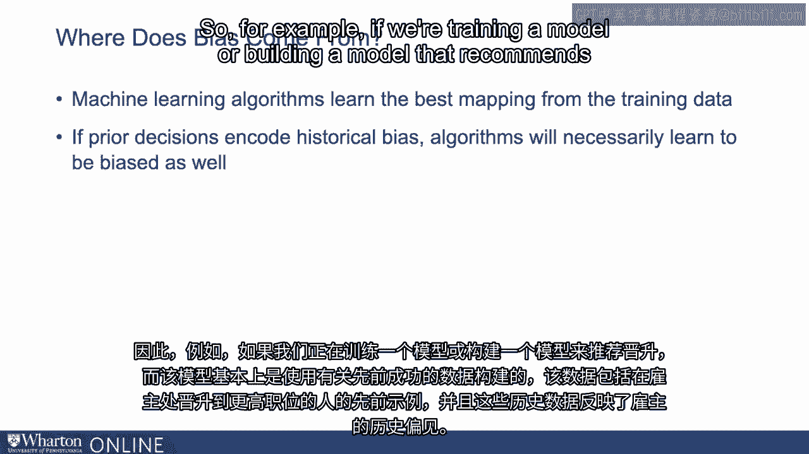

# 沃顿商学院《AI For Business（AI用于商业：AI基础／市场营销+财务／人力／管理）》（中英字幕） - P87：24_偏见从何而来.zh_en - GPT中英字幕课程资源 - BV1Ju4y157dK

 The use of AI in HR systems brings within a number of problems， a number of challenges。

 but they're also a number of emerging solutions to deal with some of these challenges。

 One of the biggest problems is the issue of bias， and this is the one you've likely， heard of。

 It's very popular with the media。 It's the idea that when you apply machine learning algorithms to data。

 they may produce， predictions or recommendations that are unequal， that are unfair to some groups。

 We talked earlier about the idea that machine learning algorithms， what they basically。

 do is learn the mapping from the examples you give it。

 But what that implies is that if the examples you have provided contain some inherent bias， if they。

 for example， contain decisions by humans that were themselves biased， the machine。

 can then learn to mimic that kind of bias。 An important focus these days in machine learning is learning how to identify that bias and。

 to extend possible eliminate this type of bias。 But given the way machine learning algorithms work。

 if prior decisions encode historical， bias， algorithms will necessarily learn to be biased as well。

 So for example， if we're training a model or building a model that recommends promotion。

 and that model is basically built using data on prior success， prior examples of people。

 within the firm who were promoted to higher positions， and this historical data reflects。

 historical bias at an employer， and the model we're using， the model we're building can。

 learn to pick up that bias as well， which is something that the industry that we want。

 to learn how to identify and eliminate in these machine learning systems。

 So that's one way that bias can enter these systems is you're using training data， using。

 historical examples that contain， that themselves contain bias。

 It's not the only way bias can arise。 There's also something called data adequacy bias。

 So think about the example of using video data or audio data from an interview to make。

 some predictions about candidate fit。 Well， it turns out that many systems learn to work better the more data they are fed。

 and it turns out that a lot of the data sets that we feed these systems， we just happen。

 to have a lot more data on some groups than others。

 So if we have differences across demographic groups， across gender， across race， some race。

 and gender groups say are not well represented in the data set， we may just do a poorer job。

 in terms of accurately predicting outcomes for that group， and that can disadvantage that。

 group， which leads to another kind of bias that's not based on historical decision making。

 but just based on the quantity and quality of data we have。

 Now this kind of bias can emerge all the time， even inadvertently。

 One recent and fairly interesting example is in advertising STEM jobs。

 So science and mathematics jobs。 There has been a recent attention on how these jobs of course are the exposure of these。

 jobs to men and to women。 It turns out that if employers use engines that are commonly used to share information。

 with people at scale， in other words advertising engines， so think about Facebook engines。

 Google engines， these are engines that are optimized to make information available to。

 people who need to see it。 So employers have had the idea that it may be useful。

 it may be valuable to be able to， put job opening information into these engines so that more people who might be a good fit。

 for the job can see it。 This is a very reasonable idea。

 Well it turns out these engines are optimized in a way that their where information is routed。

 is optimized in a way that this can actually inadvertently route these job openings disproportionately。

 to certain groups。 So in this case the employer has no bad intentions。

 The company that builds the engine has no bad intentions but because of the way the algorithm， runs。

 it shows different information to men and women and because this is an HR or a job， context。

 it starts to produce outcomes that disadvantage some groups in terms of the labor， market。

 So this is a pervasive problem that can arise even when people don't have an explicit intention。

 to impose bias on their decisions and in the next video we'll start to talk about why。

 this is a difficult problem to manage。 Thank you。 [BLANK_AUDIO]。

