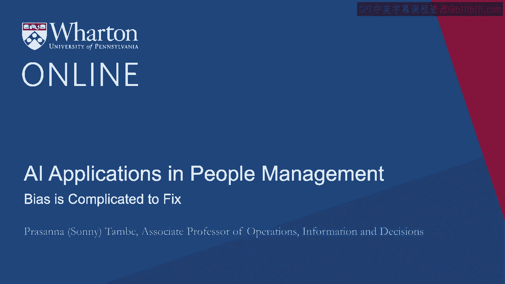
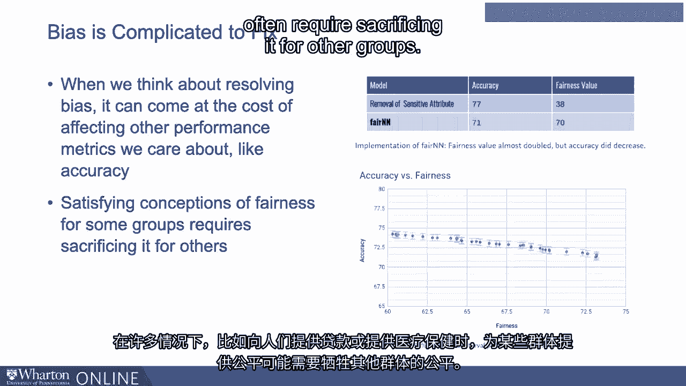

# 沃顿商学院《AI For Business（AI用于商业：AI基础／市场营销+财务／人力／管理）》（中英字幕） - P89：26_偏见很难修复.zh_en - GPT中英字幕课程资源 - BV1Ju4y157dK

 We've talked about the notion that bias is challenging to manage。

 It can also be quite complicated to fix for a variety of reasons。

 So even if we know we want to fix bias in a machine learning system。

 it can be complicated to fix that kind of a bias-related problem。

 There's a number of reasons for this。 Number one is that there are trade-offs。

 So when we think about resolving bias， it can often come at the cost of。

 affecting other performance metrics that we care about like accuracy。

 So in a variety of contexts like loans， giving loans to people， for instance， or healthcare。

 so satisfying conceptions of fairness for some groups。

 can often require sacrificing it for other groups。

 We've seen this in a number of different applications of machine learning。

 There are many people who have studied this sort of trade-off。 And of course。

 the ideal is to minimize this trade-off as much as possible。

 So we can achieve the dual goals of building systems that are both fair and accurate。

 This is often a tough thing to do。 This is one engineering trade-off that people often run into。

 when thinking about how to remove bias from a system。

 Another issue that arises is that getting better training data is hard。

 So we talked earlier about the idea that bias is really coming off often into the system。

 because the training data themselves are biased。 Well。

 it's not so easy sometimes to go out and get better training data。

 We've talked about data adequacy bias， the idea that you just don't have。

 sometimes enough training data on certain demographic groups。

 And resolving that sometimes is not easy。 If you're talking about some particular types of data。

 it's not so easy to populate your database in a way that's better or more representative。

 of different groups that you might be serving。 There is a practical issue that arises in some organizations。

 which is the question of who even should be dealing with bias issues。

 We talked earlier about the notion that this requires a holistic view of the organization。

 requires decisions that basically take into account a number of organizational priorities。

 And so we think about these decisions that have deeply， philosophical trade-offs， moral trade-offs。

 value-based trade-offs。 It's not even clear who at the organization should be responsible for making these decisions。

 And that itself can be somewhat of a bottleneck or a barrier in thinking about bias。

 Is this a problem for the developers to be dealing with？

 Is it a problem for senior management to be dealing with？

 Or who is it really that should be thinking about dealing with bias-related problems？

 We've seen a number of responses to this type of issue。

 a number of new positions like chief data officers and AI councils。

 These are basically， these are positions groups that are explicitly commissioned。

 with a task of thinking about data。 It's role in the organization and the problems that it brings。

 But the larger question of who should be dealing with bias is often one that is difficult to answer。

 and often presents a major barrier to thinking about where and how we should start dealing。

 with bias in a organizational system。 [ Silence ]。

