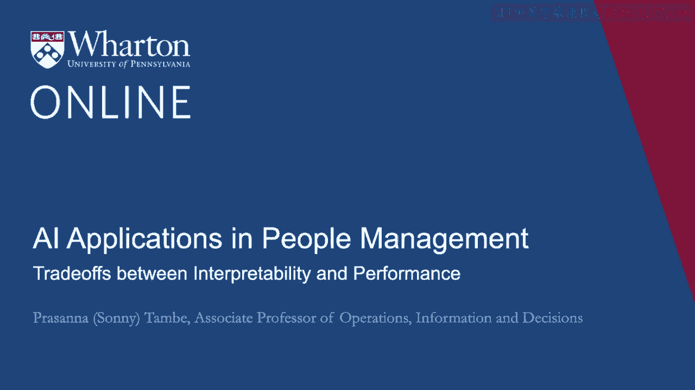
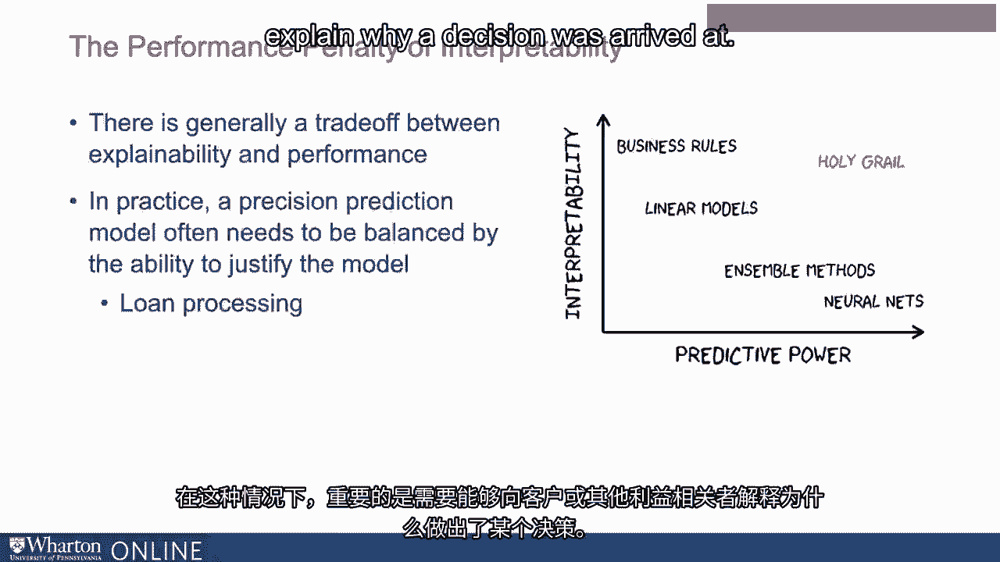
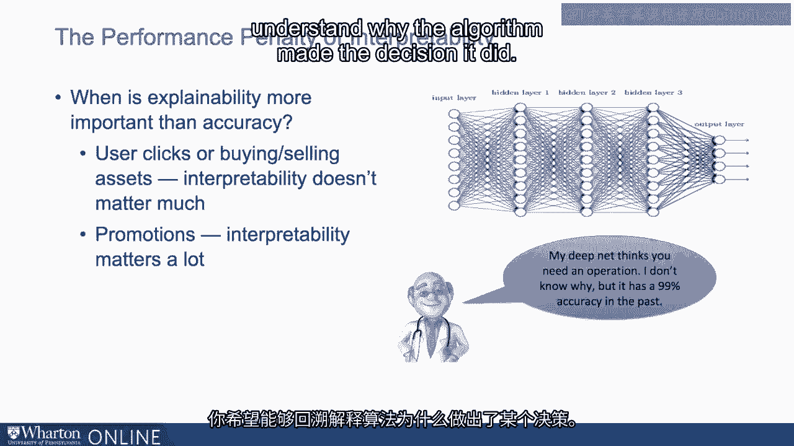

# 沃顿商学院《AI For Business（AI用于商业：AI基础／市场营销+财务／人力／管理）》（中英字幕） - P93：30_解释性与性能之间的权衡.zh_en - GPT中英字幕课程资源 - BV1Ju4y157dK

 We've talked about interpretability being important for a number of different types。

 of business contexts。 We want to be able to understand why an algorithm is coming to the decision that it's coming。

 to。 So why wouldn't we always make algorithms interpretable？ Well， it turns out there's a trade-off。

 There's generally a trade-off between explainability and performance。

 So just like with fairness or with bias， sometimes when you want to make an algorithm。

 more explainable， it comes at the expense of performance。 And there's actually。

 you can almost think about these as a spectrum with different machine。

 learning models that are commonly used， where the more interpretable they get， the less。

 predictive they get。 The ones that are very， that are least predictive sometimes are the easiest to go back and explain。

 The ones that are really high， really predictive， deep learning models， neural network models。

 tend to be very difficult to explain。 And we like， of course， to find ways to achieve both。

 We like to find ways that kind of find the sweet spot between explainability and prediction。

 But that， of course， is hard to do。 So in practice。

 a precise prediction model often needs to be balanced by the ability to， justify the model。

 And so organizations are often trying to find the balance between having a predictive， highly。

 predictive model， but also being able to go back and justify it in the case of， say。

 loan processing or something like that。 Or it is important to go back to， say。

 customers or other stakeholders and explain why it is， a decision was arrived at。

 It does raise a difficult question， though， for lots of context， because both of these， things。

 explainability is very important， so is accuracy。 Again， going back to the medical context。

 it's hard to easily say they're both very important。

 You want to be able to explain the decision for all the different stakeholders in healthcare。

 and patients as well。 But it's also the case， of course。

 that you want to have very accurate predictions when。

 you're dealing with things that affect people's health。 So it's hard to say。

 not necessarily an easy question to answer about how to make these。

 trade-offs that depends on the organizational context or the business context。 Some applications。

 if you're thinking about predicting user clicks or maybe buying or selling， a financial asset。

 it doesn't matter as much if you can go back and explain the decision。

 You're not affecting people in the same way， so it doesn't matter as much whether you。

 are able to go back and explain why the algorithm made the predictive decision that it did。

 In that case， you may want to use a highly predictive model。 It doesn't need to be interpretable。

 For something like employee promotions， it does matter。

 You want to be able to go back and understand why the algorithm made the decision it did。

 And so for that type of application， an organization may try to strike a balance between an interpretable。

 model and one that makes good predictive decisions。 [BLANK_AUDIO]。

