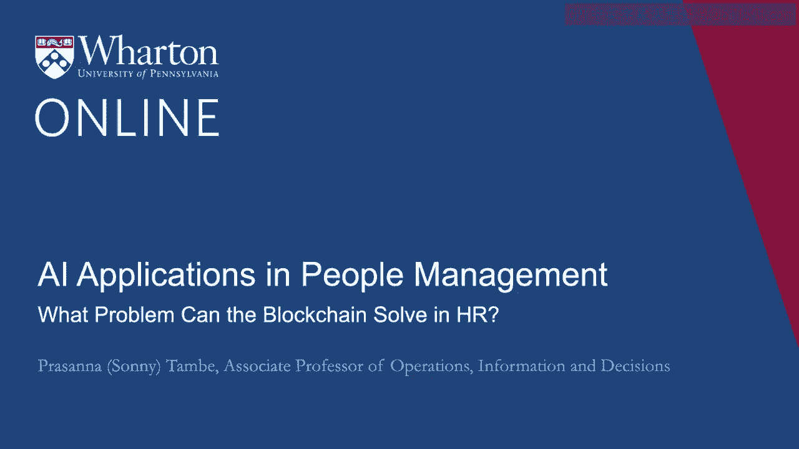
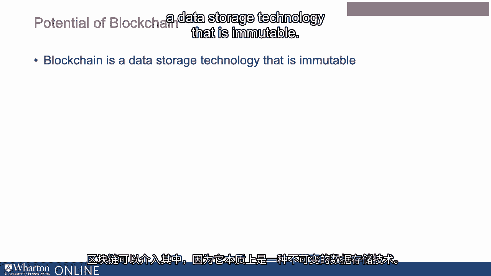
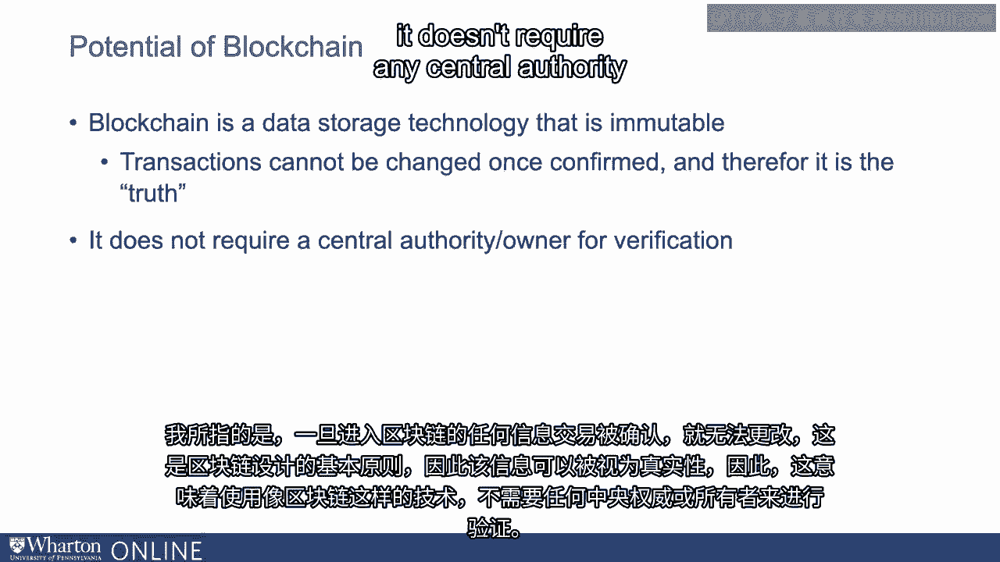
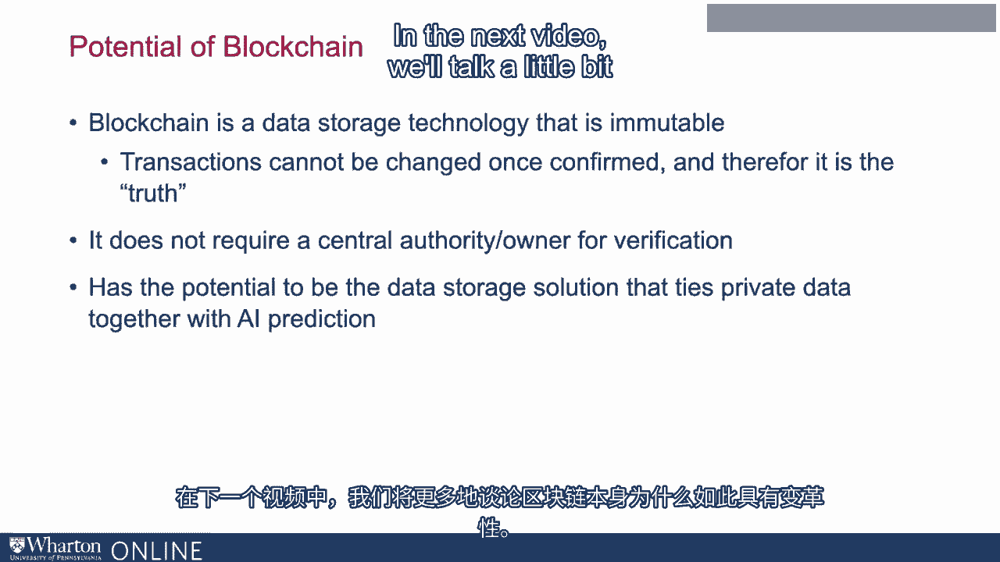

# 沃顿商学院《AI For Business（AI用于商业：AI基础／市场营销+财务／人力／管理）》（中英字幕） - P95：32_人力资源中的区块链.zh_en - GPT中英字幕课程资源 - BV1Ju4y157dK

 Machine learning has tremendous potential for HR。

 And this is， again， because they can synthesize， any number of variables about a candidate。

 to come up with good decisions or about an employee， to come up with good recommendations。

 It also can discover new relationships， that we might not have known about before。

 And one can imagine a number of new applications， of new data types that traditionally。

 have not been used in the HR process， that can now be integrated into a machine learning-based system。

 So very granular data， perhaps on employee choices。

 or actions that can be integrated into this decision making。

 One problem that this starts to surface， however， is related to data ownership。

 So we're gonna talk about a peripheral problem， to machine learning that isn't directly a part。

 of machine learning， but it's very related， to how effectively it can be implemented。

 And this is related to data storage。 And we're gonna talk in particular about the blockchain。

 which is， of course， a technology， that has received a lot of attention。

 in other contexts like Bitcoin， for example。 It turns out that blockchain also has potential in HR。

 to address some of the issues around data ownership。 So AI solutions， of course。

 require massive amounts of data。 And again， there are potentially new business models。

 and new applications that could arise， when using really fine-grained data on employee choices。

 or employee actions to predict whether they would be。

 a good fit for the firm and how well they would perform， at the firm。 Similarly。

 applications for employees within the firm， to use very fine-grained data for their activities。

 or actions or tasks that they perform， to think about career path development and so on。

 At the same time， there's growing concerns everywhere。

 about the ownership of data and privacy of data。 It's a hot issue right now。

 It's not lucky to go away anytime soon。 Lots of concerns about who should be owning employee data。

 who should be owning private data， and how much control you should have over your own data。

 So as we think about moving into a world， where machine learning makes more and more decisions。

 and richer and richer data， the question arises， how do we store this data， who owns this data？

 And this is where blockchain emerges， as a potential solution to this problem。 It could address。

 at least， a part of this problem。 It's a way， blockchain is a way for any two parties。

 to exchange information without the need for a third party， to own the data or to hold the data。

 So whenever we're talking about exchanging， or providing information related to an HR process。

 we're often talking about having a third party， keep information or records safe for us。

 But it's a credentialization or skill-based certificate。 If it's just a university。

 basically guaranteeing， that we have a degree from that university。

 we have that third party that keeps data safe for us。 If it's a platform that we are learning on。

 or taking courses on， it might be a platform， that's keeping the data。

 And so there's a number of questions that are emerging， around where data is best stored。

 This is for a number of reasons。 One is that there are a number of regulatory issues。

 that are emerging。 For example， those around the global data protection， regulation， the GDPR。

 in the EU。 There's also potential for market failure。

 where we might think there are some types of data， that would be very useful for HR decision making。

 but there's no business model there。 So maybe there's no company emerging。

 that is willing to be the arbiter of that information。

 So we can't always just rely on third parties， to be safe and effective owners of the data。

 that's going to be used to broker HR decision making。

 in a machine learning pipeline。 So the blockchain can step in here， because what it essentially is。

 is a data storage technology that is immutable。

 So what I mean by that is that any information transactions， that are entered into the blockchain。

 cannot be changed once confirmed。 And that is fundamental to the design of the blockchain。

 And therefore that information can be received as the truth。

 And so the implication of that is that with the use， of a technology like the blockchain。

 it doesn't require any central authority。

 or owner for verification。 Generally speaking， when we have a set of data。

 think about bank information， we need a central authority or owner to verify that information。

 to basically act as a guarantee or of trust， for that information。

 The blockchain is a tool or technology， that is aimed at getting around this。

 And this has the potential to be a data storage solution， that can tie private data together。

 that can be useful for HR decision making， with AI based prediction。 In the next video。

 we'll talk a little bit more。

 about why the blockchain itself is so transformative。 [ Silence ]， [BLANK_AUDIO]。

