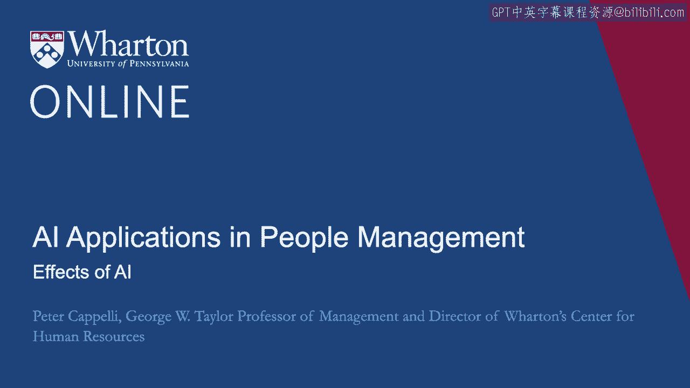
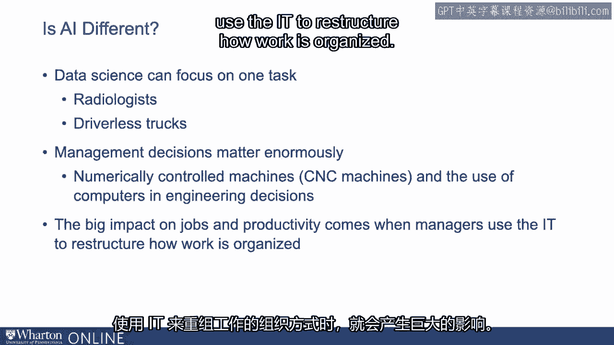

# 沃顿商学院《AI For Business（AI用于商业：AI基础／市场营销+财务／人力／管理）》（中英字幕） - P99：36_AI的影响.zh_en - GPT中英字幕课程资源 - BV1Ju4y157dK

 In this segment， we're going to talk about the effects of AI， and particularly the societal。

 level effects。 And especially we're going to talk about jobs and the belief concern that the rise of artificial。

 intelligence is going to eliminate jobs， eliminate jobs over here， over there， et cetera。

 These are attention-getting predictions。 Some of them are extremely dramatic。 I mean。

 we've heard things a few years ago that 40% of jobs are going to go away in， the next few years。

 et cetera。 The big takeaway right at the beginning is， at least so far， all those predictions， the。

 attention-getting ones， have been wrong。 But nevertheless， they get a lot of attention。

 So we want to talk about what we know， but also how to think about these predictions， because。

 they're not going to go away。 We're going to keep seeing them。

 And so part of what we want to do in this section is to get a sense about how should。

 we think about these predictions when we hear them。

 The first thing to know is to maybe spend a couple of minutes just talking about predicting。

 the future。 There are some things we're pretty good at。 Actorial science， for example。

 What is the likelihood that my house will burn down？ Well， we can estimate that pretty well。

 because there have been enough houses around and enough， of them burned down。

 and the circumstances are relatively similar， that we can assess， based on attributes of my house。

 pretty accurately what the chances are that it might burn down， in a given period of time。

 Economic forecasting does roughly the same kind of thing。

 We're assuming that the future will look like the past。 And so we build a model。

 like machine learning models in some ways， trying to predict something。

 like the growth in the economy， GNP growth based on a bunch of factors。

 We build that model if it worked pretty well for the past， then we take it into the future。

 by plugging in measures for the variables in the model today to see what that says about。

 growth rates。 The problem with those， of course， is that if the future does not look like the past。

 the forecasting models won't work very well。 That's an issue there。

 If we're looking at a prediction on a topic where there's not enough data to build a forecasting。

 model， near future events， for example， or something like what will the political reaction。

 of the Democrats be to this situation， something like that。

 Then we're into the realm of asking people， market research and polling， you know， for， asking。

 trying to figure out how the election will go， polling data is pretty good， how are。

 you going to vote？ Market research is pretty good。 Would you buy this product if it was there。

 right？ The problem is sometimes we're asking about things which are bigger events。

 They don't happen very often。 And there are things which polling is not going to work for， right？

 And that is something like the introduction of new technology。 These are expert judgment questions。

 Our colleague here at Worden， Phil Tatlock， has studied these for decades and he's run。

 big experiments on them。 And he's also run some recently to try to understand what kind of people。

 with what kind of attributes， are good at expert judgments。 That is predicting， for example。

 will the United States move toward the left？ Will a particular country elect a different parliament？

 Will there likely be a war in the Middle East？ That kind of stuff。

 And here's what he finds about people who are good at this。 First， people who are highly confident。

 who are deep subject matter experts， they know， a lot about the topic。

 And people who are guided by theory， they do worse。

 People who do better are people who are questioning assumptions， people who consider the counter。

 arguments， and people who look for similar situations elsewhere。

 They do better。 So when you're looking at a prediction from somebody or some organization。

 what you want， to do is start looking down and saying。

 do they consider in their arguments the counter， arguments？

 Do they question the assumptions that are built into the model that they're using？

 Or do they at least articulate them？ Are they looking for similar situations elsewhere？

 If they are pretty good chance their judgment might be worth listening to， if they don't。

 do any of those things， pretty good chance in Phil's estimation。

 This is like throwing monkeys throwing darts， who says description， this is just random。

 So where do the predictions come from？ Well here's something to remember about contemporary society。

 There's a big competition for eyeballs in the private sector。

 And that means if you can get attention， there's money behind that。 And the money tends to win too。

 So if these are predictions by people who are selling you something， they have an interest。

 in particular stories。 And let me just point something out。

 I have yet to see a consultant report that says things。

 are pretty much going to be the same going forward。 And I've never seen one that says， you know。

 not much to worry about here。 And the reason is those don't sell。

 They don't get eyeballs and they don't get much attention， even when they're true。

 So let me give you a couple of examples of these in the workplace that I have been around。

 One was in the early 2000s。 There were a lot of organizations predicting that there was going to be a coming labor shortage。

 And of course it never happened。 And that was because they were misreading。

 initially they were misreading some of the demographic， data from the census basically。

 And then other people started to pile out and say， yeah， coming labor shorts。

 And everybody had a report on the coming labor shortage。 And of course it never happened。

 And people who understood demographics knew it was not going to happen。

 But that didn't prevent companies from building plans about how they were going to deal with。

 this coming labor shortage because everybody was talking about it。

 Talk about another one which is popular。 And this is millennials and these generational differences。

 The National Academy of Sciences published a report this past summer looking into this。

 And they concluded basically none of this is true。

 There's no evidence that millennials even exist as a distinct generation compared to。

 those born before or after them。 There's nothing to any of this generational story。

 And yet it persists。 And the reason it persists is it sounds cool。 It sounds interesting。

 It sounds like things we kind of know even though there's no evidence that it's true。

 And all the evidence we have suggests it's not true。

 Just a couple of years ago we had this big concern that driverless trucks were going。

 to eliminate truck drivers。 And I know companies where they had tasked their HR people to try to figure out what。

 they were going to do with all their unemployed truck drivers because technology was going。

 to eliminate trucks。 And these predictions were that it was going to happen very quickly。

 And of course we haven't heard a thing about it since。

 Maybe partly because other news was more important but also we've seen no progress on that front。

 So let's talk about the general predictions about artificial intelligence but let's back。

 up a little bit following my colleague Phil Tatlok and looking at what we know from similar。

 situations before。 So we've spent a lot of time over the last generation or so looking at the effects of。

 introducing information technology。 What are the effects that that has had on jobs？

 Well overall in the economy has it eliminated jobs？ No。

 The total number of jobs in the economy continue to grow。 We'll talk about why that is in a bit。

 You might say well how about in particular occupations？ Certainly you can see some of that。

 The biggest one in my lifetime that I've seen is typist jobs went away。

 But the reason typist jobs went away is not because word processing eliminated typing。

 It was word processing led management to decide that even executives should now do their own。

 typing。 So it was a management decision pushed along by software。

 But that's going to be a key point the biggest changes come when technology pushes management。

 to make different decisions about work organizations。

 But one of the things also to remember about IT and this will certainly be true going forward。

 is that IT is not per se designed to eliminate jobs。

 In many cases what it is designed to do is introduce new functions that didn't exist， before。

 For example even earlier on when you could buy and order things online one of the things。

 that you did not see was software making recommendations to you。

 That said people who buy this also buy that。 Have you thought about getting the tools that you need to put this thing together？

 Those recommendations that you get all the time did not exist before， didn't eliminate， any jobs。

 The IT there added functionality and the effects of applying IT to existing jobs don't necessarily。

 eliminate those jobs。 That's something we want to think about pretty carefully。

 If we think about how this works for example and you think about how information technology。

 and AI more broadly what it does is not designed to eliminate jobs even in the context of robotics。

 Robots you would think are designed to eliminate jobs。

 An assembly line get rid of the person put a robot in there。

 It turns out that is not happening at least in the studies that we can see so far。

 If you look at the number of robots going into a place and you look at the number of jobs。

 they are not offsetting it。 Part of the reason for that is what the robots are doing is helping take over one task out。

 of the employees。 Lifting the tires on an assembly line robot is doing that。

 They are doing eliminated welding early on but here is a great story to remember and that。

 is the triumph of Toyota over General Motors robots。

 In the 1980s General Motors decided that it was going to eliminate as many production。

 workers as it could from its assembly plants because you couldn't trust workers and their。

 quality was bad。 They invested hugely in robotics。

 $43 billion to put robots in their assembly plants。

 Toyota came into the United States and took over General Motors plant in Fremont， California。

 that had made old mobiles and Toyota started making Corollas for General Motors。

 They called them novos but they were Toyota Corollas made by Toyota with American workers。

 and with the old equipment that was there from the 1970s but using lean production。

 At the same time General Motors spent $43 billion automating it plant。

 Because lean production was more productive， cheaper and higher quality than the General。

 Motors robots。 It isn't the case that robots always beat employees even on things like quality and。

 productivity。 Part of the reason is that people are really， really adaptable。

 Even if we think about simple tasks， low skilled tasks， where you think equipment and IT and。

 robots could do them， there's lots of things that robots could do that we're not having， them do。

 And one of the reasons why is labor is pretty cheap。

 We could have room bots sweeping all our floors rather than janitors。

 Janitors are still pretty cheap and it's easier to have them do it than it is to try to get。

 robots to do it because robots are still pretty expensive。 Same thing with driverless cars。

 Is there actually a market for driverless cars？ And here the answer is it's not so clear。

 Sure there are some people who would want them but let's take the best selling vehicles。

 in the United States。 They are all trucks。 We've all seen truck ads on television。

 The truck ads on television are some pretty burly guy with a cowboy hat on driving a truck。

 bouncing on a construction site， going through and pulling something really big at the end， of it。

 Suppose you could make a driverless truck。 Who's going to buy that truck？

 Are any of those people who are attracted to those truck ads going to be interested in。

 a truck where Skippy the Robot is driving and in the ad sitting next to him is somebody。

 who is doing their nails while Skippy drives over the construction site。

 The people who buy trucks want to drive on themselves。

 The people who buy sports cars want to drive on themselves。

 I'm saying there's zero market for driving cars that are driverless but it's not an infinite。

 market。 And a big question is simply because things are possible to do with robotics and artificial。

 intelligence doesn't mean that there's a market for it。

 Or does it mean that it's going to be cheap enough to do especially when labor is still。

 pretty cheap？

 One of the claims that we hear the most is that AI is different。 This time it's different。

 The problem with that going back to our colleague Phil Tettlock and his views about what makes。

 for a good prediction is whenever you get a claim that something is unique， so e-generous， right？

 It's completely unlike what we have ever seen before。 You want to question that， right？

 One of the things to question as we said before is that what artificial intelligence is likely。

 to do and what data science can do right now is focus on one task， right？

 So look for example at radiologists。 So well-known studies showing that radiologists。

 if you compare radiologists screening for one， particular illness like breast cancer that an algorithm does that better than radiologists。

 do it。 They don't do it hugely better but they do it better， okay？ Now。

 is that going to eliminate radiologists？ Well the second part of the finding which you don't hear as much about is that radiologists。

 working with algorithms are even better than either of them working separately， right？

 And the third thing to remember is that radiologists do a whole bunch of stuff other than reading。

 x-rays。 They also handle， they make diagnoses of course as well。

 only some part of which is based on， what the screens tell them。

 Some part of what they do as well is they do treatments with radiology as well， right？

 So it might very well be the case that some of their tasks get automated but that doesn't。

 mean that everything they do gets automated。 Driverless trucks for example， right？

 Most of the truck drivers in the United States are delivery drivers。

 So what they do is they drive to your house， maybe a robotic driver can do that but then。

 they get out， they unload your packages， they put them on the steps， they get you to sign。

 something and we don't have a robot that can do any of that stuff， right？

 The other thing to remember here is that management decisions matter enormously with IT broadly。

 defined and the introduction of data science tools。

 So let's turn back the clock a little bit to the introduction of numerically controlled。

 machines and the use of computers in engineering decisions。 We had machine， machinists and machines。

 Some of that work could be taken over by CNC machines， right？

 They have to be programmed and what we saw 20 years ago when they were first being introduced。

 is that employers made decisions。 Are we going to hire engineers to program these machines or are we going to teach the。

 machinists who already do this kind of work how to program the machines， okay？

 If you teach the machinists how to program machines you don't lose nearly as many machinists， jobs。

 If you hire engineers to do the programming then you're losing all the machinists jobs。

 and you're hiring in and creating more machinists jobs。 That outcome is a management decision。

 right？ So what are the things we've known about the impact of IT on jobs and on productivity？

 The big impact comes when managers use the IT to restructure how work is organized， right？

 At that point you get really big productivity increases。 The IT by itself doesn't do it。 OK。

 [BLANK_AUDIO]。

