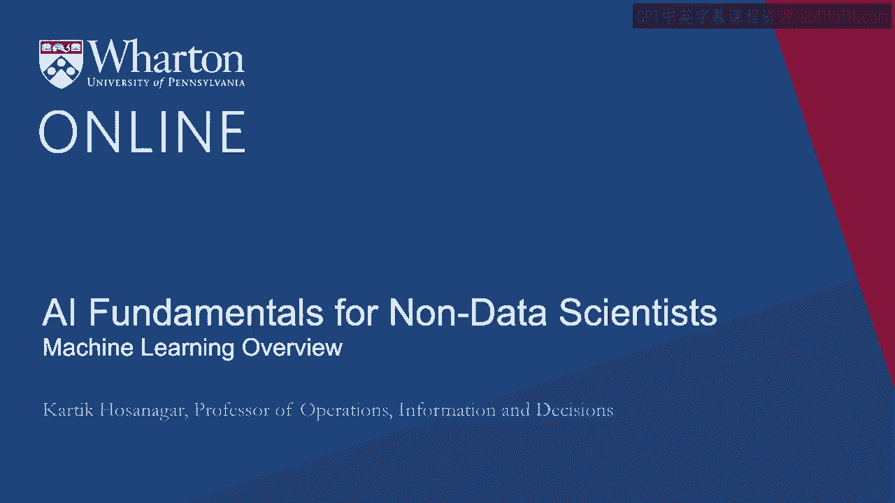
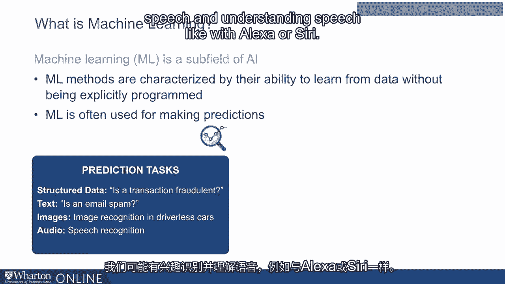
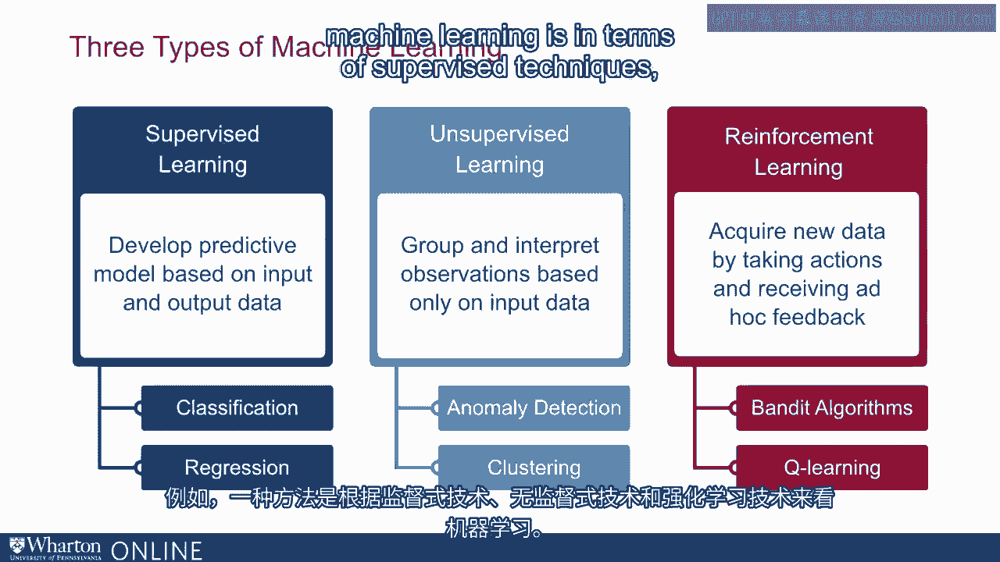
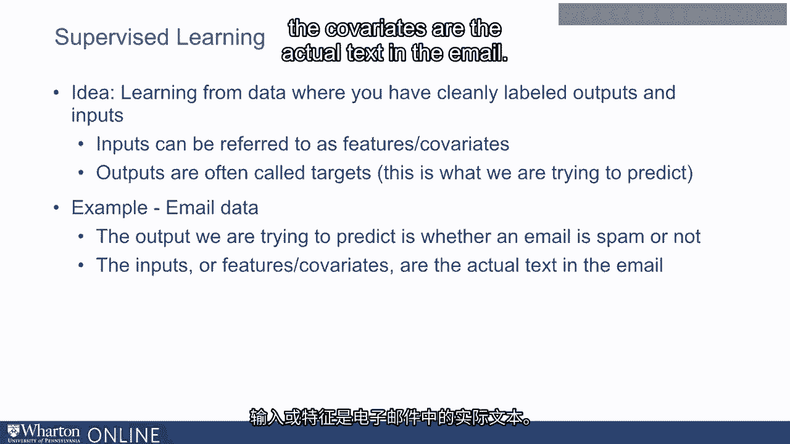
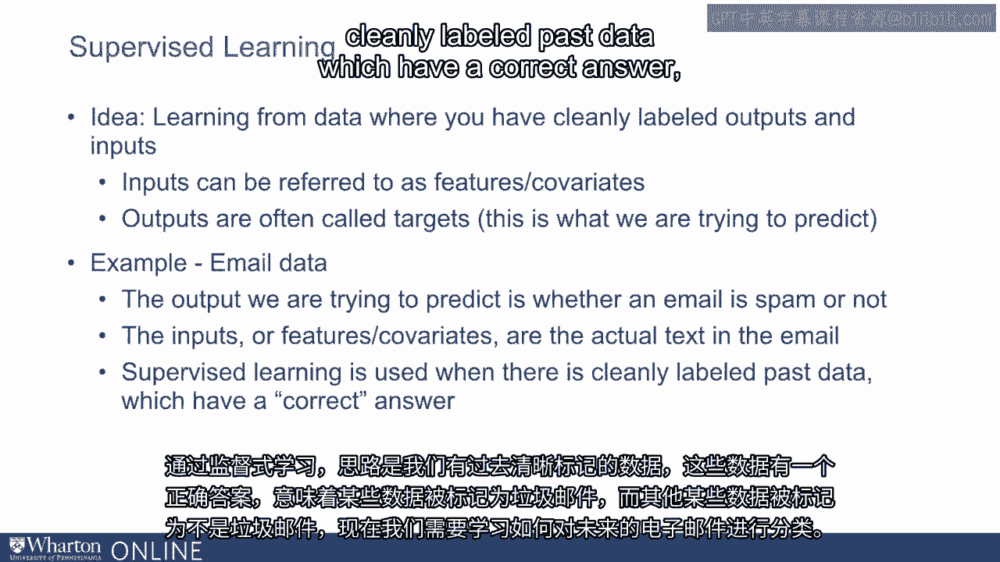
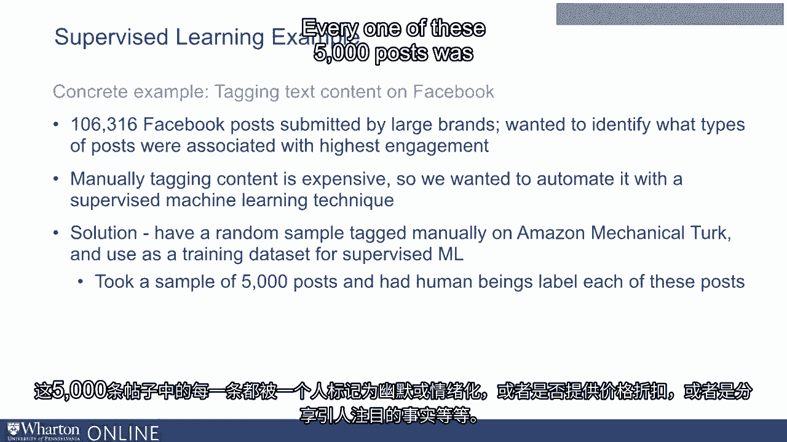
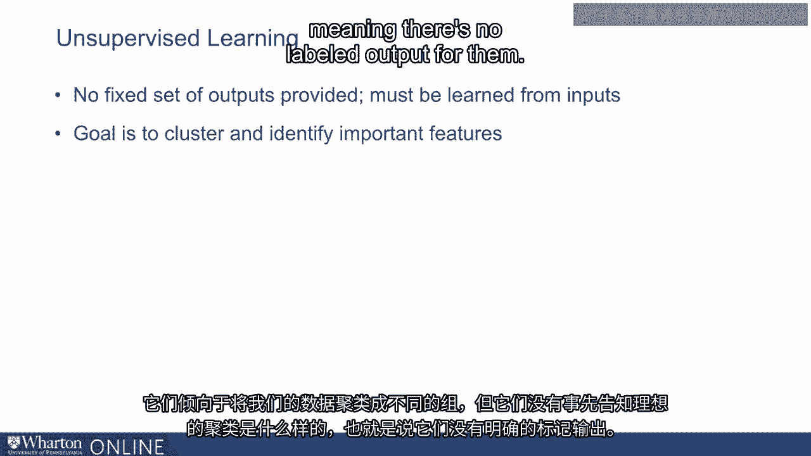
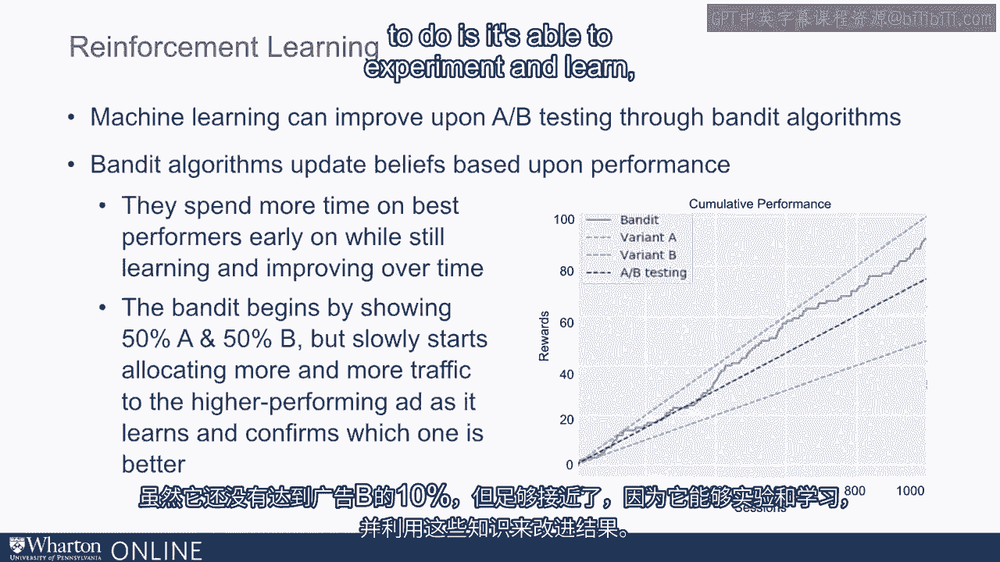

# 沃顿商学院《AI For Business（AI用于商业：AI基础／市场营销+财务／人力／管理）》（中英字幕） - P9：8_机器学习概述.zh_en - GPT中英字幕课程资源 - BV1Ju4y157dK

 Hi again。 In this lecture， we'll talk about machine learning and the different types of。

 machine learning。 The machine learning， as I mentioned， is a sub-field of artificial， intelligence。

 It's mostly focused on how do we get computers to learn from data without。

 explicitly programming them。 And they're often used for prediction tasks。 For example， we。

 might have data on past credit card transactions。 We might be interested in predicting whether。

 a new transaction is fraudulent or not。 So we might look at past data in order to make。

 this decision。 Or we might be interested in determining whether an email is spam or not。

 based on past data。 We might be looking at a task of analyzing images for a driverless。

 car and figuring out whether the object in front of a car is another vehicle or a person。

 or a tree or something else。 We might be interested in recognizing speech and understanding speech。

 like with Alexa or Siri。 In short， there are many kinds of prediction tasks that use machine。

 learning。 And these have applications in a variety of industries ranging from healthcare。

 to finance to manufacturing to human resources and so on。 Now， it's important to understand。

 machine learning is not one single technique。 There are really a large set of techniques。

 all of which come under the umbrella of machine learning。 And in fact， there are many types。

 of machine learning。 For example， one way to think of machine learning is in terms of。

 supervised techniques， unsupervised techniques and reinforcement learning techniques。 Supervised。

 learning is the idea of building a predictive model based on past data。 And these data have。

 clearly labeled input and output data。 For example， we might have data on emails in the。

 past and nice and clear labels on which of those past emails are spam emails and which。

 ones are not。 And we might then want to learn from it。 So this is a classification task which。

 is using past data which has nice labels of inputs and outputs to learn how to label future。

 data。 Unsupervised techniques in contrast have lot of input data， but you don't have clear。

 labels on output。 And so these techniques are finding patterns in the input data。 For， example。

 you might have anomaly detection， which is the idea of finding certain data points。

 that look like anomalies or in other words， they look different from all other data in， there。

 Similarly， we talked about clustering previously， which is the idea of grouping a。

 set of data points into different groups such that data points within a group are as similar。

 to each other and data points in different groups are as different from each other。 So。

 this is based on data， but we don't have clearly labeled output that is guiding us on how best。

 to actually break up the data into different clusters。 And lastly， we have reinforcement。

 learning， which is the idea of having a machine learning system， acquire new data by taking。

 actions and looking at the data to learn and improve its future action。 And we will look。

 at each of these techniques in greater detail。 Let's start with supervised learning。 As I mentioned。

 supervised learning is the idea of learning from data where you have cleanly labeled output。

 and labeled input。 The inputs can be referred to as features or as covariates and the outputs。

 are often called targets of the model。 This is what we're trying to predict。 For example。

 as I mentioned， we have email data and the output that we're trying to predict is whether。

 an email is spam or not。 And the inputs or the features of the covariates are the actual。

 text in the email。 And with supervised learning， the idea is that we have cleanly labeled pass。

 data， which have a correct answer， meaning that certain data have been labeled as spam。

 and certain other data has been labeled as not being spam。 And now we need to learn how to。

 classify future emails。 Similarly， you might have a desire to predict sales next week based on。

 historical data。 And we might use data on the season， the month of the year， the weather， and。

 other such patterns to predict future sales。 And our training data is actually past data， which has。

 all these patterns， month， season， weather， and also the actual sales that were realized in the past。

 And now we're trying to make predictions in the future based on that。 Let's look at another example。

 of supervised learning。 In a recent research study。

 my colleagues and I were interested in analyzing， social media posts posted by a number of companies on Facebook。

 So we gathered data on over 100，000 posts， submitted by large brands on Facebook。

 And we wanted to identify what kinds of posts are， associated with the highest engagement。

 that is our emotional posts associated with greater。

 engagement or humorous posts or posts that show deals and promotions to consumers or other kinds。

 of posts。 Now it is very expensive to tag 100，000 posts and label each post as being humorous or not。

 emotional or not， or as offering a price discount or not， and so on。 So we wanted to automate this。

 process。 So we use a supervised machine learning technique to do that。 To do that， we first need。

 data， a training data set that has clearly labeled inputs and outputs。

 The inputs are available to us。 These are the words the companies use in their posts。

 The output is essentially a label that says， whether the post is emotional or humorous or not。

 And so to do that， we took a sample of 5，000 posts， and had human beings label each of these posts。

 Every one of these 5，000 posts was labeled by a。

 human being as being humorous or emotional or as offering a price discount or being a post that。

 shares a remarkable fact and so on。 These labels were then used as a training data set for a。

 supervised machine learning algorithm that learned what kinds of words are predictive of whether a。

 post is emotional or humorous or not。 And then that algorithm was used to make predictions for。

 the remaining nearly 100，000 posts that hadn't been labeled by a human being。 This is essentially。

 the idea of supervised machine learning， which is you need a training data set and you learn from that。

 and you apply that to future data。 And what we found in our study was that our machine learning。

 algorithm did well and often had accuracy of over 90， 95 percent and sometimes even greater than 99。

 percent in essentially being able to predict whether a post is humorous or whether a post is。

 emotional or not。 And in any business application， if you have good high quality training data set。

 one can apply these techniques in order to make predictions about the future。 The key is collecting。

 high quality data。 And that is the most important activity in supervised machine learning。

 There are。

 a number of very good high quality off the shelf algorithms that can be applied to make predictions。

 if you've got high quality training data set for machine learning。 The next set of machine learning。

 techniques are unsupervised learning techniques。 Unsupervised learning techniques also take in data。

 but they don't have clearly labeled output。 So for example， clustering algorithms that we。

 discussed previously， they tend to cluster our data into different groups， but they're not told。

 in advance to what the ideal clustering looks like， meaning there is no labeled output for them。

 Similarly， another example is anomaly detection。 Anomaly detection algorithms look at a bunch of。

 data and identify data points that look dissimilar to most of the other data。 Here again， there's a。

 lot of input data， but there's no clearly labeled output。

 Another example is latent Dirichlet allocation， or LDA。

 which is a commonly used technique for topic modeling， meaning identifying what kinds of。

 topics a certain document might cover。 Typically， with LDA， you have an input data set which。

 consists of a large set of documents。 The idea behind LDA is that each document likely covers。

 a small set of topics， and each topic itself tends to use the same set of words quite frequently。

 So for example， we might take a large data set of new stories published in all of the major。

 newspapers and online news media outlets and feed that as an input to an LDA algorithm。

 And LDA is trying to identify the topics that these documents cover， but is not given。

 clearly labeled outputs， meaning that the algorithm is not told that here's a document on politics and。

 here's a document on sports and so on。 LDA， as I said， assumes that each document covers very few。

 topics and each topic has a few words that it uses frequently。 And when it takes a training。

 data set or an input data set rather， LDA might identify that a certain topic tends to use certain。

 words quite frequently。 For example， it might say that here's a topic that tends to use the word。

 Obama， the word Trump， the word speech， and a few other such words quite frequently， but it does。

 not tend to use words like pizza or baseball as frequently。 This clearly， we can infer is the topic。

 of politics， and that's something that the algorithm identifies on its own。 Now， given any document。

 LDA then looks at the kinds of words that are used in this document and identifies which topics。

 it covers。 So given a document， LDA might say that a topic covers sports or a topic covers politics。

 and so on。 Once LDA has been trained using a large data set。

 it can now be applied to any new document。

 and it can automatically classify these documents and identify the topics in there。

 So in this example， you see a passage that LDA might analyze and it looks at certain words that are used in this document。

 And with each of these words， it identifies certain topics that these words are related to。

 For example， arts or education or children and then it identifies a set of topics that this document。

 covers。 Now in addition to unsupervised learning， we also have this idea of reinforcement learning。

 Reins enforcement learning usually does not take in large training datasets。 Rather。

 the algorithm learns by testing or trying various actions or strategies and observing what happens。

 and using those observations to learn something。 This is a very powerful method and has been used。

 in a number of robotics based applications。 It is also at the heart of a software created by。

 Google which was called Alpha Zero which was an advanced version of Google's Go Playing Software。

 Alpha Go。 Alpha Go had used training dataset which was based on past Go games and Alpha Zero had no。

 training dataset。 Instead， it learned the game of Go by playing Go against itself and once it played。

 millions of games against itself， that was in fact the training dataset that it used to develop。

 the best strategies for this game。 Of course， in many settings， experimentation isn't always free。

 and so you have to balance the cost of experimentation against exploiting the knowledge that we already。

 have。 Let's explore that through a reinforcement learning algorithm known as multi-armed bandit。

 To illustrate how bandit algorithms work， let's consider setting where you have two different。

 ad copies that we have designed and that we would like to try with our customers。 We do not know。

 which ad copy is more effective in engaging customers and attracting them to click on the ad。

 We would like to ideally figure out which ad is the better ad to use。 One way to figure this out。

 is to do what is known as A/B testing。 That is， we might show ad A to half the users and ad B to half。

 the users and we might do this for some period of time， let's say a day。

 then we observe which ad has， the higher click through rate and we might use that ad there on。

 In this graph that you see on this， slide we have two ads， ad A and ad B。

 Ad A has a click through rate of 5% and ad B has a click through。

 rate of 10% but we do not know this in advance。 So what we might end up doing is show ad A to some。

 users and show ad B to some users。 If we have shown these ads in a randomized fashion to a large。

 number of users， over time we learned that ad A has 5% click through rate。

 ad B has 10% click through， rate and then we can use ad B from that point onwards。

 But there is a cost of this learning because， some people were shown ad A and some people were shown ad B during this learning step。

 the average click through rate that our ads experienced with 7。5% which is lower than we would。

 have obtained if we had chosen the better performing ad。

 Now a banded algorithm can do better and it。

 can improve performance。 The way it does this is that it starts off initially like any A/B testing。

 algorithm meaning it shows ad A and ad B equal number of times but it starts to observe what is。

 happening and is learning。 For example it starts to observe that ad B is doing better than ad A。

 and as it learns this it starts to show ad B more frequently than ad A。 It still will show ad A。

 a few times so it still allows itself to learn and correct itself in case ad A actually will。

 perform better。 But over time it starts to weigh ad B more and more and as a result if you observe at。

 the end of a day or in this example at the end of a thousand sessions this ad which used a banded。

 algorithm based allocation strategy ended up having a click through rate that was much higher than 7。

5%， that we obtained through A/B testing it was not quite equal to the 10% that ad B has but it's close。

 enough because what it's able to do is it's able to experiment and learn and exploit that knowledge to。

 also improve the outcomes。 So in short a reinforcement learning algorithm is essentially an algorithm。

 that takes actions observe what happens and then improves its performance over time。

 It's my pleasure to see you again。