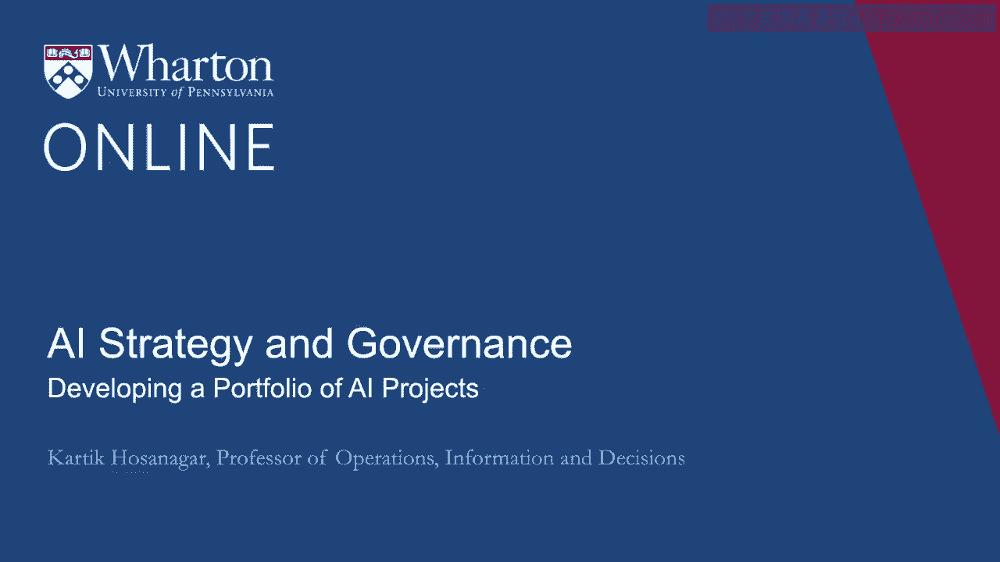
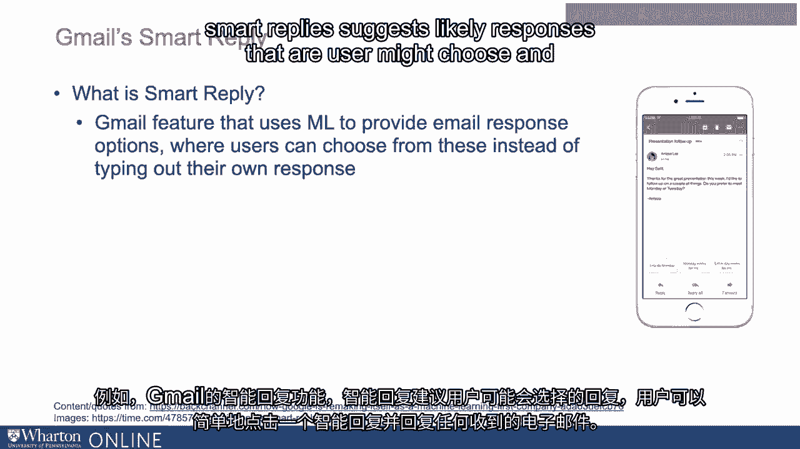
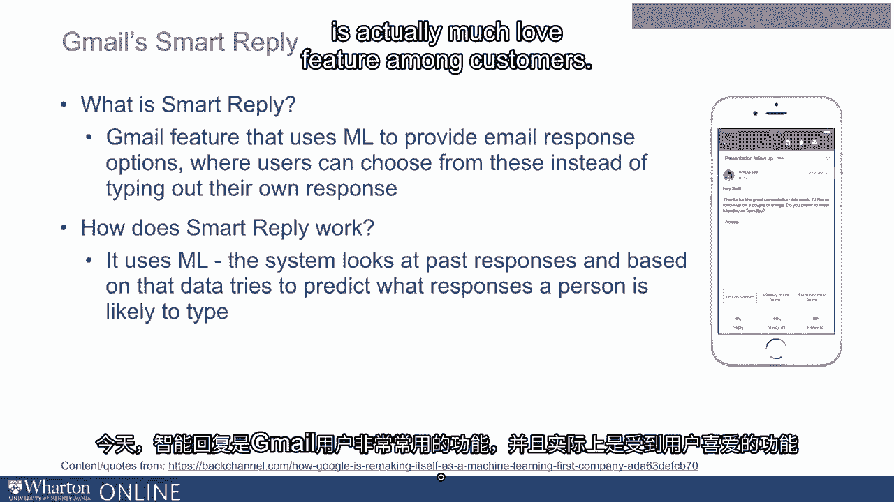
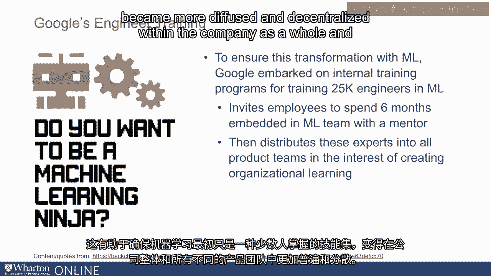

# P103：2_开发组合.zh_en - GPT中英字幕课程资源 - BV1Ju4y157dK

我们讨论过早期失败如何导致对技术的非理性退缩。

从长远来看可能会产生影响。现在我们将探讨公司如何在较长时间内投资技术。

随着时间的推移，当短期或中期的回报不明确时。

我倡导的一个关键原则是，公司应该思考如何。

开发一组人工智能项目以进行追求。那么让我们更深入地探讨这个想法。

建立人工智能投资组合的想法是提出一组项目，这些项目可以。

被视为公司可以获得快速胜利的项目，以及一系列被视为。

作为长期项目，这些项目不太可能在短期内产生结果。

所以让我们逐一看一下这些。对于快速胜利来说。

公司可以选择优化员工或客户的简单接触点。

对于长期项目，公司可以思考如何重新定义整个端到端。

流程。让我们先考虑快速胜利。那么对于快速胜利来说。

公司可以考虑使用现成的机器学习包或。

解决方案，最初利用这些来改善内部员工接触点。

随着时间的推移，也许可以利用这些技术来改善客户接触点。

现在注意，当我说你在使用现成的机器学习时，每个竞争对手。

还可以访问，并且你使用这些技术来改善内部员工接触点。

这些项目可能不太可能转变业务，但它们服务于不同的目的。

首先，它们有助于让组织和组织中的怀疑者接触到潜力。

人工智能。这有助于达成共识，了解什么是可行的，什么是可以做到的。

我与C-suite及许多组织合作的一个观察是，即使如此。

一个人工智能项目或数字化转型项目可能在组织内有一个倡导者。

组织内部也存在多个怀疑者。

当高层管理人员不一致时，让组织朝同一个方向前进是很困难的。

对于持怀疑态度的领导者来说，C-suite首先建立共识是很重要的。

建立共识的一种方式是追求快速、简单的项目，即使这些项目能够在短时间内展示成果。

三到六个月内人工智能能实现什么。再次强调，这可能不会对公司的营业收入或净利润产生变革性影响。

但是，它帮助人们理解如何在短时间内推动事情进展。

人工智能如何变革。快速胜利的另一个好处是，它帮助公司建立重要技能。

关于人工智能的技能。这些技能涉及大规模收集数据和处理数据。

标注数据，以便创建训练数据集，最终分析数据。

解释分析结果。这一切都需要时间来建立，尤其是在没有数据的组织中。

科学在其DNA中。仅仅雇佣几个数据科学家是无法改变这一点的。

要改变这一点需要时间，而快速胜利和短期项目有助于实现。

这有助于组织看到结果，并帮助组织获得经验。

通过数据收集、标注和分析。快速胜利的一些例子可能是，假设我们讨论的是一家药房。

药剂师需要查找替代药物，当某种药物不可用时，他们可能会。

通常会进入计算机，通过接口输入不可用的药物。

或者症状，然后他们可能会得到一份可用替代药物的列表。

一个简单的短期快速胜利项目可能是提供一个语音接口。

这样药剂师就可以更快速地查找，而无需花费太多精力输入。

使用现成的自然语言和语音识别软件，这很简单。

也有类似的工具可以协调内部会议或讨论。

这非常简单。注意我经常提到利用内部员工接触点作为起点。

这个点的风险非常低，如果出现问题，尤其是在组织内部。

如果没有AI经验，那么对于内部员工来说，风险实际上是很低的。

接触点。随着公司经验的积累，可以将其推广到客户接触点。

接下来进入长期项目。长期项目的理念是，这些项目必须有影响力，并提供战略价值。

或者为组织带来竞争优势。这可能涉及重新思考整个端到端的流程，而不仅仅是优化。

在某个时点。现在一个长期项目的例子可以想到一家接收索赔的保险公司。

处理保险索赔，然后进行处理，最终做出决策。

现在对于汽车保险，可以想象一种情况，客户可以上传他们的保险。

在移动应用上提交索赔。客户可以拍摄汽车或损坏的照片并上传到应用中。

许多公司已经在他们的应用中支持这种能力。

一旦索赔进入，通常保险代理会分析索赔并做出决策。

现在可以利用技术自动化这个过程的某些部分。

例如，使用图像识别算法可以分析索赔并识别。

这种损害的类型，尤其是利用针对过去数据训练的机器学习算法。

过去索赔的数据以及哪些索赔被批准、哪些未被批准的数据。

收到了一千美元的赔偿与一万美元的赔偿之间的区别。

可能只是十美元的赔偿。他们可以在这种数据上进行训练，然后也可以自动化。

批准或拒绝决策。现在，公司可能无法自动化所有进入的索赔。

然而，随着时间的推移，公司可以达到一个点，50%、60%、70%的索赔。

更简单的索赔可以由能够查看性质的机器学习系统处理。

评估损害是否为真实索赔，将索赔与过去的索赔进行比较并做出决定。

损害的程度以及需要给予的赔偿程度。

随着时间的推移，组织中的人类代理可以专注于更复杂的任务。

请注意，我们谈论的是从客户开始自动化整个索赔流程。

将索赔上传到他们的移动应用程序，系统正在分析索赔并弄清楚。

将损害的性质发送到另一个系统，该系统将其与过去的索赔进行比较，然后。

自动化决策本身。这种自动化在长期内可以在降低成本方面产生影响。

但同时也改善了客户的工作流程，赢得了未来客户对组织的信任。

我刚才倡导的投资组合方法是一些公司使用过的。

取得巨大成功。谷歌就是一个很好的例子。

几年前，谷歌首席执行官Sundar Pichai宣布他们希望成为一家人工智能优先的公司。

他们希望利用机器学习来转变多种产品，并本质上带来。

关于整个组织的变革。当谷歌开始这一工作时，他们确实考虑了长期的倡议，例如无人驾驶。

我们谈论过的汽车，但同时谷歌明确表示人工智能是为了。

对整个组织而言，这种转变是革命性的，而不仅仅是无人驾驶等一两个部门。

汽车。因此，公司决定在所有产品中推广人工智能。

包括Gmail、数据中心团队、Google照片和人力资源团队在内的多个部门。

以及其他多个团队以各种形式推出了人工智能。

当谷歌最初开始人工智能驱动的业务转型时，谷歌内的所有团队。

被要求以某种形式整合人工智能。

事实上，他们被告知最初专注于短期项目，以便能够推出。

以某种方式使用人工智能。Gmail在多个小方面利用机器学习来改善Gmail应用程序内的工作流程。

随着时间的推移，随着他们对机器学习的适应，他们开始推出许多新的。

基于机器学习的功能。例如Gmail的智能回复。

智能回复建议用户可能会使用的回复，用户只需点击。

在智能回复的基础上，回复任何收到的电子邮件。

智能回复基于机器学习，它会查看过去的回复并基于此进行判断。

数据它试图推测一个人可能会输入什么样的回复。

这再次是可行的，因为Gmail团队开始使用机器学习来处理简单任务。

随着时间的推移，一旦他们变得舒适，他们开始进行更重要的项目。

功能。如今，智能回复是Gmail上客户非常常用的功能。

在客户中非常受欢迎的功能。还有其他几个例子，比如谷歌照片。

机器学习用于分析图像并自动标记图像。

例如，机器学习可以查看一张图片并识别它是否是某种图像。

一只狗或猫，或在特定类别内，例如狗，它可以识别出是什么品种。

它是何种狗，等等。最终，所有这些信息也可以用于指导图像搜索。

当一个人输入搜索查询，尤其是与图像相关的搜索查询时，可以快速找到图片。

即使搜索查询非常具体且细致。

例如，你去谷歌搜索边境牧羊犬的图片，然后系统。

可以展示几张边境牧羊犬的图片，还可以让你进一步微调。

通过选择额外的搜索术语，可以进一步缩小搜索范围。

所有这一切都是基于使用机器学习自动分析图像并提取。

这些图片的详细元数据。这些例子展示了谷歌如何在多个不同的产品中使用机器学习。

在组织内部，事实上，这只是众多应用中的一部分。

谷歌在各种产品中应用机器学习。

谷歌的AI战略成功，因为它有一个流程，使其。

进行了几个长期项目，例如无人驾驶汽车，但也关注。

有许多短期的项目，多个产品团队被要求应用机器学习。

在产品中应用学习。他们被告知要应用，而不是被要求展示投资回报。

投入这些功能的资金。相反，重点是帮助员工获得机器学习的经验和技能。

这将允许他们构思更具雄心的项目并执行这些项目。

除了这些短期项目和拥有一个项目组合之外，谷歌还有其他的事情。

还进行了大规模的培训活动。

谷歌启动了许多培训项目，最初是面对面的，后来有了很多在线课程。

培训数以万计的工程师学习机器学习的课程。

谷歌还邀请了许多员工从他们的核心产品中抽出几个月的时间。

和机器学习团队一起花时间，他们可以与导师合作。

在一个机器学习项目上。

导师能够指导他们，一旦这个人对机器学习感到舒适。

他们回到了自己的产品团队。这有助于确保机器学习这种最初只有少数人知道的技能。

人们的技能更加集中，变得更加分散和去中心化。

整个公司以及所有不同的产品团队。

我们已经看到谷歌在项目和员工培训的投资组合中投入。

为了从其人工智能战略中获益，谷歌确实在这方面取得了巨大的成功。

这是我建议你在组织内尝试的一个简单练习。

理想情况下，你希望作为一个团队进行这个练习，例如创建一个研讨会或会议。

与你组织内的海平面或高管沟通，可能会花两天时间。

在这项活动上最多花三个小时，或者如果你无法让一组人工作的话。

如果你与我一起做这个，那么也许你可以单独尝试这个。

首先识别出你可以通过自动化的活动集。

机器学习。这可以是跨多个职能的活动，也可以是各种产品的活动。

团队，理想情况下你希望有几十个活动，因为对于大多数组织来说，情况是这样的。

在许多不同的职能中，有很多不同的产品，机器学习都很相关。

一旦你想出了一系列几十个活动，我们就要对这些活动进行分类。

将活动分为短期活动，意思是可以在让我们看看。

说大约六个月或需要几年时间的长期活动。

一旦你有了这个分类，我们再来看一下投资回报率。

为组织带来这些活动的收益。

基于这些活动的投资回报评估，以及评估。

根据组织内可用的数据资产，你可以识别出这些资产的一个较小子集。

将成为你三年投资组合的一部分的活动。

三年投资组合可以由几个短期活动组成，比如五到六个。

几个长期活动，也许一到两个长期活动。

这些是你可能想作为组织追求的活动。

在海平面团队和整体团队内进行辩论，讨论哪些活动。

哪些是值得追求的，哪些不是。这样的辩论是健康的，可以帮助构建投资组合。

一旦你构建了投资组合，你需要弄清楚AI团队将在哪里。

符合组织架构。有些公司有单独的AI团队，独立于其他部门工作。

团队并帮助推动转型，几乎像一个与之合作的咨询小组。

这些其他团队。一些像谷歌这样的组织引入了机器学习、AI和数据科学。

在所有不同的产品团队中都具备这些能力。在这种情况下，我们希望AI在组织内去中心化或扩散。

适合公司的方案可能取决于组织的规模和文化。

组织等。所以你可能想辩论哪种结构适合你的公司。

这是一个我认为在与多位高管合作时很有用的练习。

我尝试过这个练习，它促成了非常健康的对话，我非常推荐。

这对你也一样。[BLANK_AUDIO]。

