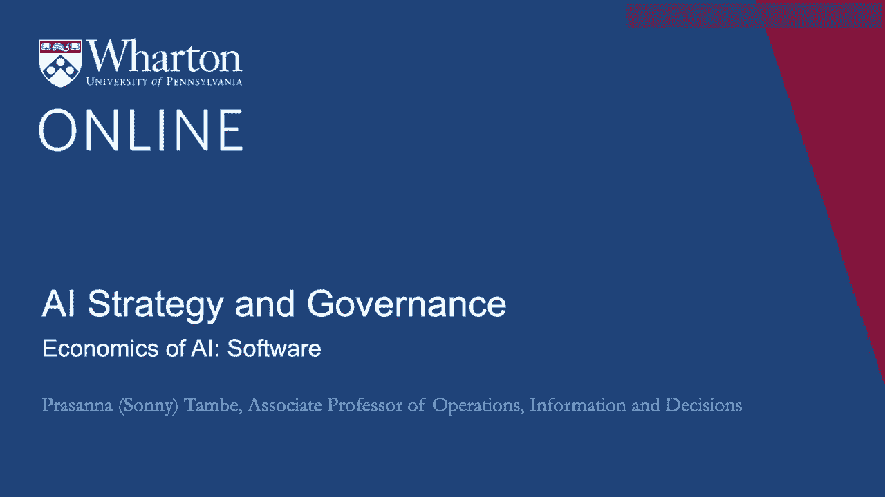
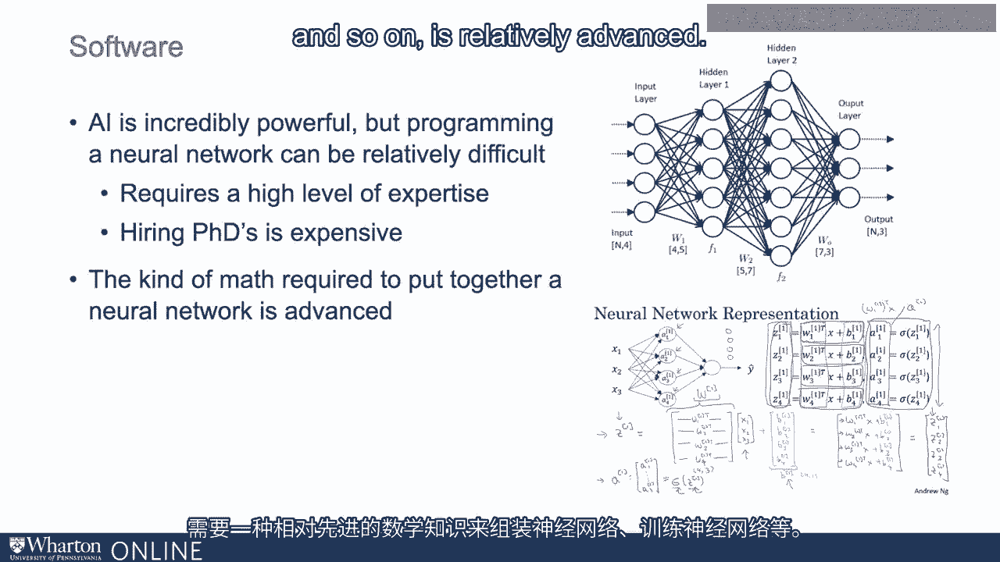
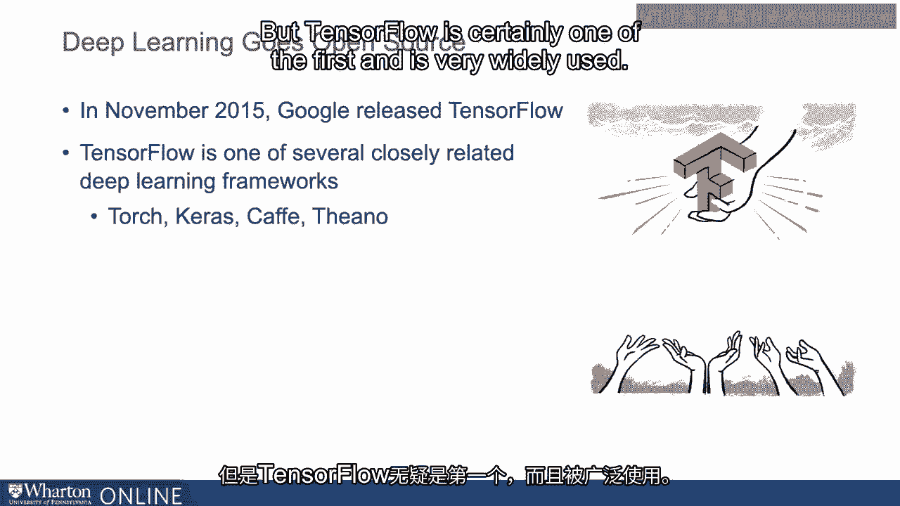
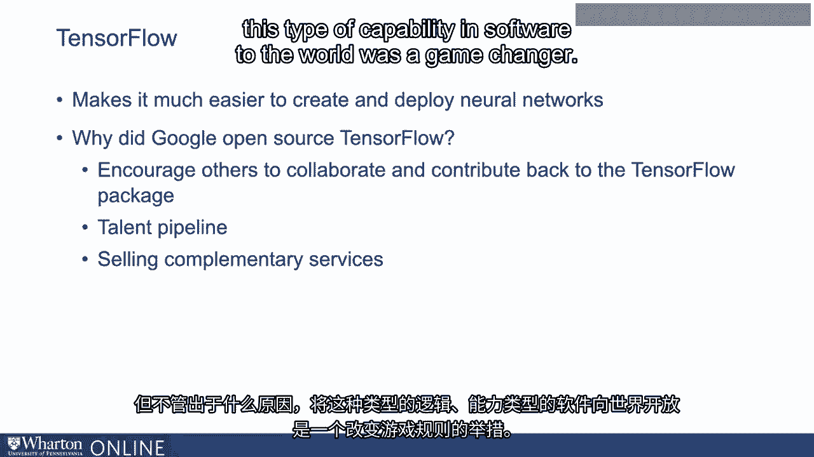

# P105：4_AI软件的经济学.zh_en - GPT中英字幕课程资源 - BV1Ju4y157dK

当我们考虑人工智能如何与经济学、竞争等互动时，这是。

重要的是考虑一些人工智能的关键输入。所以这些包括机器学习和人工智能所需的软件，以及你需要的技能。实现它们所需的计算资源，以构建和运行模型，以及。你需要的数据来训练模型。那么让我们谈谈这些输入的一些成本。输入本身正在演变，这可能会对未来人工智能的经济学和人工智能的意义产生影响。对于竞争。因此让我们从第一个开始，即软件。所以，人工智能当然是一个极其强大的工具。机器学习也非常。在其功能方面非常强大。但是，编程，例如神经网络。

是相对困难的。这需要高水平的专业知识，聘请博士是昂贵的。组建神经网络所需的数学类型。训练神经网络等是相对先进的。

使用神经网络进行预测需要大量的数学。因此，在某种程度上，人工智能的商业影响受到相对较高的限制。你可以称之为价格，这样的软件组合是很昂贵的。基于深度学习的预测模型所需的。几年前发生了一次重大变化，价格下降，而这正是深度学习。开源了。我所说的意思是几个公司。谷歌是首批这样做的公司之一，他们在代码层面上向任何想要使用的人提供了深度学习基础设施。开源软件渠道。如果开源对你来说是新的。

当软件免费提供给你下载时。使用并可能贡献给他人。因此，最早的一个例子是谷歌在 2015 年 11 月发布 TensorFlow。TensorFlow 是一个软件包，编码了谷歌关于许多内容的知识。机器学习，关于深度学习。现在我们正在使用 TensorFlow 作为几种密切相关的深度学习框架之一。

你可能还会听到 Torch、Keras、Cafe 等，它们基本上包含了相同的大部分内容。它们中的一种智能类型。但是 TensorFlow 绝对是首批推出的，并且被广泛使用。

所以 TensorFlow 是由谷歌发布的。对 TensorFlow 包的兴趣和接受度立刻提高。许多人对如何获取谷歌提供的软件感兴趣。正在与使用和实施深度学习相关的开源。

TensorFlow 可用于许多平台，因此可以使用 Python、RC++、Swift 实现。Go 和其他语言。

它所做的就是使得创建和部署神经网络变得容易得多。所以这本质上将其从你可能认为的博士级任务改变。这绝不是一项简单的任务，但所需的培训比可能需要的少。从零开始部署神经网络的人。因此，它仍然需要一些代码，但本质上使得它变得更简单。

拥有硕士学位的人可以在一个。这比以前快得多，简单得多。当然，问题就来了。谷歌为什么。为什么其他做过同样事情的公司？他们为什么开源TensorFlow？

他们为什么会将其提供给包括竞争对手在内的其他人？

还有很多潜在的答案。这可能是为了鼓励其他人合作、沟通和贡献。回馈给TensorFlow包本身。这可能与人才管道有关。有时公司会将软件开源，以吸引希望。与良好的代码库合作。他们可能有兴趣销售互补的服务。但无论出于什么原因，这种逻辑或能力在软件中的可用性。

对于世界来说是一个游戏规则的改变，在使得。让其他人更容易使用这种软件，并以此作为跳板。为他们自己的应用程序开发自己的深度学习引擎。在下一个视频中，我们将讨论这对开发所需技能概况意味着什么。深度学习应用。[BLANK_AUDIO]。

