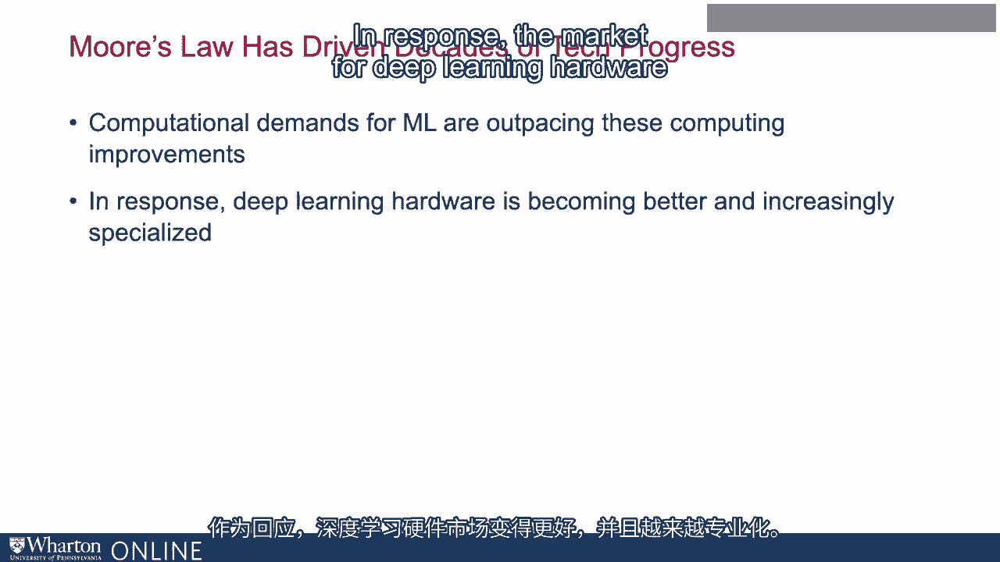

# P107：6_AI计算的经济学.zh_en - GPT中英字幕课程资源 - BV1Ju4y157dK

随着我们看到人工智能在软件使用方面变得更容易。就所需技能而言。

我们将看到更多的组织和更多地区用于更多的案例。使用这些类型的技术。到目前为止，许多机器学习的进展都是由摩尔定律推动的。这就是基本上支配技术进步的定律，涉及芯片的计算速度和存储能力。这些进展基本上推动了最近机器学习的许多改善。

当我们思考机器学习时，虽然它正在扩展到更多组织和用例中。机器学习的计算需求将开始超过这些计算的改善。随着我们看到人工智能被用于更多的案例和更多的人。我们将需要越来越多的计算能力来构建和运行这些不同应用所需的模型。

因此，作为回应，深度学习硬件的市场正在变得更好且越来越专业化。

因此，许多机器学习已从对CPU（中央处理单元）的依赖转变。这些是通用的GPU。现在正从GPU转向更专业的硬件，如TPU。这是一个张量处理单元（tensor processing unit），是谷歌所创造的。

此外，初创企业中专门为机器学习计算开发的AI芯片市场也十分活跃。在消费者领域，例如苹果公司，在开发其新芯片时。添加了一个专注于机器学习的重要组成部分。因此，围绕定制硬件和专门化的活动和能量一直非常强劲，这种方式特别快速。

在某些情况下，当涉及到运行机器学习应用时，能源效率也是一个考虑因素。举个例子，谷歌的TPU被专门设计用来补充tensorflow背后的某些算法逻辑。它运行得比其他芯片更快。它的效率也比其他芯片更高。

现在，为什么要关注计算？因为这无疑是围绕人工智能的新兴背景。如果我们考虑为什么这些公司进行投资，制造可以运行、构建和训练机器学习算法的芯片和硬件。在未来几年中，将会有一个大规模的转变，企业将利用人工智能寻找能够提供所有后端计算的供应商。我们考虑的许多应用需要的计算量太大，无法在组织内部运行。

或者这只是个不方便的问题。因此一些大型云服务提供商，比如亚马逊。像谷歌、微软这样的公司，会对成为这些AI计算的云端后端非常感兴趣。自然地，这可以说是一种互补的投资活动。主要是开发硬件基础，以便能够高效地运行这些类型的操作。

因此能够提供专门针对AI操作的高效云服务。

而对于你可能称之为AI栈的这场斗争才刚刚开始。当然，你可以看到亚马逊、谷歌、微软的很多活动。还有其他方面，以确保人们理解当他们想要在云中运行AI时的需求。这些公司能够提供后端服务以实现这一点。新的参与者也正在进入这个市场。特斯拉最近宣布将提供这一领域的服务。但这是一个将继续发展，特别是围绕运行机器学习算法所需的计算资源的市场。[空白音频]。

