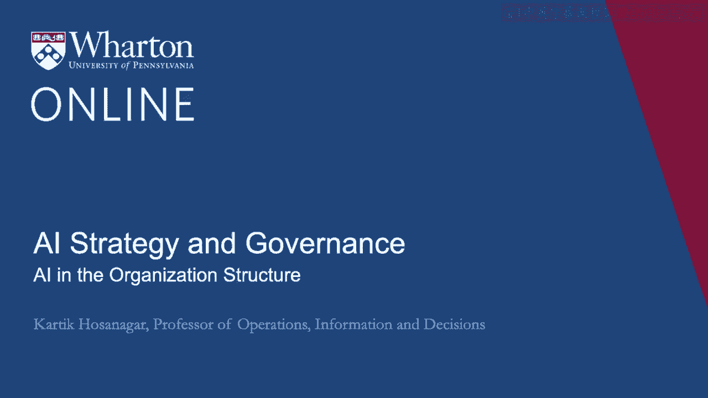
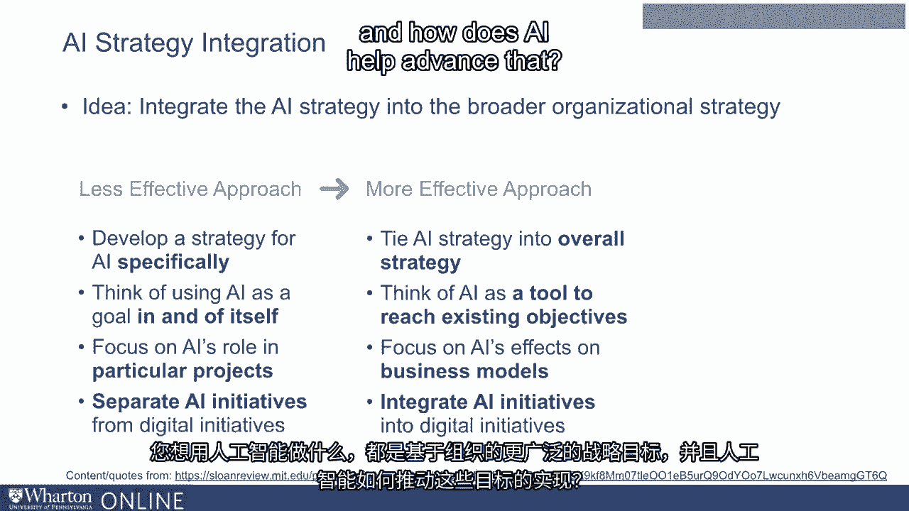
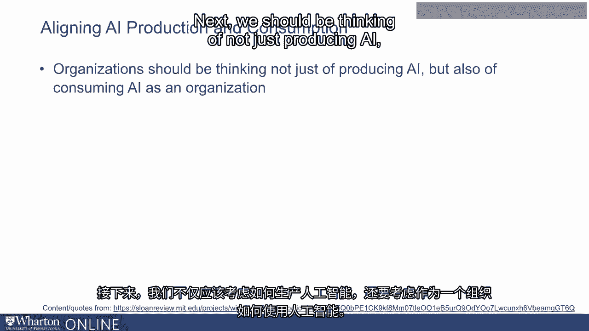
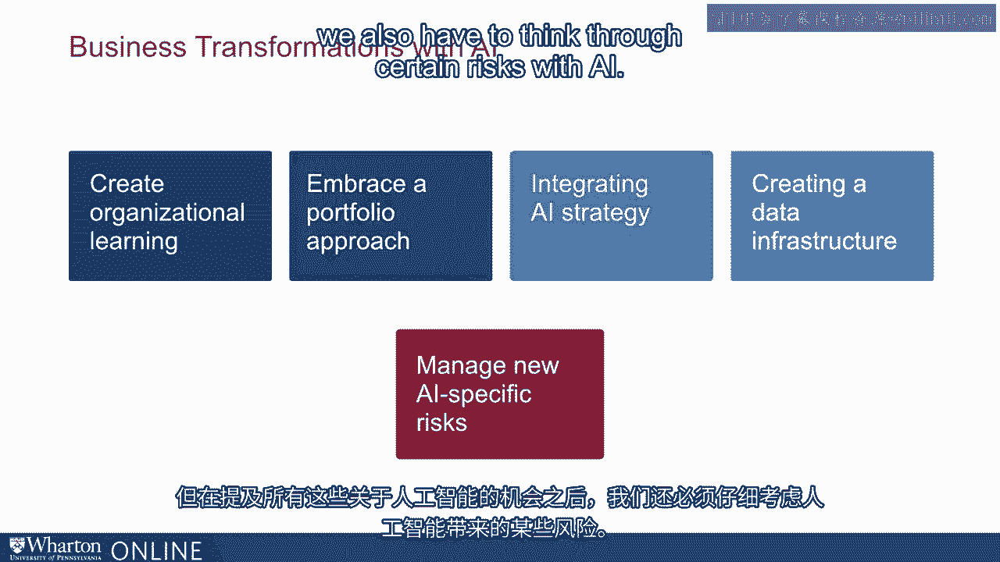

# P113：12_组织架构中的AI.zh_en - GPT中英字幕课程资源 - BV1Ju4y157dK

我们已经谈到构建投资组合是AI策略的重要组成部分。

作为他们AI策略的一部分，管理者还能做哪些事情？在本讲座中。我们将探索一些这些策略。BCG和MIT对高管进行了调查，询问他们的AI策略。特别是，他们询问了那些从AI投资中获得成果的公司。他们做了哪些事情？以下是一些似乎对这个群体有效的策略。

第一个原则是AI策略整合，即你可以整合。将AI策略融入更广泛的组织战略中。许多公司为AI单独制定了策略。换句话说。他们将使用AI视为一个独立的目标。相比之下。更有效的策略是将AI概念化并设想在。在更广泛的组织战略背景下。所以无论你想用AI做什么，都基于更广泛的战略目标。组织以及AI如何帮助推动这一进程。

当然，现在重要的是意识到，尽管我们希望长期内实现整合。对于公司而言，从不太整合和不太雄心勃勃的目标开始是可以的。在短期内作为建立共识和获取一些AI技能的方式。所以在短期内拥有其中一些是可以的，但即便如此你也希望有一些。

与整体长期策略相整合或对齐的长期倡议。作为一个组织。第二个关键原则是，能够有效利用AI并获得收益的组织。从AI中获得价值的公司不仅关注AI的成本效益，而是利用AI来推动。

增长或收入。因此，不太有效的策略就是仅仅将AI视为降低成本的工具。相比之下，利用AI承担风险的公司追求更高的风险和更高的。回报项目是那些从AI中看到回报的项目。

同样，另一个非常重要的想法是，为了在AI上取得成功，你需要。拥有合适的基础设施至关重要。而最重要的基础设施是数据基础设施。真正考虑在多个部门整合数据资产的公司。在组织内拥有多个产品和多个数据源的公司才是那些。

正在取得成效。换句话说，如果你的数据仍然孤立，并且被个别部门孤立使用。如果各部门孤立运作，整个组织不太可能从AI中获得显著收益。相比之下，那些在AI上取得成功的公司是那些努力进行整合的公司。他们的数据。请回忆在早期模块中，我们谈到过数据仓储作为其中的一种方式。

是可以完成的。数据仓储涉及将来自不同来源的数据整合到一个单一的存储库中。这是一个容易访问的分析应用程序。这是一个非常重要的练习。投资数据基础设施是一个非常重要的练习，因为没有它。否则你只能获得一个非常分散的客户或组织本身的视图。接下来。

我们不仅应该考虑生产 AI，还应该考虑作为一个组织如何使用 AI。

我们的意思是，虽然拥有数据科学家和机器学习专家很重要。正在创造新的机器学习能力的专家，我们也希望有消费者。在业务中利用 AI，这意味着经理们将消耗这些洞察。机器学习的数据科学并从中做出管理决策。

为了做到这一点，你需要有数据基因的经理。所以并不是所有经理都有这种素质。这可能也涉及一定程度的再培训。你需要与数据科学家紧密合作并努力的经理。理解数据分析的结果，挑战数据分析的对象，以及谁。他们将自己的领域知识带入数据分析中。所有这些都是必要的，以便你不仅有数据科学家在内部创造 AI。组织中有经理在消费数据科学和 AI 的洞察。接下来。投资人才非常重要。这个原则我之前提到过。

但是如果你有一个孤立的四到五个数据科学家的团队，我们就无法在 AI 上取得成功。你需要在整个组织中拥有 AI 知识、理解和洞察力。这既包括在组织内招聘新的 AI 人才，也包括重新培训现有的人才。员工以及教他们如何在自己的工作中最佳利用 AI。

所以我提到了一些帮助转型组织所需的不同原则。关于 AI 的思考。这包括帮助创造组织学习的想法。还使用投资组合来。

追求多个项目，将你的 AI 战略与更广泛的组织战略结合起来。建立一个数据基础设施，以便你可以利用它进行 AI 努力等等。

但是在提到所有这些 AI 机会的同时，我们也必须考虑某些。

AI 的风险。在接下来的几节课中，我们将讨论这些 AI 特有的风险，以及如何创建。一个治理框架来管理这些风险。[BLANK_AUDIO]。
