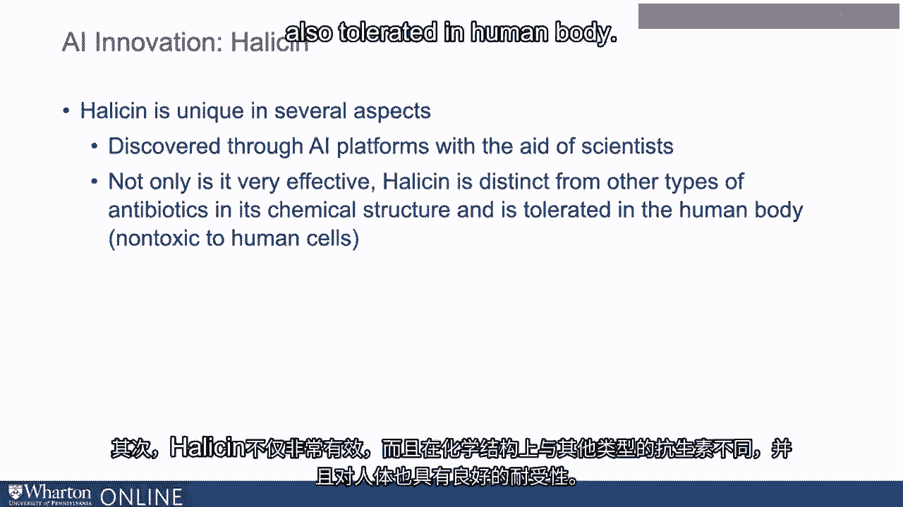
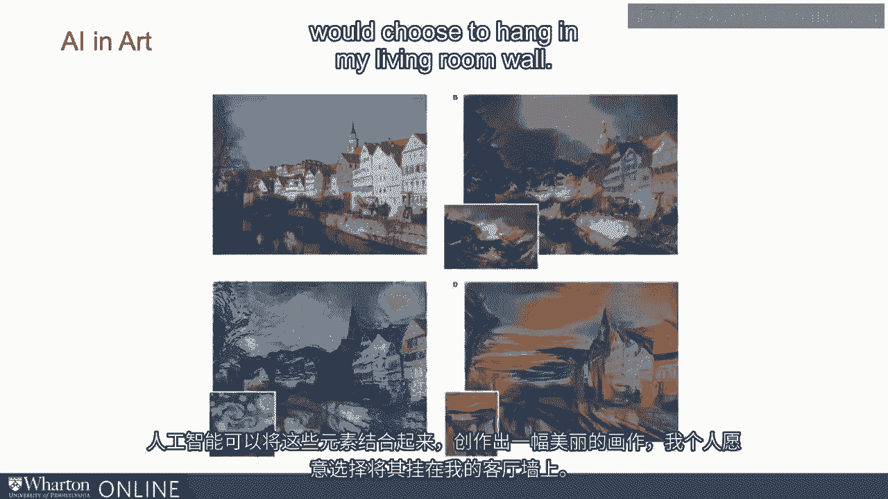

# P115：14_AI和数据分析适合创新吗.zh_en - GPT中英字幕课程资源 - BV1Ju4y157dK

我叫林吴。我是Wern商学院运营信息系的副教授。

决策部门。我的专业是AS对组织的影响，尤其是来自。

从创新的角度来看。在这个视频中，我们将讨论AI和数据分析是否适合创新。

你可能在过去几年听到了很多关于AI驱动的有趣新闻。

创新。最著名的一个是在2020年。AI创造了，帮助创造了一种新的抗生素。

被称为halosine。这是一个重大突破，因为抗生素，特别是新型抗生素。

是极其难以发现的。这已经成为一个重大公共健康问题，因为这个超级箱。

正在成为一个大问题。因此在2020年，一群MIT研究科学家利用了。

关于各种化合物的数据，它们的抗菌活性等等。在此之后。

筛选超过一亿种化合物后，他们能够辨别出新的模式。

我们之前未见过的数据。因此，他们能够识别出新的抗生素。

仅用大约三天时间。Halosine在几个方面都是独特的。首先，它被发现。

通过AI平台在科学家的帮助下。第二，不仅非常有效。

halosine在其化学结构和其他类型抗生素上也是独特的。

在人体内也是可以容忍的。

几年前，IBM沃森以其技术发现了一种新型的。

医疗创新的一个重要方面。在这种情况下，沃森能够消化大约2300万。

跨越许多不同学科的医学论文，以寻找关于肿瘤抑制剂的信息。

被称为P53。P53很重要，因为它与几乎所有癌症的一半相关。

所以在短时间内，沃森能够消化所有这些论文，找到。

这数据中的隐藏模式，并识别出六种之前未知的相互作用蛋白质。

与P53一起。这一成就本来需要研究人员超过六年的时间才能完成，而沃森。

他们在几周内完成了这一切。这不仅仅是在医疗行业，也不仅仅是在药物。

不仅仅是在化合物发现方面。这也体现在产品设计上。例如，Autodesk。

正在尝试设计一种新型底盘。他们所做的是增加了许多传感器。

到一个可以测量应力、温度、位移的底盘上。

所有与底盘相关的其他事情，以及让底盘正常工作。还有。

所有这些传感器都非常便宜，能够在这个底盘上部署许多传感器。

安装传感器后，一位特技车手驾驶这辆车并且真的。

尝试推动一个系统。好的。所以他们可以加速得非常快，他们的刹车也很猛。

尽可能用力转向。经过约2000万数据点，AI与八位科学家合作。

用全新的底盘。好的。如果你看看这张底盘的照片，它并不真的像。

一辆车。看起来像一根带有猛犸象的骨头。但请注意这辆车的非对称性。左侧。

左侧和右侧并不是彼此的镜像。通常你会看到左侧。

左侧和右侧的汽车非常相似。这是因为如果你看看。

这些数据表明，汽车在一个方向上的转向频率远高于另一个方向。

所以当然，一侧必须承受更多的压力。

一侧的压力和位移比另一侧多。这就是为什么你会看到之前的非对称性。

即使在艺术和科学的领域，这也是。

我们认为这是非常人性化的行为。我们看到AI可以创造出我们可能感兴趣的艺术。

并挂在我们的客厅墙上。如果你看看顶部的这张照片。

这是一张美丽的照片。然后你将它与梵高的《星空》结合，你就会得到一个美丽的组合。

这两张照片的元素。然后创造一张包含《星空》元素的全新照片。

你可以对许多其他著名画作进行同样的操作，将你的照片与另一幅结合。

著名的画作。AI可以结合这些元素，创造出一幅美丽的画作，我个人会。

我会选择挂在我客厅的墙上。所以我刚给你一些关于AI的精彩例子。

驱动的创新。然而，如果你查看尼古拉斯·布恩所制作的这张图表。

2017年的共同作者，你会看到不同的画面，因为有人辩称，不仅仅是。

我们为何没有看到伟大的创新出现，但平均而言，我们看到了创新的下降。

所以这就是如何阅读这张图表。绿色线可以看作是我们投入了多少钱。

我们在研发上投入的资源。蓝色线可以看作是人均支出。

基本上是每个人均产生了多少创新。你可以看到我们投入了很多。

更多的钱和资源以绿色线有效研究人员数量衡量。但如果你。

查看这一资源投资的生产力，蓝色线表明我们的。

人均投资，我们的人均创新产出下降了不少。

这是一个从1930到2000的较长趋势。数据表明这个趋势的原因。

这一趋势持续。那这里发生了什么？为什么我们看到这么多由AI驱动的创新？

但是不知为何，它们并没有体现在我们的生产力、创新和统计数据中。

这是一个非常有趣的现象。这引出了AI能做什么和不能做什么的核心问题。

进行创新。在我们下一个视频中，我将解释什么样的AI是合适的，什么样的AI是不合适的。

针对各种类型的创新活动。[BLANK_AUDIO]。

