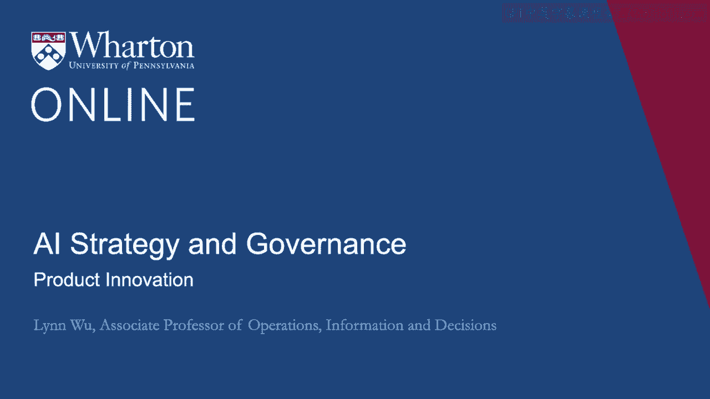
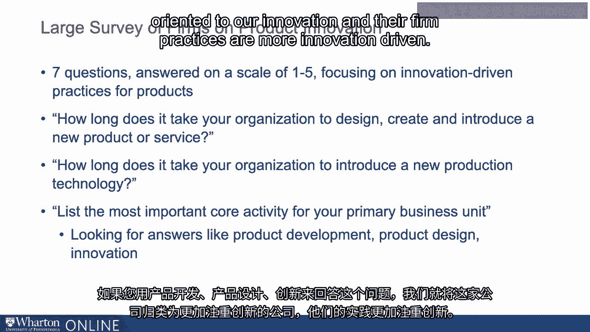

# P117：16_产品创新.zh_en - GPT中英字幕课程资源 - BV1Ju4y157dK

在最后一个视频中，我们讨论了流程创新。

在这一部分，我们将讨论产品创新，或者更具体地说AI和数据分析。可以帮助你确认，创新新的产品和服务。记住我们之前提到的创新悖论。我们看到对AI和数据的投资在不断增长。然而，我们没有看到创新统计数据的出现。在某种意义上。我们没有看到更好的创新或更多的创新。如果有的话。人均创新正在随着时间的推移而减少。

为了理解这一点，我们进行了一项大规模调查，以了解发生了什么。在早期的调查中，我们展示了AI在流程创新方面能有很大帮助。我们能否在产品和一般服务中看到相同的情况？所以再次。我们提出类似的问题，但这里我们真正想要聚焦的是。

关于产品的创新驱动实践。所以这里我们问的问题包括。你们组织设计、创建、引入新产品和服务需要多长时间？

你需要多长时间来创新或引入新的生产技术？

在一个主要业务单位中，最可能的核心活动是什么？如果你回答这个问题。答案是产品开发、产品设计、创新，我们将这家公司归类为某种类型。更加面向创新的公司，其实践更驱动于创新。

再次，我们看到直方图，并非每个公司的创新都是驱动的。一些公司在这个尺度上非常高，而一些公司则非常低。其中许多处于中间位置。

这让你了解流程创新驱动实践之间的差异。在我们调查的300家公司中。这是一个显示分布的图表。所以在x轴上。我们有流程导向的实践，如我们之前所示。在y轴上。我们看到与创新相关的实践。可以看到它分布在四个象限中。

一些公司在两者上都很高，一些公司在两者上都很低，还有混合的情况。一些公司更偏向于流程，而对创新的关注较少。一些公司更关注创新，而对流程的关注较少。你确实看到存在异质性，存在巨大光谱。

公司在这个图中可以适应的位置，以及这些公司的可能性。最初投资AI和数据分析的情况。因此在第一个柱子中。我们查看你的公司是否非常注重流程。你投资数据和AI的可能性有多大？我们看到一个标准差。过程创新的增加。有大约2.22%的公司更有可能采用AI和数据分析。这确实影响了非常显著的统计数据。但如果你看看产品创新。在同一标准下，得分为1.0的偏差增加了你采用人工智能的可能性。如果你的产品导向，这基本上没有影响。

似乎如果公司真的对产品创新感兴趣。采用人工智能分析的可能性是零。它没有影响。

这真的很有趣。这可能与某些创新悖论有关。我们之前看到的内容。让我们也看看这如何转化为生产力。好的。如果你这么做，如果也许人工智能没有帮助，且没有投资人工智能。这是一个正确的决策。在这里我们关注对改善产品创新感兴趣的公司。

他们也在人工智能上投资，并与其他公司进行比较。那些以流程为导向并投资于人工智能的公司。好的，在这个图表中我们看到。当一家公司同时投资于人工智能，并且非常注重流程时，得分为1。0的偏差变化与7%的生产力提升没有关联。

我们在之前的视频中看到了这一点。并将其与产品创新进行对比。产品创新和人工智能基本上确认，投资于大量人工智能技能和产品。以及基础设施。同时也非常关注产品的创新。他们实际上并没有看到生产力的提升。但这里我们只是测量所有产品创新。我们还没有区分产品类别中的哪种创新。但总体来看，我们确实看到对流程导向感兴趣的公司之间存在差异。而且对产品导向感兴趣的公司。

一家非常关注改善流程的公司。在使用人工智能和分析方面看到显著改善。但我们在产品创新中并没有看到这一点。

所以这个重要发现是，不仅存在人工智能与分析之间的关系。一般的产品创新是零。有时这种关系甚至可能是负面的。也就是越倾向于我们的产品，服务形象越明显。他们实际上更不可能投资于人工智能。我们看到这种关系对流程并不成立。从某种意义上说，更多的流程创新。你的公司更可能进行投资，你越有可能投资于数据分析和人工智能。此外，你还在通过提高生产力来获得这项投资的回报。

所以我们确实看到了流程与产品之间的创新差距。但再一次。这仍然是一个非常粗略的划分。我们将看看产品创新中的细分。在我们下一个视频中，我们将探讨什么在人工智能中有效，什么不起作用。（沉默），（蜂鸣声）。
