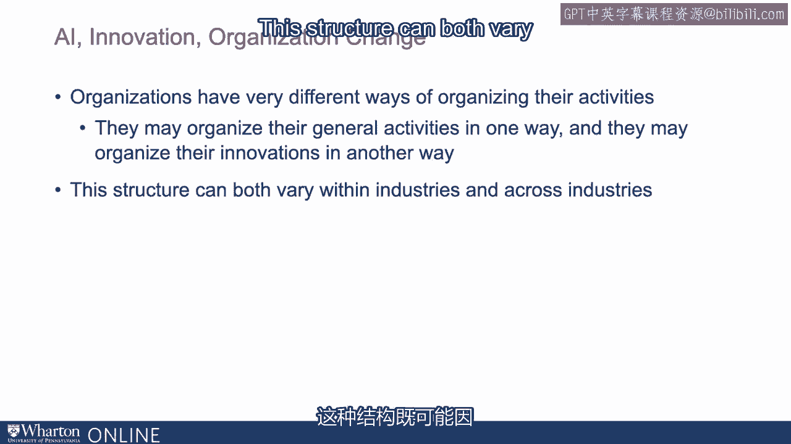
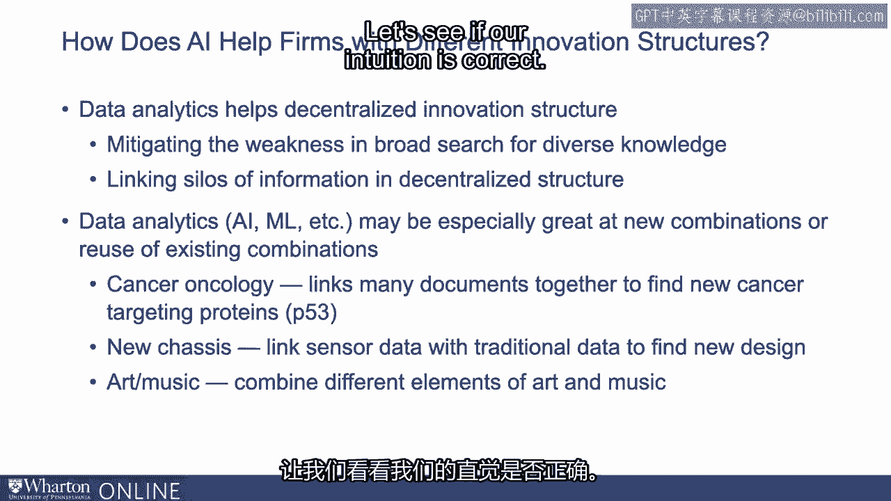
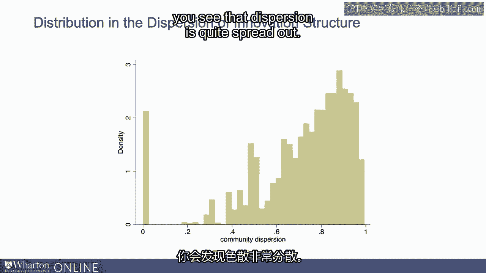
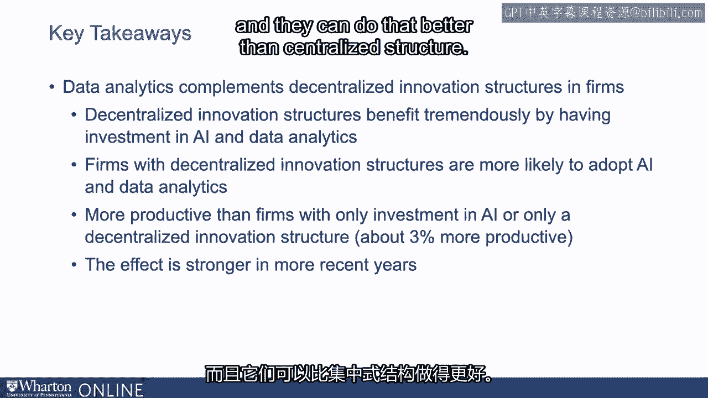
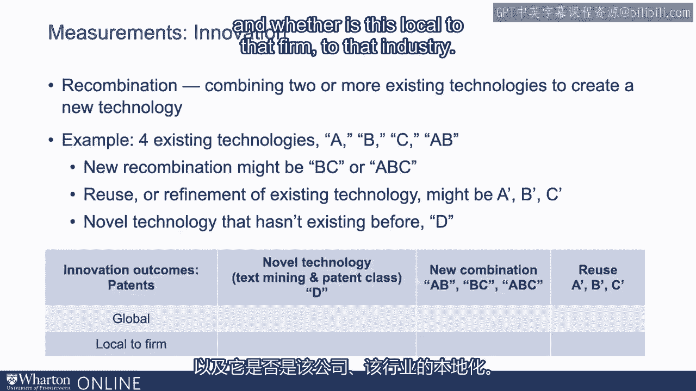

# P119：18_组织因素.zh_en - GPT中英字幕课程资源 - BV1Ju4y157dK

在我们上一个视频中，我们探讨了AI分析与一种产品之间的关系。

AI最适合的创新。但可能还有许多其他的组织因素可能影响这一点。

关系。因此在这个视频中，我将讨论如何组织你的创新可能会调解。

那种关系。有些组织结构正好适合支持以AI驱动的创新。

有些组织结构则不是。所以在这个视频中。

我们将探讨组织因素，例如如何组织你的创新团队。

团队构成，以及员工的技能组合如何变化。

AI可以帮助公司创造的创新类型。在这个视频中。

我们将主要关注结构方面。组织在组织其活动的方式上有非常不同的方法。

它们可能以一种方式组织其一般活动，并且可能以另一种方式组织它们的创新。

以另一种方式。因此，具体观察公司如何组织其活动非常重要。

创新活动，以及它们与一般组织结构的比较。

这种结构可以在行业内部和跨行业变化。

这意味着不仅仅是行业差异。例如。

药物研发可能与汽车研发组织方式截然不同。

或者它可能是在同一行业内，例如在药物发现领域，一家公司决定。

以一种方式组织他们的创新活动，而另一家公司会选择不同的方式。

为了让你了解我在说什么，让我们来看一些例子。这是两家公司。

谷歌和苹果，他们以非常不同的方式组织他们的创新活动。

这两家公司都是科技行业中非常创新的公司。如果你看看谷歌。

它们的创新结构更加分散，而。

苹果的结构非常集中在少数集群中。那么这些集群是什么呢？

节点是什么？这个图中的链接是什么？这些图中的节点是发明者。

当两个节点共同撰写专利时，它们就连接在一起。明白了吗？所以你可以看到谷歌。

它们有几个集群，但基本上是分散的。而苹果。

你会看到创新结构实际上集中在少数集群中。

中心的大节点，底部还有一个，谷歌的分散程度更高。

所以这是一种公司自然而然组织自己的方式。这可能有很多不同的原因。

可能是历史原因。也可能是对组织的不同思考方式。

想想创新。有这么多因素，我们并不真正知道为什么它们以这种方式组织。

但这不是最重要的点，我只是想让你看到公司是如何组织的。

创新方式不同。这些结构一旦形成实际上很难改变。

因为这有点难以改变创新关系。

通过法令或更换首席执行官或更换研发主管建立正式结构。

这不一定会迅速改变这种结构。

但分析和人工智能变化非常迅速。那么我们能否看到人工智能分析对这些公司的采用产生不同的影响？

这些技术能否帮助谷歌类型的世界，还是苹果类型的世界？

从某种意义上说，他们能否比集中结构更好地促进更分散的创新结构？

版本或反之？这不仅仅是苹果与谷歌，因为他们是太知名的公司。

两者都非常创新，可能特定于技术领域，其中有非常创新的公司。

你在其他各个行业中也会看到同样的现象。这是两家公司，Cenofe和Roche。

这些都是大型制药公司。再次看到他们是非常高效的制药公司。

但是这些制药公司有着非常不同的组织方式。

Cenofe稍微分散，而Roche则在未来更加集中。

少数集群。因此我们可以问的类似问题是，人工智能能否帮助谷歌的Cenofe？

世界或苹果Roche的世界能否创新？

中心化和去中心化各有利弊。

去中心化有许多优势，因为人们专注于他们的工作。

特定类型的工作。他们非常本地化于他们的市场，倾向于采用粘性知识。

通过粘性知识，有些事情你知道，且很难在一个团队之间移动。

彼此之间有许多隐性知识，许多事情你只是知道。

团队内部彼此交流，但将这些信息传递给其他人很困难。

当人们长时间共同解决特定问题时，他们更可能。

识别问题并创造自主解决方案。

但由于他们是去中心化的，有时很难促进跨团队协调。

他们在团队内部合作非常好，但可能有点困难。

将这些知识转化或与其他可能有非常不同沟通方式的团队合作。

彼此之间或以不同的方式创建自己的行话或粘性知识。

另一方面，中心化也可以提供许多优势。

中心化往往创造出超出个别团队的激进创新。

在中心化的世界里，你可能很擅长识别问题，找到你的解决方案。

自己的团队，但你的解决方案可能只适用于你自己，而可能不适用于所有团队。

或者中央集权可以更好地帮助你做到这一点。而中央集权也可以广泛搜索超出个人的外部信息。

团队可能会决定某些资源，某些事情对整个团队更好。

组织应该考虑整体，而不是单个小组。

单个小组往往相对短视，只考虑对自己小组有利的事情，而不考虑。

广泛思考。因此，中心化可以克服一些跨部门或核心国家的问题。

去中心化并不缺乏，但去中心化在地方解决问题方面确实很有效。

如果我提供针对该业务环境的创新解决方案。

所以这两种情况下都有利弊。那么分析和人工智能如何介入？

你认为分析，结合你对分析的理解，会有助于中心化吗？

更好地组织或更好地去中心化创新结构？

如果你考虑分析和人工智能能做什么，其中一个关键优势就是它们。

可以进行广泛的多样知识搜索。他们。

通过进行广泛搜索，发现隐藏的模式、隐藏的关系。

你以前没有见过的。他们还将现有的信息孤岛以一种有助于去中心化的方式联系起来。

所以，通过拥有一个自动挖掘不同领域、寻找隐藏模式的工具。

在某种程度上，它可以缓解去中心化在协调方面的中央弱点。

它也可以解决所有协调问题。这是不可能的。

但即使稍微削弱一下这些困难，可能也会促进这些组织。

在创新活动中发挥作用的结构。记得在我们上一个视频中。

我们展示了人工智能，机器学习。

隐藏的分析特别擅长发现新的组合或多样化组合。

或者以新的方式使用现有技术、现有组合和新方式。

这一切都将有助于去中心化结构并解决他们的问题。

问题说，“哦，似乎还有其他地方发明的技术可以被使用。”

帮助我找到解决问题的方案。“再说一次，如果我早些时候提到过。

你考虑癌症本体，PPP3蛋白，如果你，想象新底盘、艺术音乐。

这些都是通过重复使用、使用而产生的新组合。

组合和新的方式或重新使用现有技术和新的方式或发现多样化。

组合在一起。这个本质可以通过整合信息孤岛来帮助去中心化。

技术，通过以新的方式结合它们。

那么，让我们看看我们的直觉是否正确。再一次。

我们可以衡量公司的创新结构。

所以在这里，我们使用机器学习来理解机器学习。

在这里，我们在共同创作网络上使用社区检测算法。

基本上，它捕捉到这个图中有多少组以及它们的连接程度。

它们彼此之间的关系。在一个高度分散的谷歌世界中。

你会看到去中心化的高测量值，而在集中化的苹果世界中，你会看到高价值。

集中化。我想指出这与正式层级不同。

首先，它们非常难以捕捉。其次。

它们可能无法反映人们真正的工作情况。

仅仅因为你和另一个曾多次合作的人在一起。

重新组合成不同的组织，并不意味着你们不会再合作。

你不会考虑新的专利申请。它们可能在某种程度上会影响。

但这不会产生如此剧烈的影响。所以这里我们实际上捕捉到了人们真正的合作方式。

真实的。

人们如何共同创新。所以我在查看他们在专利上的共同署名。

这是分散创新的分布。所以再说一次。

高价值意味着你非常分散，低价值意味着你非常集中。再说一次。

你可以看到公司之间的巨大光谱。有些公司非常分散，有些公司非常集中。

你会看到这里有一个零的尖峰。我宁愿从不申请专利。所以我们就这样。

默认情况下这是零。但如果你需要超过零的列。

你会发现分散程度相当广泛。

你可以用这个指标来衡量你自己的组织结构。

你可以看到你结构的正式层级，这与什么不同。

非正式的协作结构实际上是由员工自己完成的。

而且你可以，因为作为你自己的公司，你不需要仅使用公共数据，比如生产。

你可以查看商标、设计团队、白皮书和出版物。

他们共同创造的所有内容可以帮助你衡量公司的实际内部协作结构。

你还可以看到这个结构如何与竞争对手不同。

你可以查看自己的专利共同署名网络。这是你的合作模式。

并将其与竞争对手进行比较，看看你如何不同地组织你的活动。

从竞争对手那里。当你查看数据分析，如果你查看AI投资。

这些技术补充了公司的分散创新结构。

这意味着分散的创新结构通过投资受益匪浅。

在AI和分析投资方面。不仅他们更可能采纳。

当他们一起采用这两者时，意味着他们同时投资于AI，并且拥有分散的创新结构。

它们更具生产力，而只投资于AI或仅投资于去中心化的公司。

它们的生产力提高了大约3%。这差异相当大。

考虑到这些行业的竞争性。我们查看了最近几年和早期几年之间的事实。

而且这个事实在近年来甚至更加强烈。

这家公司学会了如何在分析和AI创新中进行部署。

但是结构非常重要。数据分析和 AI 可以帮助去中心化创新结构。

他们可以比集中结构做得更好。

好的，我向你展示了 AI 如何支持去中心化，更好的去中心化。再一次。

其中有细微差别。它不会支持所有类型的创新。

它将支持一种特定类型的创新，正如我之前提到的那样，那就是。

以新的方式组合现有事物。重新组合创新。

多样的组合创新。我之前提到过，新的组合是将现有的事物结合在一起。

以一种新的方式看待技术。例如，在我们之前的例子中，我们有四种技术：A，B，C。

和 A，B。你可以考虑新的组合，例如 B，C，将 B 和 C 结合在一起。

多样的组合，将 A，B，C 结合在一起，形成 A，B，C。好的。

因此，我们也可以以稍微不同的方式对它们进行分类，可以称之为 A，B，A，B。

C 的新组合是之前不存在的。好的，或者我们可以看到 A'，B'。

C' 只是我们对现有技术 A，B 和 C 的轻微改进或精炼。好的。

A' 将是对 A 的改进，B' 将是对 B 的改进，以及 C'。

将会是对 C 的改进。好的。我们还可以提到 D，一项全新的技术。

这是之前不存在的，或者在专利中是一个新的子类别，它将是 D，这将是一项新技术。

所以我们可以将创新分为三种类型。全新的技术可能是 D。

或者新的组合，比如 A，B，B，C，A，B，C。或者重用 A' B' C'。

我们可以将新颖性与全球或本地公司进行基准比较。从某种意义上说，我们可以说。

你是第一个平均生成名为 A，B，C 的技术的人吗？

这是整个世界上从未存在过的。或者我们可以说。

尽管我不是第一个创造 A，B，C 的人，但我首先想在我自己的行业中使用它。

你可以说是针对特定公司的本地化。因此我们可以测量这三种组合的创新性。

新组合，重用。每三种都可以在全球范围内应用。

本地化到特定公司。无论它是新的，还是全球范围内的。

以及它是否只是本地于该公司，或该行业。

在这个图中，我将展示 AI 投资的可能性。

帮助去中心化创新结构，产生所有六种不同类型的创新。

所以当一家公司去中心化，并且投资于 AI，可能性有多大？

交易一个新的全球技术类别？这是第一个图。或者在全球范围内的新组合。

或者是本地于其公司的新组合。或者是现有技术的重用。

我将逐一解释每一种。第一种是新的技术类别。

所以我们这样理解，当一家公司实现去中心化时。

创新结构，他们投资于分析，并且投资于人工智能。

这种去中心化与人工智能投资的结合是否帮助公司创造新的全球技术。

你会发现这个事实几乎是负面的。但现在看看这三张图表。

他们的分数非常高。但注意他们是什么。

第二列被称为本地新技术。这意味着这是一个全新的技术类别。

这种公司或行业之前没有见过。但这个技术类别在其他地方存在。

所以再次，你正在将这种全新的技术类别纳入世界其他地方。

并将其引入你的行业、你自己的行业以及你的公司。

最高的标准实际上被称为全球新组合。

这意味着你以新的方式结合技术。这是全球范围内的第一次。

这种组合已经存在。而稍低的是本地的新组合。

这种组合在其他行业中之前已经发生过。

但你是自己公司、自己行业中第一个这样做的人。

所以这三种类型的创新是从人工智能和去中心化中获益的关键。

平均来看，你看中间的条形图、最高的条形图和新组合。

全球组合。平均每年四项专利。从某种意义上说，如果你投资于人工智能。

然后你就有去中心化的创新结构。所以如果你有一个去中心化的创新结构。

如果使用人工智能来创新这些组合的专利，似乎确实会带来回报。

将现有技术以新方式结合，或者对现有技术进行改进。

在其他行业中已经发生的。再次，将外部创新引入你的公司。

在这三年内容中以新方式解决特定于你的问题。接下来。

我们看到重用。重用就是考虑A的改进。基本上，A的改进是轻微的改进。

现有技术A。这仍然是创新，但它是渐进式的。你会看到这个事实。

但它并不是那么大。如果你考虑一下，如果你已经。

拥有你非常熟悉的技术，如果你想逐步创造。

你可能不需要强大的人工智能技术来帮助你做到这一点。

你可能已经知道你需要做什么。因为在这里。

关于该技术的搜索领域相对较小，因此并没有真正获得太多益处。

通过使用人工智能，而全球组合你必须经历两个到最后。

组件与技术数量的关系。所以你有，比如说，1,000种技术。

你必须经历两个到1,000的组合，以找出哪个有效。

这意味着更大的搜索空间。这就是人工智能真正帮助你的地方。

找出哪些组合是有效的，哪些组合不是。

当你拥有去中心化的创新结构时，这种组合特别强大。

因为这种去中心化的创新结构确实。

需要人工智能所能提供的扩展搜索空间的额外能力。

中心化不需要太多，因为他们已经具备协调搜索的能力。

从广义上讲，某种程度上。但对于去中心化，他们恰恰相反。

需要具备广泛搜索的能力。在我们的实证分析中你会看到这一点。

这确实是关于拥有分析能力，并为去中心化创新创造新组合。

而这不仅仅是通过组合。我们还可以在技术类别之外进行检查。

在之前的测量中，我们仅依赖于专利机构分配的技术类别。

但在这里我们可以查看引用。如果你认为你的专利非常新颖。

你应该在一些专利统计中看到这一点。所以在这里我们查看专利统计。

从某种意义上讲，在第一条中，条形将是90到100。

这意味着你专利中100%或90%的引用来自你自己的公司。

所以这里完全是你现有创新的增量。所以10%，它可能是--。

我只是说我引用了10%的自己的专利，即公司自己的专利，90%来自外部。

所以我们再次进行了基于分析，关注人工智能投资和去中心化。

当你同时拥有人工智能投资时，就会发生这种情况。

你将其应用于去中心化的创新结构。结果会是什么呢？再次强调。

你会看到在40到60之间的中间范围内，获得的最大收益。

而且这表明你并不是完全从外部借用新东西，而是借用得恰到好处。

你引用的恰到好处。你利用现有技术，并且从外部引用的恰到好处。

而不是中间范围的组合。这种中等的新颖性似乎是人工智能的最佳选择。

帮助去中心化的组织结构进行创新。你会注意到非常、非常新的组织。

在图表的0%和最右侧，再次看到负面效果。好吧。

小幅但负面的效果。

这可能是因为当某样东西是全新的时候。

你可能不知道如何很好地使用它。当是半对半时，你就会。

确切知道如何以某种方式应用，以适应你自己的需求和背景。一旦它是全新的。

完全新的，你只是将它们引入外部。这似乎并没有那么有效。

比进行中间范围要好。而生产力效应，我们再次看到同样的事情。

我们看到，当你投资于人工智能并进行去中心化创新时。

你的生产力大大提升。而且在最近几年这种效果甚至更强。

所以第一条是针对所有年份的。第二条是1988年至2007年。

第三条是2008年至2013年。你会看到最大的效果确实是。

从2008年至2013年的最近几年，你会看到最大的改善。

大约提升了3%的生产力。这是那些采用人工智能并进行去中心化创新的公司。

结构的生产力比其他公司高出3%。 (嗡嗡声)。

[安静]。
