# P12：11_具体的机器学习方法深度潜水.zh_en - GPT中英字幕课程资源 - BV1Ju4y157dK

在这次讲座中，我们将深入探讨一些机器学习模型，并看看它们究竟是如何工作的。

现在，我想提醒的是，这次讲座可能比本课程中的其他讲座更具技术性。对于那些没有数据分析经验或背景的人。你可能会发现这次讲座比其他讲座更难理解。我认为如果你不理解我在这次讲座中描述的所有内容也是可以的。对这些机器学习模型的高水平理解或甚至定性理解或许足够。并且在你与数据科学家互动时仍然会非常有用。如果没有其他，我希望你能从这次讲座中得到这个。当然。如果你能理解这些模型的细节。

这样在你与数据科学家互动时，它会对你的工作更有用。所以我之前提到，归根结底。给定任何一组输入变量x和一个结果变量y。机器学习模型试图预测的。机器学习算法的工作是找出某种变换或某个函数f，输入x并进行变换，以预测y。有许多不同类型的算法，每种算法对应于该函数f的不同选择。所以在这次讨论中，我会看一下其中一些选择。我将从逻辑回归开始。这是最简单的分类模型之一。

这些模型对于分类或预测问题是有用的，其中结果只能取少数几个值。例如，我们试图预测一封电子邮件是否为垃圾邮件。所以这是一个是或否的决定。或者我们试图预测消费者是否会点击广告。这又是一个二元决策。通常，逻辑回归是为二元模型构建的。

但将逻辑回归扩展到结果可以取多个有限小值的情况是相对简单的。例如，四或五个值。现在逻辑回归是数据科学和统计中最有用和最流行的技术之一，是分类算法非常成功有效的方法。现在，使用逻辑回归时经常出现的一个问题是，它是否真的算作机器学习。特别是考虑到逻辑回归实际上起源于19世纪。

并且在统计学领域已经使用了很长一段时间。逻辑回归确实有着悠久的历史，实际上早于一些现代机器学习的发展。

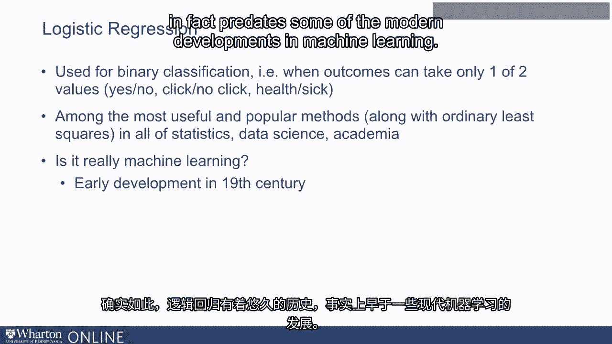

但我认为这个区分并不重要。这是一项非常重要的技术，应该在所有数据科学家的工具箱中。基本上，逻辑回归试图做的是给定一组输入变量 x1，x2。x3 等等。它试图预测给定结果的概率。现在在一个二元预测问题中，只有两个可能的结果，即邮件是否是垃圾邮件，或者信用卡交易是否欺诈。然后逻辑回归归结为你在这里看到的函数，其中邮件是垃圾邮件的概率的对数除以1减去邮件是垃圾邮件的概率是输入变量的线性函数。

基本上，logit模型或逻辑回归模型接受输入 x1，x2。x3 等等，并计算事件的概率。例如，垃圾邮件的概率或一笔交易是欺诈的概率。

现在可以直观地将逻辑回归视为试图创建一个最佳拟合平面或线，从而分离我们所有的数据。

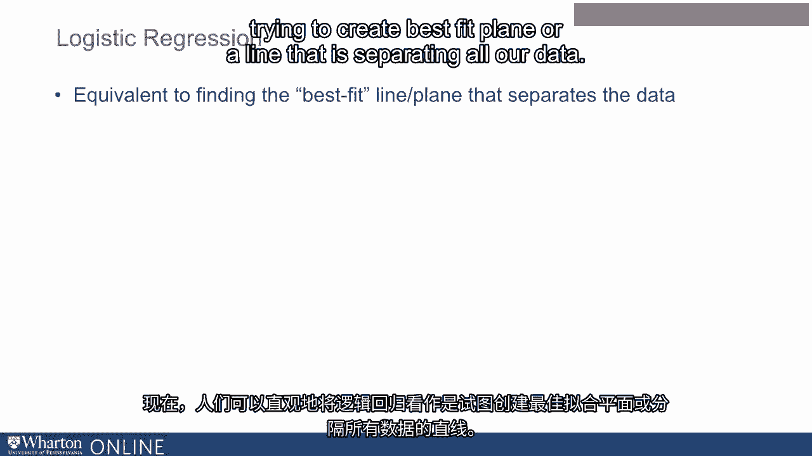

例如，如果你看看这张图表，我们有关于客户的数据。我们有他们的年龄和收入。这两者都是均值中心化的，意味着年龄为零表示这个人的年龄等于人群的均值。任何大于均值的年龄值在这里都是正值。任何低于均值的年龄值在这张图上都有负值。

现在收入和年龄都在这里进行均值中心化，我们有这些数据，并且我们正在尝试预测客户是否会购买产品。红色数据点基本上对应的是过去已经购买的用户。蓝色数据点对应的是过去没有购买的用户。逻辑回归基本上是在试图找出一条将数据划分为两个区域的线。

一种对应于可能购买的客户，另一种对应于可能不购买的客户。本质上，它尝试了许多不同的方式来划分这个平面。在这张图上有很多不同的方式来放置一条线，并找到最佳可能的线。这就是逻辑回归试图做的直觉。

另一种常用的技术是决策树技术。决策树是非常易于解释的模型，基本上它们的作用是利用数据创建一个树，帮助将数据划分为不同的组。例如，假设我们在试图预测今天是否会下雨，并且我们有温度的数据。我们有风速的数据，也有气压的数据。

现在我们可能会使用过去的数据，其中输入数据指的是某一天的温度、风速和气压，输出数据指的是那天是否下雨。决策树查看数据，并创建一棵试图预测是否会下雨的树。在这棵树中，你会注意到这个决策的第一步是问温度是否大于70华氏度。如果答案是肯定的，那么接下来决策树会查看风速，然后根据风速继续进行。

但是如果温度不大于70华氏度。它再次查看风速，但它关注的是一个不同的问题，即风速是大于还是小于4。5英里每小时。它以这种方式继续进行，直到最终做出是否会下雨的预测。

当然，这里自然会问，这个模型到底是如何决定在每个分支上选择哪些变量进行分裂，以及使用哪些值的。例如，为什么树在第一分支决定问温度是否大于70华氏度？

为什么不是60华氏度？这个问题的数学答案是决策树选择变量和分裂，以最小化数据集的熵。用非常简单的术语来说，想法是选择一个变量或分裂树的方法，以便你拥有最大的预测能力。在树的第一分支中，决策树将考虑我们所有的变量。这意味着它会考虑气压、风速和温度。

它会试图找出哪个因素对下雨的预测最有效，并将其作为树的第一分支。它以这种方式继续进行，每一步都在问如何划分数据，以便我们可以最好地预测结果。这就是决策树的工作原理，并且它们在实践中实际上效果很好。

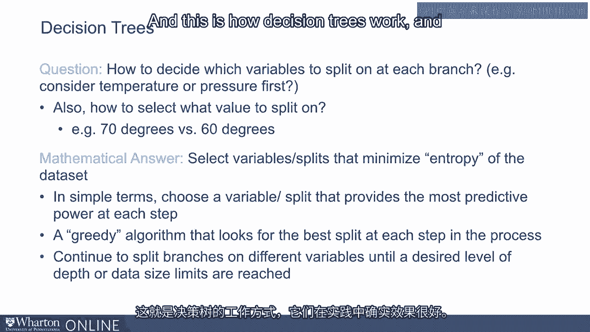

另一个常用的机器学习技术是随机森林。随机森林是所谓的集成算法的一个例子。这些算法结合了多个其他算法，以进行预测。随机森林将多个决策树结合在一起，以做出预测。随机森林在实践中实际上非常有效，因此在机器学习和数据科学家中也很受欢迎。机器学习的基本思想是将任何数据集随机划分为一堆更小的子数据集。对于数据的每个子集，你可能会训练一棵决策树，试图在可用数据的子集上做出最佳预测。现在，一旦你有多棵决策树，每棵都在试图根据可用的子样本或数据子集做出最佳预测。

然后我们最终结合所有这些决策树的预测，结合的预测成为随机森林的预测。

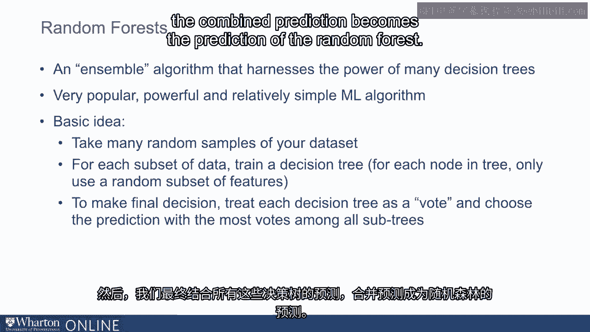

因此称为随机森林，因为它结合了多个决策树。所以我们再考虑一个例子。在这个例子中，我们有一个非常大的数据集，包含许多特征或输入变量。现在，随机森林算法可能会将数据集分成多个子样本。每个子样本可能具有不同的特征集。

所以第一个决策树是基于该子样本中的可用特征构建的。第二棵决策树是基于该子样本中可用的数据构建的，类似地，生成了大量决策树。每棵决策树尝试做出预测。例如，每棵决策树可能会预测给定的信用卡交易是否是欺诈。随机森林结合了所有这些决策树的预测。

例如，可以通过使用多数票或最受欢迎的预测来选择作为森林的预测。这就是随机森林的工作原理。值得注意的是，随机森林中的每棵决策树实际上都使用数据的一个子集。因此，每棵决策树不如基于完整数据集构建的决策树那么优秀。但当你将多个决策树作为随机森林的一部分结合在一起时，它们的表现通常在实践中优于在完整数据集上构建的单棵决策树。

在某种程度上，这就像群众智慧或预测市场。预测市场或群众智慧的背后理念是，如果你结合一群外行人所做的预测，那么群体的结合预测有时会等于，甚至可能超过专家的预测。非常有趣的是，一群外行人加在一起可以超越专家的预测，尽管这些人单独来看无法超越专家。这是因为每个外行人拥有不同的信息。

具有不同的决策标准，当我们将它们结合时，我们开始得到一些看起来像专家或真正智能的东西。

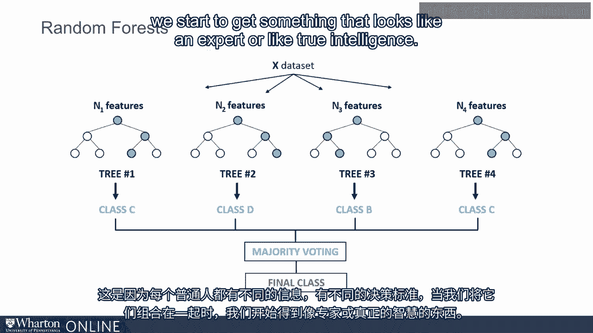

随机森林类似于拥有多个决策树，每棵树都可以访问部分数据，并根据每棵树可用的数据做出决策。每个决策树都不是一个很好的预测模型，但当你将这些模型结合起来时，你会得到一个高效的随机森林。

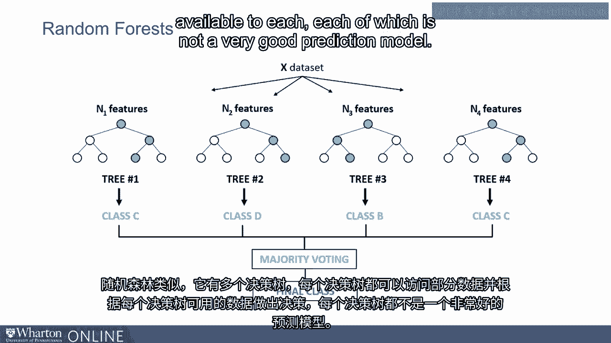

这部分原因解释了为什么随机森林表现良好，并在实践中被广泛使用。接下来我们来谈谈神经网络，这是一种先进的机器学习技术。神经网络在某种程度上受到生物神经元的启发。现在我们大脑中的神经元从其他神经元接收输入，对这些信号进行一些转换，然后将新的信号传递给与之连接的其他神经元。

同样，一个数字神经元可能从其他神经元接收输入。它接收这些输入并对其进行一些转换。所以在这个幻灯片的例子中，输入是值x1，x2，x3，一直到xn。每个输入都有一个权重应用于它，所以你有w1，x1，w2，x2，w3，x3，等等。

最后应用一个变换f，生成一个新信号或新值，这就是神经元的输出。神经网络本质上由许多相互连接的神经元组成，形成一个网络。深度神经网络是一种特定类型的神经网络，其中神经元按多层的形式组织。

让我们考虑一个例子。假设一个人试图使用神经网络，特别是深度神经网络，进行面部识别。这个神经网络的输入可能基本上由一组神经元组成，这些神经元对应于该图像中不同像素的像素值。

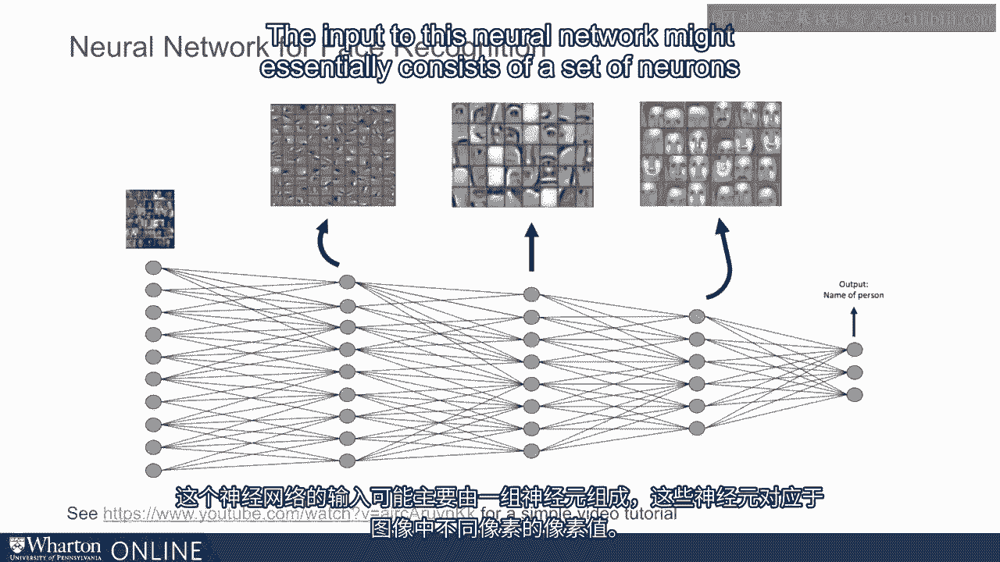

如果这是黑白图像，则每个神经元可能对应于该图像中像素的值。如果是彩色图像，则可能与该像素相关联的是RGB或红绿蓝值，神经元可能捕捉这些像素的值。

这个深度神经网络的最终层基本上具有我们希望从神经网络中获得的输出。例如，假设我们试图识别人的面孔，那么最终层可能有我们试图识别的人的实际名字。

在这张图中，我们在最终层只有三个神经元，所以我们假设我们正在面部识别任务中识别三个人。

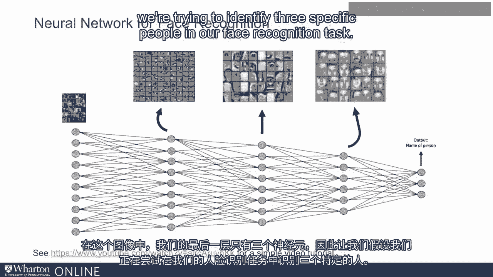

在输入层和输出层之间是一系列隐藏层。

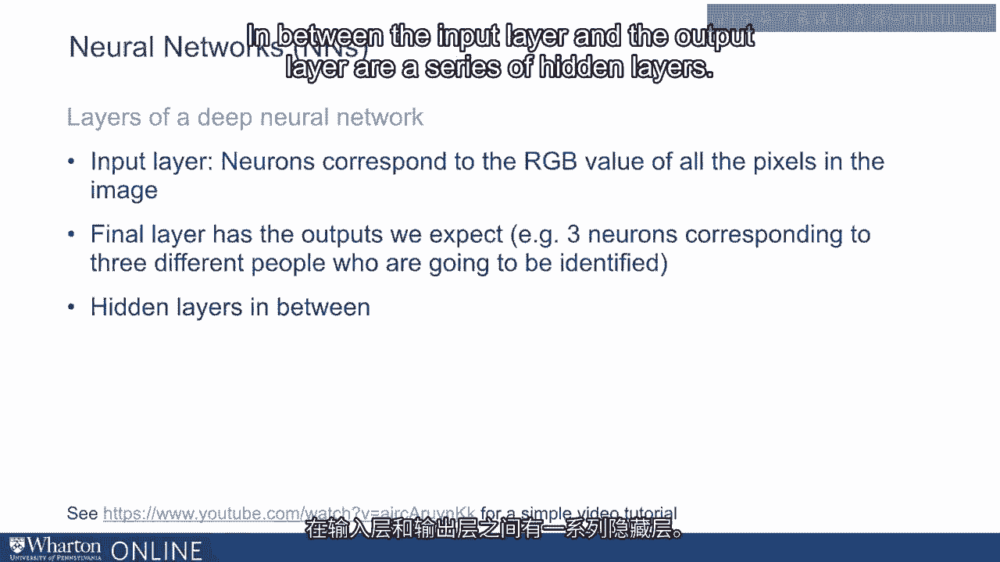

现在，在生物神经元中，当某些神经元组合激发时，会导致与其连接的某些其他神经元也激发。类似地，在神经网络中，基于一层神经元的值，下一层的某些神经元会被激活。因此，基于输入图像中像素的值，输入层中的某些神经元被激活。现在，基于输入层中激活的神经元模式，紧接着的隐藏层中一些非常特定的神经元被激活。

反过来，基于在隐藏层一中激活的神经元，下一层中的某些特定神经元被激活。这一过程以某种方式进行，直到倒数第二层激活了某些神经元。希望通过这些激活系列，我们能够捕捉到人脸的某些特征。例如，在倒数第二层，如果一个人的脸形状是椭圆形，则可能会激活某一层。

如果他们的脸形状更圆，则可能会激活不同的神经元。如果他们的眼睛形状像杏仁，则可能会激活某些层。如果他们眼睛的颜色是某种方式，则会激活某些神经元。基于激活的神经元组合，我们可以识别出这个人的脸。这就是神经网络背后的思想。现在，期望是这种神经元激活模式捕捉到人脸的某些特征。

最终，基于激活的神经元模式，我们做出预测，即在给定图像中到底是谁。近年来，神经网络已经变得非常成功。在许多在线机器学习竞赛中，使用大型数据集的神经网络实际上表现得非常好。当输入数据由图像、音频或视频等非结构化数据组成时，这一点尤其真实。

现在，如果我们看看神经网络为何如此成功，观察其结构时，我们会发现它有许多层。在给定的一层内，有很多不同的参数，例如从前一层输入的所有不同信号所分配的权重。功能形式或转换。确实存在许多参数，使我们能够构建非常复杂的模型，以便对于任何输入 x，转换 f(x) 可以相当复杂。此外，最近在计算能力方面取得了很多进展，专用处理器称为 GPU 已经被开发出来。

已经开发出专门的算法，使神经网络能够拥有越来越多的层，并允许我们构建复杂的模型。然而，这些模型的估计可以非常迅速。

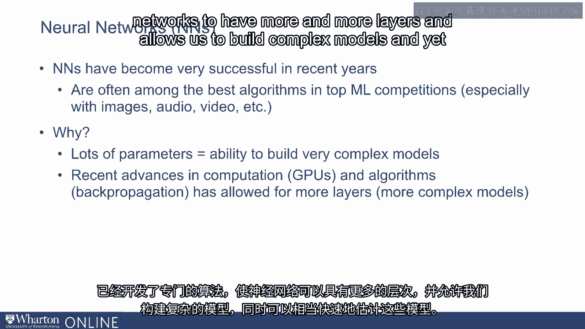

尽管神经网络具有强大的能力、灵活性和高预测性能。另一方面，神经网络的解释和理解可能非常困难。例如，我们可能知道输入层，也可能知道输出层，但中间层对我们来说很难解释。我提到的人脸识别任务，期望中间层捕捉到的概念如脸的形状或眼睛的形状。

在实践中，情况并非总是如此。因此，查看前面的层并不能让我们理解神经网络为何做出某个特定预测。因此，即使你拥有非常准确的模型，这些模型的可理解性也不高。现在计算机科学领域正在进行很多工作，试图构建更易解释的模型，或者让高性能的神经网络模型能够更好地解释它们的决策。

我们将在后面的模块中讨论解释方面的挑战。现在我在这次讲座中提到了一些不同的机器学习技术。这些绝对不是详尽无遗的，也并不代表大多数技术。还有许多其他技术，例如提升技术。支持向量机。即使神经网络也有许多不同类型，还有其他回归技术。所以回归技术可能只是普通的回归。还有其他更高级的回归技术，比如LASSO和Ridge加权回归等。关于这些技术的详细讨论，我建议你查看计算机科学课程或机器学习课程，这不在关注AI商业影响的课程范围内。

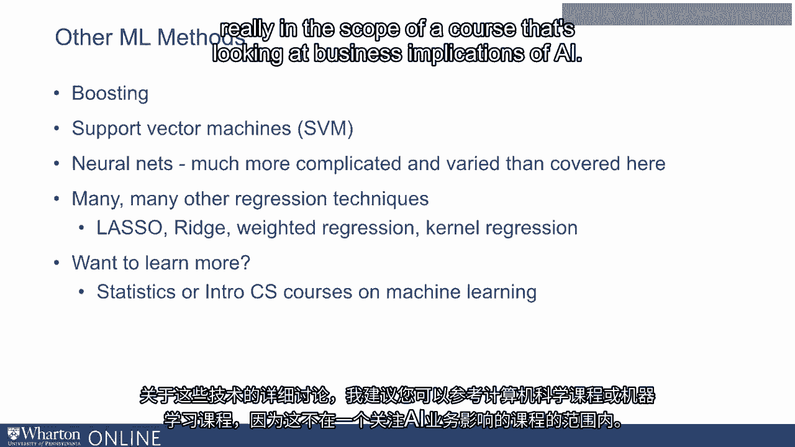

所以我不会深入探讨这个模型，但希望你对这些机器学习技术处理输入数据的方式有个大致的了解。它们进行预测，通常基于过去交易或可用于训练这些算法的过去数据中的干净标记数据。[BLANK_AUDIO]。
