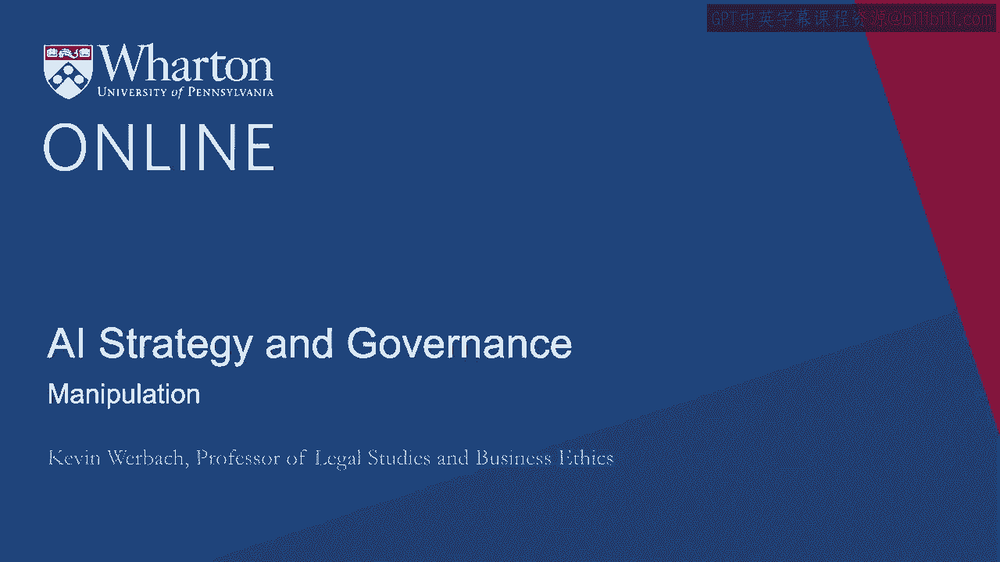
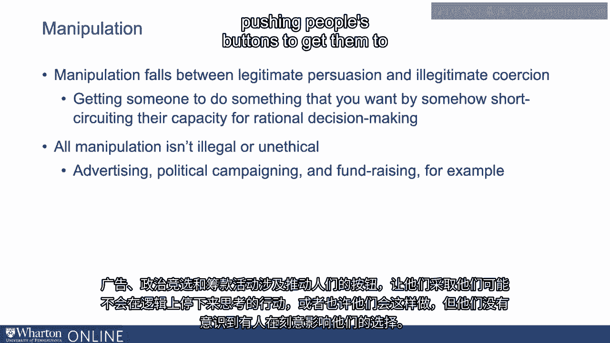
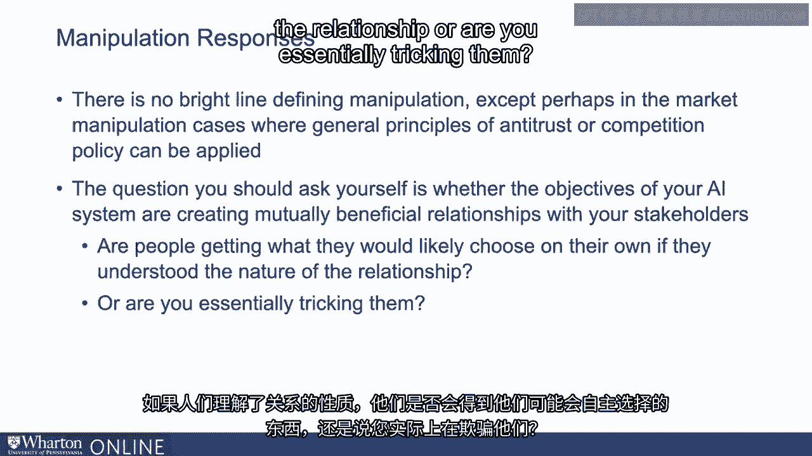
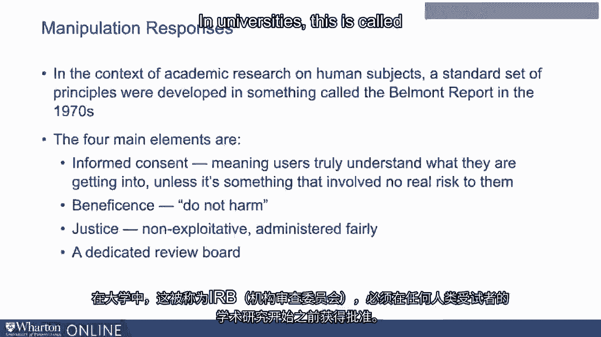

# P125：24_操纵.zh_en - GPT中英字幕课程资源 - BV1Ju4y157dK

操纵介于合法的说服和非法的强迫之间。

这意味着以某种方式让某人做你想让他们做的事情，从而绕过他们的理性。

理性决策能力。并非所有操纵都是非法或不道德的。广告。

政治竞选和筹款涉及刺激人们的情感，以获得他们的支持。

采取行动。他们可能不会，如果他们停下来并逻辑地思考这些行动。

或者他们可能会，但他们没有意识到有人在故意影响他们的选择。

所以，单纯的令人毛骨悚然与不道德，甚至非法之间的界限可能很难划分。

但这是一个重要的问题。AI可以在选择或决策不明显被塑造时操纵人们。

通过算法。

例如，当Facebook与学术研究人员合作时，引发了轩然大波。

测量其动态算法的变化是否能够产生心理学家。

称为情感传染。Facebook故意向某些用户提供了更快乐的内容。果然。

他们与朋友分享了更快乐的内容。然而，当这篇学术论文发表时。

这引发了愤怒。Facebook故意改变用户的情绪。

如果他们能让人快乐，他们也能让人悲伤，甚至可能抑郁。

在其他研究中，Facebook发现可以通过调整内容来增加选民参与率。

动态。如果它微妙地偏向某一候选人内容，会不会是操纵？

用户永远不会知道他们的投票受到影响。

这里的一个挑战是，您在Facebook动态中看到的一切都是算法的结果。

而且这些算法一直在变化。

Facebook向您展示更多关于气候变化的帖子，会不会是操纵？

如果公司的高管认为这样做对世界有好处？

或者他们这样做是因为认为会从电动车广告中赚取更多收入？

然而，一些形式的操纵是法律禁止的。

这些是虚假或潜意识广告等类别。然而，这些。

一般来说，这些定义得相当狭窄。除了这些例子之外，相关的主要法律概念是欺骗。

向客户推销他们想买的产品是完全可以的。

即使是通过AI个性化的。因为用户明白广告是为了向他们销售东西。

问题在于关系的性质不明显。

然后是剥削。这是一种更有害的操纵形式，涉及利用脆弱性。

产生在竞争市场中不会发生的自愿协议。在英国。

例如，航空公司使用算法故意将家庭成员分开坐在飞机上。

在他们购买便宜的票时未能选择座位的情况下坐在飞机上。

这是一种鼓励那些人升级到更高票价的方式。

他们能够坐在一起。但算法故意将他们分开，导致生成。

这一效果。当时，这只是一个相当简单的算法。它只查看姓氏。

但人们可以想象出更阴险的系统，能够在用户感到压力或困难时识别他们。

一份臭名昭著的泄露的Facebook广告演示表明，它能够识别青少年何时。

感到无价值、不安或焦虑。

这是负责任的人工智能从业者需要划清界限的时刻。

除了可能的公关反弹，如果你不会故意设计一个商业模式。

利用脆弱群体的做法，不应该通过算法间接进行。

然后就是市场操控，利用算法微妙地破坏竞争市场。

例如，亚马逊同时销售第三方产品和自己的自有品牌商品。

其搜索引擎并不直接优先考虑自己的产品。

但它确实结合了使用代理的信号来提高亚马逊的盈利能力，这可能导致。

在那种偏见中。那么问题是这是否是对产品市场的不可接受操控。

亚马逊。或者在某些情况下，算法可能会参与串通，这在一般情况下是被禁止的。

反垄断竞争政策法律。2018年，美国。

司法部对亚马逊上的海报销售者提起了诉讼。

因为他们的算法故意串通以维持高价格。

研究人员甚至表明，机器学习算法可以自行判断。

采用串通策略，导致更高的盈利能力。

那么，你该如何解决这些关于操控的担忧？正如我所说。

没有明确的界限来定义操控。除了在一些市场操控案件中，反垄断的一般原则。

或者在某些国家被称为竞争政策，可以应用。

你应该问的问题是，你的人工智能系统的目标是否在创造。

与你的利益相关者建立互惠互利的关系。

如果人们理解了，他们是否能够获得自己可能会选择的东西。

关系的本质？还是你基本上在欺骗他们？

在关于人类对象的学术研究背景下，制定了一套标准原则。

这是在1970年代的贝尔蒙特报告中发展起来的。

四个主要元素首先是知情同意，这意味着用户真正理解他们的。

除非涉及对他们没有真正伤害风险的事情，否则不会参与。其次，**慈善**。

这基本上是一个不伤害原则。不要让人们处于可能遭受严重身体或心理伤害的境地。

伤害。第三，**公正**，即不剥削、不利用他人的理念。

在脆弱的情况下，系统应以公平的方式实施。最后。

一个专门的审查委员会。

在大学中，这被称为IRB，机构审查委员会，必须在此之前获得批准。

任何关于人类受试者的学术研究都可以开始。

将每个AI项目，特别是在私营部门的项目，置于这样的审查之下是不合理的。

这种审查程度。然而，许多组织发现设立一个专门的卓越中心或委员会是有帮助的。

评估这些以及其他关于重大AI实施的伦理问题。这，然而。

不应以削弱负责任的人工智能为代价。

组织中。所有参与者都应对避免不道德操控和剥削感到负责。

以及我在本项目中强调的算法偏见和其他问题。谢谢。

[记录结束]，[沉默]。

