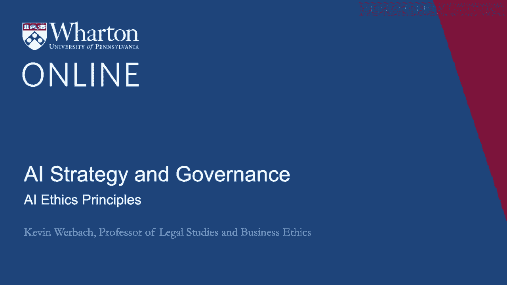
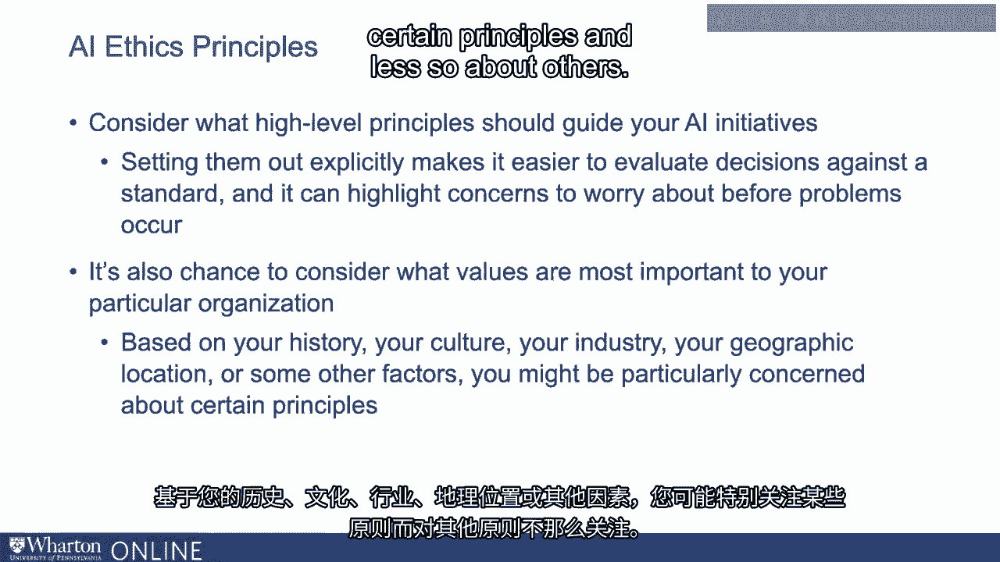
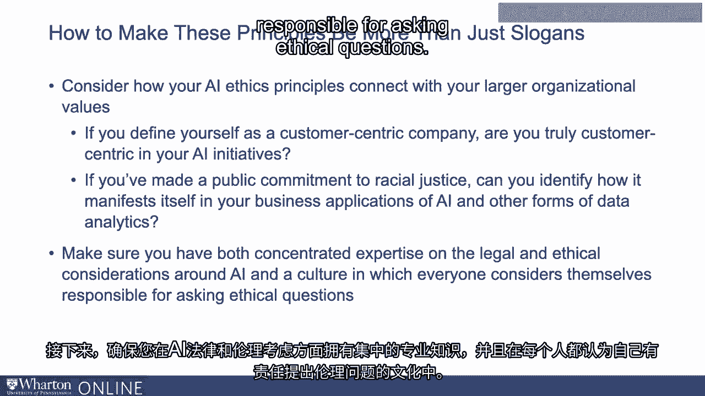

# P129：28_AI伦理原则.zh_en - GPT中英字幕课程资源 - BV1Ju4y157dK

你希望在你的AI倡议中负责和伦理。

什么原则应该指导你？越来越多的组织正在创建官方的AI伦理框架。是否想要创建正式文件取决于你组织的性质。所有这些共同点在于它们都是对理想的自愿承诺。它们在某种直接法律上是不可执行的。当然，这既好又坏。这带来了更多的灵活性。但这也引出了关于拥有一个好看的文件或框架的问题。这实际上意味着该组织更致力于负责任的AI。如果你打算走这条路，你应该考虑这些为什么重要。对你而言的原则，并承诺确保你的组织看到这些原则。

作为具体内容。通常，从整体上考虑应该指导的高层原则是有帮助的。你的AI倡议。无论你是否将它们简化为正式列表。明确列出原则使得评估决策更容易符合标准。这也可以突出在问题发生之前你需要关注的担忧。这也是一个机会，让你考虑哪些价值对你特定的组织最重要。每个实体都是不同的。基于你的历史、文化和行业。你的地理位置或其他一些因素，你可能特别关注某些原则，而对其他原则关注较少。

其他。哈佛的一份报告在2020年评估了来自大公司的36个主要AI伦理框架。像微软、Telefonica和腾讯这样的公司，标准机构、行业联盟和政府。全球范围内。它确定了八个反复出现的共同类别。这些包括隐私、问责、安全与保障、透明性和可解释性。

公平和非歧视、人类控制、专业责任，这意味着注入。

在整个过程中，伦理和法律问题以及组织的推广。人类价值的体现。这意味着要问你的行为是否最终服务于人类的繁荣。现在你不需要将这些作为你的AI伦理原则，或一定要包含所有这些。在列表上。但你应该问自己每个特征在这个背景下是否合理。

组织以及你如何看待它们。具体来说是什么呢？

在这个背景下，透明性或可解释性意味着什么。

你正在开发的系统？哈佛报告的重要发现是这些原则似乎在趋同。公司、组织和政府正在考虑现有的框架。不要在外面试图重新发明轮子。越来越多的原则，如我列出的那些，正在被理解为。大多数框架的通用基础。这并不意味着会有一套适合所有人的统一原则。

再次强调，文化、社区和国家在适当性方面各有不同。但这确实意味着你的人工智能伦理原则的可能起点列表相对。简短。好的，你如何让原则不仅仅是口号，就像我之前提到的那样？

首先，考虑你的人工智能伦理原则如何与更大组织价值观相连接。如果你把自己定义为以客户为中心的公司，你在这方面是否真正以客户为中心。你的人工智能倡议呢？如果你已公开承诺促进种族公正。你能否识别它在你的人工智能业务应用和其他数据分析形式中的体现？

接下来，确保你在法律和伦理考虑方面有集中专长。围绕人工智能以及每个人都认为自己有责任提问的文化。

伦理问题。再说一次，原则只有在组织内部广泛考虑时才有意义。在开发和实施基于人工智能的系统的整个过程中。谢谢。你。

