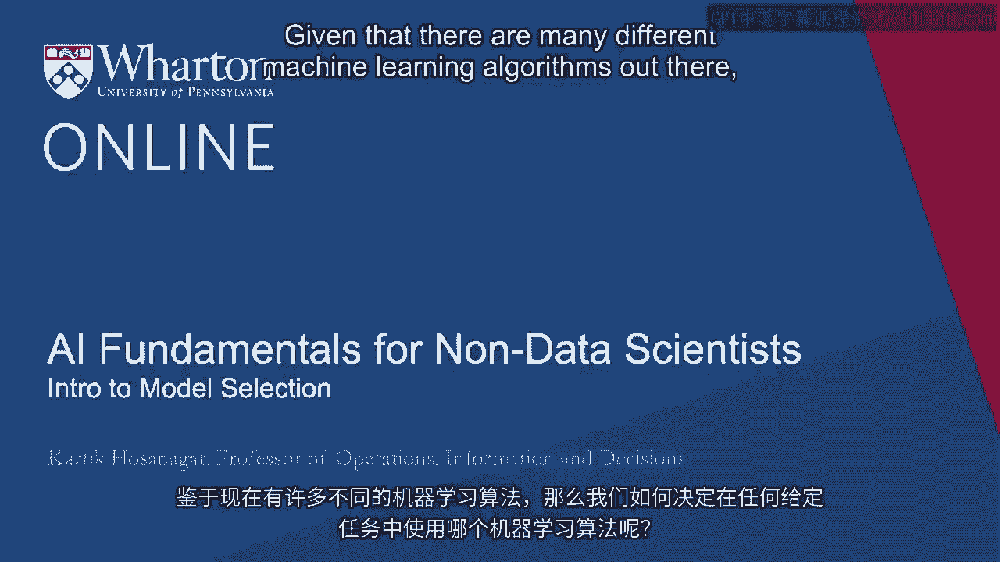
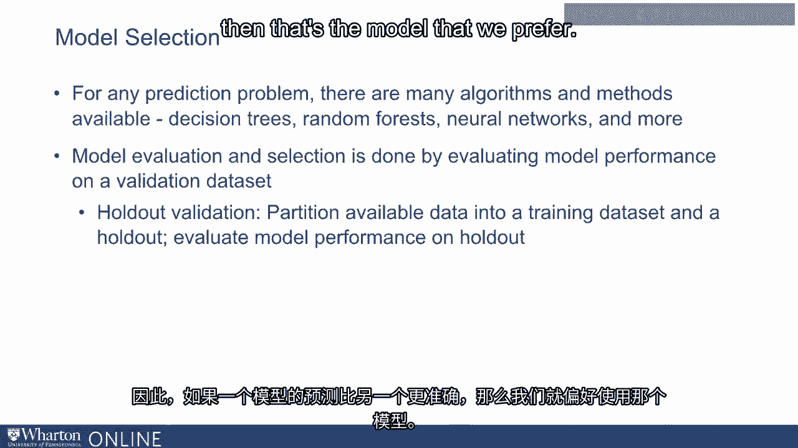
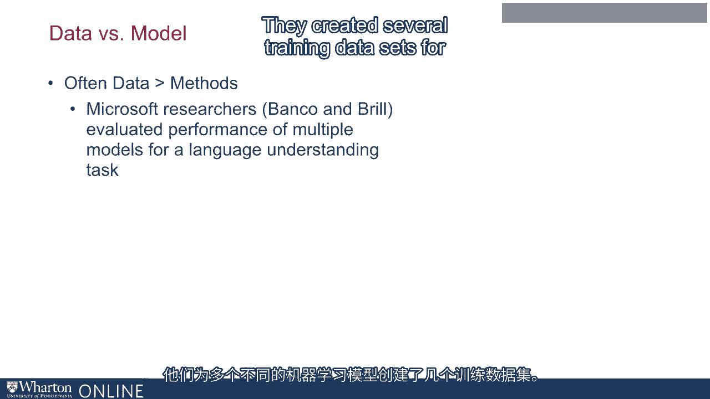

# P13：12_模型选择入门.zh_en - GPT中英字幕课程资源 - BV1Ju4y157dK

鉴于有许多不同的机器学习算法。

我们如何决定在任何给定任务中使用哪种机器学习算法？现在在实践中。

我们通过查看不同机器学习方法在所谓的验证数据集上的表现来评估它们。

现在给定一个大型训练数据集，其中你有输入和。

为这个训练数据集中的所有条目输出标签。

验证的想法是将数据集划分为训练数据集。

并且有一个保留数据集将用于验证。我们在训练数据集上训练模型，一旦模型训练完成。

我们将使用训练好的模型对保留数据集进行预测。

然后我们评估预测的准确性。

所以如果一个模型的预测比另一个模型更准确。

那么这是我们更倾向的模型。

这种方法的另一种变体被称为交叉验证。

交叉验证的想法是将数据集分成多个部分。

例如，我们可能会将可用的数据集分成10个部分。

我们可能最初将第1部分作为我们的验证数据集。

并使用第2到第9部分来训练模型并。

我们在第1部分上测试模型，而第1部分是我们最初的验证数据集。接下来。

我们可能使用第2部分作为我们的验证数据集，并且，我们可能在第1部分、第3部分上训练我们的模型。

4，5，6等等。然后一旦模型训练完成，我们在第2部分上评估其性能。

我们会用每个小的验证数据集重复这个过程很多次。

这基本上就是交叉验证背后的想法。最终。

这里的共同主题是，给定一个大型训练数据集。

目标是从中创建一些部分或保留数据集，因此。

我们在其余数据上训练模型，并且。

我们在一个未用于训练模型的保留数据集上评估其性能。最后。

另一个重要问题是公司是否应该投资于。

更好的数据或更好的机器学习模型。两者都是有价值的投资，但在实践中，我们常常发现数据胜过方法。

微软研究人员Banco和进行了一项研究。

Brill在他们评估许多不同机器学习模型的性能时。

针对语言理解任务。他们为多个不同的机器学习模型创建了几个训练数据集。

在某些情况下，机器学习模型只能访问一个非常小的数据集。

数据集中大约只有五十万字。在其他情况下。

一个机器学习模型可以访问大量的数据集。

训练数据集中可以达到十亿个字。当他们评估这些不同机器学习模型的性能时。

他们发现不同机器之间的性能差异。

当学习方法或机器学习算法相对较小时。

与相同算法在更多与更少数据下的差异相比。简而言之。

给一个合理的机器学习算法大量数据是更好的选择。

而不是给一个好的机器学习算法提供很少的数据。

这是谷歌计算机科学家彼得·诺维克常提到的。

他称之为数据的非理性有效性。

这表明，一个好的起点是。

一家公司需要认真考虑数据资产和。

思考我们是否拥有高质量的数据，以便进行预测任务。

一旦这一点到位，确实值得调查哪个是。

针对当前任务的更好的机器学习模型，但通常一切都始于数据集。

[BLANK_AUDIO]。

