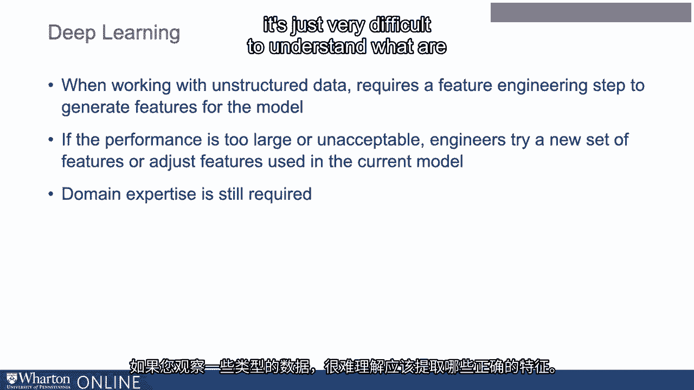
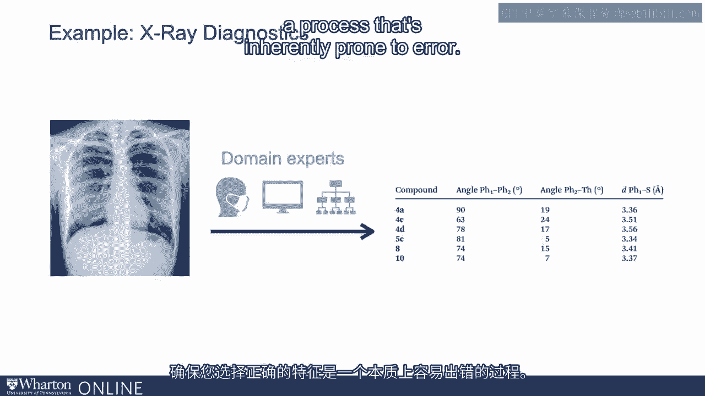
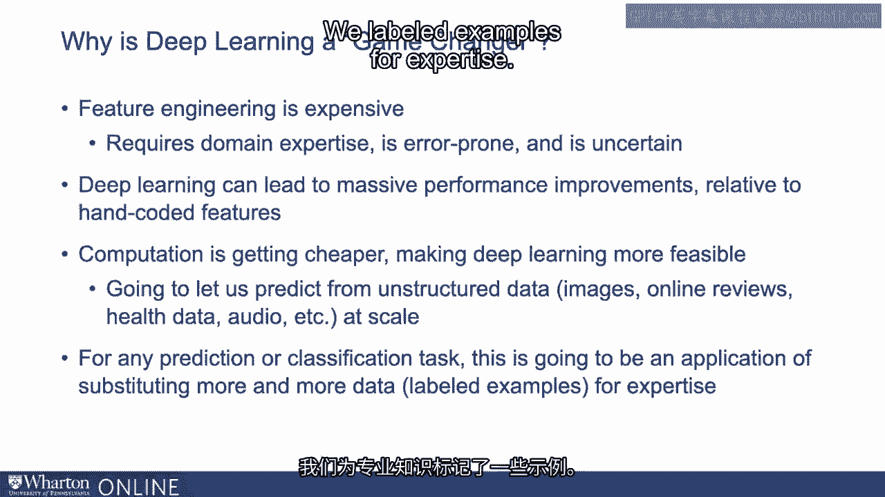

# P15：14_深度学习.zh_en - GPT中英字幕课程资源 - BV1Ju4y157dK

使用浅层机器学习或非深度学习方法时，观察到你可能会。

所谓的结构化特征会传递给一个算法，算法会学习最佳映射。基于你提供的一些示例。所以把数据想象成像电子表格一样组织。你有一个想要预测的结果，然后你有多个列。你需要有关于预测因子的数据显示。你需要以这种格式拥有数据，其中有描述的结构化列。

你试图预测的数据。正如我们之前讨论的那样。在处理非结构化数据时，需要特征。工程步骤是将原始非结构化数据处理成这些特征。将其转换为可以用来预测的格式，数据列。一些输出。同样，需要花费相当多的工作来弄清楚如何处理这些原始非结构化数据。以及生成这些列。如何选择合适的列。如何实际创建给定的结构化数据列等。所以发生的事情是工程师处理这些原始数据，创建这些特征，运行模型。

如果性能过大，无法接受，他们可能会尝试一组新的特征或只是。当前模型中使用的特征。同样，需要大量领域专业知识。如果你查看某些类型的数据，理解这些数据是什么非常困难。

提取正确的特征。尤其是对于某些类型的非结构化数据，如图像、声音、论文。理解某些内容可能需要相当多的领域专业知识或关于知识领域的专业知识。

如何将这些原始非结构化数据转换为可用特征。其中一个例子可能是医学诊断成像。想象一张X光片，你试图理解如何使用这些数据来预测某人是否。有某种病症。如果你想象一张X光片，并考虑你可能想要从中提取什么。X光或该图像以预测某人是否有某种病症，需要大量专业知识。需要特别的医学专业知识来理解你所看到的内容以及如何知道什么。在该图像中值得识别的内容。

这可能与颜色阴影或图像的某些部分有关，或观察。对于图像中出现的一些可能不常见的内容。但需要具备大量医学专业知识的人才能知道这一点。然后那个人需要与开发者合作，帮助理解如何处理一个。这样的图像并提取相关数据。这是一个例子，你可能需要多种不同类型的专业知识。处理原始数据，如医疗图像，并提取可以放入列的数据。用于预测的格式。对于某种医疗结果。比如一个人是否真的有病。而且，再一次，这需要领域专业知识。

它需要开发者时间。它需要大量资源。这也可能非常容易出错，因为你可以提取的特征数量庞大。图像的复杂性是巨大的。因此，确保你拥有正确的图像是一个固有易错的过程。

到错误。我们谈论深度学习。深度学习所做的就是消除了对特征提取的需求。因此，在正常的机器学习工作流程中，你有某种输入数据，然后你。有一个特征提取过程，人们必须坐下来弄清楚要使用哪些特征。从输入数据中提取出数据，以便将其放入那种列式的电子表格格式中。

然后可以用于预测，然后你得到你的输出。当你使用深度学习时。你跳过特征提取步骤。深度学习将使我们能够直接从这种原始非结构化输入数据中进行。以做出对我们有价值的预测。

那么，深度学习为什么是一个颠覆性的游戏规则？原因在于这个特征工程步骤特别昂贵。再次，它需要大量领域专业知识。容易出错。高度不确定。因此，当我们能够使用深度学习跳过特征工程步骤时，它。相对于我们必须手动编码的过程，这可以带来巨大的改进。

或手动选择要使用的特征。我们将讨论的价格是计算。但计算成本在下降，使深度学习在各种应用中变得更加可行。这将使我们能够在规模上对非结构化数据进行预测。因此，再一次。想想图像或在线文本，如评论或客户满意度表，健康数据，音频。

等等。因此，对于任何预测或分类任务。这将是一个替代的应用。越来越多的数据与标记示例的专业知识。

我们不再需要手动编码或提取特征所需的领域专业知识，因为。我们有大量的数据可以让机器学习。这部分本身。所以这里有几个例子。例子一是图像识别之类的。所以如果你想要一种能够基本上识别面孔的软件，这就是一个例子。

你可以直接使用原始图像数据来训练它识别面孔，而无需。去识别，比如说人们的。眼睛或面部宽度的长度。你不需要做任何这些。你可以直接使用标记的原始图像数据。与合适的人合作，它将基本上学会自动识别人。另一个例子是检测假新闻。你怎么判断一则新闻是假的还是实的？

需要特征工程的过程可能需要你坐下来尝试理解。或者找出消息或新闻帖子中可能表明某些东西是假的内容。这很难做，假新闻的真实性正在越来越好。深度学习将使我们能够处理大量的新闻示例。我们不需要知道在预测中什么是重要的，只需原始新闻帖子本身。关于它是否是假的或真实的标签，并且给了这两个信息。深度学习引擎将找出帖子中相关的信息。判断某些东西是否是假的，我们不需要告诉它那部分。

第三个例子是，识别奢侈品的仿制品。你拥有奢侈品的图像，而你正在尝试开发某种东西来判断是否。或者它是否真实，或者是否伪造。

在这种情况下，你可能会拥有大量特定产品的图像。产品，可能是一条围巾或一个包，以及是否该产品是真品的标签。我们不需要坐在那里告诉机器学习引擎在图像中寻找什么。我们只是给它输入大量的图像和正确的答案，标签，以及这些。

在这种情况下，深度学习引擎可以自动找出答案。图像中可能表明某些东西是仿制品或伪造品的内容是什么。它是否真实。谢谢。[沉默]。

