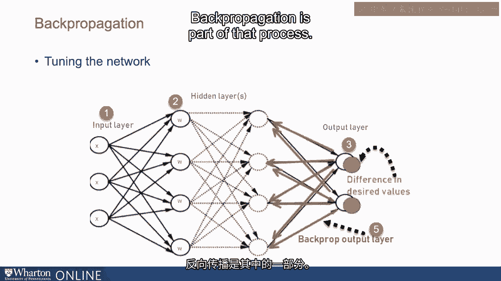
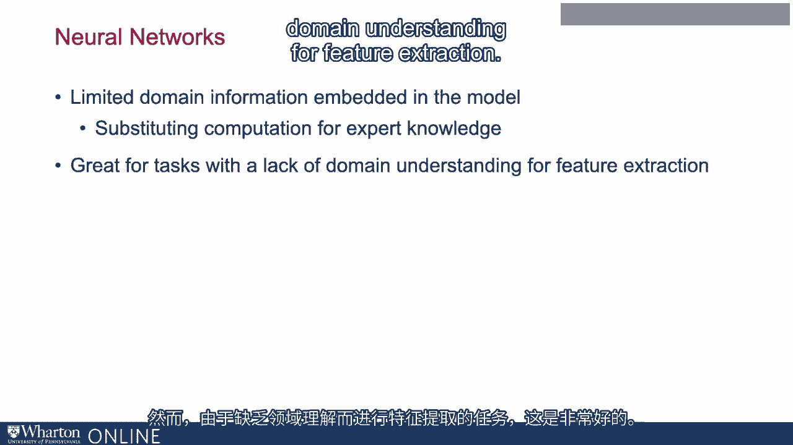
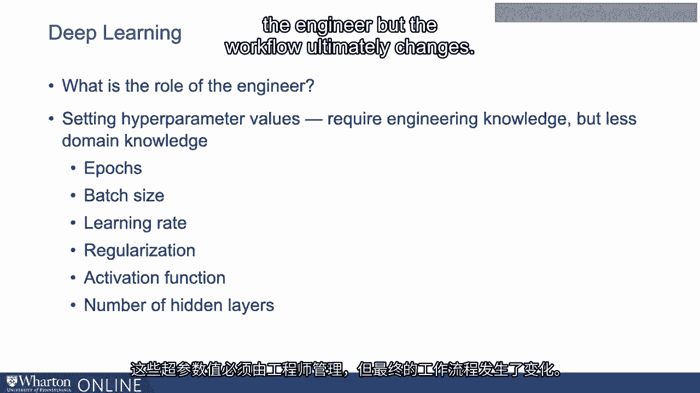

# P16：15_深度学习的工作原理.zh_en - GPT中英字幕课程资源 - BV1Ju4y157dK

深度学习是如何工作的？

我们已经讨论过可以直接使用原始非结构化数据的概念。

开始使用深度学习进行预测。我们不需要经历这个特征工程步骤。

我们不需要将其转换为列或单独的变量或特征。

用于预测。非结构化数据，我们可以从其原始数字表示开始。

首先，任何我们谈论的非结构化数据，包括文本、声音、图像，它们。

始终可以以某种数字形式表示。因此，如果是音频，它可能是一个频谱图。

图像数据可以通过像素表示。一组文本可以通过单词的向量表示，因此所有这些不同类型。

数据可以以某种原始本地数字格式表示。

数据随后以某种方式预处理，使其在预测任务中标准化。

一旦数据标准化，就会传递到一种叫做神经网络的东西中。

我们之所以称之为神经网络，是因为人们发现这是基于模型的。

本质上是继承自神经元。因此，大脑中的神经元接收多个输入，然后根据。

根据这些输入决定是否触发输出。

非常类似地，深度学习中的神经网络在某种方式上非常相似。

所以，构成深度学习基础的神经网络，数据，这些原始的本地数据。

我们讨论的那个形成输入层，进入神经网络。

就像神经元一样，神经网络基本上在查看输入的数据。

然后根据数据的值，决定是否触发其输出。

或在某个水平上设置其输出。因此，你可以将神经网络想象为一系列决策点或节点或神经元。

输入数据从一侧进入。神经网络由一系列层组成，这些层在进行某种观察。

所有输入数据的不同组合。因此，输入数据不需要转换为特征。

神经网络中的层基本上是自动尝试弄清楚原始非结构化数据的特征。

可以组合和重新组合的数据，以形成最有效的特征用于预测。

最有效的预测组合。因此，这种情况的发生是工程师选择一个损失函数或成本函数来。

与训练标签进行比较。这只是说我们离预测正确答案有多近的一种方式。

所以在这种情况下，你有训练数据，这是你知道正确答案的数据。

让我们回到我们的医疗诊断图像示例。

想象一下，你拥有大量关于人们医疗图像的数据。

关于正确答案的数据，这可能意味着你有关于这个人是否有疾病的数据。

患者的确有该疾病，这是医生确定的。因此你有医疗数据。

医疗图像以及这个人是否实际上有该疾病。

因此，神经网络将尝试处理这些图像数据。

神经网络中的各层将尝试找到正确的组合。

使用原始像素数据进行预测。这个预测将是这个人是否有该疾病。

既然我们已经知道训练数据中的正确答案，我们可以开始比较。

我们多么频繁地做出正确决策，以及多么频繁地出错。

这就是损失函数或成本函数。

这告诉我们与我们拥有的数据所代表的真实情况之间的距离。

训练模型。因此，神经网络将开始前后反复进行。

重新排列节点上的值、权重等。

神经网络的不同部分将开始自我调整，直到它。

达到一个点，原始输入数据被组合、加权并传递到。

预测层的错误最小化。基本上，它将自我调整到一个预测的点。

尽可能接近训练数据中所代表的真实情况。

已被赋予学习的机会。

你可能会听到一些与神经网络相关的术语，比如反向传播。

反向传播是调整网络的过程。

因此，这些网络应称为前馈网络和反向传播。

这些术语指的是数据向前传递，然后不同类型的。

信息在网络中前后传递，以便网络可以进行。

从数据中学习如何以最优方式进行配置以进行预测。

因此，反向传播是该过程的一部分。

深度学习或这些神经网络上下文的一个好处是。

模型中嵌入的信息是非常有限的领域信息。

因此，你是在用计算来替代专家知识。

我的意思是，在这个深度学习案例中，我们所做的是处理医疗。

诊断图像，传递给深度学习引擎，它将学习如何进行预测。

一个患者是否有疾病。使用我们之前讨论的特征工程步骤，浅层学习是。

这是一个步骤，在这个步骤中，某人需要获取图像并查看如何选择和处理。

从这些图像中编码个别特征。这是一个非常耗时和困难的过程。

这种深度学习方法需要的领域信息远远少于。

这确实需要相当多的计算。

不过这很好，但由于特征缺乏领域理解，任务的原因。

提取。

所以当你手动编码特征时，你可能需要开发人员和。

具备显著医学专业知识的人员，采用深度学习方法，深度学习。

或机器学习工程师需要大量医学图像和预测的可靠数据。

最终在这些图像上做出的决策可以自己创建深度学习引擎。

或有效执行预测任务的深度学习引擎。

一个常见的问题是工程师的角色是什么。

在之前的特征工程案例中，工程师的重要性在于能够提取。

提取出单独的信息片段。所以再回到图像示例。

工程师重要的是处理原始图像，可能提取出特征，比如说。

毛细管宽度或颜色阴影等需要图像处理的东西。

一些技术专长。在这里你不再有特征工程，那么工程师的角色是什么？

你有原始数据输入神经网络。那么工程师做什么？

好吧，事实证明，仍然有许多事情需要为深度学习设置。

方法。这些被称为需要工程知识的超参数值，但通常。

较少的领域知识。这些有称为 epochs、batch size、learning rate、regularization。

激活函数、隐藏层的数量。

工程师必须决定多种设置，以使网络能够。

表现良好。这些超参数值必须由工程师管理，但工作流程最终。

变化。

所以再次强调，特征提取不是一个重要的方法，而是没有深度学习。

我们有一个工作流程，其中有输入数据，如图像数据，然后有一个耗时的。

处理过程是从这些数据中提取单独的列变量或特征。

然后将其放入分类或预测步骤，最后你得到输出。

在深度学习方法中，你没有特征提取的步骤。

你可以直接从标注良好的原始非结构化数据开始，放入。

深度学习引擎，你可以得到你的预测，而不需要做任何特征工程。

这再次是昂贵且不确定的。谢谢。

