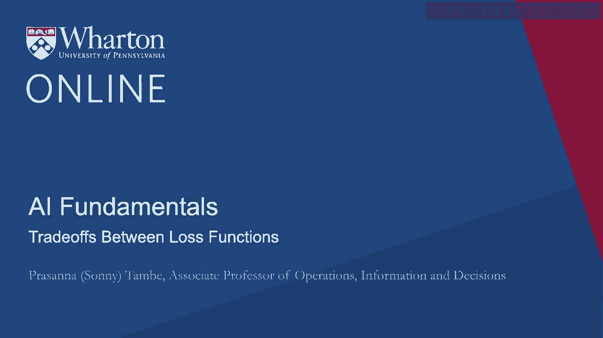
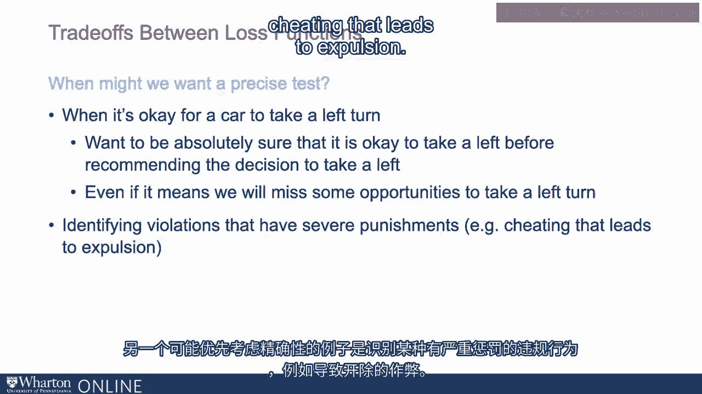

# P20：19_损失函数之间的权衡.zh_en - GPT中英字幕课程资源 - BV1Ju4y157dK

在评估机器学习输出时，我们何时想优先考虑某些类型的指标而不是其他类型？

关键问题是，在我们考虑的特定应用或商业背景中，假阴性和假阳性的相对成本是什么？

那么，例如，我们何时可能需要一个高度敏感的测试？

所以考虑一个医疗应用，其中算法正在筛查一种非常严重的疾病或某种类型的癌症。例如，当我们想绝对确认不遗漏有这种情况的人。即使这可能会导致错误识别一些有该情况的案例。即使他们没有。因此，如果你想绝对确保不遗漏任何有该情况的人。

那么我们可能想要一个高度敏感的测试。在这种情况下，我们想优先考虑敏感性。另一个例子是，这是科学在二战期间实际发展的背景的一部分。当我们有一个雷达系统试图探测来袭飞机时。如果我们担心来袭飞机或某种敌方攻击，并希望有一个可以探测潜在来袭飞机的系统。

我们可能想要一个高度敏感的测试。我们不介意几个误报。但我们希望确保不遗漏任何实际发生的情况。所以这是另一个例子，在这种情况下我们可能需要一个高度敏感的测试。另一方面。可能会想要一个精确的测试。可能想说。在我们说或预测某事是事实之前，绝对要确认这一点。想象一下你正在开发一个算法，用于预测何时汽车可以左转。现在我们可能想要在推荐左转决策之前，绝对确认左转是可以的。即使这意味着我们可能会错过几次左转的机会。

只要我们绝对确定在预测或推荐左转时，左转实际上是可以的，这就没问题。这就是一个可能优先考虑精确度的例子。另一个可能优先考虑精确度的例子是识别某种惩罚非常严厉的违反行为。例如，作弊导致开除。因此我们可能想在实际做出算法决策之前，极其确定某个人的罪行。

即使这意味着我们可能会错过一些实际发生的违反情况。我们可能希望有一个非常精确的测试，以确保我们不会错误指控某人犯有该罪行或违反，但他们实际上并未犯有该违反。[空音频]。

