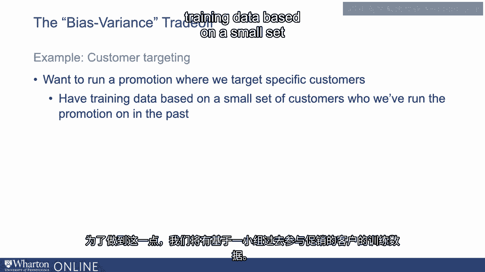
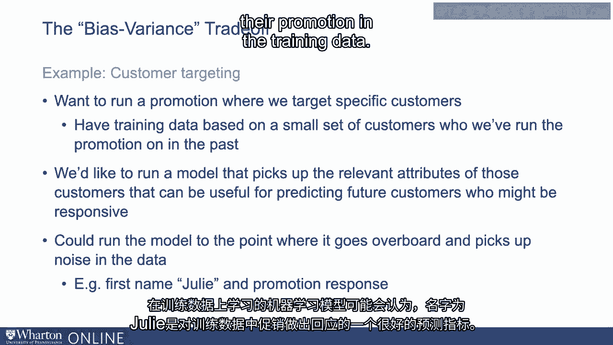

# P22：21_过拟合问题.zh_en - GPT中英字幕课程资源 - BV1Ju4y157dK

正如我们所谈到的，算法学习输入数据与输出之间映射的关键在于。

输出的预测或推荐就是训练数据。

这是算法用来学习输入数据与正确关系的数据集。

输入特征和它应该做出的预测。

因此，训练数据是构建算法的关键，但我们真正关心的其实是。

在所谓的未见数据上的表现。整个目的在于预测我们尚不知道结果的情况。

因此对于训练数据，我们需要答案已经知道的数据。

这就是算法学习的方式。但要使其真正有用。

我们希望它能够对我们还不知道答案的数据做出预测。

这就是预测的核心。当我们思考这个问题时。

我们必须考虑过拟合问题。过拟合是一个重要的机器学习挑战。

这就是模型在训练数据上表现良好的危险。我们给它进行训练。

但是当我们将其应用于未见数据时，性能几乎没有提高。

当我们将其投入生产时，开始部署后，它的性能显著下降。

所以机器学习工程师常常需要处理这个问题。

他们试图避免将模型拟合到捕捉到基本噪声的地步。

训练数据。他们不断与这个过拟合问题作斗争。

他们试图在使用训练数据构建准确模型与保持之间找到平衡。

一个仍然能在未见数据上表现良好的模型。

我喜欢用的一个例子是学习测试与学习材料的对比。

想象一下，你正在为考试复习，你有很多你做过的样本测试。

你可以利用历史数据或往年回测来帮助你复习。

所以可能的情况是，你会考虑将材料学习到某个程度。

你参加新的测试并且表现得很好。如果你理解了这些概念，就会有一定的普遍性。

如果你使用旧测试和你所掌握的其他资料来学习这些材料。

你可以学习到一种能够很好地转移到任何新测试的水平。

你也可以回去复习旧测试，以至于你能表现得极为出色。

表现良好。例如，你可能会准确记住那些问题的概念。

这意味着如果你被给了完全相同的测试，你会表现得很好，你会在那个测试中。

非常好。但是如果你被给了一个新测试，那些知识就不会很好地转移。

这与训练过拟合问题类似。

它利用训练数据提取基本关系，但并不是到达某个程度。

在这个独特的层面上，你所挑选的东西并不会转移到任何。

其他数据集或任何你正在使用的样本外数据。

所以挑战总是捕捉模型的相关方面与捕捉的。

以及训练数据中的特异性。这称为偏差方差权衡。

让我们谈谈一个关于客户目标营销的例子。

所以假设我们想进行一次促销，针对特定客户进行目标营销。

如果他们购买特定商品。为此，我们将基于一小组客户的训练数据。

在过去进行促销的地方。我们希望利用这些训练数据来了解未来哪些类型的客户。

更大的人群应该获得那次促销。哪些客户可能会对此做出反应？

所以我们想做的是运行一个模型，挑选出相关属性。

这些客户可能对预测其他客户或未来客户的反应有用。

最具响应性的。这可能与人口统计有关。

这可能与位置或其他客户属性有关。

或者，我们可以想象将模型运行到一个程度，在那里它有点学习。

这个测试可以说是。在训练中，它有点过火，学习了这些客户的特定方面。

数据集中对促销响应的相关性在于那小数据集。

例如，简单来说，在该客户训练数据集中，它可能。

所有名为朱莉的人刚好对那次促销做出反应。

因此，机器学习模型在训练数据集上学习，可以正确地说。

名字为朱莉的客户在训练中是一个很好的促销响应预测因子。

数据。但这可能只是某个单一客户或一小组客户的特征。

在训练数据中。它可能不是适用于更大客户数据集的真实信息。

关键是你希望能够平衡模型，以便它能够挑选。

在训练数据集中提取相关信号，那些实际重要的特征并忽略。

数据集中存在的噪音，这些噪音不会转移过来。

针对一个新的更大数据集。因此，处理这种类型的过拟合真的是最重要的挑战之一。

在机器学习过程中。在下一个视频中。

我们将讨论测试数据在避免过拟合问题中的作用。谢谢。

[空白音频]。
