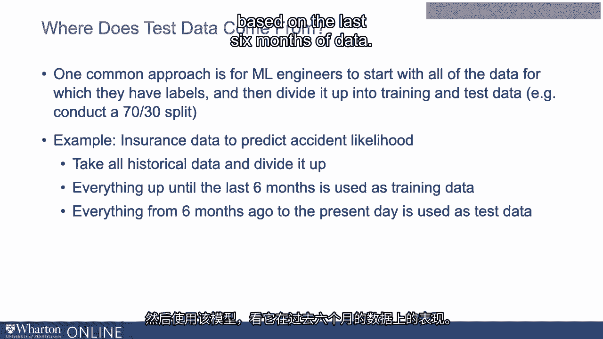

# P23：22_测试数据.zh_en - GPT中英字幕课程资源 - BV1Ju4y157dK

在考虑过拟合问题时，理解这个概念是很重要的。

测试数据是工程师用来避免过拟合的工具之一。因此，测试数据。也称为保留样本，是一个不用于训练或构建模型的数据集。但我们可以用来验证模型。因此，在未用于构建模型的数据集上验证性能有助于确保。该模型在外部样本上也能很好地工作。

因此，可以考虑拥有两个数据集：训练数据集和测试数据集。我们可以在训练数据上构建模型，模型会。在训练数据上越来越准确。它将在测试数据上变得越来越准确。然而在某个时刻，如果它开始对特定特征拟合得太好。在训练数据中，我们开始看到偏差，模型在测试上表现得不如之前。数据。

同时拥有这两个数据集有助于我们管理这个过拟合问题。这个问题帮助我们确保模型正在接受的训练是适用的。也适用于外部样本。那么测试数据来自哪里？

所以请记住，我们需要一个未用于构建模型的数据集，以便机器。学习算法没有从中学习，但我们仍然需要可用的正确答案。在数据中。我们还需要在测试数据中有这些标签。因此，机器学习工程师常用的方法是从所有数据开始。他们有标签的大型数据集。因此，有标签的一个大数据集。可用的正确答案，然后简单地将其分为训练数据和测试数据。所以你可能会进行所谓的70/30划分，其中保留70%的数据并使用。

用于训练模型，然后保留30%的数据，用于评估。了解模型在这些外部样本数据上的表现。这种方法有很多变种，基本上使用相同的思路，即你在训练。数据是在样本的一个集合或数据集上，你基本上是在验证它。在未用于训练模型的内容上。

例如，如果你尝试使用保险数据来预测事故发生的可能性。基于客户属性、驾驶特性等。你可以做的是，也可以将所有历史事故数据一起考虑。作为客户属性和特性，你可能会将其分开。你可能会说让我把最后六个月之前的所有数据用作我的训练数据。数据以及从六个月前到现在的所有内容，我将使用我的测试数据。因此，我将从六个月之前的所有数据中训练模型。我将使用该模型，并查看它在过去六个月的数据上表现如何。

过去六个月的数据不会用于建立模型，但可以用来。仍然可以用来验证它在未实际使用的数据上的表现。建立模型。然后在你确信模型在测试数据上表现良好后，再进行下一步。然后可以将其推广到部署中，以预测即将发生的事故。

未来将基于不同的客户属性和特征。[沉默]。

