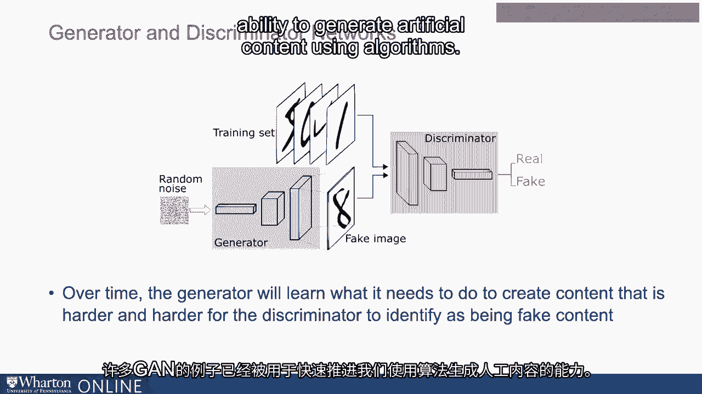
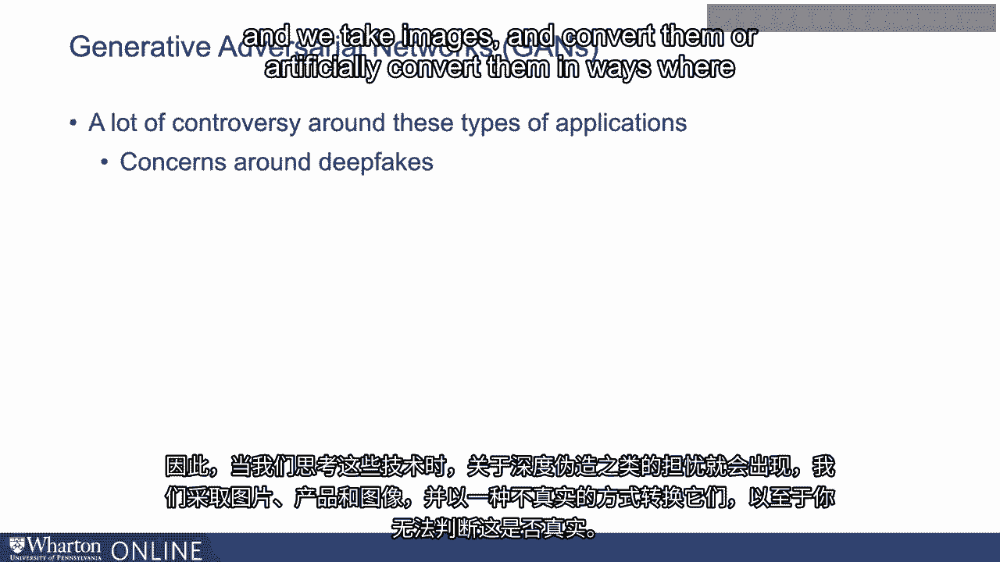

# P26：25_生成对抗网络和变分自编码器.zh_en - GPT中英字幕课程资源 - BV1Ju4y157dK

机器学习中最令人兴奋的领域之一就是生成模型。

生成模型变得越来越重要，应用也越来越广泛。我们主要讨论的模型基本上是区分两个类别的。它们标记某些东西为真或假，或一或零。这称为判别模型。生成模型的作用略有不同。与其将数据分类为两个类别，生成模型问的是“什么”。其基本过程是能够生成我们所看到的数据类型。在样本中。这在实际中意味着生成模型可以创建新的数据实例。一旦它们学习并理解了能够生成我们观察到的数据的过程。

它可以开始利用这些信息创建新的数据实例。

这变得非常有趣，因为它开始在机器之间模糊界限。学习和我们所认为的传统人类创造力领域。生成模型在艺术和音乐等领域的应用有很多例子，例如。也有生成模型用于生成特定的新歌曲。像乡村或爵士乐这样的风格。这些生成模型产生乐器编制和歌词。甚至连人声也能模仿。此外，还有用于生成新艺术风格的生成模型。也有生成模型可用于生成模仿特定风格的艺术作品。那些传统的大师，例如梵高。

你可以使用生成模型基本上创造出梵高风格的艺术作品。最著名的生成模型或许是文本应用，特别是GPT-3和GPT-2。这受到了很多媒体的关注。这类生成模型能够生成文本，看起来像是人类写的。例如，学生的论文或记者的文章。因此，使用像GPT-3这样的生成模型。

你可以给它一个起始点。

你给它几句话，它基本上会生成沿着这些思路的文本来填充。几个段落看起来像是由人类写的。所以有很多关于GPT-3的例子和应用。虽然媒体。媒体对GPT-3的许多有趣演示进行了报道。人们当然可以考虑商业应用。而且这些模型中有许多——现在有一些企业在尝试开发。针对这类技术的产品。你可以考虑使用这样的技术来创建完整的电子邮件或简化过程。例如，回复只给出几条要点的电子邮件。

许多技术的应用——一种能够生成新文本的技术。在给定起点的情况下。现在，这种称为生成对抗网络的变体特别重要。生成模型的应用。这是一种用于生成越来越多人工内容的技术。很难与真实内容区分开。因此，生成对抗网络的工作方式是。

有时被称为，它使用两个网络相互竞争。它使用生成网络创建新内容，然后使用另一个网络。其基本用途是判断第一个网络的输出是真实的还是假的。

因此，一个生成器不断输出新的人工内容，而判别器则。观察输出的内容并判断其是真还是假。随着时间的推移。生成器会学习如何创建内容。判别器识别虚假内容变得越来越困难。通过这个过程，生成器发展出越来越多难以区分的内容。在其真实性方面。有很多例子表明，器官被用于迅速推进我们的。生成人工内容的能力使用算法。

例如，GANs已被用于大规模生成人工面孔。机器或人类很难看着图片并判断其。这是一个人类面孔的图片或其他东西。围绕这个有很多应用。这些类型的应用同样存在很多争议。所以当我们思考这些技术时，这些是一些担忧的来源。比如深度伪造现象的出现。当我们拍摄图片或产品时。当我们拍摄图像并进行人工处理时。

以你无法判断其真实性或真实的方式进行转换，这正是。很多争议围绕它们的使用而产生。

另一种与这种生成类型相关的技术是变分自编码器。编码器或VAE。它们有稍微不同的角色和目标。因此编码器本身。它们所做的是提取数据，将其简化为更简单的表示。

自编码器可以获取数据，将其简化为更简单的表示，然后。

用于重建自身。因此，自编码器会处理像图像或歌曲这样的东西。将其简化为自身的更简单表示，然后可以用来重建自身。

现在，变分自编码器特别有趣，因为它可以稍微。变换一些图像的属性或方面，以我们可能关心的方式。所以我们可以获取一张图片，将其分解成各个部分，也许在某些方面进行调整。我们可以改变头发颜色，然后重新创建图像。这将允许一种称为控制生成的技术出现。我们不仅是在生成人工内容，而是在生成人工内容。这是我们可以开始控制其不同之处或如何进行调整的一种方式。这引入了许多新颖的用例，并对其产生了影响。

这些技术的采用。因此，我们可以以面孔为例。我们可以使用变分自编码器（VAEs）以特定方式改变面孔。这在建模事物或简化不同类型方面可能是有用的。

例如，眼镜在面孔上的样子等等。因此，这些技术在这些用例中非常有前景。

受控内容生成在拍照、变化等方面有很多应用。以更或更少的方式处理那些图片的属性或特定属性。对于这一用例是有用的。[BLANK_AUDIO]。

