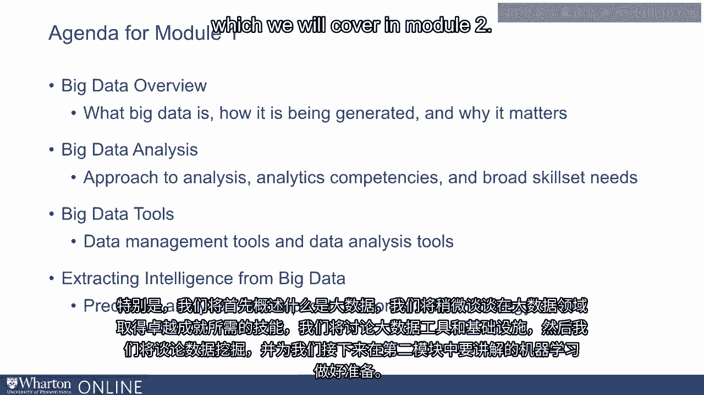
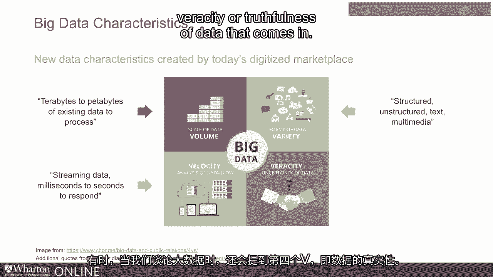
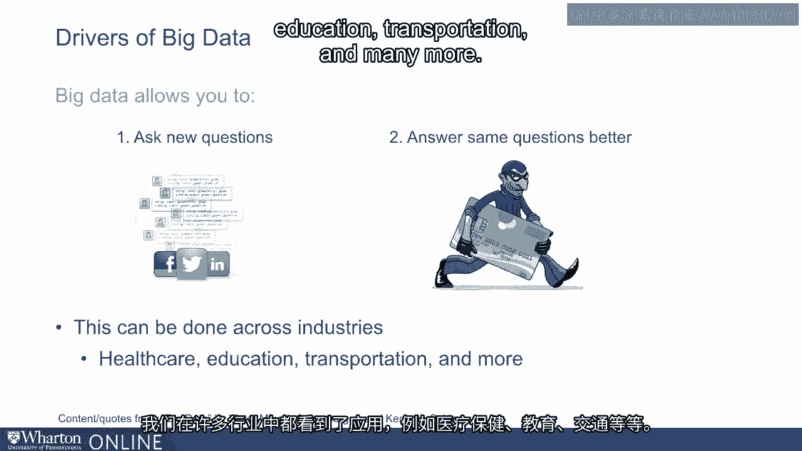
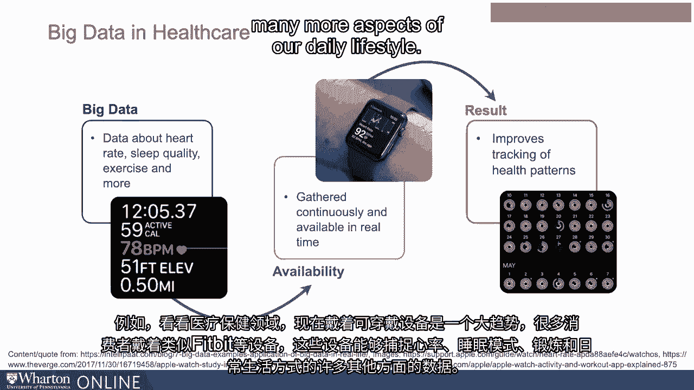
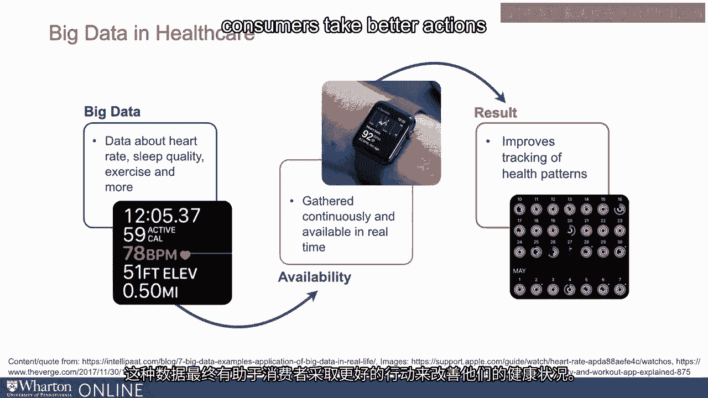

# P3：2_大数据概述.zh_en - GPT中英字幕课程资源 - BV1Ju4y157dK

在本模块中，我们将讨论大数据。

特别是，我们将从对大数据的概述开始。我们将讨论一下在大数据领域所需的技能。我们将讨论大数据工具和基础设施。我们将通过讨论数据挖掘和搭建舞台来结束。关于机器学习，我们将在第二模块中讨论。

首先，让我们探讨一下究竟什么是大数据。现在。数据无疑是一个存在已久的概念。近年来对数据的重视日益增加。我们听到诸如“数据是新石油”、“数据就像原油。它很有价值。”这样的短语。但如果未定义，就无法真正使用。

未来学家约翰·奈斯比特表示，我们首次拥有一种经济。这是基于一个关键资源，即信息，不仅是可再生的。但它也是自我生成的。资源的枯竭不是问题。但淹没在其中才是真正的问题。

现在，我们已经听到了这样的短语一段时间。数据对商业已经非常重要数十年。但对大数据的关注或重视相对较新。现在，大数据，顾名思义。是关于大量数据。事实上，国家标准与技术研究院表示大数据。超出了传统方法和计算机系统的能力。现在。

数据量无疑是大数据的一个关键方面，但它不仅仅关乎体量。

当我们谈论大数据时，我们是在谈论不同结构的数据。我们谈论的是以不同速度产生的数据。我们谈论的是分析数据的不同工具。而最重要的是。从管理的角度来看，我们谈论的是不同类型的业务。

我们可以用它来回答的问题。现在，考虑大数据的一种方法是通过大数据的三个 V。数据的体量、多样性和速度。数据的体量意味着我们不再谈论 TB 或 PB 的数据。简而言之，那些无法放入我们的笔记本电脑和个人电脑的数据。这种数据是我们无法在 Excel 中打开并直接开始分析的。

数据的体量正是关键所在。在多样性方面。我们提到的是我们不再讨论结构化数据。我们谈论的是无法在 Excel 电子表格中分析的非结构化数据。意指文本数据、音频数据、视频数据，其中隐藏着我们想要提取的智能信息。

在速度方面，我们指的是数据不断流入的理念。数据每秒和每毫秒都在流入。我们需要能够实时分析数据并作出决策。这就是数据速度的全部意义。当我们谈论大数据时，有时会提到第四个V。数据的真实性或准确性是我们所接收到的信息。

数据的真实性指的是数据来自多个来源这一点。并且这些数据不像过去那样经过筛选。因此，你可能会看到来自社交媒体平台的数据。这意味着用户生成内容，而这些内容可能并不完全是高质量数据。因此，我们需要考虑这一点。

我们也可能会面临数据不一致或数据不完整的问题。

所以数据的真实性也成为了一个第四个问题。这对大数据来说是非常关键且不可或缺的。现在，当然。一个自然的问题是，为什么对大数据的强调如此新？其实。归根结底，有两件事。第一是计算能力。计算能力正在以指数级增长。我们存储数据和处理数据的能力正在以指数级增长。这使得今天的大数据工具变得可用，而十年前这些工具根本不存在。第二，数据生成本身正在发生转变。在过去。

数据是以集中方式生成的。

而且数据是有限的。相较之下，今天的数据是以去中心化的方式生成的。有大量的用户生成内容，例如，我们的客户正在生成这些内容。有来自移动设备的数据，来自每个单独用户的数据。有来自成千上万传感器生成的数据，公司可能在其制造设施或零售店中使用这些传感器。

所有这些因素导致了数据的爆炸性增长，真正关注的是数据的转型。但最重要的是，大数据也改变了管理者能做的事情。

特别是，大数据使得管理者能够提出他们之前根本无法提出的新问题。而且它们也有助于更好地回答老问题。在提出新问题的能力方面，考虑一下一个市场经理试图为新产品设计营销活动的问题。管理者必须决定强调哪些产品特性。如果是手机。

管理者必须决定我们是否应该讨论手机的电池续航。或者我们是否应该谈论手机的精美设计？

或者我们是否应该谈论用户界面及其友好性？

或者我们应该谈论品牌本身，并在我们的营销活动中谈论我们的社会和慈善倡议？

这些问题很难回答。在过去，它们部分依赖于直觉。部分由小规模用户服务推动。但现在，营销经理可以查看社交媒体平台上的数据。他们可以查看Twitter、Facebook和其他平台的数据，看看顾客真正欣赏和享受我们产品的哪些方面。社交媒体平台上的数据有什么能够表明我们品牌与其他品牌不同的特征？

他们可以利用这些数据精确地制定营销信息。这在过去可能不可行，但通过可以在社交媒体平台上分析的大数据，现在是可行的。我还提到过，大数据使我们能够更好地回答那些老问题。例如。考虑信用卡欺诈检测。信用卡欺诈在金融服务行业非常猖獗，给这些公司带来了数十亿美元的损失。

在过去，检测很困难。而且通常是在事后很久才被发现。例如，顾客可能看到他们的信用卡账单，得出某个交易是欺诈的结论，可能会拨打客户服务中心并标记该交易。然后它被修正。但这是事后处理的，通常很难真正追回损失的钱。相比之下，今天借助大数据工具，公司可以即时分析交易。

在顾客在终端刷卡后不久。大数据工具可以分析他们的交易并判断是否存在欺诈行为。这不仅帮助更快地检测欺诈，还能在以前无法实现的规模上进行检测。这为金融服务公司创造了大量价值。而大数据的价值不仅限于金融服务公司。我们在医疗保健、教育等多个行业中看到应用。运输和更多领域。

例如，如果你看看医疗保健，近年来可穿戴设备的趋势非常明显。许多消费者佩戴像Fitbit这样的设备。这些设备能够捕捉心率、睡眠模式的数据。运动以及我们日常生活的许多其他方面。

这种数据最终帮助消费者采取更好的行动，以改善他们的福祉。

同样，考虑运输。道路上有传感器可以捕捉交通模式的数据。路闭、事故。现在这种数据可以实时在我们的移动设备上获取。这帮助我们更好地规划路线，有助于调度，并且最终成为像谷歌地图以及许多我们日常使用的其他地图系统的基础。这些只是大数据应用的几个例子。

实际上，在模块 3 的后面，我们将研究大数据在多个行业中的其他应用。我们还将探讨机器学习如何在这些行业中用于从数据中提取智能信息。[空白音频]。

