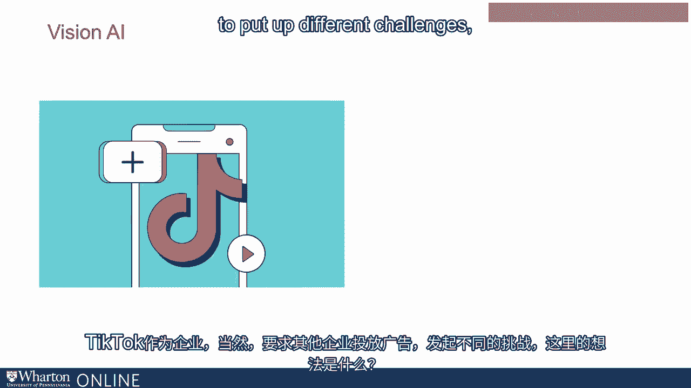
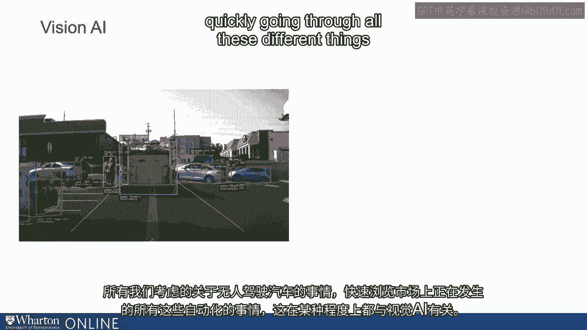

# P35：1_模块简介.zh_en - GPT中英字幕课程资源 - BV1Ju4y157dK

大家好，我是 Raku Aangar。

我是沃顿商学院的 Mars Bush 教授，1885年在普拉特学院任教。我也是市场营销教授。

我是沃顿客户分析的教职人员主任。在今天的模块中。

我们将从客户的角度讨论人工智能应用。

我们将讨论客户旅程，并了解人工智能应用可以发挥的作用。现在。

目前有很多人工智能应用。你会注意到，零售行业正在发生许多变革。人工智能。

机器学习、大数据在零售中的应用。例如，联邦快递也在这样做。

在自动化人工智能方面，银行业也有很多进展。最近。

我们听到了很多关于微软等公司无订单的讨论。

还要考虑在制药行业中的人工智能应用。有很多不同的应用。

我认为，思考这些应用的最佳方式是，它们的功能是什么。

现在，你可以从语音人工智能的角度考虑人工智能。这方面的一个例子可能是。

例如。

谷歌智能音箱、亚马逊 Echo，例如。它们的功能是什么？

它们只是让你更容易，或许可以使用你的声音来控制事物。类似地。

你可以想想 Netflix。当你在看一部电影时，例如。

在你不懂的语言中，你可以轻松更改该语言。

对于你已知的内容。所以这是一个基于语音的人工智能应用。

现在，还有很多其他类型的语音人工智能应用，可能是在企业对企业的环境中。

例如，围绕客户来电的处理，存在许多应用。

在客户服务中心。因此，你可以开始关注，例如。

如果你拥有一个客户呼叫中心，你可以开始关注是谁在打电话。

那通电话的情绪是什么？他们通话多长时间？

或许是帮助解决问题的那个人。

它是响应式的还是不响应式的？所有这些内容都在语音人工智能的范畴之内。当然。

当你想到更具未来感的内容时，我们有电影《她》，其中华金·菲尼克斯。

这位演员在某种程度上与一个语音人工智能系统建立了关系。所以当然。

这在未来会很远，但你可以已经看到，例如。

当你与亚马逊 Alexa 或谷歌智能音箱交谈时，从某种意义上说，你是在进行对话。现在。

另一类被称为视觉人工智能的东西。例如，它主要围绕。

使用你的手机，例如。你现在可以轻松追踪你的包裹。

因此，通过扫描二维码或某种代码，你可以帮助追踪不同的包裹。

所以这是一种视觉AI的应用。另一种应用，已经变得。

通过观察，例如，变得更加显著和流行。

在那里你可以有虚拟试衣间。因此，市场上有许多不同的公司。

现在提供这种上传可能性，例如你的身高等等。

然后，他们可能能够建议，例如，哪些裤子可能合适等等。

而无需实际进入一个物理试衣间。同样。

你还有其他种类的视觉AI应用。例如。

从商业角度来看，TikTok变得极为受欢迎。所以TikTok。

当然，企业要求其他企业例如放置广告。

提出不同的挑战。

这里的想法是什么。企业，例如，可以追踪其关注者的行为。

他们如何看待不同的品牌？那段视频发生了什么？

当人们想到特定品牌时，他们在想什么？

另一方面，另一种与视觉相关的AI应用。

变得有点争议。这是关于图像识别。因此，例如。

很多公司更受欢迎。

最近，IBM例如决定不想进入图像识别。为什么？

因为它也涉及到客户隐私。所以有很多动作正在进行。

但是谈到视觉AI，有两个有趣的应用。在左侧。

你可以考虑，例如，汽车。所有我们想到的东西。

在无驾驶汽车方面，迅速浏览所有这些不同的事情。

在自动化方面正在发生的事情。在某种意义上，所有这些。

存在于B2 Vision AI。当你在这些汽车中时，汽车可以说。

汽车中的计算机需要能够迅速理解，那是一个停止标志吗？

那是一个经过人行道的人吗？那是什么？右边。

我们在谈论智能城市。再说一次，很多城市正在尝试。

从某种意义上说，使客户的旅程无缝衔接。

所以，当你在智能城市中漫步时，希望它能够识别。

比如说，你的需求是什么等等。但当然，正如你所想象的。

我们在谈论的图像识别方面。在智能城市方面。

这可能在客户隐私方面更为复杂。

最后一种AI应用主要围绕语言。现在，有大量的。

例如，所需的翻译。例如，这里我在谈论一种印度语言。

叫做印地语。现在，例如，印度有很多很多人说印地语。

但想要将其翻译成另一种语言，例如英语。

现在手机可以轻松进行翻译。类似的，最近也有新的进展。

出现了一款新的应用，叫做GPT-3，从某种意义上来说。

可以写完整的文章。所以可以想象，这可能会非常有争议，并且可以。

事实上，甚至可能改变出版行业。

所以可以想象，围绕人工智能有很多很多的应用。

但关键是要思考，你对什么类型的应用感兴趣？

这是否与视觉相关？是否与声音相关？是否与语言相关？[BLANK_AUDIO]。

