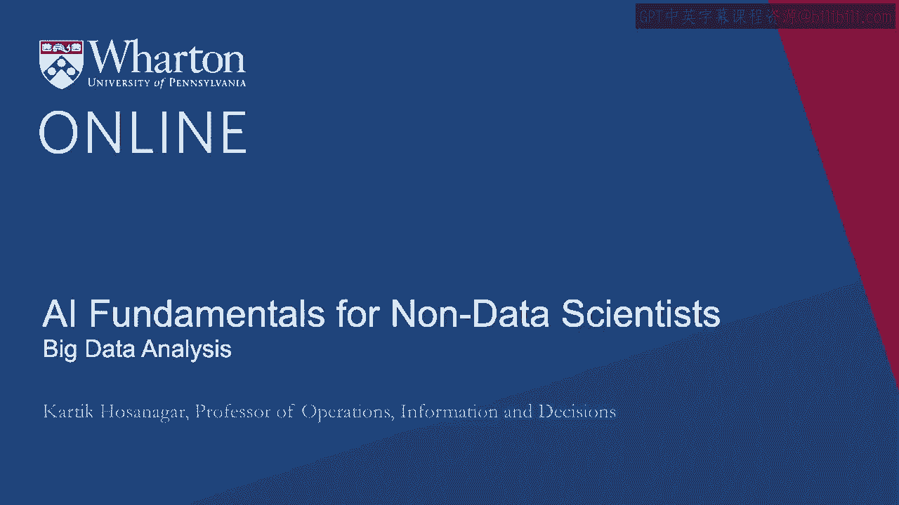
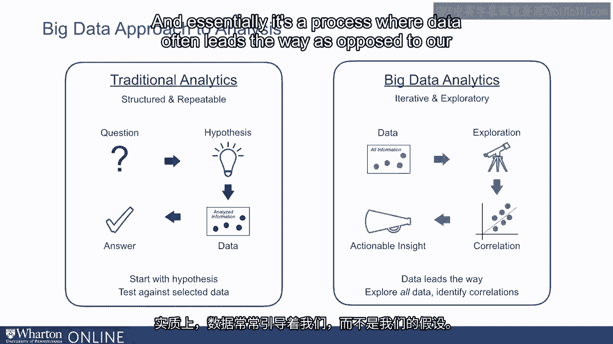

# P4：3_大数据分析.zh_en - GPT中英字幕课程资源 - BV1Ju4y157dK

在本次讲座中，我们将讨论大数据分析与传统分析的不同之处。

数据分析。而反过来，这意味着在技能和工具方面的要求。

企业在组织内部需要什么？如今，传统的数据分析通常是非常结构化的。

这可能始于一个管理问题，进而形成假设。

这是统计学家或数据科学家提出的。目标是分析。

数据以测试该假设。数据分析确认或建议我们的。

假设是错误的。简而言之，它是非常假设驱动的。相比之下，大数据。

数据分析更具探索性。它首先关注数据，而不一定是具体的。

假设，但伴随着广泛的商业问题。我们可能会进行更多的探索性。

分析并找出我们数据中的某些模式、关系或相关性。这可能暗示。

某些洞察、商业洞察。有时。

这甚至可能导致某些假设的形成。

然后我们可能会进行更正式的假设检验或传统分析。简而言之。

大数据分析更具迭代性，更具探索性，实质上。

这是一个过程，其中数据通常引领方向，而不是我们的假设。大数据。

分析也需要组织内部的新技能或能力。我认为。

将这些技能看作三种主要类型的技能，管理数据，理解。

数据的管理和利用。管理数据就是将数据组织好，以便。

它可以随后进行分析。有时这涉及购买第三方工具。

通常是这些工具开发者专注于如何最好地管理数据，并提供。

给我们提供可以现成购买的良好解决方案。但有时在公司内部，我们也。

需要数据专家来帮助内部管理数据。这些可能是数据。

建筑师或首席数据官可能会制定数据治理政策，也可能会。

理清我们数据将如何在本地组织的架构。

或在云中。理解数据就是使用工具从数据中提取智能。

这大致属于数据科学的领域。它包括经常工作的统计学家。

进行传统数据分析。这也包括机器学习和数据挖掘。

可能应用计算机科学的更现代技术来分析数据的专家。

这也包括可视化数据的能力，因为数据科学中的关键能力之一。

不仅是能够分析数据，还能以有意义的方式构建。

故事并可视化，以便洞察能够被轻松理解。

所有利益相关者都参与其中。第三种技能是基于数据采取行动。这就是管理者的。

这要求管理者运用数据分析的洞察并将其应用于决策。

管理决策。需要两种技能。第一是数据技能。管理者。

能够解读和理解数据科学家告诉他们的信息。他们。

能够在适当的时候挑战数据分析，因为数据洞察可以。

也可能具有误导性。有时数据分析可能找到虚假的相关性，采取行动。

依赖它们而不真正挑战数据分析可能会有问题。确实需要。

要求管理者具备基本的数据科学理解，以了解有哪些。

理解数据分析的局限性，以便识别数据分析何时正确，何时需要。

需要适当地进行修改或挑战。管理者需要的第二项相关技能是。

领域专业知识。数据常常告诉我们过去看到的模式，但这需要。

具有相关领域专业知识的管理者能够提出正确的问题，找出如何。

我们如何从数据洞察走向实际行动。所以最成功的管理者。

在数据世界中，管理者既要精通数据，又要具备强大的垂直领域。

专业知识。他们可以将这两者结合起来推动管理行动。最后是大数据。

分析不仅需要组织内新的技能组合。它还需要新的。

组织内的工具组合。从工具的角度，我们可以考虑两种工具。

第一类是数据管理工具，基本上是帮助。

帮助我们收集和组织公司内所有数据，第二是数据分析工具。

这些是帮助我们分析数据并提取有意义、可管理信息的工具。

从数据中获取智慧。在下节课中，我们将深入探讨数据管理工具。

[BLANK_AUDIO]。
