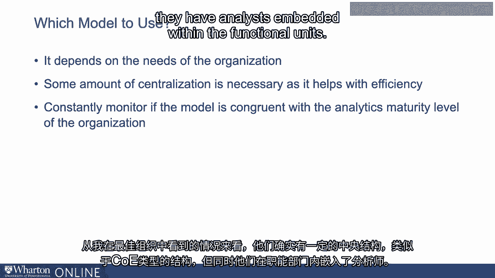

# P40：6_面向分析的组织架构.zh_en - GPT中英字幕课程资源 - BV1Ju4y157dK

我们已经讨论了很多关于声音、愿景以及各种AI。

我认为当然重要的是，在组织内部，我们如何获得成功？那么。成功的很大一部分取决于分析结构的设置。在组织内部进行分析。所以让我们举一些例子，尝试理解不同类型的结构及其可能性。在如何让组织更有结构以获取成果方面会有一些好的收获。

从分析中获得最佳成果。外面有许多不同类型的模型。我想强调的主要内容是，当然没有。一刀切。你必须看看组织内部的成熟度，判断什么模型可能适合。适合你工作最佳。我会介绍所有这些模型。所以让我们从集中式模型开始。

然后我们会讨论卓越中心。

功能模型和最终的分散模型。因此，当你研究这些模型时。让我们看看利弊，然后我会敦促你开始思考自己组织的成熟度水平。你觉得什么类型的结构最适合你的组织。我们先从集中式模型开始。这里的理念是有一个服务整个公司的核心分析单位。

当然，这样做的优点是什么？很多优点。例如在跨职能项目上工作的能力，当然有一个核心单位。服务整个公司的分析单位，他们可以看到整个公司的各种分析。公司内发生了什么，营销中发生了什么，或者可能在。财务。这种方式可以让你在公司不同部门的分析师之间分享想法。当然，中央单位服务整个公司的事实有很多。在那里工作的分析师有很高的可靠性。公司也是如此。显然，这是一个大型结构，从某种意义上讲帮助整个公司。

反面是什么？反面可能是根据分析师的设置，工作量和时间限制可能会很大。分析师的设置取决于公司在这方面的投资。分析师的数量。当然，考虑到有一个核心单位。有时你可能会优先考虑市场营销的项目。有时会涉及到运营等等。而另一个大缺点是灵活性。再次强调。如果有一个大单位，灵活性就会更难，因为你要处理很多事情。同时进行许多不同的项目。让我们再看看另一个模型。这被称为卓越中心模型。这是一个非常有趣的组合。

行业内通常使用的术语是COE，即卓越中心。这是一个有趣的组合，活动和分析师都基于他们的业务单元。但也有一个小的核心小组。那么这里的想法是什么？在某种意义上。你正在尝试兼得两全其美。这意味着在小组织中有一组中心人员。

中心小组。另一方面，分析师嵌入在业务单元中。他们也拥有业务知识。所以这是实质性的知识。那么，积极的一面是什么？

培训是集中进行的，因为中心小组负责所有培训。也有良好的协调。那么，消极的一面是什么？

消极的一面可能是卓越中心可能没有足够的控制，因为。这是一个更小的群体。当然，作为一个小组的事实。在组织内部，我们有多少信号表明对其有很大的支持？

然后有一个模型，我称之为职能模型。我认为这再次取决于。我们将进一步讨论组织的成熟度。但这里的想法是，分析师通常是在主导分析活动的职能内。现在，例如，你公司的财务小组可能有很多不同的。无论发生什么情况，运营团队都会有事情在进行。所以公司可能决定运营团队，比如因为有很多。正在进行的活动，分析应该集中在这个地方。好吧，从积极的方面看。分析集中在最能获益的地方。因此你可以看看投资回报。

你可以做各种事情来帮助你理解。分析能力和分析实践对你的公司来说有多好。所有不同的东西，你正在采用的新技术，在哪里。他们有收益吗？消极的一面是什么？消极的一面是其他职能可能得不到所需的支持。所以例如，假设市场营销没有获得支持，因为许多分析师。在所谓的运营领域内部。最后，这是一种模型，但不完全是模型。这被称为分散模型。其基本思想是分析师遍布整个组织，而没有中央。支持。而不幸的是，对于许多组织，我也看到这一点。

如果有积极的一面，那是什么呢？那就是好吧。一些单位得到了支持，因为他们碰巧有分析师。但我认为有很多缺点。首先，这不算是真正的模型。在某种意义上。你可以想象组织不同部分的小火花。但不足以引起火花。在某种意义上。分散模型并没有一种真正的方法可以期待其形成结构。但这是我看到许多组织的地方，所以我想提出来，以便你能注意到。意识到如果这就是你们组织的现状，是时候开始思考如何了。

你应该改变该组织中分析的结构。当然。一个快速的问题也是一个大问题是使用哪个模型？我们谈论了不同的模型。CUE模型、功能模型等等。老实说。这取决于组织的需求。在某些组织中。我看到的是，随着他们变得更加成熟，最初当他们开始时。你需要一些程度的集中化，因为你确实想要了解是什么。在市场营销、运营等方面，组织内正在进行的活动。等等。在某种意义上，某些可以在组织的一部分中利用的事情可能会发生。

在组织的其他部分？所以你确实需要某种形式的集中化。反过来。我认为，你需要不断监测。你在组织中拥有的模型与您的成熟度是一致的。所以我看到在那些更成熟的最佳组织中，他们确实有一些集中化。这种结构，CUE类型结构，但与此同时，他们有嵌入的分析师。

在功能单位中。为什么？因为我认为对分析师来说，这非常。理解实质性特征是非常重要的。在组织内部发生的决策。所以这样。当分析师构建他们的模型时，当分析师采用新技术来帮助。所谓的，在他们自己的业务中，他们了解决策。决策者正在经历的过程。他们理解公司内部决策者在面临的障碍。继续使用新技术。所以开始查看你的组织，看看你在成熟度的哪个级别。然后看看哪种模型最适合你。[BLANK_AUDIO]。

