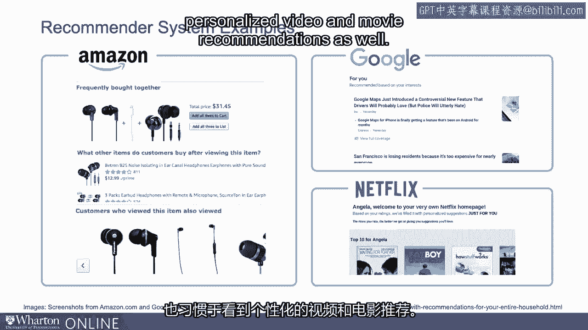

# P42：8_个性化推荐系统.zh_en - GPT中英字幕课程资源 - BV1Ju4y157dK

在本次讲座中，我们将从网络个性化的介绍开始。我会具体说明。

深入探讨推荐系统。现在推荐系统。有时也被称为推荐系统，这些系统。这些系统试图预测哪些项目、产品或内容对消费者感兴趣。基于客户的一些信息，例如他们的用户档案。根据他们过去的购买或评分。推荐系统最常见的例子是协同过滤。这是一个使用标签或短语进行推荐的系统，比如购买此产品的客户。也购买了这个，或者查看此产品的客户也查看了那个产品，或者人们。就像你购买了这些其他产品。现在，这些推荐系统是独特的，因为它们为客户增加了价值。

对于消费者，它们帮助他们了解新产品，并帮助他们筛选。大量选择，意味着当你有很多选择时，它们帮助识别最合适的。相关选择。对于公司来说，它们有助于将浏览者转化为买家。它们有助于交叉销售产品，并通过提供定制或个性化的浏览体验来提高忠诚度。

现在有很多这样的例子。你可能习惯于看到这样的消息：购买此产品的人也购买了这些其他产品。在 Google 新闻上，你可能习惯于看到个性化的新闻推荐。在 YouTube 或 Netflix 上，你可能习惯于看到个性化的视频和电影推荐。

现在如果你从高层次看这些系统的设计。行业内主要使用两种设计。第一个被称为基于内容的推荐系统，这些系统尝试。基于一些产品属性的信息来找到其他消费者感兴趣的产品。例如，如果你喜欢一个产品，这些系统会查看这些产品的属性。他们喜欢的，并找到其他类似的产品。其中一个例子是 Pandora 的音乐推荐系统。另一种设计被称为协同过滤。

协同过滤并没有真正深入产品属性。相反。协同过滤基于其他人正在消费的内容来推荐项目。所以它们尝试找到有类似品味的其他人，并推荐其他内容。他们可能喜欢的。因此，例如，购买此产品的人也购买了这个。所以让我们深入探讨这两个例子，详细看一下。首先。基于内容的推荐系统。

正如我提到的，他们倾向于关注内容属性或产品属性。倾向于找到具有相似属性的其他产品。一个例子就是Pandora，这是一个在线音乐服务。而Pandora本质上推荐并播放可能引起消费者兴趣的歌曲。Pandora源于一个名为音乐基因项目的项目。本质上在这个项目中，许多艺术家，数百甚至可能成千上万的艺术家。听取了数百万首歌曲，并对这些歌曲进行了多维度或属性的评分。所以例如，你可能会说某一首歌在电子方面得分很高。

影响，但在歌曲的节奏性方面得分较低，也被称为。作为有节奏的切分音，或者在大调音色方面可能得分较低。这些是歌曲的不同音乐特质。另一首歌在节奏切分音方面可能得分很高，但可能得分较低。在电子影响方面得分较高，但在大调音色方面得分较低。

诸如此类。在这个例子中，我提到的只是三种不同的音乐属性或音乐特质。一首歌的属性包括电子影响、节奏切分音和大调音色。

但实际上，Pandora针对任何给定的歌曲有超过150种不同的属性。鉴于这些属性，以及大量歌曲的数据库，具有非常深刻的。有关每首歌音乐特质的信息，Pandora的目标是现在开始推荐。歌曲。Pandora的运作方式是，用户登录后首先表示他们喜欢某些。

喜欢的歌曲。例如，我可能登录Pandora并表示我喜欢Imagine的《Thunder》这首歌。Imagine Dragons。现在Pandora查找其数据库，找到其他具有类似音乐特质的歌曲。然后推荐这些歌曲。例如，当我登录Pandora并表示我喜欢Imagine Dragons的《Thunder》时。Pandora接下来播放了21 Pilots的《ride》，并特别指出推荐了这首。

这首歌因为它有dub制作，带有雷鬼风格，且有一段原声节奏钢琴。它使用弦乐合奏，并且具有大调音色。这是Imagine Dragons的《Thunder》这首歌的属性，它在《ride》中也找到了。由21 Pilots演唱。正如你所看到的，这基于对所推荐产品或内容的深入了解。

这种设计只有在你拥有大量有关音乐或产品的元数据时才能使用。一般来说。这些系统可以适应，例如，如果我听一首歌并给它一个不喜欢的反馈。换句话说，如果我告诉Pandora我不喜欢那首歌，Pandora就可以整合。反馈并学习，这就是学习的过程，并即时调整。

向我们展示更接近我们偏好的不同歌曲，与之不同的歌曲。我们不喜欢的歌曲。因此，这是构建这些算法的关键部分。另一种不同于基于内容设计的设计是协作过滤。协作过滤不需要对正在被推荐的产品有非常深入的了解。推荐，所以它们不需要歌曲或其他产品的属性。相反，它们是基于其他人消费的信息。例如，亚马逊的“购买此商品的人也购买了那件商品”是基于协作的。过滤。实际上，当Netflix最初推出其流媒体服务时，最初的设计是。

基于协作过滤。本质上，它根据用户的评分和观看行为将用户分组到不同的特征中。模式，然后根据其他人喜欢的内容向人们提出建议或推荐。其他具有相似特征的人喜欢什么。现在最后。fm是一个在线音乐服务，用户利用协作过滤。

制定推荐。这种方法是，如果我去最后。fm并表示我喜欢Imagine Dragons的《Thunder》。现在最后。fm不一定对《Thunder》的音乐特性有深入的了解。相反，它会查看其他用户喜欢《Thunder》的内容，一旦识别出。

其他这样的用户，它查看这些用户喜欢的其他歌曲，并推荐他们的。

歌曲。因此，这两种主要设计在协作过滤中有许多变体。设计。例如，有一种设计称为物品到物品的协作过滤，本质上。此设计根据其他人消费的内容向用户推荐歌曲，但输入。此设计是您已表示喜欢的特定项目。比如我开始说我喜欢Imagine Dragons的《Thunder》，这就是。系统用于开始推荐歌曲的输入，因此该设计。是一种物品到物品的协作过滤。另一种设计本质上使用有关用户的信息作为输入，而不是特定的。项目。这种设计被称为基于用户相似性的协作过滤。

因此，这种设计的本质是，它查看我们所有的过去历史并观察。查看我们过去喜欢的所有产品，并找到其他具有。相似偏好的原因。我提到Netflix以前使用过一种设计，它本质上创建了人们的特征。然后找到了其他有相似特征的人，并推荐了他们喜欢的其他东西。

这是一种基于用户相似性的协作过滤。这两种设计都不需要对被推荐的产品有深入了解的另一种方式。因此，它们非常容易构建，且构建成本也非常低，这就是它们。也非常受欢迎。他们受欢迎的另一个方面是实际上非常有效。所以我们都习惯在像亚马逊这样的零售网站或其他网站上看到推荐。我们知道，YouTube影响我们做出的选择，实际上协同过滤设计。虽然它们比基于内容的设计简单得多，但同样有效，因此。因为它们设计的简单性，基于内容的推荐系统更受欢迎。

同时，构建这些系统也存在一些挑战。无论你是构建基于内容的推荐系统还是协同过滤，你都必须面对。你拥有多少数据以及需要足够的数据来开始推荐。特别是协同过滤会导致与内容不同的数据集。基于内容的推荐系统。基于内容的推荐系统需要大量关于产品属性的信息。推荐相对而言，协同过滤使用其他人消费的信息。这需要很多关于他人消费的信息。实际上一个挑战是数据可能会很稀疏。

考虑到用户可能只对数百万种不同产品中的五到六个项目进行评分。一家公司的视频或歌曲，因此现在公司必须想出如何推荐。基于这些有限推荐向人们推荐歌曲或视频。这些系统必须弄清楚如何使用或彼此相似，尽管它们。每个人仅对五首歌曲进行评分，而这五首歌曲可能实际上非常。不同的歌曲重叠极少，因此稀疏数据是一个问题。另一个问题是所谓的冷启动。换句话说，冷启动基本上是如何开始做出推荐的问题。

对新用户，当你对他们过去的选择、兴趣或偏好没有信息时。还有，如何推荐尚未被其他人购买的新项目。或者尚未被其他人评分，但刚刚被添加到目录中。想要开始进行推荐。这是另一个挑战。因此，存在许多设计挑战，数据科学家会花大量时间思考。通过一些设计挑战，但这是一个相当成熟的领域。针对这些问题有一些非常好的答案。所以，今天构建这些系统并不是很复杂。

公司也可以选择使用第三方系统，因此如果你不想构建。如果你想自己做，有第三方公司提供产品推荐。

作为公司可以整合的服务。总之，推荐系统有很多设计。最流行的两种设计是基于内容的设计和协同过滤设计。这些设计在实践中是非常不同的。两者都相当有效，并且在这些设计上有不同的权衡。在讲座中，我们将实际深入探讨这些权衡的一些方面。 [BLANK_AUDIO]。
