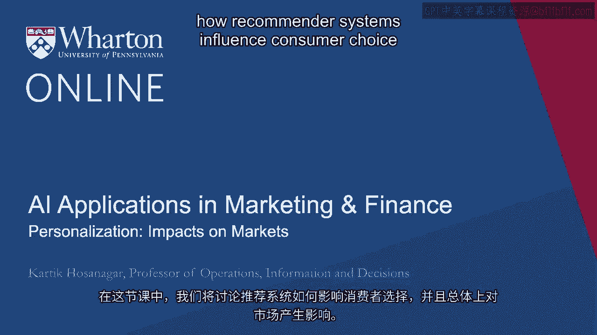
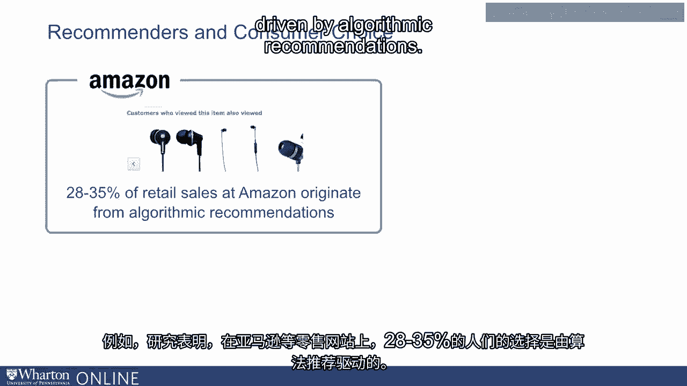
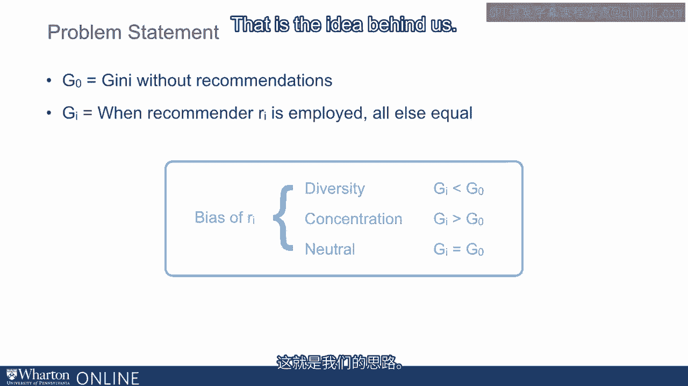
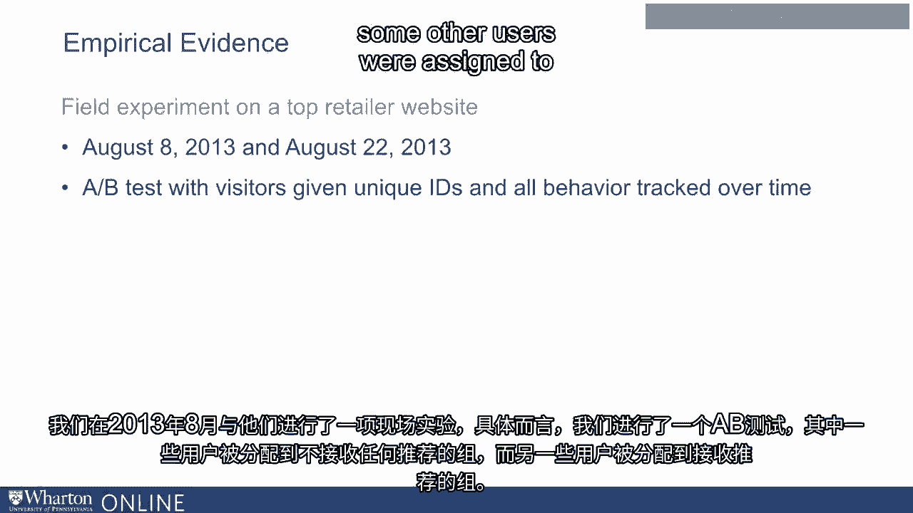

# P43：9_个性化对市场的影响.zh_en - GPT中英字幕课程资源 - BV1Ju4y157dK

在这次讲座中，我们将讨论推荐系统如何影响消费者选择，以及一般情况。

对市场产生影响。现在，推荐系统在多种场景中影响消费者选择。例如，研究显示消费比例在28%到35%之间。在亚马逊等零售网站上，人们的选择有很多是受到算法推荐的影响。

所以要么是推荐系统改变了我们的选择。意思是我们走进来试图购买产品A，但推荐系统。通过这样的推荐，比如“查看此商品的人最终购买了那件商品”。这实际上可能说服我们改变选择，或者实际上可能交叉销售某个产品。我们买了产品A，但看到推荐“购买A的人也购买了B”，最终我们买了B。

但无论如何，亚马逊零售网站上近三分之一的选择都是归因于此。针对算法推荐的研究，尤其是Google News上的研究。有研究表明，算法推荐使网站的消费者使用率增加了约38%。所以人们消费更多的新闻，在Google News上花费更多时间。

而且这基本上驱动了使用率的38%增长。

另一项来自Netflix数据科学家的论文表明，80%的观看小时数。在Netflix上观看的内容实际上来源于算法推荐。所以简而言之。我们已经看到推荐可以在许多场景中推动消费者选择。现在。有趣的是，它们不仅仅增加了消费量。

它们还会推动消费的商品、产品或内容的变化。

关于它们如何影响我们的选择有很多理论。现在。一种理论实际上可以追溯到2000年代中期，被称为长尾理论。这基于一本叫做《长尾》的书，作者是克里斯·安德森。在书中。作者建议，互联网总体上将帮助推动消费者。从最受欢迎的商品到更小众的商品的搜索、偏好和购买。换句话说，互联网将推动对热门商品需求的转变。向更小众的商品倾斜。在使这种转变成为可能的机制方面。关键机制之一是自动化推荐。具体而言。

他建议自动化推荐的主要影响。将帮助人们从热门商品的世界转向小众商品的世界。而这可能发生的主要原因是，在没有推荐的情况下。我们可能会参考一些列表，比如说热门电影列表或畅销书列表。而且我们可能会基于这些列表做出选择。但推荐可能有助于引导我们关注更接近我们偏好的项目。但并不一定非常受欢迎。但问题是，这真的是真的吗？

尤其是考虑到协同过滤算法会推荐项目。基于他人的消费，所以它们是否依赖于一些关于流行度的信息来。推荐项目。现在，让我们看看这是否发生。

现在，我们可以用一种方法来衡量购买是否多样。是通过观察所谓的“消费基尼系数”来实现的。现在。“基尼系数”是消费多样性或收入集中度的度量。它在多种不同的环境中使用。计算“基尼系数”的方法是首先绘制所谓的洛伦兹曲线。

洛伦兹曲线是你在黑色图形中看到的曲线。这被标记为“L”。洛伦兹曲线表示由某一百分比的产品生成的总销售额的份额。换句话说，洛伦兹曲线在这里所指示的是底部20%的产品。产生的销售额微不足道，可能少于1%。在这个图中。

底部40%的产品产生的销售额稍微少于10%。底部60%的产品产生的销售额大约为20%。所以，这基本上就是洛伦兹曲线所指示的内容。你在图中看到的对角线基本上表示洛伦兹曲线会是什么样子。看看如果所有产品的销售额相等会是什么样子。如果所有产品的销售额相等。底部20%的产品将产生20%的销售。底部40%的产品将产生40%的销售，依此类推。现在，基尼系数是洛伦兹曲线与对角线45度之间面积的度量。

直线。如果基尼系数为零，则意味着所有产品的销售额相等。如果基尼系数为1，则意味着一种产品生成了所有的销售。所以现在我们可以问推荐系统是否将市场中的基尼系数朝零的方向移动。或者接近1，这意味着接近更大的销售多样性或接近较低的销售多样性。

我们实际上可以研究一个没有推荐的世界。我们称这个市场的基尼系数为G0。假设在这里使用某个推荐器R。在那个市场中，使用该推荐器获得的基尼系数是GI。然后我们可以问推荐系统是否存在多样性偏见或集中偏见。通过查看GI是否小于或大于G0。因此，这就是这个想法。

所以为了验证这一点，我们实际上与北美的一家大型零售商合作。我们与北美前五大零售商合作，并于八月与他们进行了现场实验。2013年我们专门进行了一项AB测试，其中一些用户被分配到未。未接受任何推荐的用户与接受推荐的其他用户被分配到。

具体来说，我们取了超过130万访问网站的用户，并将他们分成。三个组。第一组，我们称之为控制组，大约占我们用户基础的77%。被分配到控制组的用户，他们未接受推荐。第二组。大约11.5%的130万用户，他们接受了基于浏览的协同过滤推荐。

意味着一种推荐，表示查看此商品的人也查看了其他商品。最后，第三组接受了基于购买的协同过滤推荐。意味着该公司的推荐，购买此商品的人也购买了这些其他商品。接下来，我们查看这三组的基尼系数有何不同。让我们看一下。

在幻灯片上看到的图中，黑色为控制组的洛伦兹曲线。对于未接受推荐的组。虚线红色中，我们有接受推荐的组的洛伦兹曲线。基于浏览的推荐。你会注意到底部40%的产品市场份额。在开启推荐后显著下降。类似地，市场份额的。

底部60%的产品在推荐开启后也显著下降。这可以是。直接体现在基尼系数的测量中。因此，获得推荐的群体的基尼系数。没有推荐的基尼系数为0.6，而获得推荐的群体的基尼系数。公司，查看此产品的人也查看了那些产品，实际上增加到0.68。

换句话说，销售变得更加集中。接下来，我们可以看到购买时发生了什么。基于协同过滤的推荐。在这个图中，再次，我有控制组的洛伦兹曲线。黑色和基于购买的协同过滤的洛伦兹曲线为虚线红色。我们会看到这次结果更为明显。底部产品的市场份额。

下降得非常明显，而在有推荐的情况下，基尼系数。从控制组的0.6显著增加到接受推荐的组的0.7。接受推荐的组。换句话说，有充分证据表明协同过滤具有显著。流行偏见。他们往往根据其他人正在浏览的产品来推荐商品。

正在购买。因此，他们往往会加强已经受欢迎产品的流行性。

现在，所有这些内容有一个警告。在这里的图表中，我绘制了绝对销售额。并不是产品的市场份额，而是推荐前后产品的绝对销售额。值得注意的是，所有产品的绝对销售额，无论我们谈论的是。关于每个图表左侧的小众产品或销售额的。

图表右侧的流行产品。所有产品的销售额都在增加。

换句话说，推荐系统所做的就是帮助所有产品。无论是小众还是流行产品都会被发现。然而。它们对流行产品的受益不成比例。这在某种程度上类似于关于收入不平等的辩论。人们谈论收入。

不平等，但如果你查看过去25年、30年的数据，特别是在美国这里。有充分的证据表明，在绝对规模上，所有群体的收入，无论我们。不论是富人、中产阶级还是穷人，他们的收入都在上升。但在相对基础上，富人受益远远超过穷人，这就是为什么会有。

关于收入不平等的辩论。因此，我们观察到非常相似的结果，各种产品。无论流行或不流行的产品在推荐下都会受益并被发现。然而。更流行的产品往往更容易被发现，并且比小众产品受益更多。在协同过滤下。这是我们从不仅仅是这项研究中得出的主要发现之一。

但还有多项其他研究。因此，总的来说，我们发现协同过滤往往具有流行性。

偏见。但换句话说，我们发现基于内容的推荐系统并没有相同的。流行偏见。简而言之，我们发现基于内容的推荐系统可以帮助人们找到。接近他们偏好的产品。然而。这些产品未必是最受欢迎的项目。因此，在使用这两种设计方面有一些利弊。在下一次讲座中。我们将看看这些权衡，并看看公司如何修改其设计以。这两种推荐系统设计都受益于此。[BLANK_AUDIO]。
