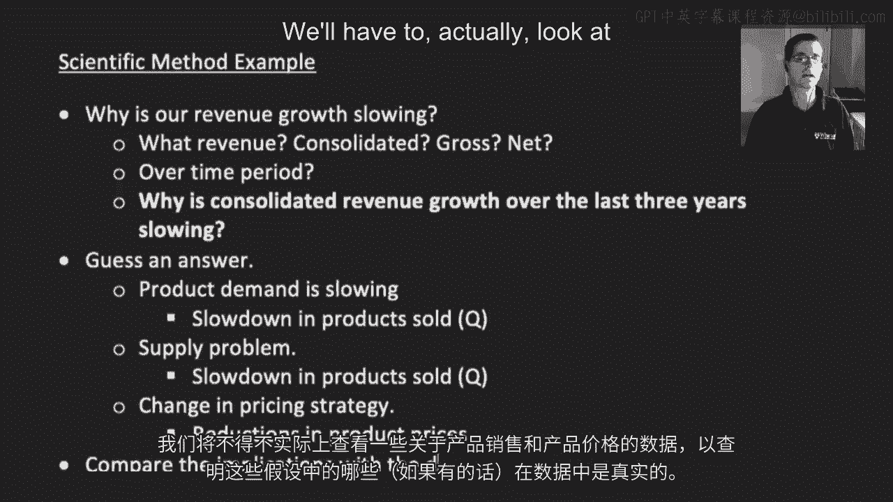

# P47：13_过程科学方法.zh_en - GPT中英字幕课程资源 - BV1Ju4y157dK

因此，在任何形式的机器学习或人工智能，或者更一般的财务分析工作之前。我们总是希望有一个解决问题或提问的流程。我认为最经过考验的方法是大多数人所称的科学方法。

方法。我喜欢理查德·费曼这位伟大物理学家的这句名言，它很好地总结了。以非常简洁而优雅的方式描述科学方法。如果是，他指的是理论。与实验相悖就是错误的。而这个简单的陈述是科学的关键。我认为对解决问题的科学方法的这种描述是。

对于解决商业问题来说，这非常有用，就像解决科学问题一样。

那么让我们在这里更明确一些。那么什么是科学方法？

有许多方式可以描述它，我发现以下这种方法非常有用。所以首先，你要清楚地表述一个具体的问题。你想解决什么问题？然后你猜一个答案。统计学家会说你假设一个答案。同样的思路。所以你提出一些潜在的答案或假设、解决方案、建议的解决方案。针对这个问题。第三步，我们希望识别这些假设或猜测的经验含义。对于这个问题的答案或假设。如果答案或假设是正确的。我们在数据中应该看到什么？最后，我们希望将我们猜测的经验含义与实际观察到的进行比较。

在数据中看到的。如果我们的假设是正确的，这就是我们在数据中看到的。我们应该在数据中看到，但我们实际上在数据中看到吗？这实际上是最后一步。那么让我们考虑一个例子并应用科学方法。

这里有一个人可能会问的问题。为什么我们的收入增长在放缓？

许多商业领袖可能会问他们的公司什么问题。现在看起来答案是明确的。这是一个具体的问题，但实际上，我对那个问题有很多疑问。如果我们想查看数据以提取答案，其实并没有那么明确。对于那个问题的答案。那么例如，我们在谈论什么收入？我们是在谈论合并的？总收入。

净收益、折扣等等。时间跨度是多少？

那么我们是在讨论过去一年的收入增长，还是过去两年的收入增长。五年？所以如果我们想要“说”数据，我们需要非常谨慎。要具体且清晰地提出问题。所以让我们想象一下，我们真正感兴趣的是为什么收入增长在。过去三年？抱歉，打字有误。我们假设这是在综合层面上进行的。

而不是针对特定产品。为什么过去三年的合并收入增长放缓？

我最终会学会在这里打字。这就是我们的问题。记住第二步是猜测一个答案。一些潜在的答案是什么？你认为为什么。实际上，暂停视频并尝试提出一些答案？

你不知道我们讨论的是哪家公司的事实并不重要。只需运用你的商业常识和对推动收入的一般理解。尝试对此问题提出一些答案。好的，希望你回来了。如果你想到了什么，那么这里可能的答案是什么？

有一些假设可以解释为什么收入增长放缓。可能有一件事情正在发生，那就是需求。产品需求在放缓。可能还存在其他情况，实际上需求并没有放缓。但我们面临供应问题。因此，我们的产品需求量很大。但出于某种原因，我们就是无法将产品上架。

也许正在发生的事情是定价策略发生了变化。记住。收入等于价格乘以数量。因此，收入随时间减少或增长放缓。更准确地说，可能通过数量或价格渠道实现。因此，我们可以测试一些假设。然后第三步是确定我们猜测的经验含义。

这些不同假设的经验含义实际上相对简单。如果定价策略发生变化，我们可以查看数据中的定价。我们的产品是否在降低价格，也许过于激进以维持需求。所以我们应该看到产品价格的降低。也许正在发生的事情是，我们看到的却是产品销售数量的放缓。

有趣的是，这是我们在供应问题中看到的相同含义。增长将影响数量。因此，如果事实证明我们只是销售的单位减少了。我们稍后将需要更深入地探讨一下。但关于我们收入增长放缓的问题，还有一些潜在的假设。

作为这些假设的一些经验含义。最后一步是将这些含义与数据进行比较。这是我们的最后一步。

所以我们需要查看一些关于产品销售和产品价格的数据，以了解。如果这些假设在数据中确实存在。这虽然是一个非常风格化的例子，但希望能强调其重要性。清晰地阐明一个具体问题，以便你可以进行数据分析。第二。猜测一些问题的答案或假设。三。确定这些假设的经验含义。这是我们在数据中应该看到的。最终将这些含义带入数据中，以查看哪些是存在的，若有的话。

事实上是真的。[BLANK_AUDIO]。

