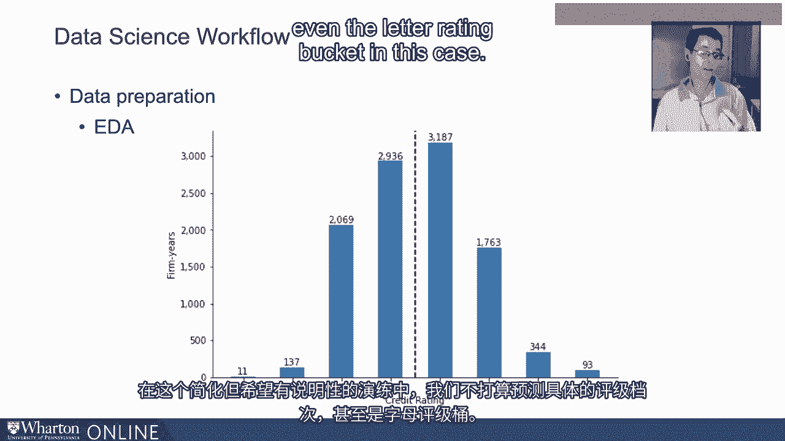
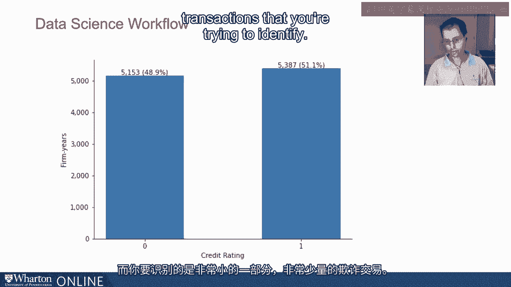
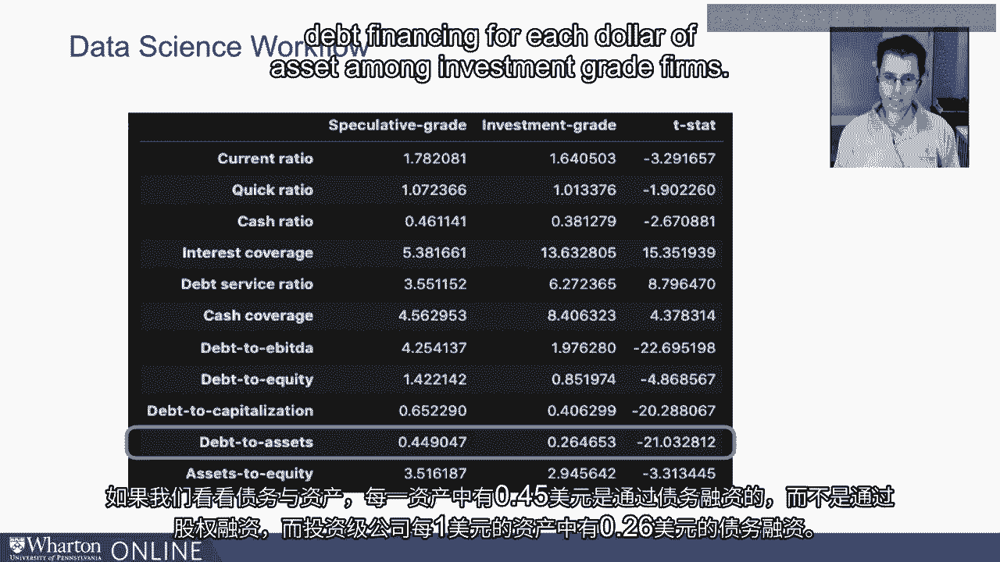

# P53：19_信用风险数据.zh_en - GPT中英字幕课程资源 - BV1Ju4y157dK

在这个视频中，我想开始谈谈我们将用于分类模型的数据。

好的，记住，我们先退一步。

一切都始于科学过程，明确阐明问题。

从一些假设的提出和对问题的猜测与回答开始。

理解这些假设的实证含义，然后在数据中进行测试。

我们现在所处的阶段实际上是在用数据进行测试。

这是数据科学工作流的开始。这始于获取和验证。

因此，我将抓取一个标准和开放的CompuSAT数据库，其中包含美国大多数上市公司的信用评级和财务信息。

以及一些私有公司。这将成为我们数据的基础。

我将进行一些筛选，做一点清理和验证，正如我们一直做的那样。

但此时不会让你感到无聊，这并不是为了降低其重要性。

而只是简单地掩盖了一些为了准备这些数据而必须完成的繁琐代码。

结果是一个包含10540个观察值的样本。

涉及1995年至2016年的400家公司。因此，记住我在上一个视频中提到的公司年观察。

我们有1400家公司的数据，在多个时间点上。因此，让我们看看我们的数据。

特别是，让我们做一些探索性数据分析（EDA）。

我将在这里绘制样本中评级的分布。

为了简化呈现，我已经对评级进行了合并。

这些是标准普尔评级，分成完整的字母桶。所以。

我所说的是，双A级桶由双A减去双A和双A加组成。

三A级桶由三A减去三A和三A加组成。

对于大多数相关的其他评级也是如此。

我们可以看到的东西大致是对称的，在某种意义上几乎呈钟形。

并不是说它是正态分布的，原因有很多。

其中一个原因是数据是离散的，但你可以看到大部分数据。

大多数观察值聚集在这个虚线附近。

这旨在区分右侧的投资级和左侧的投机级。

所以大部分数据在B级和A级公司之间。实际上。

我们观察到的三A级评级中，只有相对少量的93个，而双C评级则更少。

其中一些接近违约。当然，这并不是我们的结果变量。

我们在这个练习中并不是在尝试，这是一种风格化的表现。

但希望能够直观地预测具体的评级等级，甚至在这种情况下的字母评级桶。

我们试图区分投资级。

投资级和投机级。如果我看这里的分布，其中1对应投资级。

零对应于投机级，你可以看到我们的评级几乎是五五开。

在10540个观察值中，51.1%是投资级，48.9%是投机级。

从某种意义上说，这实际上会让我们的工作变得更容易，因为我们对这两类都有很好的代表性。

两类公司。与一些数据集（例如银行欺诈）形成对比。

绝大多数（百分之九十九，甚至更多）数据是非欺诈交易，而你只有很小的比例。

你试图识别的欺诈交易数量非常少。但在这里并不是这样。

在最后这张表中，我将实际将样本分为两组，基于你是投机级还是投资级。

然后我将计算我们之前讨论过的每个组的平均信用风险KPI。

接着我将进行一项小的配对t检验，并在第三列展示t统计量。

因此，如果我们看第一行，我看到投机级公司有一个平均流动比率。

请记住，流动比率是流动性的一个衡量指标，流动资产。

流动负债约为1.78。

投资级公司的流动比率实际上略低，为1.64。

乍一看可能会显得有些奇怪。但请记住。

投资级公司不需要流动性来支持其财务。

他们可以在流动性方面运行更精简的操作，因为他们从运营中获得了更多的资金，远超任何财务义务。

我们看到，投机级公司与投资级公司之间的流动比率在统计上显著较大，t统计量为负3.29。

因此，我们需要关注流动比率、速动比率和现金比率。

我们发现，投机级公司平均上实际上更倾向于拥有更多的流动性。现在。

当我们转向覆盖比率时，特别是利息覆盖比率。

债务服务和现金覆盖率上，我们看到完全相反的情况。

投资级公司比投机级公司具有更强的覆盖能力。

让我们聚焦于利息覆盖比率，使讨论更具体和精确。

记住，利息覆盖率是EBITDA与利息支出的比率，EBITDA是运营收入的代理。

所以，平均投资级公司每一美元利息支出有$13的运营收入。

而平均投机级公司仅有$5.38。

如果我们考虑本金，这两个数字都会下降。

但你可以看到我们几乎接近投机级的1:1。

投机级公司每欠一年利息一美元的本金，运营收入为$3.55。

相比之下，投资级公司为$6.27。

而且在投机级与投资级的差异不仅在经济上显著。

它们在统计上也是显著的，正如大t值所示。最后。

信用风险指标的最后一个类别，杠杆比率。

显示一些与我们的覆盖比率相对一致的内容，尽管是反向的。

所以，让我们考虑债务与EBITDA，投机级公司的债务与EBITDA比率或杠杆比率是4。

25 表明，他们平均每产生一美元的运营收入就有$4.25的债务未偿还。

所以，与投资级公司每一美元运营收入的$1.97的未偿债务相比。

所以，显然，投机级公司杠杆率相对较高，我们在所有流动性方面都看到了这一点。

所有杠杆比率。

因此，如果我们看看债务与资产，每个资产的45美分是通过债务而非股权融资的，针对投机级。

相比之下，投资级公司每一美元资产的债务融资为26美分。

这些都是高度显著的。你可以看到信用风险特征之间的明显差异。

信用风险KPI在投机级和投资级公司之间。

这很重要，因为这在我们想要预测或分类公司为投机级时会非常有用。

等级或投资级，因为我们会得到很多差异。

覆盖比率、流动比率等之间的巨大差异，以及在某种程度上的其他方面。

流动比率，换句话说。这些似乎可能是我们下一个分类问题的有用预测指标。

谢谢。

你。
