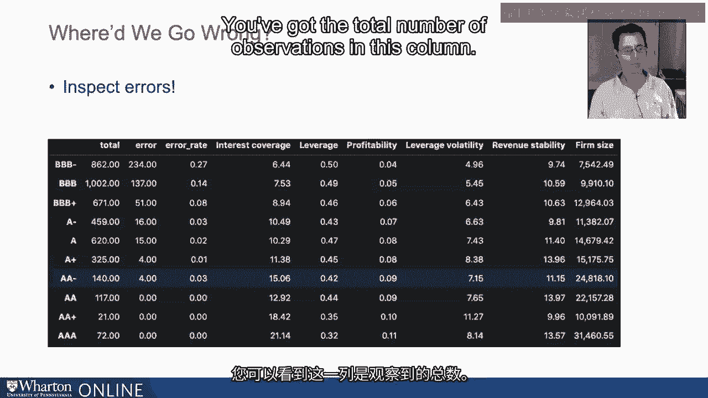
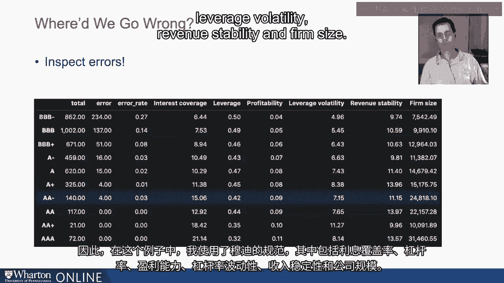
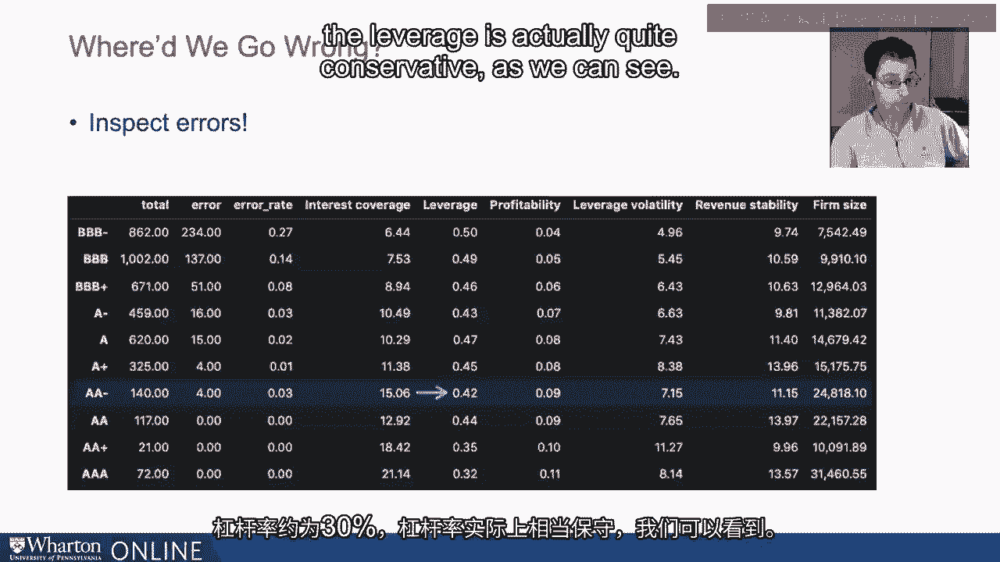
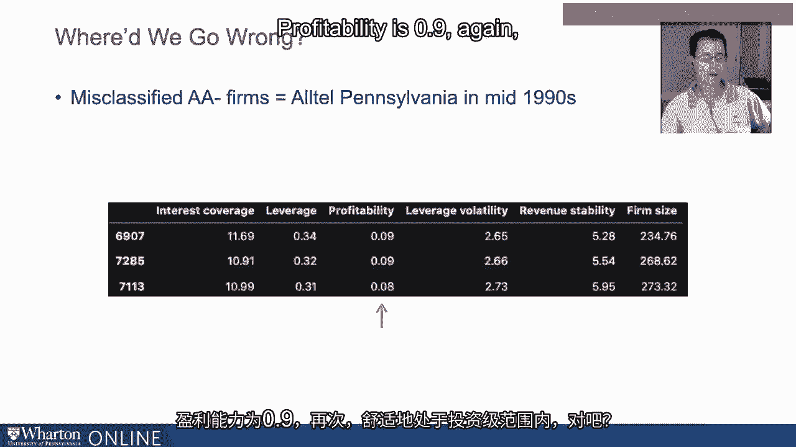
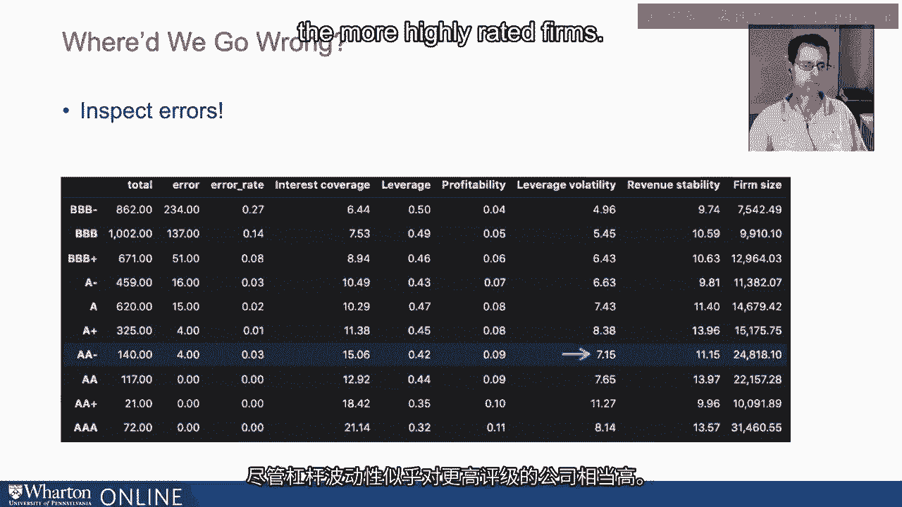
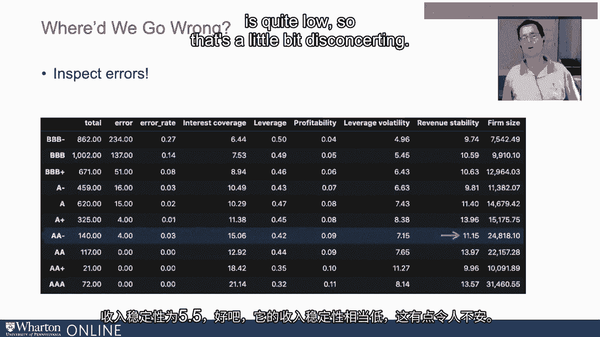
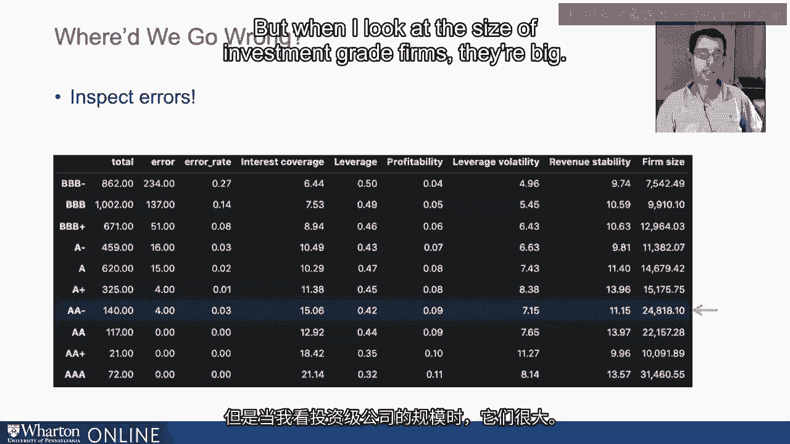
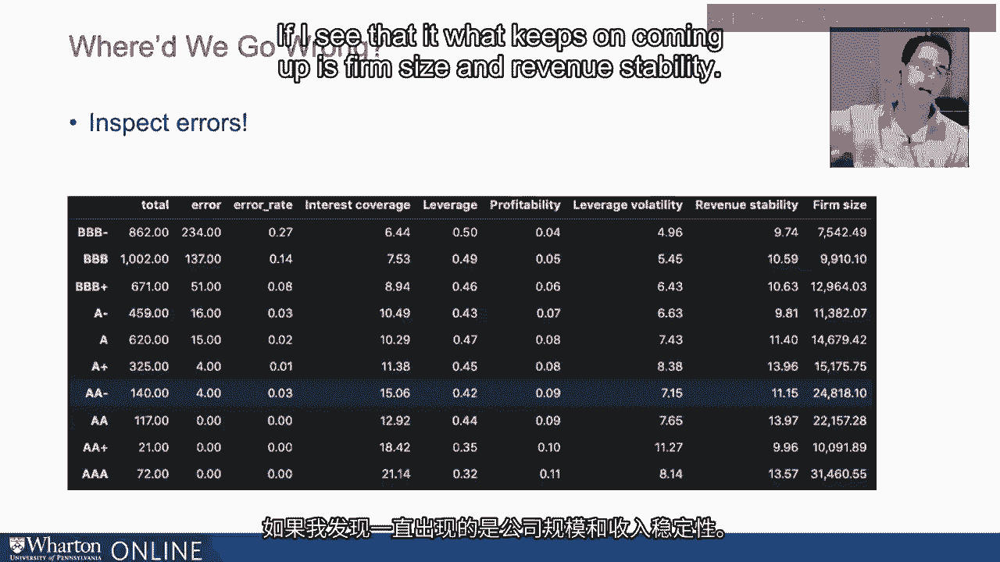

# P57：23_信用风险误差分析.zh_en - GPT中英字幕课程资源 - BV1Ju4y157dK

因此，我们探索了许多不同的模型。我们探索了不同的数据来推送这些模型。过程中的另一个重要因素是我所称的误差分析。

换句话说，我们在哪里出错？我们是如何错误分类公司的？

让我们尝试理解这一点。因此，我在这里做了一个小表格。

每一行代表一个不同的评级类别，从 AAA 一直到表格的底部或顶部。评级为 B-，这是在变为投机级之前仍然是投资级的最后一个评级。

低于投资级。我们在这一列中有总的观察数量。

我有错误的数量或错误率。这仅仅是这两个数字的比率。然后我得到了每个输入的平均值。数据输入，输入变量。

输入模型的预测变量。因此在这个例子中。我正在使用穆迪的规范，包括利息覆盖率、杠杆率和盈利能力。杠杆波动性、收入稳定性和公司规模。

因此，对于 BBB- 评级的公司，在训练数据中有 862 个。我们错误地将 234 个分类为投机级，错误率为 27%。

那些公司的平均利息覆盖率为 6.44，杠杆率为 0.50，盈利能力。为 0.04，波动率为 4.96，等等。

这只是给我们提供了一个关于我们在分类中出错的视角。以及那些公司的某些特征，而不是错误，而是那些。

更广泛的公司。好的。现在，请注意，我们没有错误分类任何 AAA。了解这些信息很重要，因为如果我们漏掉了 AAA，如果我们把这些搞错了，可能会出现问题。输入数据一定存在严重错误，因为它们与投资级相差甚远。投机级界限。它们应该很容易识别。

我们不准确地将四个 AA- 进行了分类。

因此，我将查看这些。我在屏幕上有三个指标。这是三种错误，它们都与上世纪 90 年代中期的宾夕法尼亚州有关。当我查看 1110 的利息覆盖率并将其与 AA- 进行比较时。

这个评级低了不少，但仍然舒适地保持在投资级。1110 仍然是 AA 评级。

所以我认为这不是问题所在。

杠杆比率大约为30%，杠杆实际上相当保守，正如我们所看到的。

盈利能力再次为0.09，舒适地处于投资级范围内，对吧？

投资级公司往往拥有更高的盈利能力。

所以到目前为止这有点令人困惑。也许它的波动性非常高，这确实是一种波动性。

它的杠杆波动性非常高。2.6。不是，几乎没有。虽然。对于评级较高的公司，杠杆波动性似乎相当高。

我想将其与投机级公司的杠杆波动性进行比较，但。这可能正是一个原因。

它似乎有点低。坚决的稳定性，5.5。

嗯，它的收入稳定性相当低，所以这有点令人不安。

不过，真正引人注目的是，看看公司的规模。所有信息都表明其公司规模。我认为这是以百万美元计算的总资产。我们在看大约2.34亿美元，2.75亿美元。274万美元到275万美元，假设。

当我看投资级公司的规模时，它们很大。

这些资产以十亿计。你可以看到，规模在某种程度上几乎是单调关系。可以说，随着我们从风险更高或投资更低的方向移动，稳定性确实在增加。等级较高的公司与更高投资级评级的公司。

但是当你将2.5亿美元的资产与70亿美元进行比较时，这就显得有些奇怪。

就像一个小公司。而我很确定这一点，虽然程度较小。收入稳定性和杠杆稳定性，正是导致情况混乱的原因。这正是导致情况混乱的原因。

现在，目标，明确一点，不是要获得每一个公司的观察或。

正确分类。我们可以用最高度参数化和复杂的模型做到这一点，从而获得每一个。观察是正确的，但一旦我们将其移出样本，它就会出现问题。它将会表现得很糟糕。

所以我们自然会漏掉一些。但我们想做的是理解为什么我们的模型会犯错。因为如果它以系统的方式犯错。我们希望能够将某种衡量标准纳入模型，以捕捉这种变化。

所以，如果我查看这些其他错误，如果我打印出数据，应该看看。看看我为什么会错误分类一些公司的投机评级，如果我看到它不断出现。

关于公司规模和收入稳定性，也许我想转向更灵活的模型。功能性。

例如，公司的规模形式。或者也许公司规模并不重要。我确实知道它是重要的。但我想试着找出我错误中的一些共同主题。

从中学习，并改进模型。事实上，这正是提升模型的过程所做的。它是否从自己的错误中学习。好的？好吧。那么。模型过程中的另一个重要元素是错误分析，以便我们能够理解。

理解模型为何出错，从这些错误中学习，并改进模型以提高性能。分类准确率。

谢谢。[BLANK_AUDIO]。

