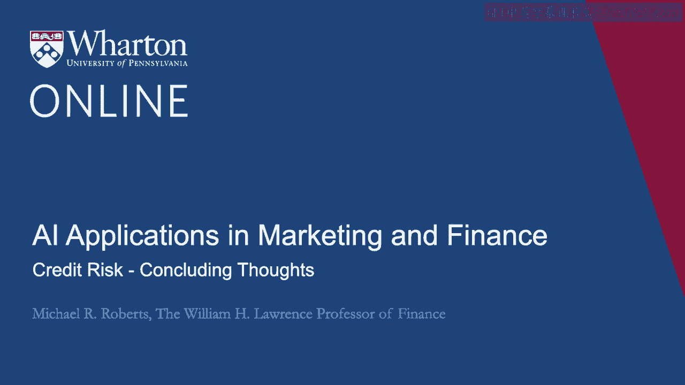

# P58：24_信用风险总结思考.zh_en - GPT中英字幕课程资源 - BV1Ju4y157dK

好的，让我们在最后一个视频中将事情结合起来。

正如我们一开始所说，金融数据技术密切相关。自金融几乎开始以来，数据就扮演了核心角色，随着技术的发展。随着进展，它逐渐渗透到金融领域，至少是金融实践，更不用说。学术研究几乎立即开始。因此，三者之间形成了良好的结合，引领我们走到了这里。

今天的环境中，机器学习和AI等概念扮演着核心角色。在这一系列视频中，我们实际上谈论了各种事情。所有这些都是以线性方式相关的。一些解决方案始于科学方法。清晰地表达一个问题，非常精准，假设问题的答案。理解这些答案的含义，关于你可能在数据中看到的内容，然后通过数据检验这些假设。数据科学工作流程的组成部分，从数据的获取和验证开始，随后。通过准备数据，使其准备好进行分析，进行探索性数据分析。最终在其基础上进行建模。我们在一个应用的背景下展示了所有这些，作为一个说明性工具。

专门针对企业信用风险。我们讨论了企业信用风险的含义。了解这一点是多么重要，不仅对公司，还有各种不同的利益相关者。我们讨论了通过查看企业财务的基本面来评估信用风险的基础知识。通过查看关键绩效指标来分析报表。

然后我们过渡到讨论信用评级，认识到信用评级是。我们正朝着基于我们开始的分析构建信用风险量化的方向迈进。在财务报表分析中开始。然后我们实际上决定对信用评级进行建模。尽管以一种相对粗略的方式观察，投机等级与投资等级之间的区别。

然后我们实施了一个机器学习过程，从逻辑回归模型开始，并探索了。其他各种模型，包括K近邻算法。我们避免了技术细节，因为现在既不是时候也不是地方。我们只是想对这些概念有一个总体的概述介绍。对于有兴趣的人，其他地方有大量关于那些可怕细节的信息。但是，从中得出的一个教训并不常被强调，那就是。数据与模型的重要性。如果你要花费资源，花在数据上。不是为了更复杂的模型，因为模型受限于输入的数据，至此而已。

我们学习的另一件事是，了解你在哪些地方犯错误同样重要。这可能比你成功的地方更重要，因为那是。改进将体现在建模过程中。通过这一切。你可能会想，“人工智能呢？我们还没有谈论人工智能。”

我喜欢将人工智能视为一个包含机器学习的超级集合，但还有其他。其他内容也一样。为了保持内容可消化，以及让这个视频系列控制在合理的时间范围内。让我稍微即兴说几句。人工智能在金融领域可以扮演许多不同的角色。我认为值得强调的一点是在克服或减轻某些行为偏见方面。

人类决策中固有的偏见。看看一些最近的诺贝尔奖得主。无论是丹尼·卡尼曼还是理查德·塞勒。真正的经济学，更广泛地说是行为金融学。这点非常重要，因为它照亮了个体投资者所犯的错误。人类在经济决策或财务决策方面所犯的错误。

我们总是会犯错误。我认为人工智能能做的事情之一，当然还有很多其他功能。它可以真正帮助我们规范决策过程。它可以帮助我们避免在投资决策中犯一些常识性的错误。或其他与金融相关的决策。这里有巨大的潜力，我们已经在一些机器人投资中看到了这一点。还有建议，但我并不觉得这样说有什么冒险，因为这只会不断增长。

人工智能在帮助人们做出更好财务决策方面的角色只会。随着时间的推移，随着我们获得更多数据和计算能力的提升，这一角色会变得越来越重要。所以让我停下来不再说话。

谢谢。 [BLANK_AUDIO]。

