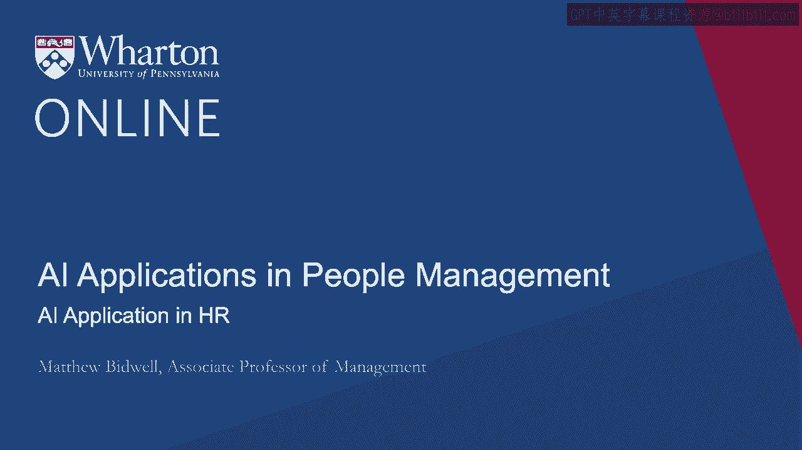
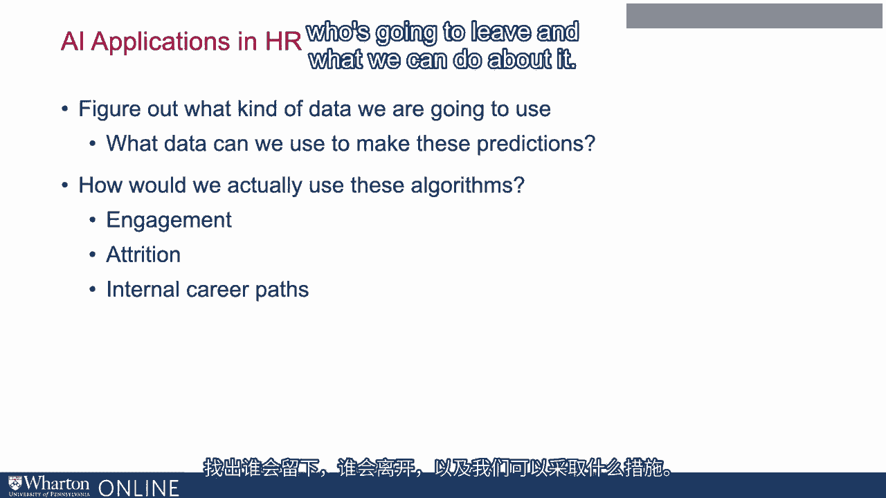

# P73：10_人力资源中的AI应用.zh_en - GPT中英字幕课程资源 - BV1Ju4y157dK

到目前为止，我们讨论了两件事。

首先，我们讨论了在某种独特挑战中管理人员的问题。

它创造了什么，以及组织如何倾向于应对这些挑战。

索尼还向你展示了机器学习的魔力。这些新工具和技术。

技术使能，并且现在被用于构建更强大的东西。

算法和更好的预测我们之前拥有的广泛事物。

所以现在我认为我们已经到了一个很好的时机，可以真正将这些算法应用到。

我们之前提到的管理人员的问题。

而且想想机器学习可以用来改善方式的不同方法。

我们管理人。现在在这样做的时候，我认为我想强调一个关键点。

这是索尼描述的算法。这些是通用目的技术。

我指的是它们是一套我们可以应用于任何问题的技巧，你知道的。

无论是模式识别的问题，还是训练计算机识别每一只猫。

互联网正在解决一些生产问题。你说吧。好的。

所以当我们谈论如何将其应用于管理员工时，所不同的是。

将有几个事情。所以一个是弄清楚我们将使用什么样的数据。

所以索尼所描述的这些算法真正擅长的就是处理一堆。

输入数据和输出，以及弄清楚这些输入数据中的哪个。

所以我将举例谈论营养预测。

我们可以利用哪些信号来预测谁会领导，这些信号与人们的行为有关。

因此，关键的一点是弄清楚哪种数据效果最好。

预测谁将离职的工作。因此，我们常常考虑的是我们可以使用哪些数据来进行这些预测。

预测，数据越聪明，结果就越好。

我们在应用这些时，另一个我们真正想要考虑的事情是我们该如何去做。

实际上使用这些算法。算法只是给你提供预测。

对自己的预测没有用。那么这些行动邻居究竟在做什么呢？

由此产生的行动是什么？所以我将讨论这些算法如何应用于管理的三个不同领域。

人们。因此，首先要关注员工的参与度，追踪我们员工的动机有多高，他们的满意度如何。

在这里。一个 attrition，弄清楚谁会留下，谁会离开，以及我们可以做些什么。

怎么处理它。

第三，在组织内部建立职业发展路径。

这并不是机器学习使用的所有方式的详尽列表。

管理人员。我认为建立这样一个详尽的列表会很困难。

我特别想说的是，机器学习正在显著影响的一个巨大领域。

used is hiring。 我将忽略这一点，因为彼得会花很多时间谈论。

那个。我将讨论这三个主题：**参与度**、**流失率**和**职业发展路径**。

我们将从互动开始。谢谢。 [沉默]。
