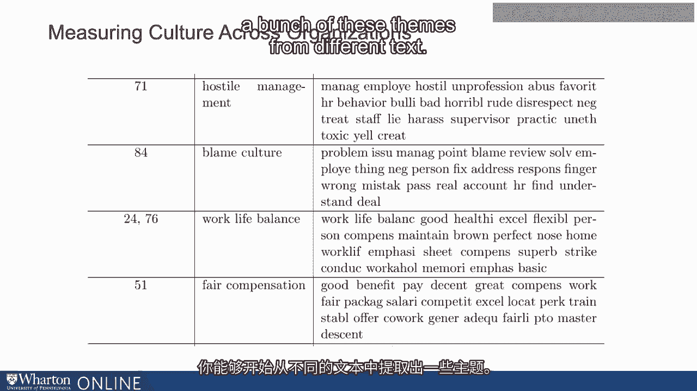

# P75：12_主题建模.zh_en - GPT中英字幕课程资源 - BV1Ju4y157dK

主题建模是从文本数据中提取意义的第二种技术。

情感分析仅仅给你一种价值，积极与消极。

主题建模是试图弄清楚正在讨论的不同主题。

在大量文本中，能够对每个不同的文本片段进行编码。

告诉你哪个主题存在。我们该如何做到这一点？

我认为再次理解时，考虑你是否在和朋友交谈是很有帮助的。

谁是情商为零的学者，我们正在试图向他们解释，这要怎么做？

你如何浏览这些文本并提取出关键主题？你可能会怎么做？实际上。

这里有一个不错的例子，在我的一节课上，我让我的学生写一个非常。

他们最后工作过的组织文化的简要描述。

所以我这里有几个。想象一下我们的任务是弄清楚一些主要的维度是什么。

人们如何描述组织文化？

描述文化时常出现的事情有哪些？我们会怎么做？嗯。

我们可以通读这些内容。通读之后，我们可以开始观察是否有一些共同的主题浮现出来？

我认为有一些。所以例如，有几个明确谈论“努力工作，尽情玩乐”。

所以这似乎是一个维度。另一个经常提到的事情是某种*同事之间的关系*。

所以人们谈论团队合作、协作等这种团队基础的东西。

你知道，也许是影响。这将是另一个，有人谈论重大的社会挑战和影响导向。

所以你开始看到一些主题浮现。

所以我们做的就是开始列出这些主题。现在，我们的朋友在想，好吧。

但我看到的只有几个。我得过一遍大约500到1000个这些。

我得弄清楚，你知道，他们当中有多少人在谈论协作性。

有多少人在谈论“努力工作，尽情玩乐”？我该怎么做呢？我们可以这样告诉他们，嗯。

让我们逐一探讨这些主题。对于每一个主题。

我们可以做的是建立一个小字典。好的。

我们可以识别与之相关的词汇。因此，关于“努力工作，尽情玩乐”，你知道的。

工作将会占据很多时间，但当然也要玩乐和努力。

如果主题描述了游戏，并且描述了努力，同时也包含了“工作”这个词。

这可能与**努力工作，尽情玩乐**有关。对于合作来说。

我们将使用诸如**协作**、**合作**、**团队**、**同事关系**等词汇。

所有这些事情。好的，所以对于每个主题。

我们可以创建一组与之相关的词。

所以这就是主题建模的基本内容。它的作用就是这样。

它假设当我们拥有大量不同的文档和对文化的众多描述时。

或者他们的工作或其他事情，所描述的人，每一个文件将包含有限的主题。

所以它们之间有几个共同主题。

所以描述文化的一个人会谈论工作和生活。

平衡和影响，其他人可能会提到这是一个合作和辛勤工作的过程。

每个文档只有几个主题，主题数量较少。

这些主题各自都与一些词汇相关。所以，如果是同事间的讨论。

这些词包括团队、协作、同事关系等等。好的。

现在我们实际上看不到这些主题，对吧？如果你考虑一下计算机所看到的内容。

它看到了所有的文本。所以它看到了，你知道，这里是每个文档。

每个文档都有一组相关的词汇。

但它接着尝试弄清楚主题和文档之间的一系列关联。

在单词和主题之间，最有可能导致这种单词在主题间的分布。

好的，因此它利用文档中的所有词汇来尝试找出哪些词在主题中是相互关联的。

每个文本中涉及哪些主题。好的，这就是它所做的一切。

它确实有一些重要的局限性，所以我说，我们必须。

计算机并不识别主题，它会自行推断。实际上。

它可以针对无限数量的主题执行此操作。因此，计算机未能很好地告诉我们的是有多少个主题存在。

所以我们通常需要做的一件事就是告诉它，可以。

假设有15种描述文化的方法。如果有15种描述文化的方法。

每个不同主题会关联哪些词语呢？

哪份文档会包含这些不同主题，这是一个限制。

我们必须告诉它要寻找多少个主题。第二个限制是。

其实并没有告诉我们那些主题是关于什么，对吧？

所以这告诉我们，这些文档中出现了一个主题，并且与之相关联的有这些词汇。

所以我们最终要做的就是查看与主题相关的所有词汇，然后说，好吧。

这些都是词汇，这一定是主题的内容。

所以在实践中做这件事有点麻烦。但是我得说，我试过几次。

有时它运作良好，尤其是在大型文档中。

因此，这是一种从大量文本中提取关键主题的方法，然后能够对这些不同的文档进行编码。

并且说，好吧，这并不是，你知道，如果我们想提取所有关于工作与生活平衡的答案。

这将是这些。它可以非常令人印象深刻。

这是一个很好的例子，来源于斯坦福和伯克利的一项研究。

当他们试图跨组织测量文化时。

我不知道有多少人听说过网站Glassdoor。 所以，Glassdoor是什么。

这是一个网站，你可以在这里基本上写关于你公司文化的内容。

在那里工作是什么感觉。因此，这个想法主要是为求职者服务。

这样你就可以了解每个不同的组织。

因为为了了解其他组织，它鼓励你描述你的雇主。

这真的很酷，因为这意味着我们突然有了数以百万计的人写关于他们雇主的文章。

因此我们可以开始看到他们写了什么。于是，在这项研究中。

他们所做的基本上就是提取出每一个包含“文化”一词的句子，以便尝试理解。

再次，当人们谈论文化时，他们究竟在谈论什么？我认为，他们。

使用了大约一百个主题。他们说文化可能有大约一百种不同的维度。

我这里有一些他们提出的主题及其相关词汇的例子。

我们可以看到其中一些效果非常好。所以举个例子。

如果你有一个关于敌对管理的话题，那与之相关的词汇有哪些呢？好吧。

显然，管理层和员工之间的关系，似乎经常存在一些敌对的情绪。

不专业，恶劣，偏袒，欺凌，糟糕，可怕，粗鲁，不尊重。

这似乎在强调一个非常明确的主题。如果你关注工作与生活的平衡。

工作与生活的平衡，良好，健康，灵活，个人，还有一些其他的似乎有点奇怪。

不过，你可以看到，这种情况贯穿始终，它是在挑选类似的词汇。

所以你能够从不同的文本中提取出一系列这些主题。

因此，这就是我们如何在实践中使用主题建模。

所以我们可以在脉搏调查和其他类型的简短问题中询问我们的员工。

只需告诉我们你喜欢和不喜欢的事情。

你希望我们知道什么？从他们那里获取相对简短的回答。

然后我们可能在一个组织中得到数千个这样的主题。通过运行主题建模。

我们可以非常快速地识别出那成千上万的主题是什么？

这些主题有多常见？通过观察一段时间来看。

我们可以探讨一下主题是如何变化的？

哪些主题变得越来越常见，哪些主题变得越来越不常见？

我们在每个部门中看到哪些主题更为常见？

因此，我们不仅可以讨论情感。

但即便如此，也能感受到人们所担忧的事情。

并且以可扩展的方式在一段时间内做到这一点，是的，我们可以支付某人去逐一阅读所有这些内容。

但我们可以做到更快，更有效。

因此，当涉及到我们如何跟踪参与度时，机器学习开辟了一些非常有趣的可能性。

尤其是在寻找不同方式来感知人们的感受时。

所以通过情感分析，我们可以很好地处理人们撰写的任何形式的文本。

并快速检查整体积极性水平。通过主题建模。

当人们填写调查问卷或做其他事情时，我们可以远远超越这一点。

为我们提供开放文本，并给我们一个很好的方式来分析这些文本，并快速提取出关键主题。

最常见的内容，并观察这些内容是如何变化的。

我认为这些应用仍然处于早期阶段，已经有很多公司开始采用它们。

尤其是在进行主题建模以分析文本等方面。未来也会如此。

我认为在跟踪参与度时，可以成为一个非常有价值的工具。

我会说这是对一些更为繁琐的年度调查的一个很好的赞美，这些调查我们依然会看到。

[沉默]。

