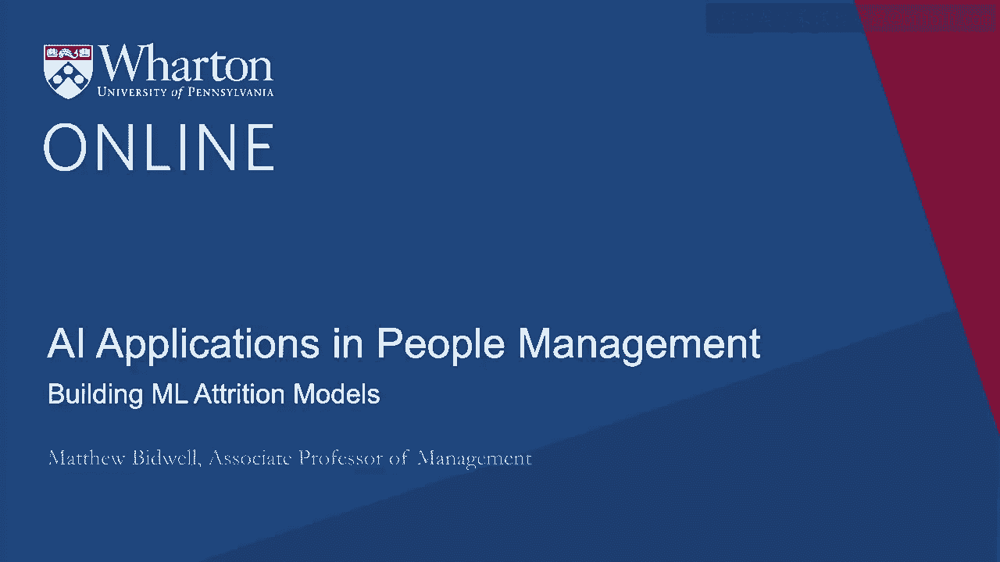
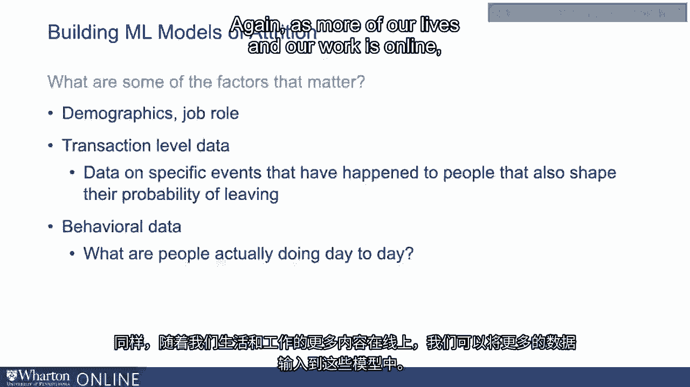
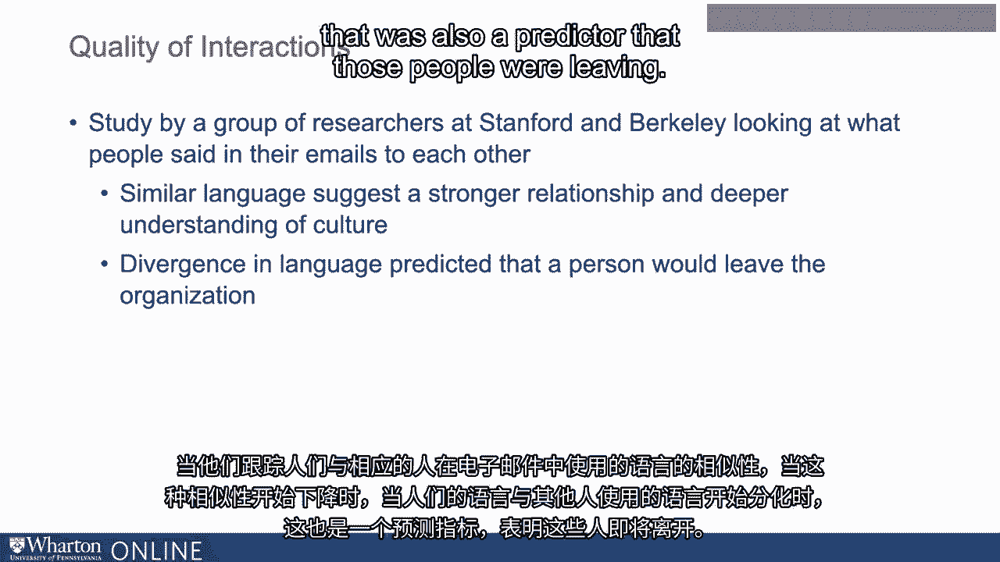

# P77：14_构建流失机器学习模型.zh_en - GPT中英字幕课程资源 - BV1Ju4y157dK

当我们观察这些机器学习模型时，很多聪明的东西其实并不是模型本身。

这是在弄清楚应该放入什么类型的数据。

我认为我们工作的方式，尤其是我们很多工作都在线进行的方式，正在发生变化。

因为现在有越来越多的数据可以用来帮助我们更好地估计谁将离开。

那么，有哪些重要因素呢？我们将尝试构建一个机器学习模型来预测谁会留下，谁会离开。

我们可能放入其中的一些信息是什么呢？显然，正如我所提到的。

有关人口统计的信息，包括人们所处的职位类型。

这对于理解谁可能离开、谁可能留下非常有用。

我认为另一个非常有用的东西是事务级数据。

他们尝试在特定事件上，这些事件发生在影响人们离开的概率上。

这种关于事件的交易数据之所以有用，是因为营业额实际上与变化有关。

所以如果你考虑为什么人们离开组织，从某种意义上说，答案是显而易见的。

我们通常选择离开，因为我们认为当前的工作比其他选择更糟糕。

男爵让我不得不搞清楚这份工作有多糟糕。

不过有趣的是，我们离开是因为这份工作比其他选择更糟。

但我们也接受了那份工作。所以我们之前接受那份工作的事实。

那时它一定比其他选择更好。因此我们想问自己，发生了什么变化？

有什么变化使得某个人现在觉得他们的工作比其他选择更糟糕呢？

但之前他们认为这样更好。并且我们可以利用大量人力资源数据来了解人们是如何被管理的，从而为我们提供洞察。

那么，什么可能发生了变化呢？可能导致人们更容易离开的一个因素是接收到一个信号。

他们发现自己在组织中的价值并没有他们想象中那么高。

因此，他们未来的前景并不是那么强劲。

那么，这些信号可能是什么样子的呢？它们可能在绩效评估中发生变化。

所以可能是我的表现，估值还不错。现在我的估值正在下降。

评估下降。人们意识到他们并不合适。他们更有可能离开。

如果我没有得到加薪，没有奖金，或者我的奖金和加薪都没有。

这对我来说又是一个相当糟糕的迹象。我在这个组织的表现比我预期的要差。

所以我可能应该考虑离开。因此，不获得加薪通常是人们被期望离开的一个警示信号。

另一个重要的事情是正在进行晋升。

人们外出寻求升职，但却未能如愿。他们更有可能选择离开。确实如此。

我们更广泛地发现，当人们申请组织内的其他职位时。

我常常认为，在很多组织中，你可以申请内部职位。

如果人们申请那些工作并被拒绝，他们更有可能离开。

这可能部分是明确的，因为这是一个拒绝。

有时这可能是因为他们正在申请组织内部的职位。

这是他们准备离开工作的好迹象，如果他们无法在组织内部转岗。

他们将搬到外面去。无论如何，如果我们能将这些信息融入我们的模型中。

无论他们是否申请其他工作，我们再次有更好的证据证明他们的跳槽风险。

另一个关于变更的信息可以预测员工流失。

是他们环境变化的原因。所以我们知道如果同事离开，人们更可能选择离开。

通常被描述为人员流动传染。与新同事一起工作的学习过程充满了各种挑战。

也许那些同事曾是朋友，如今上班的乐趣已不如从前。

也许当那些人离开时，这让他们有一种“嘿”的感觉。

在这个组织之外还有其他的可能性。“也许我应该在生活中做更多的事情。”

所以当我们看到他们的同事离开时，他们面临着很高的风险。毫无疑问，当他们的经理离开时。

特别是如果这是一个优秀的经理，他们的经理离开，这可能会造成很大的干扰。

可能导致人员流动。更一般地说，重组，其他事实的组织。

当员工面临多次重组时。

这也增加了他们离开的倾向。所以我们可以透过我们在HR系统中获取的所有数据进行深入分析。

看看所有这些变化，所有这些不同的标志。

开始为我们的流失模型获取输入，以帮助我们做出更好的预测。

关于人们可能离开的时间。我们可以使用第二组数据来理解。

人们是否会离开的行为数据。 他们日常究竟在做什么？再说一次。

随着我们生活和工作在线的越来越多。

我们可以将更多的数据放入这些模型中。所以很多人。

一旦他们开始考虑离开，他们就会更普遍地开始退缩，对吗？

他们的表现下降，因此生产力也会突然下降。

这可能暗示他们有逃跑的风险。更甚者。

我们可以利用关于人们如何与他人互动的信息。

了解他们是否可能留下来。

所以我们一般期望在组织中有更多联系的人。

或者花更多时间与他人互动。好吧。

他们将获得更多来自其他人的支持，这使得我们成为一个有吸引力的地方。

我们往往享受我们的关系，因此我们在组织中越是社会嵌入，就越会感到愉悦。

我们越可能留下来。因此，我们通常会发现，在研究中，当我们观察与组织的互动时。

那些与更多人有联系的人，通常与他们的沟通更多。

更有可能留在这里。那些人有点处于组织网络的边缘。

那些人更可能会离开。我们甚至看到联系的质量也很重要。

所以举个例子，留下来的不仅仅是那些拥有更多人脉的人。

但也与那些接触更多且地位较高的人建立了联系。

所以有很多有趣的证据表明，追踪人们所参与的沟通网络。

可以为我们提供更多信息，这些信息可以用于这类流失模型中。

了解谁可能留下，谁可能离开。

理解互动在谁留下来的角色甚至可以更进一步。

斯坦福大学和伯克利的一组研究人员进行了一项不错的研究。

研究了人们在电子邮件中彼此发送的信息。

所以他们的理论是，我们的语言与他人电子邮件的语言之间的相似程度。

是我们在多大程度上努力相互适应的一个良好指标。

更广泛地努力适应文化。

所以当人们使用相似的语言时，这表明他们确实在努力融入。

当人们不使用类似的语言时，这可能表明他们正在退缩。

他们找到了证据。因此，当他们追踪人们在电子邮件中使用的语言与他们对应的对象之间的相似性时。

当这种相似性开始降低时，人们逐渐偏离其他人使用的语言。

这也是一个预测那些人离开的因素。所以这很有趣。

不仅仅是观察人们与谁交谈，这是可能的。

但即使是观察他们使用的语言类型，也可能成为模型的一个输入，从而尝试构建一个更精确的模型。

理解谁留下，谁离开。我还没有完成。

我们可以关注其他方面。一些最有趣的内容来自社交媒体。

所以有一些初创公司，比如High Q Labs和Clara Analytics，已经尝试建立业务多年。

围绕着人们的社交媒体档案可以告诉你很多关于他们将要离开的地方，并为这些离职风险模型提供信息。

我实际上认为这些想法背后有很好的逻辑。

我之前提到的所有事情。

真正不同的指标显示了人们在工作中对组织的依附程度。

我们必须将这些视为推力因素，究竟有多少，你知道吗。

他们正被组织驱逐。我们也知道，当涉及到人员流动时。

吸引因素同样重要。所以你知道，我在其他地方找到好工作的可能性有多大？

你知道，那些工作无论我是否离开都很重要。你知道。

我们也知道，大多数人倾向于通过他们的社交网络找工作。

我们通过认识的人找到工作，而在线网络使这些搜索变得可见。

因此，通过观察人们的社交媒体活动。

我们可以真正追踪的一件事是，他们实际上有多少人在寻找新工作，以及他们是否在寻找新工作。

显然，他们更有可能离开。以一种非常粗略的方式，我们可以这样考虑。

如果人们在LinkedIn上更新他们的个人资料并试图与很多人建立联系。

这是一个很好的求职活动指标。

这确实表明，在我们的模型中，这个人的潜逃风险应该更高。

[空白音频]。

