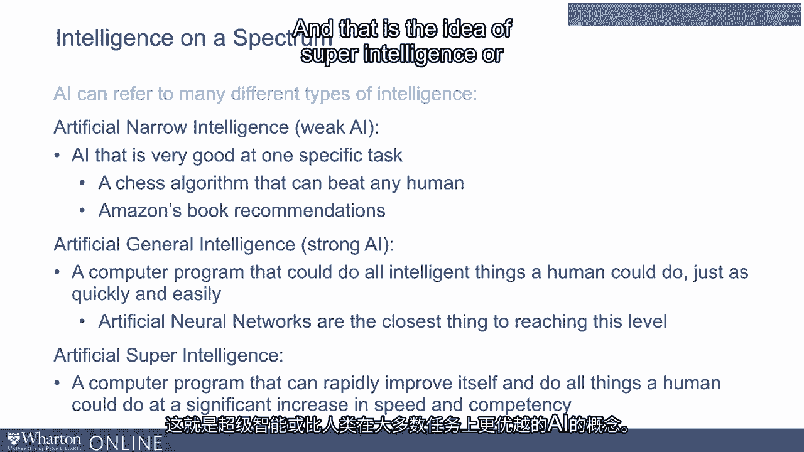
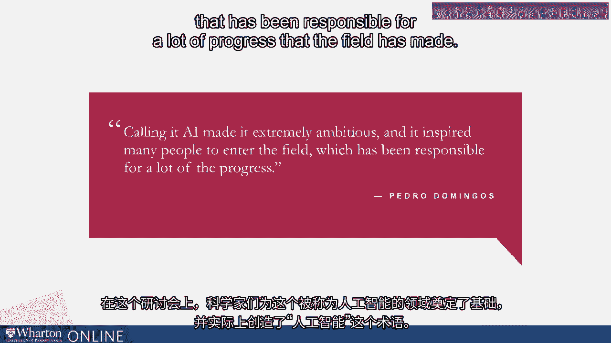
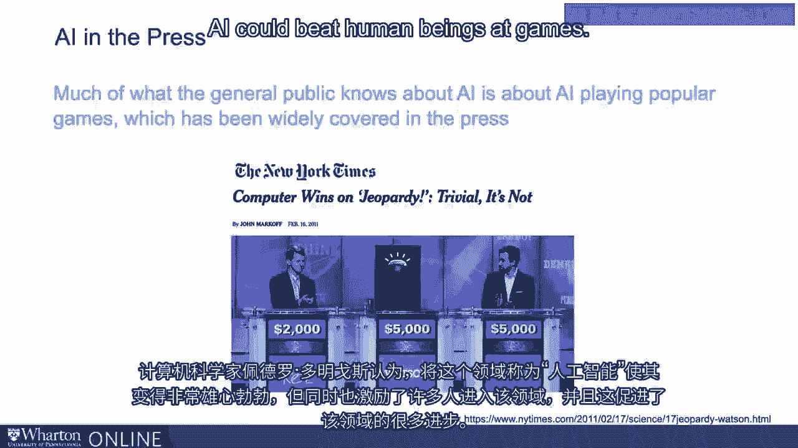
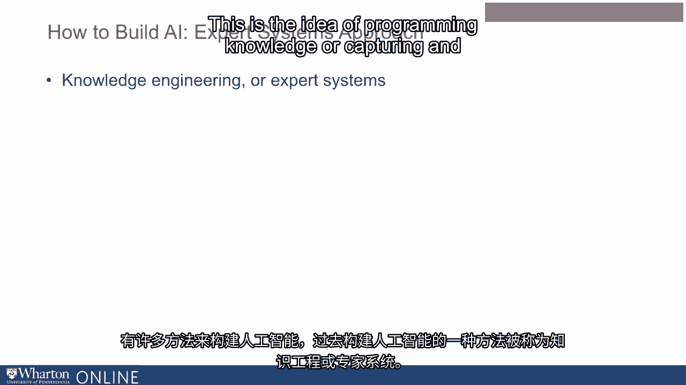
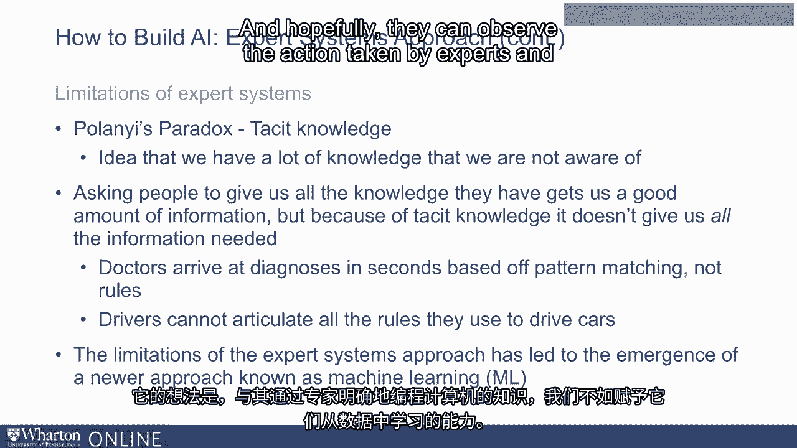

# P8：7_人工智能简介.zh_en - GPT中英字幕课程资源 - BV1Ju4y157dK

在本模块中，我们将讨论人工智能。

我们将开始对AI进行简要概述。接着深入到AI的一个子领域，即机器学习。

我们将从对机器学习的高层次概述开始，然后我们将。

深入一些具体的机器学习方法。这样。

让我们先谈谈什么是人工智能。

人工智能或AI是一个指代的术语。

开发能够执行通常需要人类智能的任务的计算机系统。

人类智能，例如理解语言、推理、语音识别、决策。

或者导航视觉世界、操控物理物体等等。

当我们谈论人工智能时，有许多种类的AI。例如。

可以考虑弱AI和强AI。弱AI，也称为人工狭窄智能。

是擅长非常特定任务的AI。例如。

你可能有一个下棋的AI，它可能会击败世界顶尖的棋士。

但它只擅长那一项任务。相同的AI可能无法与我们对话。

它可能无法识别图像等等。同样。

你可能会有一个擅长产品推荐的AI，但它并不擅长。

在国际象棋或图像识别方面。简而言之，这些是擅长单一狭窄任务的AI。

我们周围的大多数AI倾向于是弱AI，但该领域的目标最终是。

建立所谓的强AI或人工通用智能。

这是一个计算机程序，可以完成所有人类能做的智能工作。

因此，这种AI将真正具备智能，并且在许多方面接近人类。

任务范围。最后，你会有人工超智能的概念。

这是一个强AI系统。它在很多任务上和人类一样出色。

但它能够利用其计算资源存储更多数据。

更快地分析数据并做出决策，因此。

因此，可能在许多任务上击败人类。这就是超智能或在大多数任务上优于人类的AI的概念。

AI的历史非常短暂。这个领域的起源归功于数学家艾伦·图灵所写的一篇论文。

提出“机器能否思考？”这个问题的正是他，他认为可以构建模拟人类思维的机器。

非常接近。实际上，他提出了一个测试，被称为模仿游戏或更广为人知的名字。

作为图灵测试，用于机器智能。在测试中。

一名人类评审与两个计算机终端进行互动。

一个计算机终端由计算机控制，另一个终端由。

由人类进行交互。法官通过计算机终端与每一个参与者进行对话。

如果法官无法区分人类和计算机系统，那么。

这个计算机系统被认为通过了图灵测试。

现在，当阿兰·图灵提出图灵测试并提出问题，机器能思考吗？

这在该领域引发了很大的兴趣，并促成了其中一个首次研讨会的举办。

这是一个由数学家组织的关于人工智能的夏季研讨会。

John McCarthy参加了这个研讨会，还有其他几位领域的杰出人物。在这次研讨会上。

科学家们为一个后来被称为的领域奠定了基础。

人工智能，实际上也创造了“人工智能”这个术语。

科学家Pedro Domengo认为，将这一领域称为人工智能使其变得非常雄心勃勃。

这也激励了许多人进入这一领域，并对其负责。

该领域取得了许多进展。

现在，人工智能早期的关注点往往集中在人工智能是否能够击败人类。

人类在游戏中的表现。

例如，在1997年，IBM创建了一台名为Deep Blue的下棋计算机，最终击败了。

当时世界第一的棋手Gary Kasparov，以三分之二对两分之三获胜。

这个系统没有机器学习能力，意味着它不能自我学习。

它能够在没有被编程的情况下自行运作。相对于人类玩家，它的优势来自于其强大的计算能力。

它的分析能力每秒超过200,000个动作，能够找出最佳可能的移动。

在2011年，IBM创建了IBM Watson，它击败了Ken Jennings和Brad Rutter这两位选手。

这是有史以来最好的危机边缘的玩家。IBM的Watson内置了机器学习，能够理解语言的含义。

理解所提问的问题，并能够从中检索信息。

一个大型信息数据库，然后回答所提出的问题。

最近，谷歌创建了一款名为AlphaGo的软件来下围棋。

围棋是一种策略游戏，类似于国际象棋，但比国际象棋复杂得多，这意味着。

单靠强大的计算能力是不足以击败人类的。

你需要的不仅仅是强大的计算能力，还需要学习的能力。

这是一种更好的智力标准。谷歌在创建AlphaGo时使用了一些最新的机器学习技术，AlphaGo。

在与人类对战中取得了巨大的成功，实际上击败了世界围棋冠军。

有许多方法可以构建人工智能。

建造人工智能的旧方法是一种被称为知识工程的方式，也被称为。

被称为专家系统。这是编程知识或捕获并转移知识的理念。

计算机系统。例如，如果我们想构建一个用于诊断疾病的软件，我们可能会采访医生。

并整理他们用来诊断疾病的规则。

例如，医生可能会告诉我们，如果一个人或患者发烧超过。

一周内如果他们有身体疼痛和寒战，他们可能会开始考虑抗生素治疗。

现在这是他们可能给我们的一个规则，我们可能会编程许多这样的规则来诊断。

疾病。同样，如果我们想开车，我们可能会采访成千上万的司机，问他们。

他们用来驾驶汽车的规则是什么，他们可能会给我们一些规则，比如什么时候。

当前面的车减速时，我们可能会踩刹车，自己减速。

如果我们前面的车开得很慢，我们可能会换车道，等等。

现在，最终我们可以利用这些技术创建相当智能的系统，并且。

事实上，我们发现随着时间的推移，专家系统表现得相当不错。

但随着时间的推移，我们也观察到专家系统往往无法打败人类。

在需要智力的复杂任务上。例如，一个用于诊断疾病的系统可以表现得相当不错，但它往往无法。

在诊断疾病方面打败医生也是如此。

这是由于一个被称为波兰悖论的限制。

波兰是一个数学家，他提出了隐性知识的概念。

我们有很多我们未意识到的知识。

例如，当你问一个人他们用什么规则驾驶车辆时，他们。

他们可能能想到一些规则，这些规则是。

有用，但同时它们并不足够，因为我们都有很多知识。

我们在驾驶时隐含应用的知识，但我们对某些知识并不自觉。

我们在驾驶时应用的这些原则。因此，要求人们提供他们所有知识的结果是。

信息量很大，但由于隐性知识，它并没有给我们所有的信息。

这就是为什么用于诊断疾病的专家系统往往无法超越现实世界的专家。

这就是为什么使用知识工程或通过专家创建的无人驾驶汽车。

系统的方法最终无法像人类一样驾驶。

这导致了一种被称为机器学习的替代方法的出现。

这就是不再显式地用专家的知识编程计算机的理念。

我们可以给他们从数据中学习的能力，希望他们能观察到。

专家的行动并在一段时间内模仿该行动。

而这就是我们将在下一次讲座中讨论的内容。[BLANK_AUDIO]

