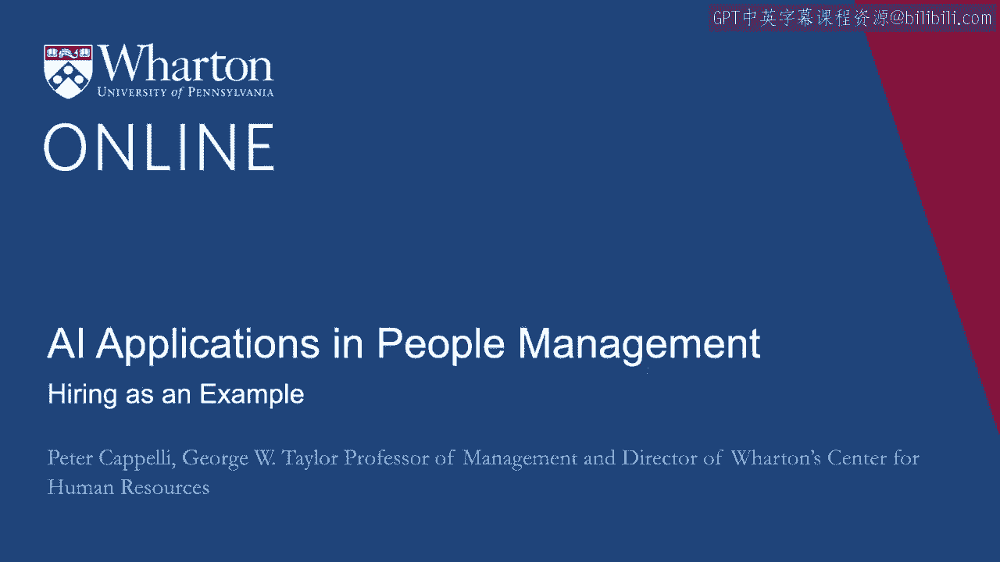
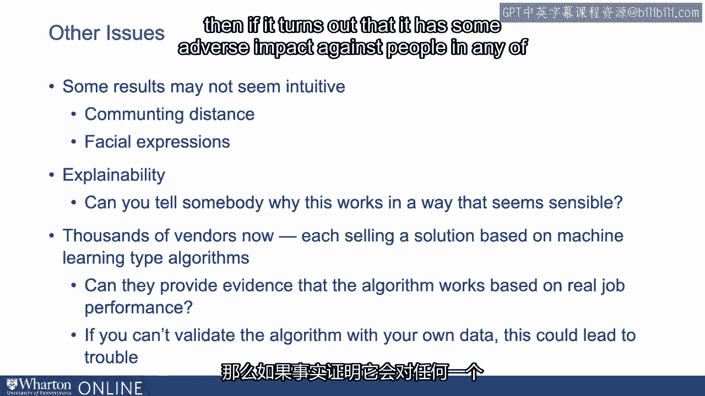

# P81：18_招聘作为一个例子.zh_en - GPT中英字幕课程资源 - BV1Ju4y157dK

在这个部分，我们将说明一些关于数据科学的问题。

在一个非常实际、非常重要的问题背景下应用于管理人员问题。那是招聘的成本。因此，马修稍微谈了一下管理人员决策的总体背景。在数据科学出现之前，这些决策和行动已经做出。我们现在将深入探讨招聘。在招聘方面，因为这是目前为止。

至少目前，最重要的人力管理问题。这是花费最多的方面。仅更换一个人的行政成本就很高。即使是最低级别的员工，成本也约为4000美元。当你开始考虑人员流动的成本时，往上看。听到大约两年薪水的估计成本并不罕见。需要引入新人的情况。如果你犯了错误，那个人辞职，就是一次糟糕的招聘。这真的很贵。这个行业大约是2000亿美元，帮助公司填补职位。这是一个非常庞大的生意。它应该如何运作？好吧。提醒一下，你们大多数人可能经历过这一切。

如果你查看关于招聘如何运作的教科书，他们会说，你从职位描述开始。这将是所需的。我们在寻找什么样的人。然后你在某个地方发布广告，等待人们申请。一旦你收到申请。然后你试图将他们缩减到一个短名单。短名单，你需要更昂贵的筛选。

基本上，也许你会面试这些人并给他们测试。然后在最后。你做出招聘决策。现实情况看起来完全不是这样。去年的普查报告显示，大多数人并未在寻找工作。改变雇主的人并不在寻找工作。他们并不主动找工作。有人来找他们或诱使他们转移。创建短名单的过程。现在这一切都是通过申请者跟踪软件完成的。人们甚至不再接触简历。这是基于关键词的自动化。这不是人工智能。甚至不是数据科学。只是关键词跟踪。

它只是查看你的简历中是否在某些情况下使用了魔法词。因为这很复杂，很多公司将其外包。可能在美国雇佣人数最多的公司是你可能不知道的公司。我听说过一个叫PeopleScout的公司。他们是一家招聘流程外包公司。

他们为其他公司招聘。每年招募30万人。放在大背景下看。美国军队每年大约招募120,000名新兵。PeopleScout每年招募30万。这是一个规模庞大的大操作。我们看看目前是如何运作的。对于被动候选人有一个很大的推动。这意味着看看我们能否找到没有申请的人并把他们带来。

将他们纳入我们的系统。大多数雇主的目标似乎是让更多更多的人申请。他们的职位。大多数组织的思考方式，顺便说一下。我认为这是一个错误。我稍后会提到这一点，把它当作一个漏斗来考虑。我们试图让很多很多人申请在最顶部。

然后我们会用申请追踪系统筛选他们。从那里开始。我们会尝试使用其他筛选来将他们拉到漏斗底部。如果100人在我们漏斗的最顶部申请，多少人。这些人会获得工作机会吗？好吧，证据似乎表明约为2%。当你把申请投到电子招聘模型中时，获得工作机会的几率。去公司申请，或者你去像Indeed这样的招聘网站申请。你获得工作机会的概率大约为2%。原因是申请工作的人太多。概率很低，我们有的人申请20个工作，30个工作，100个工作。

我们让人们申请变得简单，所以他们就是这样做的。这就是现实，接下来是一个非常奇怪的发现。当公司查看他们的招聘情况时，无论是好还是坏，这是。他们追踪什么。我们填补一个职位需要多长时间？

我们填补一个职位花费多少？他们没有追踪。所以可能只有四分之一的人尝试看看我们是否进行了良好的招聘。想一想。我们在测量成本和速度。而不是我们是否做得好。如果你考虑审查，比如说。用这种方式评判餐厅，评判餐厅的标准是快速和便宜。米其林星级指南的样子真的会不同。如果你只关心快速和便宜。当我们开始谈论招聘时，有一件事情需要认识到，首先，事情的方式。现在的情况看起来与教科书不同，第二，对于大多数雇主，我们没有。

我们是否做得好并没有明确的想法。比我们现在的做法更好并不难。让我们谈谈如何做得更好，以及我们如何将数据科学应用于招聘决策。两个问题，第一个问题是申请者，很多数据科学的精力都投入到。尝试寻找那些被动申请者，可能看起来像那些即将。

要求是好的。然后第二个更受关注的是，我们看看申请者，看看是否能。选择哪些人是我们应该提供工作的对象。我们如何开始？用数据科学。你开始的方式与数据科学出现之前是一样的。我们现在试图弄清楚什么是好的招聘，而不是像以前那样说。

让我们看看这个工作的要求，然后我们就。我们将建立一个申请人跟踪筛选系统或类似的东西。我们说。“告诉我谁是你最好的员工。”我们首先要弄清楚谁好谁坏。我们要怎么做？我们在这里也有这个数据问题。也许没有一个好的单一指标，但我们将采取一个指标，也许是。绩效评估。我们使用那个。一旦我们定义了什么是好的，我们将尝试识别什么。我们对那些人有了解。他们上过哪所学校？他们接受过什么样的培训？

如果他们有测试分数，那些测试分数是什么样的？

我们之前的方法是依赖于心理学家主要说的指标，“我们看过。这些确实可以预测。“通过数据科学，我们并不关心。告诉我们你知道的一切，因为我们不必一次查看一个。这些属性是特征。我们将把它们全部放在一起，构建一个模型。

一旦我们识别出我们最优秀员工的所有信息，我们就会说：“好的。”

现在让我们看看你是否能告诉我关于你不优秀员工的信息，因为我们。需要变化。“就像我们在寻找轴承一样。我们希望看到那些失败的情况，但也想看到那些没有失败的情况，以便弄清楚它们失败时的原因。我们在这里试图弄清楚什么与优秀员工相关，同时也弄清楚什么。

与不优秀员工相关。数据科学的不同之处在于我们并不关心这些指标是什么样子的。它可能是，“只告诉我你知道的关于这个人的所有信息，因为我们完全。对于解释将由什么驱动保持中立。“正如你所知。使用机器学习模型和它生成的算法，它是。

这是一个关于那个人各种属性的真正复杂的非线性组合。到最后，这将为我们产生一个单一的评分。我们做的第一件事是查看我们的劳动力和我们拥有的数据。我们将其对半分。我们有机器学习软件将学习的训练数据。也就是说，它将构建一个模型，以预测我们正在使用的绩效评分。识别优秀与不优秀的员工。我们将使用第二组数据。后半部分用于测试它，看它表现得如何。假设它表现得相当不错。然后我们要做的是我们将尝试。

去找申请者，获取他们在我们所包含的所有属性上的指标。我们自己员工的模型，他们上过哪所学校，表现如何，在哪里工作。在此之前，他们住在哪里。任何我们认为可能相关的信息，我们在训练数据的第一个模型中使用过。为了构建算法，我们必须对申请者提出同样的问题，并获取所有。

那些相同的数据。当我们这样做时，在流程结束时。我们得到的是每个候选人的分数。分数将反映他们与我们表现最佳员工的匹配程度。

你将获得一个单一的分数。在此之前，在过去。你可能会给人们性格测试，智商测试或灵巧测试。三个不同的测试，三个不同的衡量标准。它们进行面试，你得到面试分数。也许关于他们的推荐信有些事情，你为这些得到分数，总共得到五个分数。

然后你把它交给一些招聘人员，或一些专家，希望他们能跨越这五项进行决策。我们转向机器学习和算法时，你得到一个数字。那个数字就是分数，这就是你得到的。我们对这个模型了解多少？

这很可能在预测方面远超你之前所做的任何事情，因为。它只有一个目标，那就是预测某人将如何表现。表现良好的人或以前的表现。它不必是心理学家、经济学家或其他人所说的。过去的表现预测未来。我们关心的只是关联。我们为申请者测量和捕获的这些属性呢？这些测量。它们与优秀表现者相关吗？如果相关，你将获得良好的分数。我们还需要什么？我们需要大量数据。我们需要成千上万的申请者来构建机器学习模型。除非你是大雇主，否则这将很棘手。

这将支持使用可能拥有大量资源的供应商的论点。在许多不同公司的众多申请者中，但那里存在一些问题。有一些法律问题，我们稍后会再回到这个话题。让我们谈谈偏见的问题。在机器学习招聘的讨论中，偏见引起了广泛关注。关于机器学习生成的算法，这里有个好消息。好消息是他们对每个候选人都一视同仁。例如。如果我们考虑大学学位应该有多重要，那就是。我们告诉他们的只是大学学位，它将对所有大学学位一视同仁。

它不会对男性和女性的大学学位区别对待。招聘人员。当他们在查看这些内容时，脑中充满了偏见，他们的判断。也会充满偏见。当你使用一个算法时。你不会遭遇任何偏见。每个人都被一致对待。坏消息是，如果构建算法的训练数据存在偏见，那就会有。算法本身将存在偏见。它会重复出现。一个引起广泛关注的例子是，亚马逊构建了一个算法来。为它进行招聘。这个动机是完全合理的。

让我们看看能否在招聘方面做得更好，同时也降低成本。因为如果我们获得一个好的算法。我们不需要招聘人员，不必烦恼这个面试。这可能更便宜。更快，顺便说一下，也许表现更好。当亚马逊开始使用其算法时，他们发现。分数显示女性的分数低于相同条件下的男性。

这成了一个难题。他们回去后去掉了可能识别性别的任何信息。或者申请者的性别。例如，去掉了名字。确保没有任何带有女性或男性色彩的东西。代词并去掉了所有相关信息。他们发现结果并没有太大变化。原因是训练数据基于亚马逊之前的员工。当前的数据也是如此，男性的平均分高于女性。这部分可能是因为数据中男性的比例过高。但毫无疑问，在晋升率和整体表现分数上存在偏见。

亚马逊算法正在寻找任何可能显示出。与性别的关系。例如，如果你上过女性研究课程。它假设这与女性高度相关，女性表现更差。如果算法比没有使用时表现更差，你将获得更低的分数。我们永远不会知道。差异在于你使用了这个算法并将其应用于所有人。你可以立刻看到偏见，因为你可以查看这些分数，看看男性的情况。查看女性的情况，看看她们在同一职位上的表现有什么不同。同样的教育水平，其他法律和法庭可能关心的因素。

你会看到是否存在差异。特别是如果你担心被起诉。使用这些算法的问题在于，它们可能比你之前的方法更好。它们可能比你之前的做法更少偏见。但你可以轻易看到偏见，这就是问题所在。其他问题包括。如果算法足够好，你可以摆脱这些申请者跟踪系统。你不必烦恼根据这个或那个标准筛选人选。把所有结果交给我们，我们会快速轻松地打分。给他们一个分数。你可能会发现，研究表明一些人最终是。

与工作真正契合的人并不具备你之前认为重要的属性。我们在哥伦比亚的同事Bo Kogel对这个用于。招聘，他发现算法能够识别。在假设需要大学学位的职位上表现优秀的人。一些获得高分的人声称他们在这方面会表现出色。工作不再要求有大学学位。问题是如果你只招聘有大学学位的人，你将永远不会。你要知道这一点。为了真正利用这些算法，你需要用不。一开始就是在筛选人。未来为了确保算法的持续有效，例如如果人口。

如果工作发生变化，或者你不得不进行一些随机的招聘，这并不是一开始就有的。筛选掉那些说必须具备这一、这一或这一的工作要求的人。顺便说一下，这在招聘中一般都是真实的，但在算法下变得更加。更明显的是，如果你在筛选人，你永远不会知道你是否还需要。

这些屏幕，如果它们仍然合理。算法的另一个问题是你可能会得到一些看起来并不特别的结果。直观的。例如，多年前我们与一家有业务往来的公司发现。在他们的申请中，人们居住的邮政编码是一个相当不错的预测指标。呼叫中心工作流失率的问题。那里的情况实际上是工作地点距离的一个衡量，而这些是。

工资不高的工作。通勤距离越远，缺勤的可能性就越大。因此你最终离职或辞职的可能性更大。那是因为低薪工作需要可靠的交通工具，公共交通。并不总是那么好。一辆真正可靠的车可能需要比很多人拥有的更多的钱。所以之前没有人考虑过通勤距离，而这些人发现了这一点。但随后你会看到其他供应商和其他人也在做类似的声明。一个著名的例子是一个公司声称面部表情可以预测。你的工作表现。他们是怎么做到的呢？

他们试图将你的面部表情与他们最佳员工的面部表情进行匹配。公司里的员工，然后根据你的面部表情与申请者的相似程度给申请者打分。映射到你最佳表现者的面部表情。那么你对此感觉如何？

假设它实际上做出了预测，你觉得这样可以吗？

基于申请者面部表情的招聘模型，你觉得这样可以吗？

还是不？更仔细地看一下，这在数据科学界被称为可解释性。你可能已经听说过这个。可解释性意味着你能否告诉某人为什么这在某种意义上有效。比如，如果你不得不在法官面前出庭，而你的面部表情。该测量对非裔美国人给出的分数更低，因为用相机读取面部表情。

在那种情况下可能会更难做到。假设发生了这种情况，你需要向法官解释你是如何招聘的，你说。基于面部表情。你觉得这样做会舒服吗？

好吧，当你查看那些数据时，并不明确它是否真的进行了预测。结果并不明确是否真的能预测，但你可能会得到。有些证据表明，至少在最初，它是有效的。其中一个问题是现在有成千上万的供应商。每个卖方都基于机器学习类型的算法提供招聘解决方案。在与供应商打交道时，你要非常小心。无论他们的主张是什么，问他们能否向我展示基于真实数据的证据。工作表现。我理解你是如何构建算法的，但当你测试并招聘后。

基于这些数据选择的人，实际上这些人表现得好吗？

记住这一点，假如你真的想为自己辩护。特别是在对抗诉讼时，你的标准对某些群体有不利影响。女性或少数群体或几乎任何其他受保护的群体，包括每个人。你能用自己的数据做到吗？如果你无法用自己的数据证明这个算法真的有效，那么如果。

结果表明，这对任何这些类别的人都有一些不利影响。

基本上，大家都面临麻烦。如果供应商告诉你它的预测是有效的，那很好，但这没有帮助。你需要证明你自己的招聘实践是好的。所以，你必须考虑的一件事是，你不能仅仅把这些东西从货架上买回来。即使供应商能够说服你他们的数据看起来很好，但他们的证据显示它有效。

你必须能够在自己的数据上测试它，并做到这一点。所以，当我们开始考虑将其应用于招聘时，这里是一个复杂的问题集合。这正是目前大多数活动发生的地方。[BLANK_AUDIO]。

