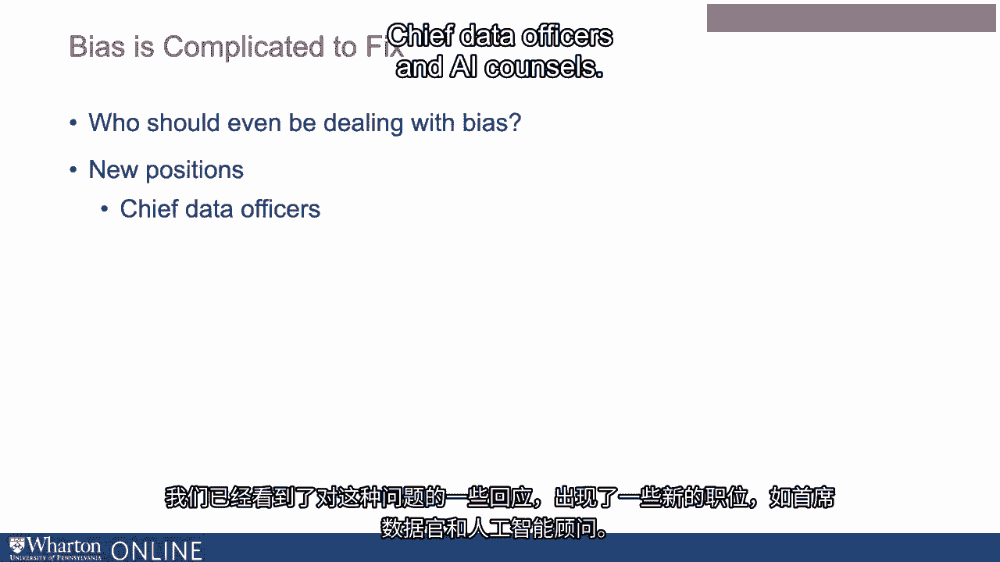

# P89：26_偏见很难修复.zh_en - GPT中英字幕课程资源 - BV1Ju4y157dK

我们讨论了偏见管理的挑战性。

修复这一问题可能相当复杂，原因多种多样。所以即使我们知道想要修复机器学习系统中的偏见。修复这种偏见相关问题可能很复杂。这有许多原因。第一是存在权衡。所以当我们考虑解决偏见时，往往会付出其他成本。影响我们关心的其他绩效指标，如准确性。所以在贷款等各种上下文中，比如给人们贷款，或者医疗保健。因此，满足某些群体对公平性的认知。

通常可能需要为其他群体牺牲一些利益。

我们在许多机器学习的不同应用中看到了这一点。许多人研究过这类权衡。当然。理想情况是尽可能地最小化这种权衡。因此我们可以实现构建既公平又准确的系统的双重目标。这通常是个难事。这是人们经常遇到的一种工程权衡。在考虑如何消除系统中的偏见时。另一个出现的问题是获取更好的训练数据很困难。所以我们之前谈到偏见往往会出现在系统中。

因为训练数据本身就有偏见。嗯。有时候获得更好的训练数据并不是那么容易。我们谈到了数据充分性偏差，意味着你实际上没有足够的数据。有时候某些人口统计群体的训练数据不足。解决这一问题有时并不容易。如果你在谈论某些特定类型的数据。以更好或更具代表性的方式填充数据库并不是那么容易。你可能服务的不同群体之间。某些组织中会出现实际问题。这就涉及到谁应该处理偏见问题。

我们之前谈到了这一点，需要对组织有一个整体的看法。需要做出决策，基本上要考虑多个组织优先事项。因此我们考虑这些决定时会涉及深刻的、哲学性的权衡，道德权衡。基于价值的权衡。甚至不清楚在组织中谁应该负责做出这些决定。

而这本身可能在思考偏见时成为瓶颈或障碍。这对开发人员来说是个需要处理的问题吗？

这对高级管理层来说是个需要处理的问题吗？

其实应该由谁来考虑处理与偏见相关的问题？

我们看到了针对这一类型问题的多个回应。一些新职位，如首席数据官和人工智能委员会。

这些基本上是被明确委托的职位群体。考虑数据的任务，它在组织中的角色以及带来的问题。但关于谁应该处理偏见的更大问题往往难以回答。这通常成为思考我们应该从哪里以及如何开始处理的主要障碍。在一个组织系统中存在偏见。[沉默]。

