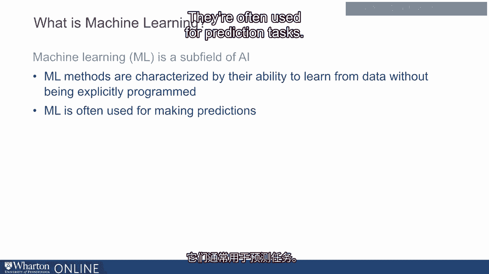
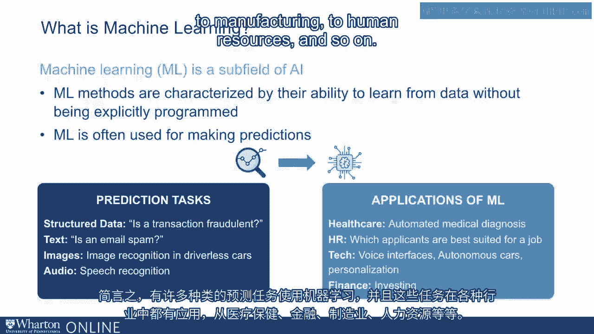
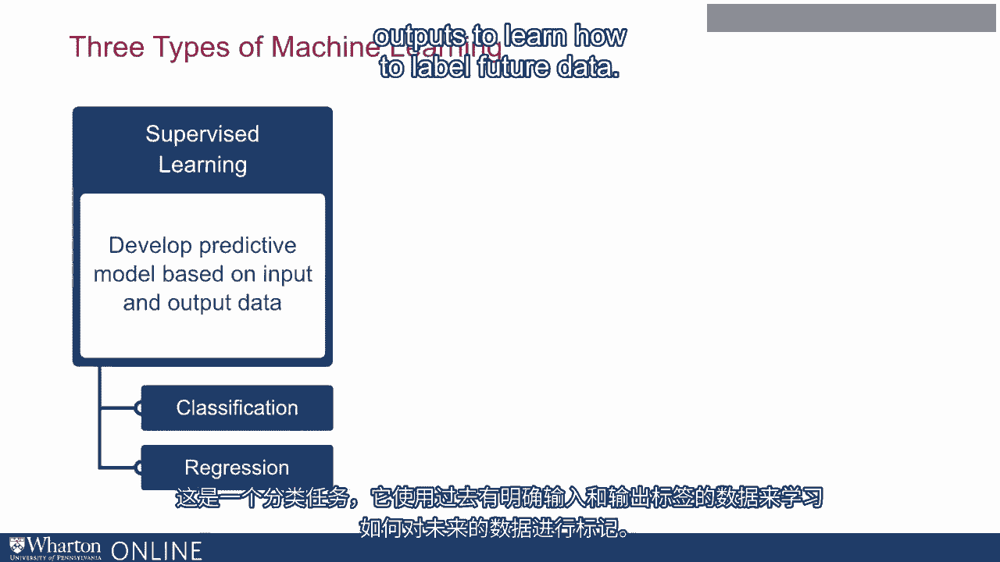
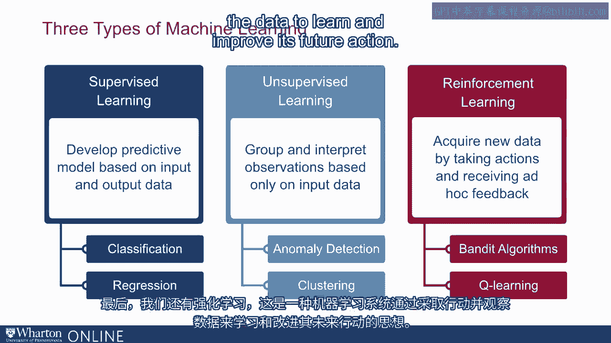
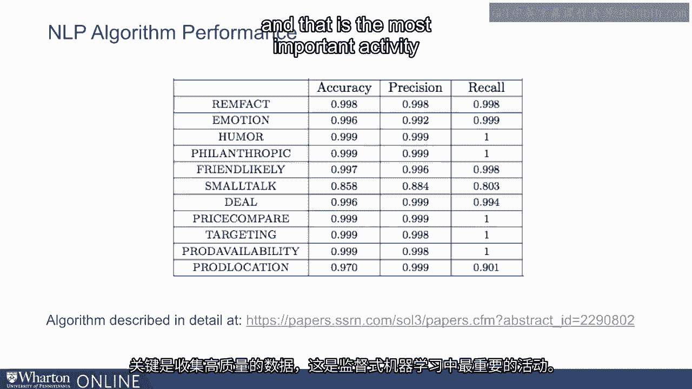
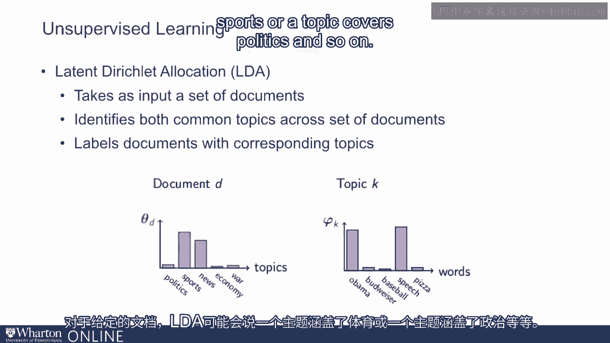
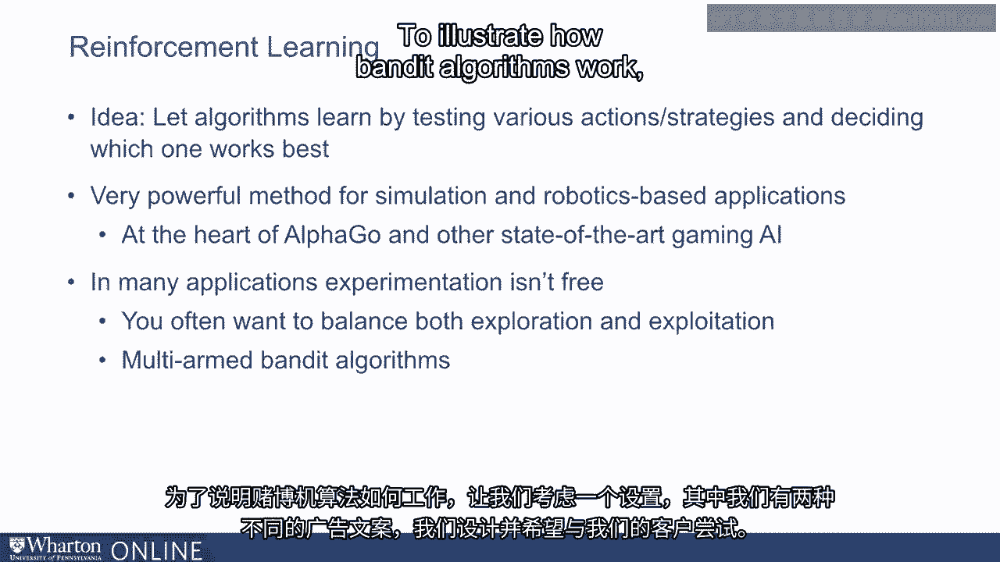
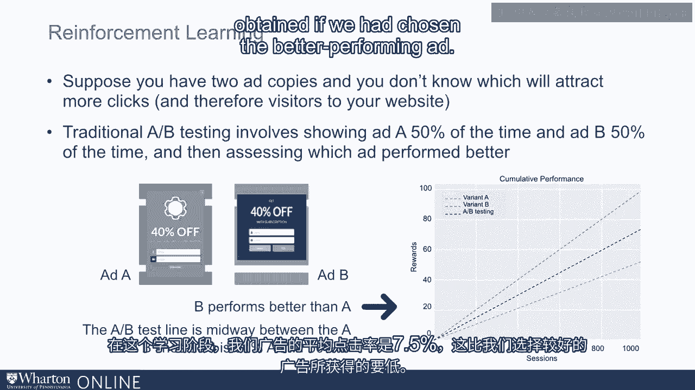

# P9：8_机器学习概述.zh_en - GPT中英字幕课程资源 - BV1Ju4y157dK

你好，再次见面。在这节课中，我们将讨论机器学习及其不同类型的。

机器学习。正如我提到的，机器学习是人工智能的一个子领域。

它主要关注如何让计算机从数据中学习，而不需要。

明确编程它们。而且它们通常用于预测任务。例如，我们。

可能会有关于过去信用卡交易的数据。我们可能对预测是否感兴趣。

一笔新交易是否是欺诈性的。因此，我们可能会查看过去的数据以做出。

这个决策。或者我们可能对判断一封电子邮件是否是垃圾邮件感兴趣。

基于过去的数据。我们可能会关注对无司机驾驶的图像进行分析的任务。

汽车和判断汽车前面的物体是另一辆车还是一个人。

或树或者其他东西。我们可能对识别语音和理解语音感兴趣。

比如Alexa或Siri。简而言之，有许多使用机器学习的预测任务。

学习。这些技术在从医疗保健到各种行业中都有应用。

从金融到制造业，再到人力资源等。现在，理解这一点很重要。

机器学习并不是单一的技术。实际上有一大堆技术。

所有这些都属于机器学习的范畴。实际上，有很多种类型。

机器学习的一个方面。例如，考虑机器学习的一种方式是从。

监督技术、无监督技术和强化学习技术。监督。

机器学习的概念是基于过去的数据构建一个预测模型。这些数据有。

明确标记的输入和输出数据。例如，我们可能有关于电子邮件的数据。

过去和清晰的标签，标识哪些过去的电子邮件是垃圾邮件，哪些不是。

一些不是的。因此我们可能想从中学习。所以这是一个分类任务。

使用带有清晰输入和输出标签的过去数据来学习如何标记未来的数据。

数据。与之相对的是无监督技术有很多输入数据，但没有清晰的。

输出上的标签。因此，这些技术是在输入数据中寻找模式。例如。

你可能会有异常检测，这个概念是找到某些数据点。

看起来像异常值，换句话说，它们与其他所有数据看起来不同。

同样，我们之前谈到的聚类是将数据分组的概念。

将一组数据点分成不同的组，使得同一组内的数据点尽可能相似。

彼此之间的数据点在不同组中是如何相互不同的。因此。

这是基于数据，但我们没有明确标记的输出来指导我们如何最佳。

实际上将数据分成不同的聚类。最后，我们有强化学习。

学习，这个想法是让机器学习系统通过获取新数据来获得。

行动和观察数据以学习并改善其未来行动。我们将会看。

更详细地看每一种技术。让我们从监督学习开始。正如我提到的。

监督学习的理念是从数据中学习，其中你有明确标记的输出。

并标记输入。这些输入可以称为特征或协变量，输出则是。

通常被称为模型的目标。这是我们试图预测的内容。例如。

正如我提到的，我们有邮件数据，而我们试图预测的输出是是否。

一封邮件是垃圾邮件还是不是。输入或协变量的特征是实际的。

邮件中的文本。通过监督学习，想法是我们有明确标记的通过。

数据，这些数据有正确的答案，意味着某些数据已被标记为垃圾邮件。

某些其他数据已被标记为不是垃圾邮件。现在我们需要学习如何。

对未来的电子邮件进行分类。同样，你可能希望根据预测下周的销售。

历史数据。我们可能会使用关于季节、年份月份、天气的数据等。

其他模式来预测未来销售。我们的训练数据实际上是过去的数据，这些数据。

所有这些模式，月份、季节、天气，以及过去实现的实际销售。

现在我们正试图根据这些数据进行未来的预测。我们来看另一个例子。

监督学习的案例。在最近的一项研究中。

我同事和我对分析一些公司在Facebook上发布的社交媒体帖子感兴趣。

因此，我们收集了超过100,000条由大型品牌在Facebook上提交的帖子的数据。

我们想要识别与最高参与度相关的帖子类型。

那是我们情感帖子与更大关联。

参与度或幽默帖子，或向消费者展示交易和促销的帖子或其他类型。

帖子的内容。现在，标记100,000条帖子并标记每条帖子是否幽默是非常昂贵的。

情感或不情感，或是否提供价格折扣，等等。因此，我们希望自动化这一过程。

过程。因此，我们使用监督机器学习技术来做到这一点。为此，我们首先需要。

数据，一个有明确标记的输入和输出的训练数据集。

输入对我们是可用的。这些是公司在其帖子中使用的词。

输出本质上是一个标签，用来说明帖子是情感性的、幽默的还是其他。

为此，我们抽取了5,000个帖子样本，并让人类对这些帖子进行标记。

这5,000个帖子中的每一个都由一位。

被人类标记为幽默、情感性的，或者提供价格折扣的帖子。

分享了一个显著的事实等等。这些标签随后被用作训练数据集。

学习了哪些词汇能够预测帖子是。

帖子是情感性的或幽默的，然后该算法用于进行预测。

其余的近100,000个帖子没有被人工标记。这本质上是。

监督机器学习的理念，即你需要一个训练数据集，并从中学习。

然后将其应用于未来的数据。在我们的研究中发现，我们的机器学习。

算法表现良好，准确率通常超过90%，95%，有时甚至超过99%。

在能够预测帖子是幽默的或不是幽默的方面的准确率是百分之。

是情感性的或非情感性的。在任何商业应用中，如果你有高质量的训练数据集。

可以应用这些技术来预测未来。关键在于数据的收集。

高质量数据。这是监督机器学习中最重要的活动。

有。

一些非常优秀的现成算法可以应用于预测。

如果你有高质量的机器学习训练数据集。下一组机器学习。

这些技术是无监督学习技术。无监督学习技术也会接收数据。

但它们没有明确标记的输出。例如，我们使用的聚类算法。

如前所述，它们倾向于将我们的数据聚类到不同的组中，但没有被告知。

事先对理想聚类的理解，即它们没有标记的输出。

类似地，另一个例子是异常检测。异常检测算法查看一系列。

数据并识别出与其他数据看起来不同的数据点。在这里再次，有一个。

有大量输入数据，但没有明确标记的输出。

另一个例子是潜在的狄利克雷分配（LDA）。

这是一个常用的主题建模技术，意指识别出哪些类型的。

某个文档可能涵盖的主题。通常，对于LDA，你会有一个输入数据集。

由大量文档组成。LDA背后的想法是每个文档可能涵盖。

一小组主题，每个主题往往会频繁使用相同的词汇。

例如，我们可能会拿一个大型数据集，包含所有主要发布的新故事。

报纸和在线新闻媒体，并将其作为输入提供给LDA算法。

LDA试图识别这些文档所涵盖的主题，但并没有被给定。

清晰标记的输出，意味着算法并未被告知这是关于政治的文档。

这是关于体育的文档，等等。正如我所说，LDA假设每个文档涵盖非常少的。

每个主题都有几个频繁使用的词。当它接受一个训练。

数据集或输入数据集时，LDA可能会识别出某个主题倾向于使用特定的。

词频繁出现。例如，它可能会说这是一个倾向于使用该词的主题。

奥巴马、特朗普、演讲等词频繁出现，但它并不会。

不会像比萨或棒球那样频繁使用这些词。这显然，我们可以推断出这是主题。

政治的主题，而这是算法自己识别出的内容。现在，给定任何文档。

LDA查看文档中使用的词的种类，并识别出哪些主题。

它所涵盖的主题。因此，给定一个文档，LDA可能会说某个主题涵盖体育或某个主题涵盖政治。

等等。一旦LDA使用大型数据集进行训练。

它现在可以应用于任何新文档。

它可以自动对这些文档进行分类，并识别出其中的主题。

在这个例子中，你可以看到一个LDA可能分析的段落，它查看文档中使用的某些词。

通过这些词，它识别出这些词相关的特定主题。

例如，艺术、教育或儿童，然后识别出该文档所涉及的一组主题。

现在除了无监督学习，我们还有强化学习的概念。

强化学习通常不需要大型训练数据集。相反。

算法通过测试或尝试各种行为或策略，并观察发生了什么来学习。

利用这些观察来学习一些东西。这是一种非常强大的方法，已经被广泛使用。

在多种基于机器人应用中也有应用。它也是由某家公司创建的软件的核心。

Google开发的一个称为Alpha Zero的围棋软件的高级版本。

Alpha Go。Alpha Go使用的训练数据集基于过去的围棋比赛，而Alpha Zero没有。

训练数据集。相反，它是通过与自己对弈学习围棋的，一旦它进行了。

数百万局自我对弈，这实际上是它用来发展的训练数据集。

这个游戏的最佳策略。当然，在许多场景中，实验并不总是免费的。

因此，你必须平衡实验的成本与利用我们已有知识之间的关系。

让我们通过一个称为多臂强盗的强化学习算法来探讨这一点。

为了说明强盗算法的工作原理，我们考虑一个有两个不同选择的场景。

我们设计的广告文案，我们希望尝试与客户互动。我们不知道。

哪种广告文案在吸引客户并促使他们点击广告方面更有效。

我们希望理想情况下找出哪则广告更好用。一种找出这个的方式。

进行所谓的A/B测试。也就是说，我们可能将广告A展示给一半用户，将广告B展示给另一半用户。

用户，并且我们可能会这样做一段时间，比如一天。

然后我们观察哪则广告的点击率更高，我们可能会在那之后使用该广告。

在你看到的这个图表中，我们有两个广告，广告A和广告B。

广告A的点击率为5%，而广告B的点击率为。

点击率为10%，但我们事先并不知道。因此我们可能最终会将广告A展示给一些。

用户并将广告B展示给一些用户。如果我们以随机方式向大量用户展示这些广告。

用户数量，随着时间推移，我们了解到广告A的点击率为5%。

广告B的点击率为10%，因此我们可以从那时起使用广告B。

但这种学习是有代价的，因为在这个学习阶段，一些人看到了广告A，而一些人看到了广告B。

我们的广告经历的平均点击率是7.5%，这低于我们希望的。

如果我们选择了表现更好的广告，我们所获得的。

现在一种带宽算法可以做得更好。

可以提高性能。它的做法是，它一开始就像任何A/B测试一样。

算法意味着它以相等的次数展示广告A和广告B，但它开始观察。

正在发生的事情并在学习。例如，它开始观察到广告B的表现优于广告A。

随着它学习这一点，它开始比广告A更频繁地展示广告B。它仍然会展示广告A。

几次，所以它仍然允许自己学习并纠正自己，以防广告A实际上会。

表现更好。但随着时间推移，它会越来越倾向于广告B，因此如果你观察到。

在一天结束时，或者在这个例子中，在一千个会话结束时，这则使用带宽。

基于算法的分配策略最终具有远高于7的点击率。

5%，通过A/B测试获得的，虽然与广告B的10%不完全相等，但接近。

足够，因为它能够实验、学习并利用这些知识来。

也能改善结果。因此，总之，强化学习算法本质上是一个算法。

采取行动后观察发生了什么，然后随着时间的推移改善其性能。

很高兴再次见到你。
