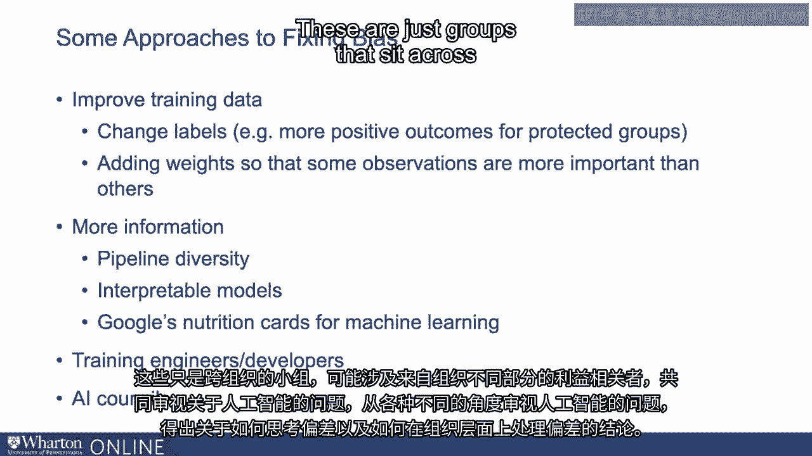

# P90：27_一些修复偏见的方法.zh_en - GPT中英字幕课程资源 - BV1Ju4y157dK

鉴于机器学习系统中与偏见相关问题的严重性。

行业已经作出回应，有多种方法可以考虑开始修复偏见。

一些来自行业，一些来自试图构建这些系统的组织。

一种方法是改善训练数据。因此，我们可能知道训练数据本身是有偏见的。

但可以在训练数据中采取一些措施。

有时这满足其他性能指标，但可以改善多样性。

因此，数据可以被更改或操纵，以反映更为多样的结果。

所以这是一个方法，改善训练数据本身可以帮助减轻一些与偏见相关的问题。

在构建这些系统时出现的问题。以类似的方式。

我们可以考虑给一些观察结果加权。因此，数据中的某些观察结果。

数据中的一些例子更好地反映了组织在公平性方面想要达到的目标。

从偏见的角度来看。因此，这些观察结果可以加权，以更大程度上教会机器学习算法。

这是一个更好地反映我们希望做出的决策的例子。

现在非常常见的一种做法就是打开系统并提供更多信息。

关于在每个阶段发生的事情，以便更容易识别偏见，并可能在源头处理。

这方面的一个例子是一些工具，帮助你处理管道多样性，可能在每个阶段显示给你。

管道的确切样子，可能出现的多样性问题。

另一个例子，我们将在另一个环节中讨论更多，是可解释模型。

这些是提供大量信息的机器学习模型，关于它是如何做出决策的。

这两种方式都反映了为你提供更多信息的工具的不同方法。

关于偏见可能在系统内部不同点产生的地方。

一些建议，一些组织建议在决策做出后提供更多的信息。

我们可以回过头来评估决策，并寻找可能驱动该决策的因素。

一个例子是谷歌尝试使用营养信息，也就是他们所称的营养卡片。

所以这些基本上是关于机器学习决策的信息表或信息。

也许在不同数据集上使用不同的性能指标。这种方法。

再次提供更多信息，以便我们更好地理解偏见特征。

我们可以更好地理解它在不同数据集上的表现。

我们可以更好地识别出在特定系统中可能出现偏见的地方，因为我们有更多的信息可供利用。

我们知道算法的构成以及在不同环境中输出的样子。

新的方法是对构建算法的人进行培训，使他们更好地应对与偏见相关的问题。

一些雇主采取了主动，努力提供培训。

以一种方式来帮助数据科学家或工程师更好地装备自己，方便他们整合。

算法帮助理解偏见可能产生的来源。

如何识别偏见、思考以及解决这些类型的问题。

然后是一个更组织化、更广泛的方法来思考这些问题。

这回到一个问题，即到底是谁的工作来管理偏见。

是创建AI委员会。这些只是组织内的一个小组。

这可能涉及来自组织不同部分的利益相关者，来探讨有关AI的问题。

作为一个小组，从不同的角度来审视AI相关的问题。

得出关于如何思考偏见以及在组织层面上处理偏见的结论。

[空白音频]。

