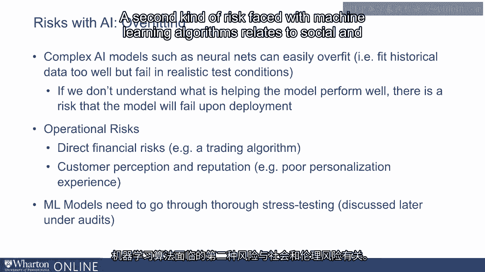
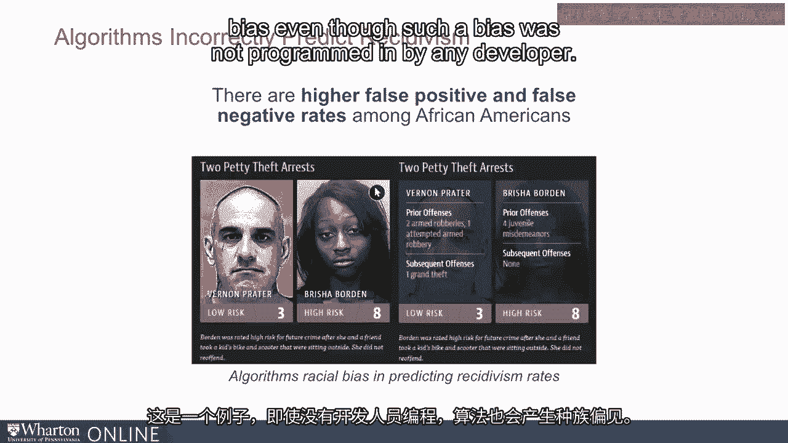
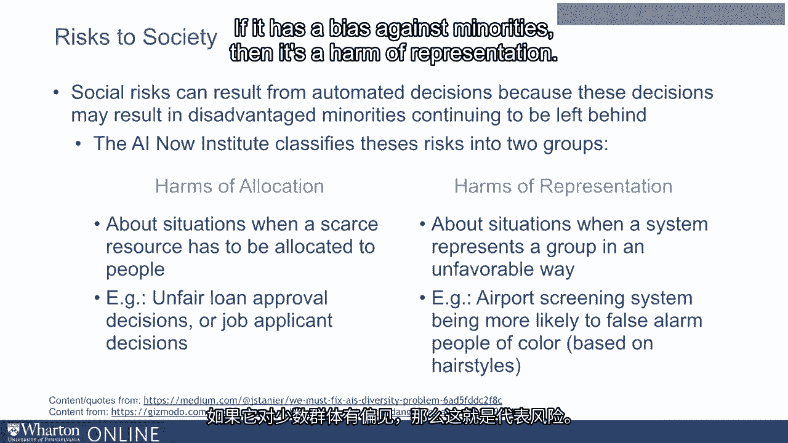

# 沃顿商学院《AI For Business（AI用于商业：AI基础／市场营销+财务／人力／管理）》（中英字幕） - P123：22_AI的风险.zh_en - GPT中英字幕课程资源 - BV1Ju4y157dK

在这次讲座中，我们将讨论AI的一些风险。

我将以一个简单的统计风险开始，它有重要的管理意义。

然后我会谈论社会和伦理风险。

所以我想讨论的第一个风险是过拟合风险。

现在，许多复杂的高级机器学习模型，比如神经网络。

梯度提升等方法，容易对数据过拟合。

这意味着它们往往对历史数据的拟合过于完美。

但它们在其他现实情况中失败。这是因为这些模型通常参数过多。

它们可以拟合非常复杂的形状，且往往对历史数据的拟合过于完美。

但它们在历史数据之外并不能很好地泛化。

如果我们不了解什么在帮助模型表现良好。

当我们在现实世界中部署这些模型时，这就带来了显著的风险。

使用过拟合模型会产生许多操作风险。

例如，假设你有一个基于机器学习的交易算法。

这使得股票交易决策直接承担财务风险。

也存在客户认知和声誉风险。例如。

你有一个与客户互动的聊天机器人。

或者你有一个个性化算法，正在个性化用户体验。

如果那样在实践中运行不佳，就会在长远中损害客户的认知和保留率。

简而言之，尽管存在许多统计风险。

它们实际上可以被测试，因此机器学习模型的表现非常重要。

经过一次非常重要的压力测试。

这包括进行我之前提到的验证。

但这也包括进行许多其他压力测试，我们将在后面的讲座中讨论。

第二种机器学习算法面临的风险。

涉及社会和伦理风险。 为了说明这一点。

在我为我的书进行研究时，我会提供一些我发现的例子。

在我的研究中采访的一个人是。

在中国的一位22岁的生物技术专业人士名叫袁瑾。

袁有一个非常有趣的习惯，每晚睡觉前。

她与一个在中国的社交媒体名人邵平聊天。

她参与了这些有趣且充满玩乐的对话。

邵平是一个在中国拥有四千万粉丝的少女。

有趣的是，邵平能够参与这些对话。

在她的许多粉丝中。 当然，当我深入挖掘时。

我意识到，Shaoping并不是一个人。Shaoping实际上是微软研究院创建的聊天机器人。

在中国实际上取得了很大的成功。后来同一家公司在美国推出了一个聊天机器人。

它被称为微软日。遗憾的是，Day参与了性别歧视。

充满种族主义和法西斯主义的对话，许多人不得不在上线24小时内将其关闭。

现在有趣的是，同一家公司推出的两个相似聊天机器人。

得到了如此不同的结果。这反映出一些机器学习算法面临的挑战。

以及在部署之前需要进行大规模压力测试。

另一个与机器学习相关的挑战是其在简历筛选中的应用。

现在像亚马逊这样的大公司可能会收到数十万甚至数百万份简历。

在任何一年中。他们必须在这些数百万份简历中筛选出。

选择邀请哪些申请者进行面试。

用人类来做这件事在规模上是非常困难的。

因此，许多大型公司正在尝试使用机器学习。

目的是筛选求职者。在路透社的一则最新新闻中报道，亚马逊发现。

他们最初的简历筛选算法存在性别偏见。

幸运的是，这一算法被亚马逊的人员发现，因此不再使用。

但有趣的是，即使像亚马逊这样的大公司也不得不面对这个问题。

他们设计了一个基于非常前沿的先进机器学习算法的算法。

存在性别偏见。几年前，ProPublica报道了一则新闻。

关于在美国法庭中使用的算法，以帮助法官和假释官进行保释决策。

判刑和假释决策。这些算法会查看被告的历史，预测被告再次犯罪的可能性。

基于这些预测，法官可以作出判刑决定。

调查发现，该算法在错误预测未来犯罪方面的可能性是两倍。

在黑人被告和白人被告之间。这是一个例子，尽管开发者没有编程任何偏见，但算法却产生了种族偏见。

显然出现的问题是，为什么这些偏见会出现？

为什么一些简历筛选算法显示性别偏见？

为什么一些判刑算法存在种族主义？为什么一些聊天机器人存在种族主义？

注意，当我们谈到人工智能设计时，我们提到了基于规则的方法。

但也有基于机器学习的方法来设计人工智能。

所以如果你看看驱动人工智能系统行为的因素，部分是由程序员的逻辑驱动的。

或者是程序员为主要基于规则的专家系统提供的规则。

或者与几乎完全基于规则的传统软件相比。

现在，在机器学习中有规则，但也有数据。

而我们所学到的很多内容都是从数据中学习的。

因此，在人类行为方面，我们认为人类行为是由我们的天性和教养驱动的。

我们的天性是我们的基因代码，这驱动着我们的一些行为。

教养是我们的环境，我们从这个环境中学习，这驱动着我们的一些行为。

心理学家将一些问题行为，比如酗酒，部分归因于天性，部分归因于教养。

在 AI 中也是如此。如果你看看问题行为，天性和教养再次发挥作用。

天性是程序员为 AI 创建的规则。

教养本质上是 AI 学习的数据。

如果数据中存在偏见，那么 AI 系统也能识别出来。

因此，换句话说，很多偏见可能存在于数据中。

当我们说简历筛选算法存在性别偏见时，实际上发生的事情可能是它在学习过去的数据。

而这些过去的数据是基于人类所做的历史决策。

成千上万的人申请了某个组织的工作。

人们决定邀请谁参加工作面试。我们然后查看他们中哪些人获得了工作邀请。

我们随后查看哪些人获得了晋升。这些人正是 AI 系统试图邀请参加工作面试的对象。

如果过去存在性别偏见，那么这可能已经在数据中被捕获，并反过来也被 AI 捕获。

当我们思考基于 AI 的决策及其相关风险时，往往源于数据中的偏见。

现在产生的一些风险是什么？首先，社会面临许多风险，特别是当 AI 基于系统的自动决策可能导致少数群体继续被边缘化。

AI 现在将这些风险分为两组。第一组是分配的危害。

第二组是表示的危害。分配的困境基本上是关于必须将稀缺资源分配给人们的情况。

例如贷款审批决策或求职决策，其中多人申请某个职位，但只有少数人能够获得职位，以及简历筛选算法。

哪些申请者会获得那稀缺资源的分配。

表示不平等的现象指的是系统以不利的方式代表一个群体的情况。

例如，如果你在机场有一个筛选系统，它观察人们的面部表情和其他因素，以判断谁需要接受筛查。

如果它对少数群体有偏见，那么这就是一种表示的危害。

这两者都是非常重要的伤害，我们应该对此感到担忧。

现在，这些不仅仅是对社会的风险，也是对公司的风险，因为最终这些社会风险还会为组织创造声誉、法律和监管风险。

声誉风险来自于被视为偏见或有偏见的公司，公关反弹可能导致客户离开组织。

法律风险则来自于因歧视性做法而被客户或其他人起诉。

当监管者觉得你的算法实际上是在歧视或造成社会风险时，就会出现监管风险，他们会增加很多规定，这就造成了合规成本。

例如，如果你看看欧盟的GDPR法规，主要关注隐私，它确实有一些条款涉及自动决策。

其中之一是解释权，这无疑是消费者可以拥有并应该拥有的非常宝贵的权利，但这也给公司带来了合规风险。

简而言之，人工智能确实带来了许多风险。对社会的风险包括资源分配的伤害和表现的伤害，而这些社会风险又为公司创造了许多声誉、法律和监管风险。

那么问题是我们如何管理这些风险，我们将在下一个讲座中探讨。

[BLANK_AUDIO]。
