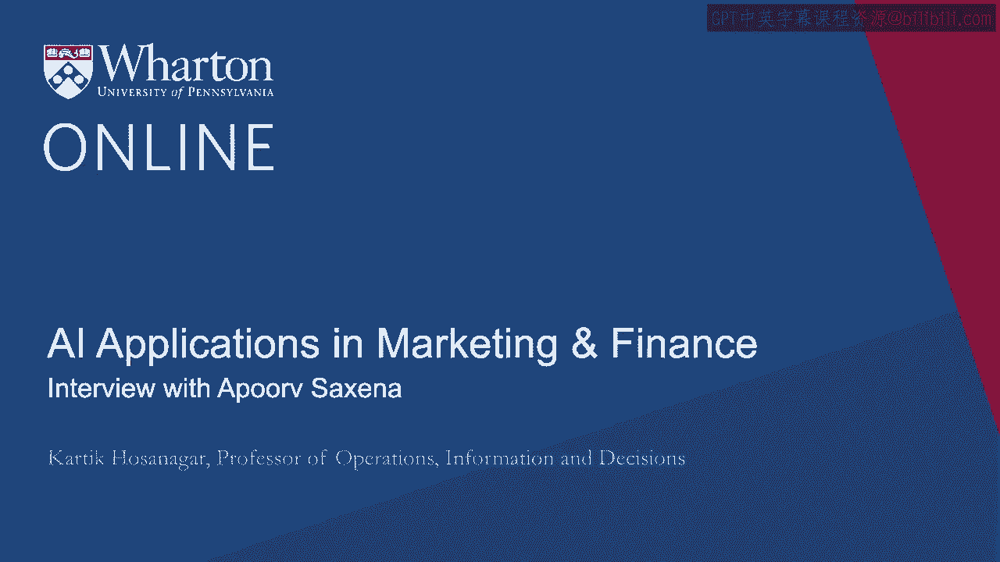

# 沃顿商学院《AI For Business（AI用于商业：AI基础／市场营销+财务／人力／管理）》（中英字幕） - P59：25_Apoorv Saxena访谈.zh_en - GPT中英字幕课程资源 - BV1Ju4y157dK

我们讨论过使用投资组合来管理人工智能项目。

我们谈论了机器学习的民主化。

这是我与曾在的Apoorv Saxena广泛讨论的主题。

谷歌并帮助实施了许多人工智能项目。

目前他是摩根大通的全球人工智能负责人。

我们所写的这些文章作为这门课程的一部分，提供可选阅读。

我鼓励大家去了解一下。现在让我们开始与Apoorv的对话。你好。

现在与我一同参与的是Apoorv Saxena，他是摩根大通的全球人工智能负责人。Apoorv。

感谢您加入我们。如果可以，请简要介绍一下自己和您的背景。

>> 谢谢你，Karthik，邀请我参与这次对话。正如你所说。

我领导摩根大通的人工智能和机器学习团队。我在这里快一年了。

我根本相信人工智能对金融行业是非常具有变革性的。

这是我在过去几年中的主题，在此之前，我在摩根大通，与谷歌共事。

我负责谷歌人工智能垂直团队。基本上是将人工智能应用于医疗、金融。

人工智能应用于工业。我们根本相信，人工智能是一个贯穿始终的主题。

关于转型多个行业。我正在摩根大通实现这一点。>> 很好。

事实上，关于这一点，我很想听听人工智能在金融服务中的影响。

你能帮助我们了解人工智能如何被使用的全貌吗？

人工智能在金融中是如何应用的？>> 如果你看看金融历史，它一直是一个技术驱动的行业。

从自动取款机到使用数字银行。这是一个非常数据驱动的行业。

人工智能转型所需的两个基本论点是，您必须拥有大量数据。

这必须是数字化的。这两个关键因素在金融中一直存在。

第三个非常有趣的方面是，通常不存在代理问题。

其他行业中存在于医疗领域。拥有数据的人有巨大的激励来实现盈利。

作为任何人工智能决策过程的结果。

金融领域的转型速度非常快。所以我认为这三个组合使人工智能在金融行业非常成熟。

通过人工智能的颠覆。有多种事情正在发生。

人工智能现在被用来颠覆您与前台的互动方式，一直到。

在后台，可以给您多个例子说明这一点是如何实现的。>> 好的。

那么我们也许可以从前台开始，前台的含义是什么。

公司如何与客户互动。所以请告诉我们这是如何改变的。

金融服务公司与客户互动的方式。>> 我想再说一遍。

在前台，最重要的是客户互动。

因此，AI正在被用来从根本上转变多渠道、全渠道的体验。

无论你现在谈论的是哪种方式，是否只是访问一个在线网站。

你可以与银行进行对话。这是一个正在利用对话AI进步而转变的领域。

更好的目标定位，微目标定位，使用通常的独特信号。

银行在目标客户群体时从未使用这种方式。而第三个是个性化。

个性化已经存在一段时间，但创造个性化的金融产品。

还有正在前端发生的事情。>> 好的。

你所说的创造个性化金融产品是什么意思？

我们在本课程中确实讨论过个性化。这是一个重要主题。

不仅限于金融服务，还有零售和许多其他场景。

但这也是一个已经存在一段时间的想法。

那么，请多告诉我们一下如何个性化产品本身。>> 这是一个非常好的问题。

个性化已经存在很长时间了。因此，信息传递的个性化也已经存在一段时间。

在电子邮件方面比较长，但电子邮件的目标定位，使用正确的语言。

这正是目标定位。但在过去几年发生了什么。

在过去的几个季度中，产品的创造越来越多。

一个例子是主题投资组合。因此，你可以拥有一个基于你兴趣的非常独特的创意投资组合。

嘿，我想投资于可持续发展的公司。

我想投资于针对特定地区的公司。

那么，如何在不实际挖掘他们的SEC数据和文件的情况下做到这一点？

他们的投资关系，然后提出一个特定主题。

这就是一个AI用于创建主题投资组合的例子。>> 有趣。

你还提到AI也在后台使用。

那么，请告诉我们AI在后台设置中是如何使用的。>> 再次说明。

AI在金融领域已经使用很长时间了。传统上，后台处理如欺诈和反洗钱。

反洗钱。因此，发生了什么变化，新深度学习技术正在转变。

技术正在被用来创建非常复杂的欺诈检测模型。

这就是你可以在某种程度上操纵数据的规模。

利用数据和新数据源。这就是正在发生的巨大转变。

反洗钱也是一样。现在例如，摩根大通处理大约三分之一的所有交易。

在世界上发生的事情通过某种方式与摩根大通相关。

我们正在使用实时极其复杂的知识图谱来创建见解和反欺诈警报。

这就是一个例子。其他领域，呼叫中心的传统领域。

与其说你的IVR体验是完全的，我们通过对话体验来转变客户体验。

你甚至可以与银行账户进行体验对话，谈论如何。

银行的支票账户里有多少余额，你可以做什么。

你现在可以完全通过对话方式进行简单的电汇，而无需与人类交谈。

这就是传统上存在的后台操作类型。

现在通过AI正在进行转型。另一个我应该提到的例子是合同。因此，银行。

银行的许多后台操作与合同相关。

谈判和维护合同。因此，在这一方面有很多令人兴奋的新事物发生。

机器理解合同并识别差异。

在合同中提醒相关方采取行动。

因此，在这一领域也有很多出色的工作。 >> 所以作为全球AI负责人。

显然，无论是你个人还是整个组织，正在大量投资于AI。

当公司在AI上进行大量投资时，问题是需要具备哪些条件。

你想从中获得回报？因为正如我们所见。

有很多公司正在投资AI，但尚未看到回报。

那么告诉我们你对此的看法。你认为哪个AI策略效果很好？

长期来看，**这可能会产生回报**？ >> 这是一个非常好的观点。

我认为需要注意的一点是，开始使用AI非常简单。

我认为实际上可以雇佣几位数据科学家。

给他们一台笔记本电脑，他们应该能够迅速开始进行AI。

从事机器学习或数据科学。我认为你需要关注的是如何产生巨大影响。

AI的变革性影响？我认为我们看到的工作有三种方式。

首先，你必须拥有适合大规模AI的基础设施。这意味着什么？

这基本上意味着要确保你的数据就位。数据易于发现，易于注释。

还有训练大型模型的能力。

这基本上就是我所称之为的AI基础设施，例如Facebook和Google。

或者世界在这方面进行了大量投资。这就是他们能够跨越行业的原因。

第二个要素是你必须从业务流程的角度进行审视。

从端到端的视角来看，看看如何应用AI。

从头到尾的过程，而不是整个过程的一小部分。

我会说第三个要素是你必须提出并。

你可以使用AI并且应该使用AI来创造新的数字体验。

而这是你会看到随着时间推移影响最大的地方。

>> 有什么新的数字体验可以通过AI创造的例子？

>> 我认为AI无法做到的，已经能够做得很惊人。

通过对话创造新体验。语音转文本的准确性大大提高。

创建新文本的能力，完全由AI生成的文本大大增加。

现在你可以想到两三年前根本不可能的体验。

就在两三年前。所以正确的例子是。

如果你在私人领域讨论，实际上有很多低接触。

你通常作为银行想要自动化的高频交易。例如嗨。

你早上醒来，想检查你的投资组合。

它怎么样，为什么会下降？所以，嗨，你醒来，跟Alexa对话。

数字体验助手之一，并且说，为什么我的投资组合下降了两个百分点？

然后人工智能助手分析你的投资组合。

它给出了非常好的理由说明为什么会下降，并给你这个交易。当然。

在所有这些体验中，如果你想深入挖掘，可以深入研究。

你实际上拨打了你的财富顾问的电话。但这就是我们所谈论的体验。

>> 所以很清楚你可以如何应用人工智能来改善现有体验。

但当你谈论创造新体验时，你到底是什么意思？

>> 所以人工智能实现了完全变革的体验。

你与机器的对话方式，以及你如何生成新的、机器生成的文本。

所以这两个进展可以用来改变你与银行的互动。举个例子。

通常是低接触、高频率的互动。

你的私人财富顾问通常是银行想要自动化的内容。

这方面的一个例子是你早上醒来，通过Alexa与银行对话，并说。

嗨，我的投资组合今天怎么样？实际上，昨天表现如何？而且它说，嗨。

它下降了两个百分点，然后你开始深入挖掘，嘿，为什么会下降两个百分点？

它说这是你的投资组合是如何构建的。

这就是它出现问题的原因等等。

所以这种互动非常低接触，非常高频率。

但今天你可以轻松自动化的事情。

这就是我所说的体验。>> 好吧，这就是结果。

三个支柱支持建议。第一个是在我们启动大型人工智能项目之前。

让我们确保基础设施、数据基础设施和平台到位。

第二个是不要仅仅考虑单个接触点，而是实际上。

考虑整个端到端的过程，看看人工智能如何能改变整个流程。

最后，当然可以利用人工智能来转变现有体验，但。

还要深入思考人工智能如何创造完全新颖的体验。

客户以及这些体验可能对公司是战略性的和颠覆性的。Appurf。

再次感谢你加入我们。>> 感谢你的邀请。[BLANK_AUDIO]

