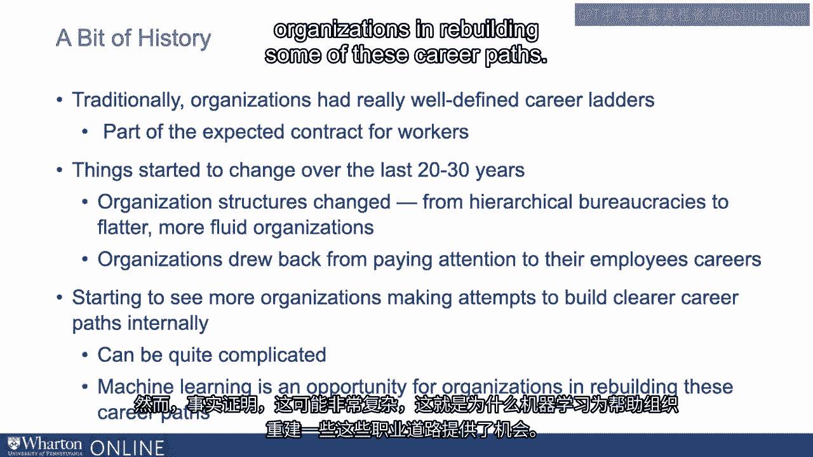
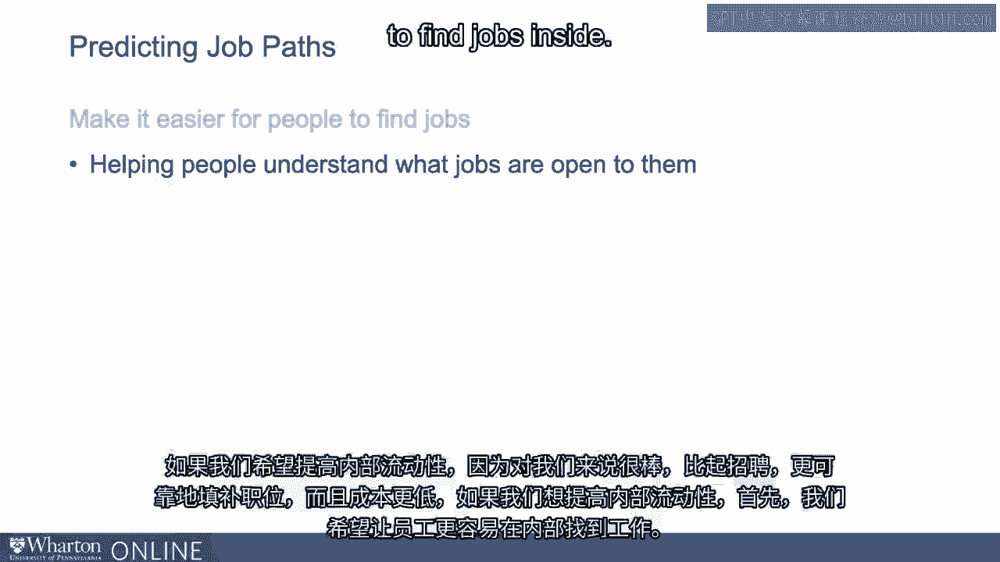
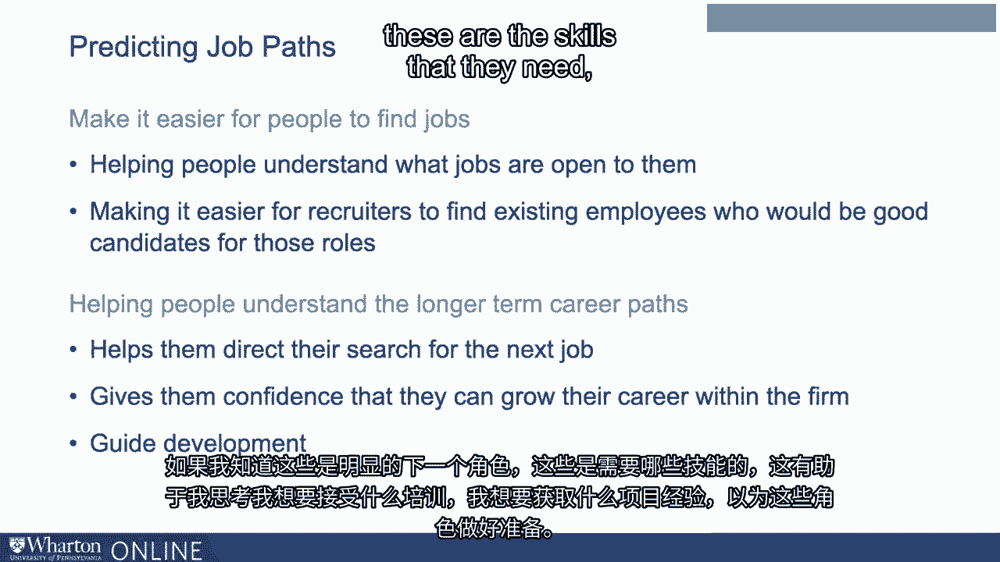

# 沃顿商学院《AI For Business（AI用于商业：AI基础／市场营销+财务／人力／管理）》（中英字幕） - P79：16_AI与职业生涯.zh_en - GPT中英字幕课程资源 - BV1Ju4y157dK

我想谈论的机器学习的第三个应用是在内部管理。

职业。 这是我特别感兴趣的领域，我认为这也是一个日益受到关注的话题。

在公司中，**重要性**越来越凸显，而这是一个机器学习展现出真正价值的领域。

仅仅提到Moncris的复杂性。让我给你一些背景信息。

为什么组织关心员工职业生涯的管理？

主要原因是公司关心员工流失，而人们常常离开公司以寻求更好的发展。

他们的职业生涯。这个想法是，如果我们能让人们在组织内更容易地晋升他们的职业。

他们更不容易离开我们。我认为这促使了人们对内部职业发展的许多新兴趣。

为了提供一点背景，我认为提供一点小小的商业信息是有用的。

历史。我知道商业历史并不是你在人工智能课程中所期待的内容。

人力资源，但请你宽容我一分钟。这个想法是，传统上。

组织有非常明确的职业阶梯。你知道会发生什么。

你以某种水平进入，然后你可以在这些不同的层次上不断进步。

职业随着你的职业发展而变化。在某种意义上，这是一种预期的契约。

你从那里工作中获得的就是这些。在过去的20到30年间，确实有几件事情发生了变化。

其中之一是组织结构发生了变化。我们从这些层级官僚制转变为这些更扁平的结构。

更加灵活的基于网络和项目的组织。这在很多方面都非常好。

这使得组织更加灵活和创新，更加协作。

我们减少了那种繁琐的官僚主义负担。所有这些事情，我们都喜欢。

这也使得职业发展变得更加困难，因为不再有这种等级结构来适应气候。

我们有这些独立的组织，了解我如何从一个地方移动到另一个地方。

到另一个机会更多的地方。这要难得多。

我们在这样做的过程中摧毁了职业阶梯。另一个发生的事情是，组织在某个时候开始减少关注。

关心员工的职业发展。 他们明确表示，就公司的关注而言。

你的职业发展，对我们来说，听起来像是你的问题。

我们并不特别感兴趣于帮助你。

你需要弄清楚自己的职业发展。这是你的责任。

组织走上了这条道路。随着时间推移，这种策略的局限性变得相当明显。

这意味着如果你告诉你的员工，他们的职业发展是你的问题，校长。

他们会想出一个对我来说的解决方案，这不一定与停留有很大关系。

在你的组织中。这一点逐渐被认识到。

当有人离开去另一家组织工作时，这对我们来说是一个损失。

我们用自己的员工有效地填补角色要容易得多。我们希望他们留下来。

帮助他们留下来是为了帮助他们理解，他们可以在内部建立职业生涯。

我们正在帮助他们理解他们在这里可以获得什么样的工作以及他们如何做到这一点。

实际上进入这些职位。我们开始看到越来越多的组织努力建立更清晰的职业发展。

内部的职业路径，并确保在招聘时优先考虑这些内部职业路径。

结果表明，这其实可能相当复杂。

这就是为什么机器学习为组织在重建某些方面提供了机会。

这些职业路径。我们如何利用机器学习帮助员工在内部建立职业路径？

最简单的方法确实是帮助他们理解自己的职业发展路径。

我之前提到过组织是如何破坏这些职业阶梯的。

我们不再有这种非常结构化的进步。那意味着。

作为组织中的一员，如果我想在组织内部发展我的职业。

对我来说，弄清楚我应该转向的下一个工作需要更多的努力。

如果我们想要增强内部流动性，因为这对我们来说非常重要，且更可靠。

填补职位比招聘便宜得多。如果我想增强内部流动性。

首先，我想让人们更容易在内部找到工作。

这可能部分是帮助人们了解他们可以获得哪些职位，同时也在使其。

招聘人员更容易找到现有员工，他们会是不错的候选人。

这些角色。更广泛地说，帮助人们理解那些稍微长期的职业道路是有益的。

因为它帮助他们指引下一份工作的搜索方向。

当我想到这些是我可以转型的不同角色时，我知道该去找谁。

开始讨论从哪里着手建立我的网络，以找出我的下一个机会。

更广泛地说，这对我来说是一个信号，表明我可以在公司内部发展我的职业。

我开始理解有哪些可能性，并看到所有这些事物为我打开。

更技术性地说，我也可以开始指导我的发展。

如果我知道这些是显而易见的下一个角色，那么这些就是他们需要的技能。

这帮助我思考我可能想参与什么样的培训，以及什么样的项目经验。

我想为那些角色做好准备。

我们希望找到方法帮助人们理解他们可以转向的下一个职业。

人们常常借助机器学习来帮助构建这些地图，在一个充满不确定性的世界中。

传统职业路径不再存在。早期尝试这样做的组织之一是IBM Watson的职业教练。

你可能听说过IBM Watson。这是IBM的开创性人工智能产品。

基于此，他们建立了一个工具，员工可以通过它来解释他们的偏好。

为了他们的职业生涯，然后沃森会采纳他们的偏好，并将其结合起来。

对于在一个组织内部可能的职业路径有一种认知。

给他们提供关于下一步应该思考什么的指导。

这个目标是提高信息的保留率和参与度。这样的工具是如何运作的？

它们实际上如何帮助为人们提供可选择的职业道路建议。

在组织内部跟随？有几种常见的方法。

最简单的方法基本上就是分析那些在他们之前的人职业路径。

例如，如果你是一名市场分析师，正在思考接下来想做什么。

让我们深入分析数据，看看之前的市场分析师们有哪些其他角色。

他们继续前进，以便能够继续。这些是常见的选择。

这就是你可能会考虑做的事情。有些组织可能会反向操作。他们可能会说。

"相反，非常好。你想成为一名控制者。让我们看看人们从哪些职位转向控制者，以便你可以开始。"

考虑一下你可能想要担任的下一个角色，以便为自己定位。

两种信息，对于人们思考潜力时可能非常有帮助。

接下来的步骤。有几个挑战需要面对。首先，

这个方法适用于非常常见的角色。我们有很多市场分析师。

我们有很多控制器。可以很容易看到进出多个路径。对于相对少见的角色。

我们可能对人们以前做过的事情没有太多数据。

关于进入这些角色或离开它们的方面。其他挑战。

这都是关于过去发生的事情。工作正在迅速变化。能够告诉你。

“好吧，以前人们是沿着这些路线行走的。”，好吧。

也许这就是五年前市场分析师所做的，但今天，情况完全不同。

可能市场分析师将要从事的一系列工作，在我们当时甚至还不存在。

将这些数据整合在一起。在快速变化的环境中。

仅仅依赖于之前的角色可能效果并不好。另一种更为稳健的方法。

但更棘手的是，根据技能绘制职业路径。

这里的观点是，我能否找到一份工作真的取决于我具备的技能。

我拥有合适技能的工作，我可以转向那些愿意雇用我的人。

他们认为我能做好这份工作。工作是我没有技能的地方。

这对我来说并不是一个真正的选择。如果我们可以考虑我的技能和工作对技能的需求。

这是一种不同的方式，帮助我识别在下一步行动中所有不同的可能性。

这里有一些不错的想法，也许我是一名市场分析师，而我之前并没有真正意识到。

我曾想过也许可以作为数据科学家转入人力资源，但实际上所需的技能。

所有必要的技能都是相同的。当我们看待技能时。

我们不需要经历过去发生的这种大量过渡。

这确实有助于识别人们尚未走过的新职业道路。

在新工作中进进出出。这是一个不错的方法，但它也有自己的问题。

在组织中，使用技能数据来识别职业路径的特定障碍。

是因为我们往往对技能的数据掌握得不够好。为了做到这一点。

我们需要了解不同工作的技能要求。

我们需要了解人们实际上具备哪些技能。

这就是这种以及坦率地说，许多工作规划应用程序所需的核心数据。

组织也希望参与其中。但我们在哪里找到这些数据呢？

我们到底在哪里能了解到人们具备什么技能呢？目前在大多数组织中。

那些信息几乎缺乏。

[空白音频]。

