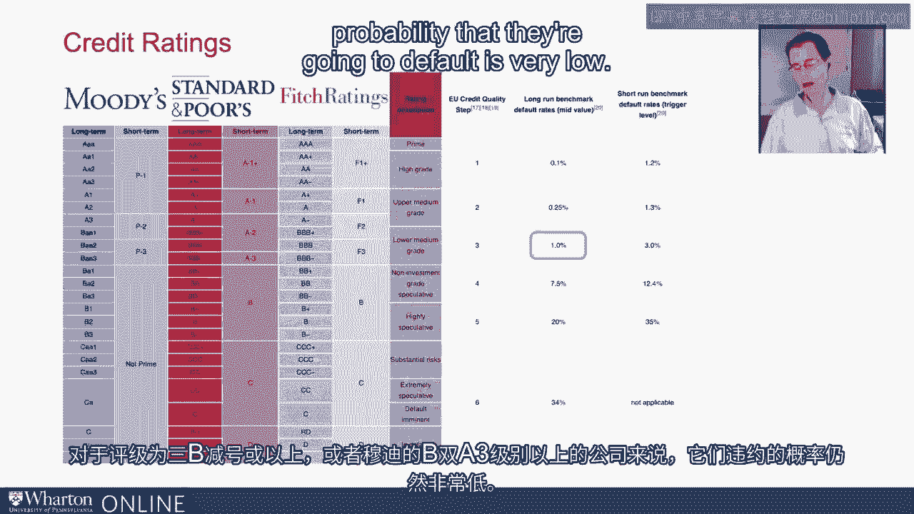

# 沃顿商学院《AI用于商业：AI基础／市场营销+财务／人力／管理》（中英字幕） - P51：17_信用风险信用评级.zh_en - GPT中英字幕课程资源 - BV1Ju4y157dK

现在我想在我们至今讨论的信用风险基础上继续深入。

这是企业信用风险。我想介绍信用评级，这是许多你们。

很多人可能已经熟悉这些内容。所以让我放一个小幻灯片，这实际上是维基百科页面的截图。

这里有很多信息，让我们尝试逐一梳理。

一步一步来看，看看它与我们讨论的内容有什么关系。好的。

实际上有很多评级机构，但在规模和评级范围方面，三家最大的机构是。

分别是穆迪、标准普尔和惠誉。信用评级背后的理念其实很简单。

这是一个试图表征，而不是完全量化的过程。

但要表征不同公司和金融工具的信用风险。

所以当我们谈到英特尔比AMD风险小的时候，就像我们在之前的视频中提到的。

你知道，问“风险低多少”是个自然的问题，对吧。

或者AMD相比于英特尔的风险到底高多少？因此，信用评级是我们量化这种风险的一种方式。

或至少提供一种相对排名的概念。

让我们来看看左侧的第一列，穆迪的长期评级。

我们可以看到，它们的评级从AAA一路降到单C。

随着我们从AAA降到单C，我们正从风险较低的公司转向风险较高的公司。

从信用风险的角度来看，最安全的公司被评为AAA。而最具风险的公司，实际上。

几乎处于违约状态的公司，如果不是已经违约，穆迪的评级是单C。

标准普尔和惠誉有相似的评级标准，只是字母标记略有不同。

所以标准普尔再次以AAA开始，但并不是直接到AA1。

它比最安全的评级低一个档次，达到AA+。然后一路降到单C。

不过，这在某种意义上略高于穆迪的单C评级。

而且惠誉实际上非常相似，甚至可以说是完全相同。

在其长期评级方面与标准普尔相比。现在。

短期和长期之间是有区别的。我现在先把这个放一边。

我不想承担超过我们能力范围的任务。让我们专注于长期评级。

这些公司可能更为知名，引用也更广泛。

你可以把这些评级类别视为在企业信用风险方面的松散相似公司集。

现在，这与违约概率有什么关系？所以在这一列。

维基百科很友好地列出了构建页面的相关人员和一些默认率。现在。

我不会完全依赖它们，但它们会给你一个大致的感觉，因为我确实检查过。

他们与实际的违约率相差无几。每个信用评级，每个单独的评级。

AAA、AA+、AA，各自有自己的违约率，还有不同类型的违约率。

但我不想深入探讨这个问题。所以我们还是关注大局吧。

对于相对安全的公司，按照标准普尔的评级，评级为AA或以上的公司。

或者对于穆迪来说，或者其他评级机构，这家公司违约的概率是多少？

嗯，概率是0.1%。所以10个基点，0.1%。这是非常低的。随着我们在评级等级上向下移动。

你可以看到违约的概率开始逐渐上升。

但请注意，即使我们降到BBB评级的公司。

违约的概率只有1%。对于评级为BBB-或以上的公司来说，这仍然是极不可能的。

或者在穆迪评级中被评为BAA3或以上的公司。

他们违约的概率非常低。

但一旦我们降到单B或AA评级以下。

一旦我们降到BB或BA1以下。

我们看到违约率从1%跃升至7.5%。

一旦你跨越这个界限，就会发生这种情况。

所以从标准普尔的BBB-到BB+。

并且在穆迪评级中，从BAA3到BA1也是如此。

你正在从所谓的投资级评级，转向投机级评级。

这个区别出于很多原因是重要的。

不仅仅是因为我们看到违约可能性几乎是一个离散的跃升。

但也是因为对某些类型的机构投资者有许多规定，关于他们可以投资于哪些公司的资金量。

或者被评级为投资级以下或投机级的工具。

所以我在这里画的这条线是一个重要的划分。

你可以在这里看到评级描述，对吗？我们有投资级别在上面，对吧？

投资级以下，抱歉。投资级以下或在这条线以下的投机级。

那么这次讨论的要点是什么呢？信用评级是信用风险特征的有用描述。

他们稍微抽象一下，但与违约率密切相关，但获得评级。

我喜欢把它想象成课堂上的成绩，对吧？A、B、C、D和F，对吧？

如果你在课堂上得了A，你的表现非常出色，好吗？就像如果你被评级为AAA或AA一样。

那是非常安全的。这是一家非常安全、信用风险低的公司。如果你在课堂上得了B。

你表现得不错。虽然不是很好，但你做得还可以。

所以如果你被评级为单A或高BBB，你仍然是一家相对安全的公司。

违约的概率非常低，但这显然不同于AAA或AA评级的公司。

同样，评级越低，违约概率也越低。因此，它们是信用风险的有用描述。

它们是一种流行的描述。尽管它们受到了很多关注。

在经济中，相对来说，拥有信用评级的公司非常少，我指的是相对少的上市公司。

事实上，这甚至还不到大多数。如果我凭记忆猜测，大约在30%到40%之间。

所以，你知道，在整体上，并没有多少公司拥有信用评级。

但是那些公司往往非常庞大，并且对大量经济活动负有责任。

因此，信用评级理所当然地获得了大量关注。所以，你知道。

信用评级的旋风式介绍，对吧？

它们代表了信用风险，并区分了从低到高的不同信用风险类别。

这将为我们在接下来的视频中想要做的事情提供背景。

我们要开始思考如何对信用评级进行建模。

[沉默]。

