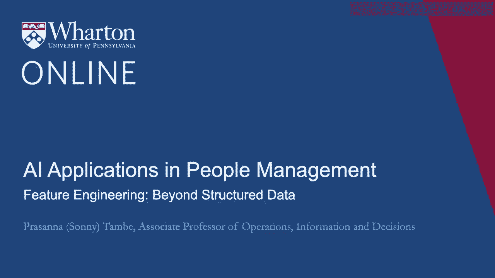
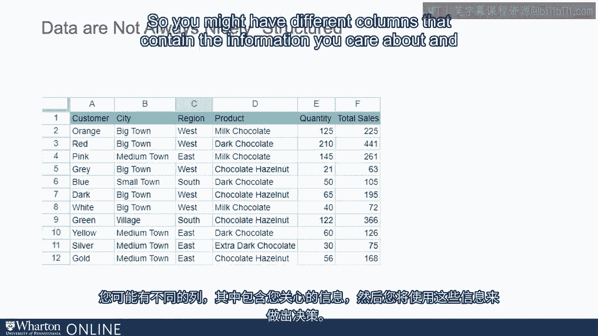
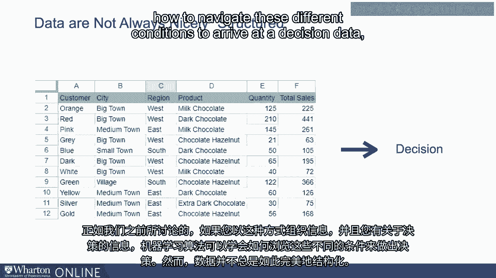

# 沃顿商学院《AI用于商业：AI基础／市场营销+财务／人力／管理》（中英字幕） - P70：7_结构化数据之外的特征工程.zh_en - GPT中英字幕课程资源 - BV1Ju4y157dK

我们讨论的机器学习示例有点让人明确。

假设数据的格式使我们能够考虑评估不同的条件。

数据。因此，我们在某种程度上讨论了或隐含地讨论了这些例子，您可能会遇到。

数据以电子表格的形式组织。因此，考虑多个列，每个列都有一些信息。

关于申请者。因此，你可能会有不同的栏目来包含你关心的信息。

然后你将利用这个来做出决定。

正如我们之前讨论的，如果你以这种方式组织信息并且你拥有。

关于决策的信息，机器学习算法可以学习如何进行导航。

不同条件下做出决定。

然而，数据并不总是如此结构化，而且在机器学习中有很多的兴趣。

真的关于在非结构化数据上使用机器学习的能力。

不容易放入电子表格列的数据。

想象一下，使用在线评价来预测一些关于餐厅的情况，或者使用诊断。

我们之前谈到的图像可以用来预测患者的某些信息，或者在HR的情况下，使用简历。

原始简历文本本身用于预测申请者的一些信息。

在这些情况下，特征经历了一个工程过程，即特征工程。

这是从原始非结构化数据中提取特征的过程。

以一种可以用于机器学习算法的方式。

所以这就是将原始数据提取并转换成一种格式。

你可以把这看作是一个带有列的电子表格。

所以如果你有原始简历数据，你会将简历中的哪些部分提取到列中呢？

开始为你的机器学习预测算法使用。

这是一项耗时且相当具有挑战性的过程。

这通常还需要相当多的领域专业知识。

因此，对于我们讨论的任何诊断图像的上下文来说，它是必需的。

需要相当多的专业知识来思考图像中哪些内容需要提取出来以开始。

对于图像做出预测。 这听起来似乎没那么麻烦，原因我们稍后会讨论。

在这里，但了解特征工程是这个过程的重要组成部分是很有用的。

这正是将这些非结构化数据集与机器学习过程连接起来的关键所在。

这是一个概念，即你可以处理原始数据，未经过整理的原始非结构化数据，这些数据不容易被组织。

在列中，你可以利用这些来进行预测。

在人力资源领域，这一点变得越来越重要，尤其是对于越来越多的公司和小型企业。

科技领域的公司正在考虑使使用其他信号成为可能。

从采访中获取音频或视频，以预测员工表现。

所以你可能听说过一些公司或工具，可以让你录制申请人的面试。

能够记录申请人对问题的声音回应，并且该信息本身可以。

可能会告诉你一些关于申请者的信息。为了成功实现这一点，它必须经过这个特征工程过程。

是从音频信号开始，还是从视频信号开始，然后再进行特征工程。

从这些数据中可以提取出信息，进而用于进行预测。

现在我刚刚评论过这个概念，认为这并不是一个很大的问题。

听起来是这样，这其中一个原因是深度学习的出现。

因此，深度学习在这里本质上开始展现其光芒。

因此，深度学习可以帮助绕过这个特征工程过程，因而它是一个真正的。

深度学习的一个优势是能够处理这种原始的非结构化数据，并且。

直接进行预测，这样我们就可以绕过这个需要思考的过程。

如果我们看一段视频，那么关于这个人的手势或面部表情，是什么呢？

真的重要的是表情或声音，这在某种程度上最终是一个猜测游戏。

深度学习将让我们在某种程度上绕过这个过程。

利用所有原始信息进行预测，而不必走弯路。

通过特征提取过程。

。 。 [空白音频]。

