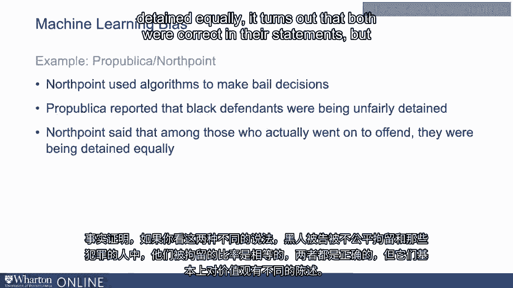

# 沃顿商学院《AI用于商业：AI基础／市场营销+财务／人力／管理》（中英字幕） - P88：25_偏见很难管理.zh_en - GPT中英字幕课程资源 - BV1Ju4y157dK

相对容易理解为什么偏见会在算法系统中出现，但。

管理这些系统中出现的偏见可能相当困难。

原因在于，当考虑如何处理偏见时，通常涉及。

价值判断需要整体视角。现在不清楚这是技术问题还是数据问题。

当你思考我们如何解决在一个。

在组织背景中，这通常确实需要对组织的整体视角和思考。

深入思考组织优先事项。这，当然。

可以跨越多个不同的决策者，而不仅仅是单个开发者或数据科学家。

这就是为什么处理这个问题变得复杂的原因。一个相当高调的例子是ProPublica和北点的例子。

这是一个例子，北点开发了一个算法，你正在被。

用于做保释决定。该算法在这个案例中被用来预测某人是否可能。

再次犯罪或不。ProPublica是一个新闻组织。

查看这个算法并声称，黑人被不公平地拘留。

北点表示，在那些实际上犯罪的人中，他们被拘留。

在相等的比率下。事实证明，如果你看这两个不同的陈述，黑人被。

不公平地被拘留，而在那些犯罪者中，他们被同等拘留。

事实证明，他们在陈述中都是正确的，但他们基本上在说不同的。

关于价值的事情。他们所问的基本上是让有罪的人自由更糟糕吗。

是让有罪的人自由还是不公平地惩罚无辜？这当然是一个非常古老的问题。

这被称为黑石比率，历史悠久。

这是一个深刻的哲学问题，如果我们问一百个人他们对此的看法。

我们会得到多种不同的例子。然而，它说明这并不是一个数据科学家问题或算法。

这是一个问题。它实际上是一个更深层次的问题，需要在价值观方面优先考虑。

社会或在商业方面。在人力资源的例子中。

我们可能在思考机器学习算法如何评估。

候选人或评估组织内的人员，这可能对生产力产生影响。

这可能对偏见和不平等产生影响，但需要权衡成本和收益。

这些不同事物具有非常深刻的组织影响，并需要进行多项权衡。

需要对组织优先事项进行整体的视角。 [BLANK_AUDIO]。

