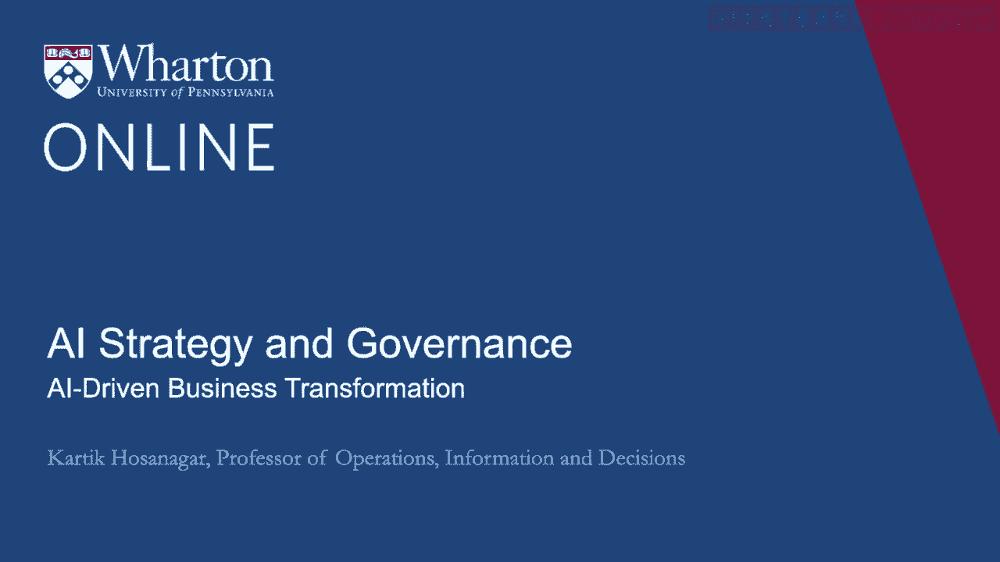
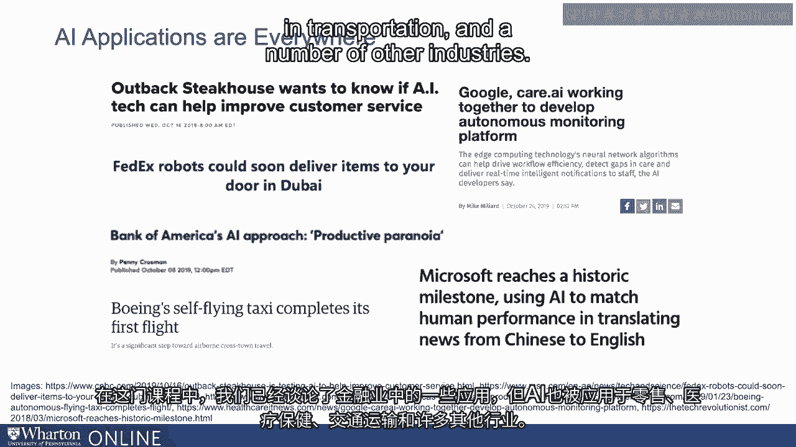
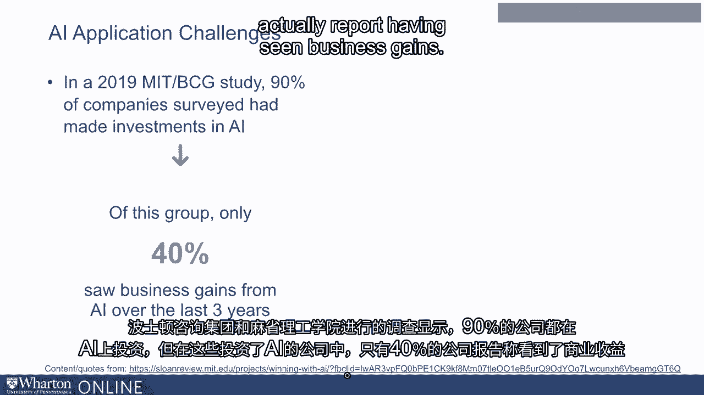

# 沃顿商学院《AI For Business（AI用于商业：AI基础／市场营销+财务／人力／管理）》（中英字幕） - P102：1_AI驱动的业务转型.zh_en - GPT中英字幕课程资源 - BV1Ju4y157dK

 Hello， this module will focus on AI strategy and governance。

 In this particular lecture， I'm going to focus on AI driven business transformation。

 And we'll talk a little bit about what are the opportunities with AI and also what are。

 the challenges and potential failures with AI。 In later lectures in this module。

 we'll look at strategic frameworks so as to ensure companies。

 can get returns from their AI investments。 And also we'll talk about AI governance frameworks。

 Now AI is being viewed by business leaders as both an opportunity and a risk。

 A recent survey conducted by Boston Consulting Group， NMIT of executives at many large companies。

 reports that nine out of ten companies find AI as a significant business opportunity。

 At the same time， 45% of these companies view AI as a potential business risk as well。

 And the risk essentially is that competitors might be able to use AI and get ahead of the， company。

 So driven by both these opportunities and risks， companies have started to invest quite heavily。

 in AI。 We see many applications of AI in a number of different industries。 In this very course。

 we have talked about some of the applications in finance， but AI， is being applied in retailing。

 AI is being applied in healthcare， in transportation and。

 a number of other industries。 But at the same time。

 we tend to notice that early investments haven't always paid off。

 The survey conducted by BCG and MIT reports that 90% of companies have made some investments， in AI。

 But out of these companies that have made investments in AI， only 40% of them actually。

 report having seen business gains。

 If we focus our attention on a subset of these companies and only focus on those companies。

 that have made very significant investments in AI， even with this subgroup， we find that。

 only 60% of them are seeing business gains。

 In other words， early investments in AI are not yet producing results。

 And this brings up a concern that early failures can lead to irrational retreats by these organizations。

 And we've seen this play out before。 For example， in the late '90s。

 when the internet started emerging， many companies invested in。

 the internet and created online divisions and had very high hopes from these investments。

 Early investments did not pay off。 And in fact， the dot-com bust happened and many companies withdrew and even shut down。

 their online divisions。 These companies paid a heavy price for those retreats。 In the mid-2000s。

 again， companies invested in cloud computing。 But some of them withdrew because of concerns around security or regulatory issues like compliance。

 And the ones that persisted were able to create a certain amount of business agility that actually。

 positioned them really well for the long run。 And the ones that actually withdrew are still struggling to catch up。

 Same thing happened with mobile computing in the late 2000s。 I believe AI is similar。

 And I've previously argued why AI should be viewed as a general purpose technology that。

 can have impact on a number of different industries。

 And so similar pattern of early failures leading to retreats by companies can be dangerous。

 And therefore， companies have to be cautious about that。 In the next few lectures。

 I'm going to talk about what are some frameworks companies can。

 use to plan their investments in AI and to ensure those early investments produce returns。

 in the medium to long run。 [BLANK_AUDIO]。