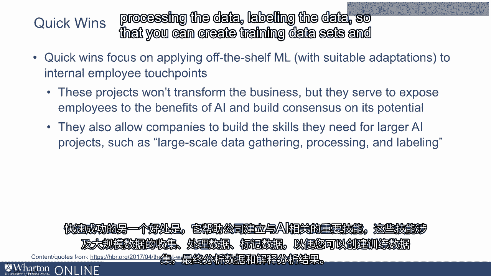
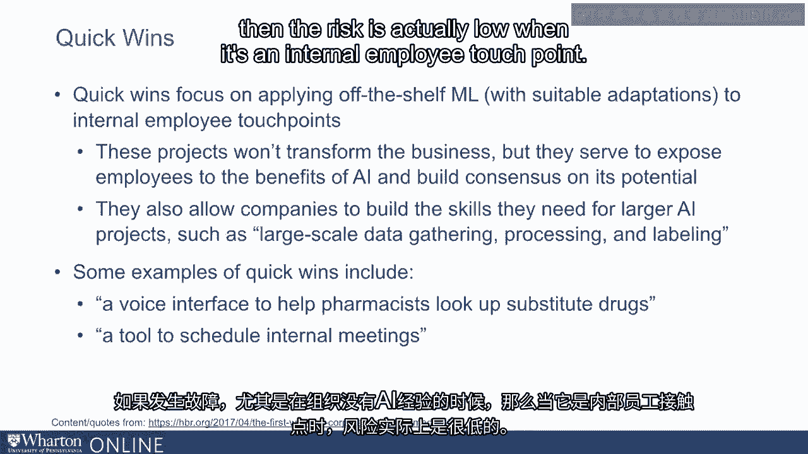
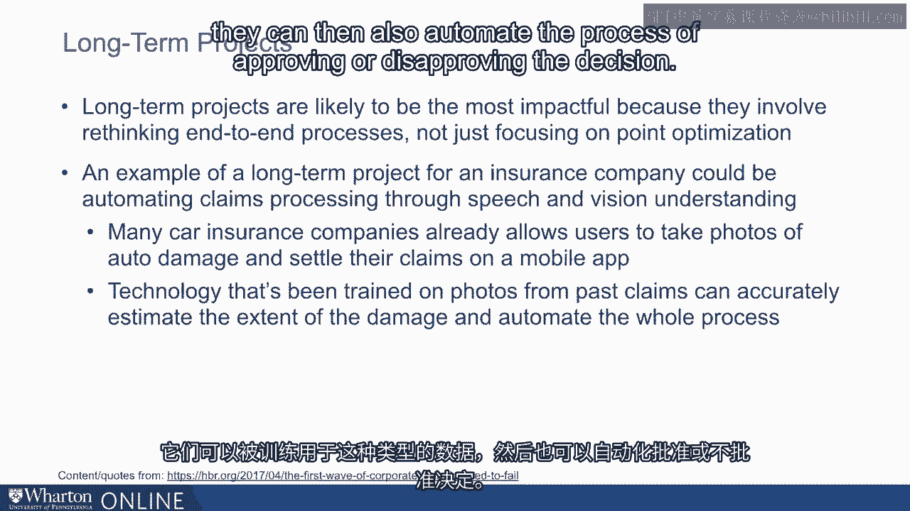
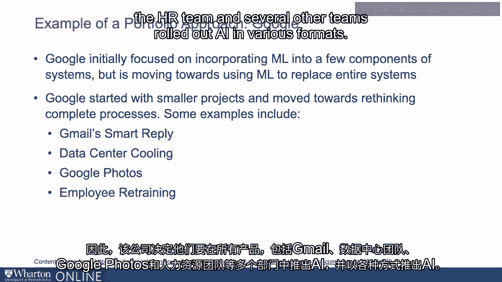
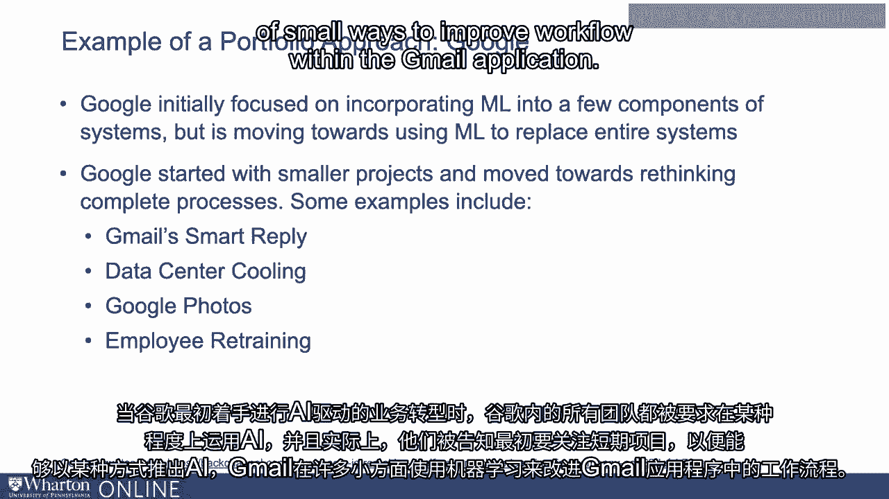
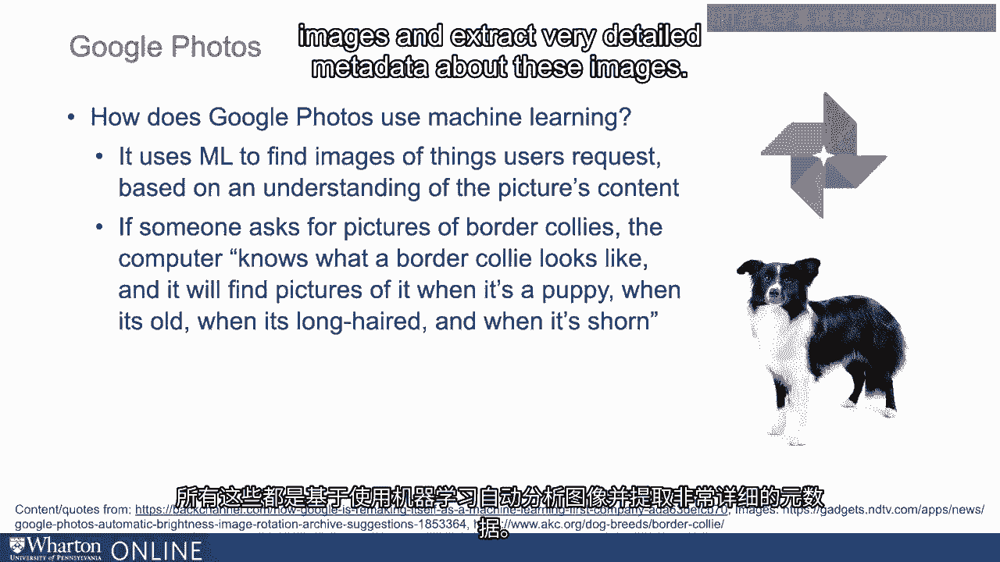
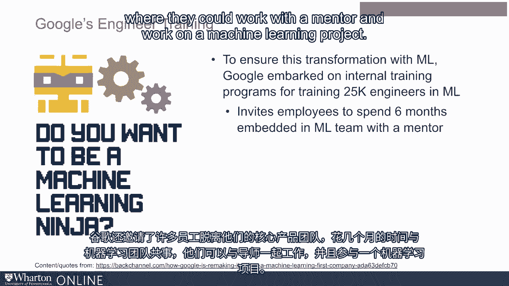
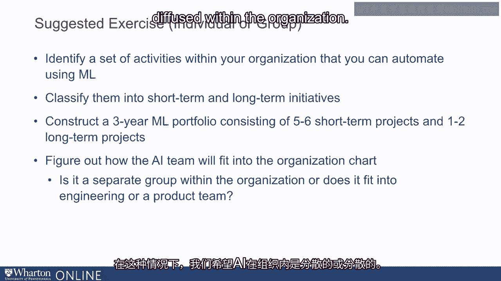

# 沃顿商学院《AI For Business（AI用于商业：AI基础／市场营销+财务／人力／管理）》（中英字幕） - P103：2_开发组合.zh_en - GPT中英字幕课程资源 - BV1Ju4y157dK

 We've discussed how early failures can cause irrational retreats from technologies that。

 can be impactful over the long run。 Now we're going to explore how companies can invest in technologies over a long period。

 of time when it is not clear that they will be returns in the short or medium term。

 One of the key principles I advocate is that companies should think through how they can。

 develop a portfolio of AI projects to pursue。 So let's dive into this idea a little bit more。

 The idea of building an AI portfolio is to come up with a set of projects that can be。

 seen as projects where a company can get a quick win and a set of projects that are viewed。

 as long term projects that are unlikely to produce results in the short term。

 So let's look at each of these in turn。 For quick wins。

 companies can choose to optimize simple touch points of employees or of customers。

 For long term projects， companies can think through how to redefine entire end-to-end。

 processes。 Let's first consider quick wins。 So for quick wins。

 companies can look at using off-the-shelf machine learning packages or。

 solutions and initially use that to improve internal employee touch points。

 And over time， maybe use them to improve customer touch points。

 Now notice that when I say that you're using off-the-shelf ML， which every competitor。

 can also access and you're using this to just improve internal employee touch points。

 these projects are perhaps not likely to transform the business。 But they serve a different purpose。

 First， they help expose the organization and the skeptics in the organizations to the potential。

 of AI。 It helps build consensus on what is feasible and what is doable with AI。

 One of my observations working with the C-suite and many organizations is that even though。

 an AI project or a digital transformation project might have a champion within the organization。

 there are also multiple skeptics within the organization。

 And it is hard to get the organization to point in the same direction when you have senior。

 leaders who are skeptical。 C-suite is important to first build consensus。

 One way to build consensus is to go after quick， easy， even projects where you can show within。

 three to six months what AI can achieve。 Again， this might not be transformational for the company's top line or bottom line。

 but， it helps people understand how you can get things going in a short period of time and。

 how AI can be transformational。 The other benefit of quick wins is that it helps companies build important skills with。

 regard to AI。 These are skills with regard to gathering data at large scale， processing the data。

 labeling， the data so that you can create training data sets and ultimately analyzing the data and。

 interpreting the results of the analysis。 All of this takes time to build especially in an organization which doesn't have data。

 science in its DNA。 Simply hiring a few data scientists will not change that。

 In order to change that it takes time and quick wins and short term projects help achieve。

 some of that because it helps organizations see results and help organizations get experience。

 with data gathering， labeling and analysis。 Some examples of quick wins might be let's say we're talking about a pharmacy where the。

 pharmacist has to look up substitute drugs when a drug is not available and they might。

 typically go into a computer and through an interface type in the drug that is not available。

 or the symptom and then they might get a list of alternative drugs available。

 A simple quick win short term project for that might be to provide a voice interface。

 so that the pharmacist can quickly look this up without as much effort with typing it in。

 This is easy to do with off the shelf natural language and voice recognition software that's。

 available out there。 Similarly in terms of a tool to coordinate internal meetings or discussions that's something。

 that's very easy to do。 Notice that I'm often talking about using internal employee touch points as a starting。

 point because the risk is very low if something goes wrong especially at a time when the organization。

 doesn't have experience with AI then the risk is actually low when it's an internal employee。

 touch point。 As the company gains experience then you can roll it out for customer touch points as well。

 Next moving on to long term projects。 Now long term projects the idea is these have to be impactful and provide a strategic。

 or a competitive advantage to the organization。 They will likely involve rethinking entire end to end processes and not just optimizing。

 at a point。 Now an example for a long term project one can think of an insurance company that receives。

 insurance claims and then processes it and then eventually makes decisions。

 Now for car insurance one can imagine a situation where customers can upload their insurance。

 claims on a mobile app。 They can perhaps take some photographs of the car or the damage and upload it on the app。

 Many companies already support this ability within their apps。

 Now once the claims come in usually insurance agents analyze the claims and make decisions。

 Now technology can be used to automate certain parts of this process。

 For example it is possible with image recognition algorithms to analyze a claim and identify。

 the kind of damage and especially with machine learning algorithms that are trained on past。

 data of past claims and data on which claims were approved which ones were not which ones。

 got a thousand dollar reimbursement versus a ten thousand dollar reimbursement versus。

 maybe just a hundred dollar reimbursement。 They can be trained on that kind of data and they can then also automate the process of。

 approving or disapproving the decision。 Now it may not be possible for companies to automate all of the claims that come in。

 However companies can get to a point where over time 50， 60， 70 percent of the claims coming。

 in the easier claims can be handled by machine learning systems that can look at the nature。

 of the damage assess whether it's an authentic claim compare the claim to past claims and decide。

 what is the level of damage and what is the level of reimbursement that needs to be given。

 And over time the human agents in the organization can focus on the more complex task。

 Notice that we're talking about automating the entire claims process starting from customers。

 uploading the claim on their mobile app to a system that's analyzing the claim figuring。

 out the nature of the damage to another system that's comparing this to past claims and then。

 automating the decision itself。 This kind of automation can be impactful in the long run both in terms of reducing costs。

 but also improving the workflow for the customer and winning over future customers to the organization。

 The portfolio approach that I've just advocated is one that has been used by some companies。

 to great success。 Google is a great example of that。

 A few years back Google CEO Sundar Pichay announced that they want to be an AI first company。

 They wanted to use machine learning to transform a variety of products and essentially bring。

 about change in the entire organization。 When Google embarked on this exercise they thought of certainly long term initiatives like driverless。

 cars which we've talked about but at the same time Google was clear that AI was meant。

 to be transformational for the entire organization and not just for one or two divisions like driverless。

 cars。 So the company decided that they want to roll out AI across all of their products。

 A number of divisions including Gmail， the data center team， Google photos and the HR team。

 and several other teams rolled out AI in various formats。

 When Google initially embarked on the AI driven business transformation all teams within Google。

 were asked to incorporate AI in some form or the other。

 And in fact they were told to initially focus on short term projects so they can roll out。

 AI in some way。 Gmail used machine learning in a number of small ways to improve workflow within the Gmail application。

 Over time as they got comfortable with machine learning they started rolling out lots of new。

 features that were based on machine learning。 For example the Gmail smart reply。

 Smart reply suggests likely responses that a user might use and the user can simply click。

 on a smart reply and respond to any email that comes in。

 Smart reply is based on machine learning it looks at past responses and it based on that。

 data it tries to figure out what kinds of responses a person is likely to type。

 This again was feasible because the Gmail team started off using machine learning for simple。

 projects internally and over time once they got comfortable they started to do more important。

 features。 Today smart reply is a very commonly used feature by customers on Gmail and is actually。

 much love feature among customers。 There are several other examples you look at Google photos。

 Machine learning is used to analyze images and auto tag the images。

 For example machine learning can look at an image and identify whether it's an image of。

 a dog or a cat or within a specific category let's say a dog it can identify what breed。

 of dog it is and so on。 And ultimately all of this information can be used to also guide image search so that。

 when a person types in a search query an image related search query it can quickly find images。

 even if the search query is very specific in very detail。

 For example you go to Google and you ask for pictures of border collies then the system。

 can show you images of several border collies but can also allow you to further fine tune。

 your search by choosing additional search terms that make your search even more narrow。

 All of this is based on using machine learning to automatically analyze images and extract。

 very detailed metadata about these images。 These examples show how Google is used machine learning with a number of different products。

 within the organization and in fact there are only a sample of the many applications of。

 machine learning in the various products that Google has。

 Google has been successful with its AI for strategy because it had a process wherein it。

 had several long-term initiatives such as the driverless car but it also focused on。

 lots of short-term initiatives where multiple product teams were asked to apply machine。

 learning within their product。 They were told to apply it and they were not asked to show return on investment for the。

 money that went into those features。 Instead the focus was on helping employees get experience and skills with machine learning。

 which would allow them to ideate more ambitious projects and also execute on those projects。

 But in addition to these short-term projects and having a portfolio the other thing Google。

 did was also embark on a large-scale training exercise。

 Google launched a number of training programs initially in person later a number of online。

 courses to train tens of thousands of engineers in machine learning。

 Google also invited many of these employees to take a few months away from their core product。

 team and spend it with a machine learning team where they could work with a mentor and work。

 on a machine learning project。

 The mentor was able to guide them and once the person was comfortable with machine learning。

 they went back to their product team。 This helped ensure that machine learning which was initially a skill set known to a few。

 people a more centralized set of skills became more diffused and decentralized within the。

 company as a whole and across all the different product teams。

 We have seen how Google invested in a portfolio of projects and employee training in order。

 to get benefits from its AI strategy and Google has indeed found tremendous success with， it。

 Here is a simple exercise that I would suggest you can try within your organization。

 Ideally you want to do this exercise as a group for example create a workshop or a meeting。

 with the sea level or senior executives within your organization where you might spend two。

 three hours at most on this activity or perhaps if you are not able to get a group to work。

 with you on this then perhaps you could try this individually。

 First identify a set of activities within your organization that you can automate through。

 machine learning。 This can be activities across multiple functions it can be activities across various product。

 teams and ideally you want several dozen activities because for most organizations there are so。

 many different functions so many different products where machine learning is relevant。

 Once you have come up with a set of several dozen activities we then want to classify these。

 activities into short term activities meaning activities that can be completed in let's。

 say roughly around six months or long term activities for which you need a few years。

 Once you have come up with this classification let's then look at the return on investment。

 to the organization from these activities。

 Based on an assessment of the return on investment of these activities and also an assessment。

 of the data assets available within the organization you can identify a smaller subset of these。

 activities that will be part of your three year portfolio。

 The three year portfolio can consist of several short term activities say five or six and a。

 few long term activities perhaps one or two long term activities。

 These are the activities that you might then want to pursue as an organization。

 Have a debate within the sea level team and within the overall team and discuss which activities。

 are worth pursuing and which ones are not。 That debate is healthy and can help construct the portfolio。

 Once you have constructed the portfolio you have to figure out where the AI team will。

 fit within the organization chart。 Some companies have separate AI teams that sit in a separate group and work with other。

 groups and help drive transformation almost like a consulting group that is working with。

 these other teams。 Some other organizations like Google have brought in machine learning and AI and data science。

 capabilities in all the different product teams。 And in this instance we would want AI to be decentralized or diffused within the organization。

 What's right for a company might depend on the size of the organization， the culture of。

 the organization and so on。 So you might want to debate on which structure is right for your company。

 This is an exercise that I think is useful when I worked with a number of executives。

 I've tried the exercise and it creates very healthy conversations and I highly advocate。

 it for you as well。 [BLANK_AUDIO]。

