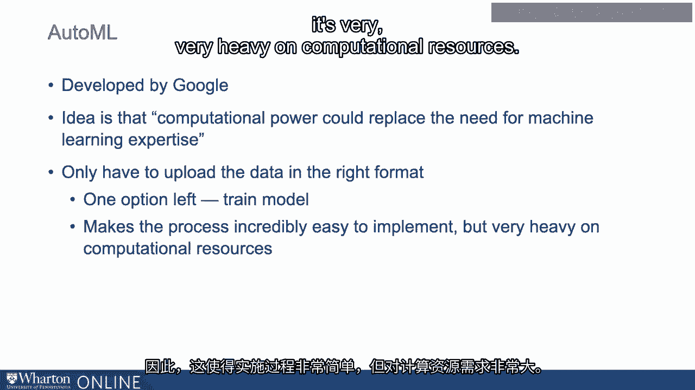
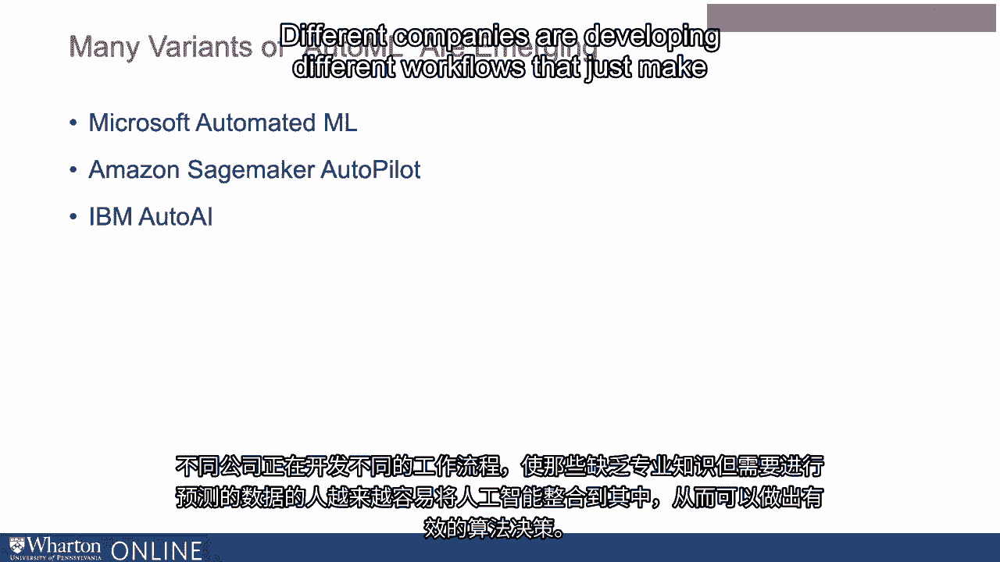

# 沃顿商学院《AI For Business（AI用于商业：AI基础／市场营销+财务／人力／管理）》（中英字幕） - P109：8_自动机器学习的经济学.zh_en - GPT中英字幕课程资源 - BV1Ju4y157dK

 We've been talking about data and computation becoming more important for the machine learning。

 process， software and skills perhaps becoming slightly less critical in terms of being a。

 differentiator。 The next stage is likely going to take this to the next levels。

 More and more workflows are being made available that really allow people to develop machine。

 learning applications with having almost no software or skill expertise at their disposal， at all。

 AutoML for instance is， or automated machine learning is essentially a workflow which transforms。

 how we think about machine learning from going from data collection to cleaning to labeling。

 and preparation and then feature engineering， then running the model and optimizing it and。

 looking at the predictions。 AutoML takes that workflow and essentially takes on almost all of the steps where all。

 you have to do is get the data and then run it till you get predictions。

 And the way AutoML works is it essentially throws in computation to the point that it。

 can substitute for many different kinds of expertise。

 So AutoML can throw so much computation at the problem that it can try different variations。

 until it figures out the best model。 So you don't even have to specify a model to run。

 It will figure out the best model as well。 It just throws so much computation at the problem。

 All you specify is the data and what the labels are you want to predict。

 And this is， AutoML is a product that's been developed by Google。

 It can be run through Google Cloud。 And so the idea here as we've heard from people at Google talking about AutoML。

 the idea， is that they're going to be able to use computational power to replace the need for machine learning。

 expertise of any kind， just making it easier and easier to run。 If you go through the workflow。

 you only have to upload the data in the right format and。

 there's really only one option at that point。 You upload the data with training labels。

 There's only one option left which is just train the model。

 So it makes the process incredibly easy to implement， but it's very， very heavy on computational。

 resources。

 So， for instance， if I run a model through AutoML， which I've done several times， if I upload。

 the data， I train the model。 And then in several hours， I get an email which has got the results。

 So Google will basically try the different models。 Tell me which one's the best。 I get the results。

 but of course， I also get a bill。 So this is run through their cloud services。

 I'm using their computation to run this model。 It makes it easier than ever。

 but it shifts some of the costs from expertise that I need， to have to computation on the back end。

 And they just send the results to an email， again， along with a bill for the cloud services。

 that were used。 So what this essentially does is exchange more and more raw computation for expertise。

 Now， we talked about AutoML， but there's a number of different types of automated machine。

 learning that are emerging from different companies。 Microsoft calls automated machine learning。

 Amazon refers to SageMaker， Autopilot， IBM， calls it AutoAI。

 These different companies are developing different workflows that just make it easier and easier。

 for people who have little expertise but have strong data and a need for prediction to。

 integrate AI in a way that can make effective algorithmic decisions。 These are going to， of course。

 only have further implications for the market， for machine learning， skills， for computation。

 for data。 We're essentially moving to an ecosystem where anyone at all should be able to deploy AI solutions。

 but there's going to be higher demand for computation and for data assets。

 And as we'll talk about next， also perhaps for people who can contextualize and interpret。

 the AI predictions。 [BLANK_AUDIO]。

